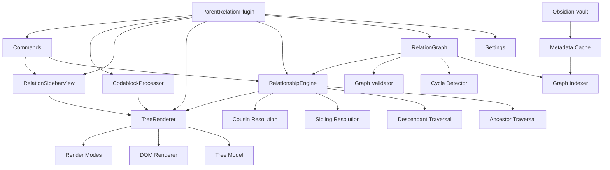

# Incremental Implementation Plan

## Overview

This document outlines a step-by-step, incremental implementation plan for the Obsidian Parent-Relation Plugin, prioritizing core functionality first (relationship engine with cycle detection) before adding UI components. Each milestone is designed to be independently testable and provides tangible progress.

## Current State Analysis

### ✅ Already Implemented
- Basic plugin scaffolding ([`ParentRelationPlugin`](../src/main.ts:14))
- Settings UI with `parentField` and `maxDepth` configuration
- [`RelationGraph`](../src/relation-graph.ts:9) class with basic graph building
- Parent/child link extraction from frontmatter (supports arrays)
- Metadata and vault event listeners (metadata changes, file renames)

### ❌ Missing Components
- Cycle detection and validation
- Extended relationship computation (siblings, cousins, ancestors, descendants)
- Incremental graph updates (currently rebuilds entire graph)
- Tree rendering system
- Sidebar view
- Codeblock processor
- Commands
- Performance optimizations for large vaults

---

## Implementation Phases

### **Phase 1: Core Graph Infrastructure** (Foundation)

Building robust, performant graph capabilities before adding features.

#### Milestone 1.1: Cycle Detection
**Goal:** Add cycle detection to prevent infinite traversals

**Tasks:**
1. Add `detectCycle(startFile: TFile): boolean` method to [`RelationGraph`](../src/relation-graph.ts:9)
2. Implement DFS-based cycle detection algorithm
3. Add `getCycleInfo(file: TFile): CycleInfo | null` to return cycle path details
4. Create unit tests with sample cyclic graph structures

**Acceptance Criteria:**
- Detects simple cycles (A → B → A)
- Detects complex cycles (A → B → C → A)
- Returns accurate cycle path information
- Handles graphs with multiple disconnected cycles
- No false positives on valid DAGs

**Testing Strategy:**
```typescript
// Test cases to create:
// 1. No cycle: A → B → C
// 2. Self-loop: A → A
// 3. Two-node cycle: A → B → A
// 4. Three-node cycle: A → B → C → A
// 5. Multiple parents with cycle: A → B, A → C, C → B
```

**Deliverables:**
- `src/cycle-detector.ts` (new file)
- Unit tests in `src/__tests__/cycle-detector.test.ts`
- Updated [`RelationGraph`](../src/relation-graph.ts:9) with cycle detection methods

---

#### Milestone 1.2: Incremental Graph Updates
**Goal:** Optimize graph rebuilding to only update affected nodes

**Tasks:**
1. Refactor [`RelationGraph.build()`](../src/relation-graph.ts:13) to support incremental updates
2. Add `updateNode(file: TFile)` method for single-file updates
3. Add `removeNode(file: TFile)` method for file deletions
4. Track "dirty" nodes that need recomputation
5. Only rebuild affected subtrees when metadata changes

**Acceptance Criteria:**
- Metadata change for single note updates only that note and its immediate relations
- File deletion properly removes node and updates parent/child references
- File rename updates all references correctly
- Performance test: 10,000 note vault updates single note in <10ms

**Testing Strategy:**
- Benchmark current full rebuild time vs incremental update
- Test edge cases: renaming parent note, deleting note with many children
- Verify graph consistency after series of incremental updates

**Deliverables:**
- Refactored [`RelationGraph`](../src/relation-graph.ts:9) with incremental update methods
- Performance benchmarks documenting improvement
- Integration tests for vault operations

---

#### Milestone 1.3: Graph Validation Utilities
**Goal:** Add diagnostic tools for graph health and integrity

**Tasks:**
1. Create `src/graph-validator.ts` module
2. Implement `validateGraph()` - checks for orphaned references, unresolved links
3. Add `getDiagnostics()` - returns warnings/errors about graph state
4. Create optional "diagnostic mode" setting to enable verbose logging
5. Add console warnings for common issues (cycles, broken links)

**Acceptance Criteria:**
- Identifies unresolved parent links (links to non-existent notes)
- Reports all cycles in the graph
- Detects orphaned nodes (no parents, no children)
- Provides actionable error messages
- Can run validation on-demand via command

**Testing Strategy:**
- Create intentionally broken graph structures
- Verify all issues are correctly identified
- Check that valid graphs pass validation without warnings

**Deliverables:**
- `src/graph-validator.ts`
- Diagnostic mode toggle in settings
- Console logging for graph issues

---

### **Phase 2: Relationship Engine** (Core Functionality)

Implementing all relationship computation methods with proper safeguards.

#### Milestone 2.1: Ancestor Traversal
**Goal:** Implement depth-limited ancestor computation with cycle protection

**Tasks:**
1. Create `src/relationship-engine.ts` module
2. Implement `getAncestors(file: TFile, maxDepth?: number): TFile[][]`
   - Returns array of arrays: `[[parents], [grandparents], [great-grandparents], ...]`
3. Add cycle guard using visited set
4. Respect `maxDepth` setting from plugin config
5. Add tests for various depth levels and cycle scenarios

**Acceptance Criteria:**
- Returns correct ancestors up to specified depth
- Stops at cycles without infinite loop
- Handles multiple parents correctly (explores all branches)
- Returns empty array for root nodes (no parents)
- Performance: processes 1000-node lineage in <50ms

**Testing Strategy:**
```typescript
// Test cases:
// 1. Linear chain: A → B → C → D (depth 3)
// 2. Multiple parents: A → B, A → C; B → D, C → D
// 3. Cycle in ancestry: A → B → C → B
// 4. Max depth limiting
```

**Deliverables:**
- `src/relationship-engine.ts` with [`RelationshipEngine`](../src/relationship-engine.ts:1) class
- `getAncestors()` method with tests
- Documentation of return format

---

#### Milestone 2.2: Descendant Traversal
**Goal:** Implement depth-limited descendant computation

**Tasks:**
1. Implement `getDescendants(file: TFile, maxDepth?: number): TFile[][]`
   - Returns array of arrays: `[[children], [grandchildren], [great-grandchildren], ...]`
2. Add cycle guard (prevent infinite descent)
3. Support breadth-first traversal for predictable ordering
4. Add tests for various depth levels

**Acceptance Criteria:**
- Returns correct descendants up to specified depth
- Stops at cycles without infinite loop
- Handles multiple children correctly
- Returns empty array for leaf nodes (no children)
- Breadth-first order within each generation

**Testing Strategy:**
- Mirror ancestor tests but in reverse direction
- Test wide trees (many children per node)
- Test deep trees (many generations)

**Deliverables:**
- `getDescendants()` method in [`RelationshipEngine`](../src/relationship-engine.ts:1)
- Comprehensive tests
- Performance benchmarks

---

#### Milestone 2.3: Sibling Resolution
**Goal:** Compute siblings (notes sharing same parent)

**Tasks:**
1. Implement `getSiblings(file: TFile, includeSelf?: boolean): TFile[]`
2. Handle multiple-parent scenarios (union of all sibling sets)
3. Add option to include/exclude the queried note itself
4. Support half-siblings vs full-siblings distinction (optional advanced feature)

**Acceptance Criteria:**
- Returns all notes sharing at least one parent
- Correctly handles notes with multiple parents
- Option to include/exclude self works correctly
- Returns empty array for root notes (no parents, thus no siblings)
- No duplicates in result set

**Testing Strategy:**
```typescript
// Test cases:
// 1. Single parent, multiple children
// 2. Multiple parents with different child sets
// 3. Only child (no siblings)
// 4. Self-inclusion toggle
```

**Deliverables:**
- `getSiblings()` method in [`RelationshipEngine`](../src/relationship-engine.ts:1)
- Unit tests covering edge cases

---

#### Milestone 2.4: Cousin Resolution
**Goal:** Compute cousins (notes sharing same grandparent)

**Tasks:**
1. Implement `getCousins(file: TFile, degree?: number): TFile[]`
   - degree 1 = first cousins (share grandparent)
   - degree 2 = second cousins (share great-grandparent)
2. Exclude siblings and self from cousin set
3. Handle complex multi-parent scenarios
4. Add depth parameter for cousin degree

**Acceptance Criteria:**
- Returns correct first cousins (grandparent's grandchildren, excluding siblings)
- Supports configurable cousin degree
- Handles multiple grandparents correctly
- No duplicates or self-inclusion
- Returns empty array when no cousins exist

**Testing Strategy:**
- Create family-tree-like test structures
- Verify cousin relationships are symmetric (if A is cousin of B, B is cousin of A)
- Test edge cases: only grandchild, no grandparents

**Deliverables:**
- `getCousins()` method in [`RelationshipEngine`](../src/relationship-engine.ts:1)
- Documentation explaining cousin degree parameter
- Comprehensive tests

---

#### Milestone 2.5: Relationship Engine Integration
**Goal:** Integrate relationship engine with main plugin and expose via API

**Tasks:**
1. Instantiate [`RelationshipEngine`](../src/relationship-engine.ts:1) in [`ParentRelationPlugin`](../src/main.ts:14)
2. Pass [`RelationGraph`](../src/relation-graph.ts:9) reference to engine
3. Create public API methods on plugin for accessing relationships
4. Add TypeScript interfaces for relationship query results
5. Document public API in README

**Acceptance Criteria:**
- [`RelationshipEngine`](../src/relationship-engine.ts:1) accessible throughout plugin lifecycle
- All relationship methods available via plugin API
- Type-safe interfaces for results
- API documented with usage examples

**Testing Strategy:**
- Integration tests using real plugin instance
- Verify all relationship types work end-to-end
- Test with various vault configurations

**Deliverables:**
- Updated [`main.ts`](../src/main.ts:1) with engine integration
- API documentation
- Integration tests

---

### **Phase 3: Tree Rendering System** (Visualization Foundation)

Building reusable rendering components for both sidebar and codeblocks.

#### Milestone 3.1: Tree Data Model
**Goal:** Create data structures for representing computed relationship trees

**Tasks:**
1. Create `src/tree-model.ts` module
2. Define `TreeNode` interface with properties:
   - `file: TFile`
   - `children: TreeNode[]`
   - `depth: number`
   - `isCycle: boolean`
   - `metadata: Record<string, any>`
3. Implement `buildTreeFromRelations()` helper functions
4. Add methods for tree traversal and manipulation

**Acceptance Criteria:**
- TreeNode structure supports nested hierarchies
- Cycle nodes are clearly marked
- Supports metadata for rendering hints (icons, colors, etc.)
- Efficient serialization for large trees
- Immutable or safely mutable structure

**Testing Strategy:**
- Create trees from relationship engine results
- Test tree depth calculations
- Verify cycle marking works correctly

**Deliverables:**
- `src/tree-model.ts` with interfaces and builders
- Unit tests for tree construction
- Documentation of tree model

---

#### Milestone 3.2: DOM Tree Renderer
**Goal:** Create generic, reusable tree renderer for DOM output

**Tasks:**
1. Create `src/tree-renderer.ts` module
2. Implement `TreeRenderer` class with methods:
   - `render(tree: TreeNode, container: HTMLElement): void`
   - `renderNode(node: TreeNode): HTMLElement`
   - `addCollapseToggle(element: HTMLElement, node: TreeNode): void`
3. Add CSS classes for styling (indentation, icons, states)
4. Support collapsible/expandable nodes
5. Add click handlers for navigation to notes
6. Render cycle indicators visually

**Acceptance Criteria:**
- Renders nested tree structure with proper indentation
- Nodes are clickable and navigate to corresponding note
- Collapse/expand toggles work correctly
- Cycle nodes have visual indicator (icon, color, tooltip)
- Responsive to Obsidian theme changes
- Accessible (keyboard navigation, screen reader support)

**Testing Strategy:**
- Manual testing with various tree structures
- Test collapse/expand state persistence
- Verify click navigation works
- Test with both light and dark themes

**Deliverables:**
- `src/tree-renderer.ts`
- `styles.css` with tree styling classes
- Demo test page for visual verification

---

#### Milestone 3.3: Tree Rendering Modes
**Goal:** Support different tree visualization modes

**Tasks:**
1. Add `TreeRenderMode` enum: `ANCESTORS`, `DESCENDANTS`, `FULL_LINEAGE`, `SIBLINGS`, `COUSINS`
2. Implement mode-specific tree building logic
3. Add configuration for combining multiple modes
4. Support filtering and sorting options
5. Add "show path to root" option for descendant trees

**Acceptance Criteria:**
- Each mode renders appropriate relationship structure
- FULL_LINEAGE shows both ancestors and descendants
- Modes can be combined (e.g., "ancestors + siblings")
- Filtering works (e.g., by tag, folder)
- Sorting options available (alphabetical, by creation date, etc.)

**Testing Strategy:**
- Create test vault with known structure
- Verify each mode shows expected notes
- Test combined modes
- Test filters and sorting

**Deliverables:**
- Extended tree-renderer with mode support
- Settings for mode selection
- Documentation of each mode

---

### **Phase 4: Sidebar View** (Primary UI)

Creating the dedicated sidebar panel for relationship exploration.

#### Milestone 4.1: Basic Sidebar View
**Goal:** Create sidebar view extending Obsidian's ItemView

**Tasks:**
1. Create `src/sidebar-view.ts` module
2. Implement `RelationSidebarView extends ItemView`
3. Register view with plugin
4. Add command to open sidebar
5. Auto-update when active note changes
6. Display basic tree using tree renderer

**Acceptance Criteria:**
- View appears in sidebar when opened
- Shows relationship tree for currently active note
- Updates when switching between notes
- Can be closed and reopened
- Persists state across Obsidian sessions
- Ribbon icon to toggle view

**Testing Strategy:**
- Open/close sidebar multiple times
- Switch between notes, verify tree updates
- Restart Obsidian, verify view state persists
- Test on both desktop and mobile (if supported)

**Deliverables:**
- `src/sidebar-view.ts`
- View registration in [`main.ts`](../src/main.ts:1)
- Open sidebar command
- Basic styling

---

#### Milestone 4.2: Sidebar Configuration Panel
**Goal:** Add controls for customizing sidebar display

**Tasks:**
1. Add control panel at top of sidebar view
2. Implement mode selector dropdown (ancestors, descendants, etc.)
3. Add depth slider/input
4. Add "pin to note" button to lock view to specific note
5. Add refresh button (manual rebuild)
6. Add filter controls (by tag, folder)
7. Save sidebar preferences per-vault

**Acceptance Criteria:**
- Mode selector changes tree display correctly
- Depth control limits tree depth as expected
- Pin functionality locks view to selected note (doesn't change with active note)
- Filters work and update tree in real-time
- Preferences persist across sessions
- UI is intuitive and responsive

**Testing Strategy:**
- Test all mode combinations
- Verify pin/unpin behavior
- Test filters with various vault structures
- Check preference persistence

**Deliverables:**
- Enhanced sidebar with control panel
- Settings persistence
- User documentation for sidebar features

---

#### Milestone 4.3: Sidebar Context Menu
**Goal:** Add right-click context menu for tree nodes

**Tasks:**
1. Implement context menu on tree node right-click
2. Add menu items:
   - "Open in new pane"
   - "Open to the right"
   - "Reveal in file explorer"
   - "Copy link"
   - "Set as parent of current note"
   - "Show ancestors of this note"
   - "Show descendants of this note"
3. Integrate with Obsidian's built-in context menu system

**Acceptance Criteria:**
- Right-click shows context menu
- All menu items work correctly
- Menu integrates with Obsidian's native menus
- Keyboard shortcuts supported where applicable
- Context-sensitive items (hide irrelevant options)

**Testing Strategy:**
- Test each menu action
- Verify keyboard shortcuts
- Test on different note types

**Deliverables:**
- Context menu implementation
- Integration with Obsidian menu system

---

### **Phase 5: Codeblock Renderer** (Inline Visualization)

Enabling relationship trees to be embedded in notes.

#### Milestone 5.1: Basic Codeblock Processor
**Goal:** Register and parse `relation-tree` codeblocks

**Tasks:**
1. Register codeblock processor for `relation-tree`
2. Parse YAML parameters from codeblock content:
   ```
   note: [[Target Note]]
   type: ancestors | descendants | siblings | cousins
   depth: 3
   mode: tree | list | compact
   ```
3. Validate parameters and show error messages for invalid input
4. Render tree using existing TreeRenderer
5. Handle note references (wiki-links, file paths)

**Acceptance Criteria:**
- Codeblock with valid parameters renders tree
- Invalid parameters show helpful error message
- Supports both wiki-link and file path note references
- Tree updates when target note metadata changes
- Renders correctly in both reading and live preview modes

**Testing Strategy:**

Test cases to create in markdown files:

1. **Valid ancestor tree** - Codeblock with valid parameters renders correctly
2. **Invalid parameters** - Codeblock with nonexistent note or invalid type shows error
3. **Multiple trees in one note** - Multiple codeblocks render independently

Example test codeblocks:
- `note: [[My Note]]`, `type: ancestors`, `depth: 3`
- `note: [[Nonexistent]]`, `type: invalid-type` (should error)
- Multiple codeblocks for same note with different types

**Deliverables:**
- Codeblock processor registration in [`main.ts`](../src/main.ts:1)
- YAML parser for codeblock parameters
- Error handling and display
- Documentation with examples

---

#### Milestone 5.2: Advanced Codeblock Options
**Goal:** Add filtering, styling, and layout options to codeblocks

**Tasks:**
1. Add optional parameters:
   - `filter-tag: #project` - only show notes with tag
   - `filter-folder: Projects/` - only show notes in folder
   - `exclude: [[Note1]], [[Note2]]` - exclude specific notes
   - `max-nodes: 50` - limit total nodes shown
   - `collapsed: true` - render initially collapsed
   - `style: compact | detailed | minimal` - visual style variant
2. Implement filtering logic in tree builder
3. Add visual style variants in CSS
4. Support combining multiple filters

**Acceptance Criteria:**
- All filter options work correctly
- Filters can be combined (tag AND folder)
- Style variants render differently
- max-nodes shows "(+N more...)" when truncated
- Collapsed state works on initial render
- Well-documented with examples

**Testing Strategy:**
- Create test vault with tagged/foldered notes
- Verify each filter type works
- Test filter combinations
- Test all style variants

**Deliverables:**
- Extended codeblock parameter parsing
- Filter implementation in tree builder
- CSS style variants
- Updated documentation

---

### **Phase 6: Commands & Navigation** (Workflow Enhancement)

Adding command palette commands for quick navigation.

#### Milestone 6.1: Basic Navigation Commands
**Goal:** Implement essential navigation commands

**Tasks:**
1. Add command: "Show parent tree in sidebar"
2. Add command: "Show child tree in sidebar"
3. Add command: "Show full lineage in sidebar"
4. Add command: "Toggle relation sidebar"
5. Add command: "Go to parent note" (opens first parent)
6. Add command: "Go to child note" (shows modal to select if multiple)
7. Register all commands in [`main.ts`](../src/main.ts:1)

**Acceptance Criteria:**
- All commands appear in command palette
- Commands work on currently active note
- "Go to" commands navigate correctly
- Modal selection works for multiple parents/children
- Commands disabled when not applicable (e.g., no parents)
- Keyboard shortcuts assignable by user

**Testing Strategy:**
- Test each command in various scenarios
- Test with notes having 0, 1, and multiple parents/children
- Verify command palette filtering works

**Deliverables:**
- Command implementations in [`main.ts`](../src/main.ts:1)
- Modal for multi-option selection
- Command documentation

---

#### Milestone 6.2: Advanced Navigation Commands
**Goal:** Add sophisticated navigation and utility commands

**Tasks:**
1. Add command: "Show siblings of current note"
2. Add command: "Show cousins of current note"
3. Add command: "Find shortest path to note" (opens modal to select target)
4. Add command: "Show all root notes" (notes with no parents)
5. Add command: "Show all leaf notes" (notes with no children)
6. Add command: "Validate relationship graph" (runs diagnostics)
7. Add command: "Export tree as markdown" (copies tree to clipboard)

**Acceptance Criteria:**
- Each command produces expected output
- Modals have search/filter functionality
- Path-finding works correctly
- Diagnostics command shows helpful output
- Export preserves tree structure in markdown format

**Testing Strategy:**
- Test path-finding with various vault structures
- Verify root/leaf detection accuracy
- Test export with different tree types

**Deliverables:**
- Advanced command implementations
- Path-finding algorithm
- Markdown export formatter
- Documentation

---

### **Phase 7: Performance Optimization** (Scalability)

Ensuring plugin works efficiently with large vaults.

#### Milestone 7.1: Graph Indexing Optimization
**Goal:** Optimize graph building and updates for large vaults

**Tasks:**
1. Profile current graph build performance with 5k, 10k, 25k note test vaults
2. Implement lazy loading for relationship computation (compute on-demand, cache results)
3. Add LRU cache for frequently accessed relationships
4. Debounce metadata change events (batch updates)
5. Add background indexing option (don't block UI)
6. Implement progressive rendering for large trees (virtualization)

**Acceptance Criteria:**
- 10,000 note vault: initial index builds in <2 seconds
- Incremental update for single note: <10ms
- Relationship query (siblings/cousins) for any note: <50ms
- Cache hit rate >80% for repeated queries
- UI remains responsive during indexing
- Memory usage reasonable (<100MB for 10k notes)

**Testing Strategy:**
- Create synthetic test vaults of various sizes
- Benchmark each operation type
- Monitor memory usage over time
- Stress test with rapid metadata changes

**Deliverables:**
- Optimized graph indexer
- Caching layer implementation
- Performance benchmarks documentation
- Background indexing option in settings

---

#### Milestone 7.2: Tree Rendering Optimization
**Goal:** Optimize tree rendering for deep/wide hierarchies

**Tasks:**
1. Implement virtual scrolling for large trees (only render visible nodes)
2. Add pagination for wide trees (show first N children, "load more" button)
3. Lazy-load collapsed subtrees (don't render children until expanded)
4. Debounce tree re-renders during rapid interactions
5. Add "compact mode" that renders flatter structure
6. Optimize DOM manipulation (batch updates, minimize reflows)

**Acceptance Criteria:**
- 1000-node tree renders in <500ms
- Scrolling remains smooth (60fps)
- Expanding/collapsing node is instant (<16ms)
- Memory usage doesn't grow unbounded with large trees
- Works smoothly on mobile devices

**Testing Strategy:**
- Create test vaults with deep (100+ levels) and wide (100+ children) trees
- Measure render time and FPS
- Test on various devices/browsers
- Monitor memory usage

**Deliverables:**
- Virtual scrolling implementation
- Lazy-loading for collapsed nodes
- Optimized rendering pipeline
- Performance documentation

---

#### Milestone 7.3: Settings for Performance Tuning
**Goal:** Allow users to configure performance/feature tradeoffs

**Tasks:**
1. Add settings:
   - "Enable auto-refresh" (toggle real-time updates)
   - "Refresh interval" (milliseconds between update checks)
   - "Max tree depth for auto-render" (safety limit)
   - "Max nodes to render" (truncate huge trees)
   - "Enable caching" (toggle relationship cache)
   - "Cache size limit" (MB)
   - "Enable background indexing"
2. Add performance diagnostics panel showing:
   - Current graph size (nodes, edges)
   - Cache statistics
   - Last index time
   - Memory usage estimate
3. Provide recommended settings for vault size

**Acceptance Criteria:**
- All settings affect plugin behavior correctly
- Diagnostic panel shows accurate information
- Recommended settings improve performance
- Settings documented with explanations

**Testing Strategy:**
- Test each setting with large vault
- Verify diagnostics accuracy
- Validate recommended settings

**Deliverables:**
- Extended settings tab
- Diagnostics panel
- Performance tuning guide in docs

---

### **Phase 8: Polish & Release Preparation** (Production Ready)

Final touches before public release.

#### Milestone 8.1: Cycle Handling UX
**Goal:** Improve user experience when cycles are detected

**Tasks:**
1. Add visual cycle indicators in tree rendering:
   - Icon next to cyclic node
   - Tooltip showing cycle path
   - Different color/style for cyclic edges
2. Add "Show cycles" command that lists all detected cycles
3. Add cycle warning in codeblock renderer
4. Create help documentation explaining cycles and how to resolve them
5. Add optional setting: "Break cycles at" (max depth to traverse before stopping)

**Acceptance Criteria:**
- Cycles are immediately visible in all views
- Tooltip clearly explains the cycle path
- "Show cycles" command produces actionable report
- Documentation helps users understand and fix cycles
- Plugin never hangs or crashes due to cycles

**Testing Strategy:**
- Create various cycle patterns
- Verify all are detected and displayed
- Test user experience of cycle resolution
- Ensure documentation is clear

**Deliverables:**
- Enhanced cycle visualization
- Cycle reporting command
- User documentation on cycles
- Settings for cycle handling

---

#### Milestone 8.2: Documentation & Examples
**Goal:** Create comprehensive documentation and example vault

**Tasks:**
1. Write README.md with:
   - Feature overview with screenshots
   - Installation instructions
   - Quick start guide
   - Settings reference
   - Command reference
   - Codeblock parameter reference
   - Troubleshooting section
2. Create example vault demonstrating all features
3. Write CONTRIBUTING.md for developers
4. Add inline code documentation (JSDoc comments)
5. Create video tutorial (optional)

**Acceptance Criteria:**
- README covers all features with examples
- Example vault demonstrates each relationship type
- Code is well-commented
- Installation instructions are clear
- Screenshots show current UI

**Testing Strategy:**
- Have someone unfamiliar with plugin follow README
- Verify all examples work
- Check for broken links/references

**Deliverables:**
- Complete README.md
- Example vault (separate repo or downloadable)
- CONTRIBUTING.md
- Code documentation

---

#### Milestone 8.3: Testing & Bug Fixes
**Goal:** Comprehensive testing and bug resolution

**Tasks:**
1. Create automated test suite:
   - Unit tests for all core functions
   - Integration tests for plugin lifecycle
   - E2E tests for UI interactions
2. Manual testing checklist covering all features
3. Test on multiple platforms (Windows, macOS, Linux)
4. Test on mobile (iOS, Android)
5. Test with various Obsidian versions (min version to latest)
6. Fix all critical and high-priority bugs
7. Address performance issues

**Acceptance Criteria:**
- Test coverage >80% for core modules
- All tests passing
- No critical bugs
- Works on all supported platforms
- Mobile experience is usable
- Compatible with Obsidian min version specified in manifest

**Testing Strategy:**
- Set up CI/CD pipeline for automated tests
- Beta testing with community users
- Collect and triage bug reports
- Performance profiling

**Deliverables:**
- Comprehensive test suite
- CI/CD configuration
- Bug fix releases
- Test coverage report

---

#### Milestone 8.4: Release Preparation
**Goal:** Prepare for official release to Obsidian community

**Tasks:**
1. Finalize version number (1.0.0)
2. Create CHANGELOG.md
3. Update manifest.json with accurate information
4. Create release notes
5. Prepare promotional materials (forum post, Reddit post)
6. Submit to Obsidian community plugins
7. Set up GitHub releases with automated builds
8. Create support channels (GitHub Discussions, Discord, etc.)

**Acceptance Criteria:**
- Plugin meets Obsidian community plugin guidelines
- All required metadata is correct
- Release notes are clear and comprehensive
- Build artifacts are properly generated
- Community plugin submission accepted

**Testing Strategy:**
- Final review against community plugin guidelines
- Test installation from community plugins
- Verify auto-update works

**Deliverables:**
- Release version 1.0.0
- Community plugin listing
- Support infrastructure
- Promotion plan

---

## Testing Strategy Summary

### Unit Testing
- **Tools:** Jest or Vitest for TypeScript
- **Coverage:** Core relationship algorithms, cycle detection, tree building
- **Mocking:** Mock Obsidian API for isolated testing

### Integration Testing
- **Tools:** Obsidian plugin testing utilities
- **Coverage:** Plugin lifecycle, vault operations, metadata changes
- **Test Vaults:** Programmatically generated vaults with known structures

### Performance Testing
- **Tools:** Chrome DevTools Performance profiler, custom benchmarks
- **Metrics:** Index build time, query time, memory usage, render time
- **Targets:** Test with 5k, 10k, 25k, 50k note vaults

### Manual Testing
- **Checklist:** Comprehensive feature checklist for each release
- **Platforms:** Windows, macOS, Linux, iOS, Android
- **Edge Cases:** Empty vault, single note, cycles, very large trees

### User Testing
- **Beta Program:** Invite community members to test
- **Feedback:** Collect via GitHub Issues and Discussions
- **Iteration:** Fix bugs and refine UX based on feedback

---

## Dependencies & Prerequisites

### Development Dependencies
- Node.js (v16+)
- TypeScript (v5+)
- Rollup (build system)
- Obsidian types package
- (Optional) Testing framework: Jest/Vitest

### Knowledge Prerequisites
- TypeScript/JavaScript
- Obsidian Plugin API
- DOM manipulation
- Graph algorithms (DFS, BFS)
- Event-driven programming

### External Dependencies
- **None** - Plugin is standalone per vision requirements
- Uses only Obsidian's built-in metadata index

---

## Architecture Diagram



---

## Risk Assessment & Mitigation

### Risk: Performance issues with very large vaults (50k+ notes)
**Mitigation:**
- Incremental indexing (Phase 1)
- Lazy loading and caching (Phase 7)
- Configurable performance settings
- Background indexing option

### Risk: Complex cycles causing infinite loops
**Mitigation:**
- Cycle detection in every traversal (Phase 1)
- Recursion depth guards
- Clear visual indicators
- User documentation

### Risk: User confusion with complex UI
**Mitigation:**
- Intuitive defaults
- Comprehensive documentation with examples
- Tooltips and help text
- Guided onboarding

### Risk: Breaking changes in Obsidian API
**Mitigation:**
- Use stable, documented APIs only
- Version compatibility testing
- Monitor Obsidian developer updates
- Maintain backward compatibility

### Risk: Plugin conflicts
**Mitigation:**
- Minimal global state
- Namespaced CSS classes
- No monkey-patching of Obsidian internals
- Test with popular plugins

---

## Success Metrics

### Technical Metrics
- ✅ Index 10,000 notes in <2 seconds
- ✅ Query any relationship in <50ms
- ✅ Render 1000-node tree in <500ms
- ✅ Memory usage <100MB for 10k notes
- ✅ Test coverage >80%

### User Experience Metrics
- ✅ Installation takes <2 minutes
- ✅ First meaningful use within 5 minutes
- ✅ Intuitive enough for non-technical users
- ✅ Positive community feedback

### Adoption Metrics
- 🎯 1,000+ downloads in first month
- 🎯 4+ star average rating
- 🎯 Active community engagement
- 🎯 Few critical bug reports

---

## Timeline Estimate

**Total Estimated Time: 8-12 weeks (full-time equivalent)**

| Phase | Milestones | Est. Time | Priority |
|-------|-----------|-----------|----------|
| Phase 1 | Core Graph Infrastructure (3 milestones) | 1-2 weeks | Critical |
| Phase 2 | Relationship Engine (5 milestones) | 2-3 weeks | Critical |
| Phase 3 | Tree Rendering System (3 milestones) | 1-2 weeks | High |
| Phase 4 | Sidebar View (3 milestones) | 1-2 weeks | High |
| Phase 5 | Codeblock Renderer (2 milestones) | 1 week | Medium |
| Phase 6 | Commands & Navigation (2 milestones) | 1 week | Medium |
| Phase 7 | Performance Optimization (3 milestones) | 1-2 weeks | High |
| Phase 8 | Polish & Release (4 milestones) | 1-2 weeks | Critical |

**Note:** Timeline assumes single developer, part-time work. Adjust based on team size and availability.

---

## Next Steps

1. ✅ Review and approve this implementation plan
2. Set up development environment and testing infrastructure
3. Begin Phase 1, Milestone 1.1 (Cycle Detection)
4. Establish regular progress tracking and reporting
5. Create GitHub project board to track milestones
6. Set up CI/CD pipeline for automated testing

---

## Appendix: File Structure

Proposed project file organization after full implementation:

```
relations-obsidian/
├── src/
│   ├── main.ts                      # Plugin entry point
│   ├── settings.ts                  # Settings interface & tab
│   ├── relation-graph.ts            # Graph indexer
│   ├── cycle-detector.ts            # Cycle detection logic
│   ├── graph-validator.ts           # Graph diagnostics
│   ├── relationship-engine.ts       # Relationship computation
│   ├── tree-model.ts                # Tree data structures
│   ├── tree-renderer.ts             # DOM rendering
│   ├── sidebar-view.ts              # Sidebar UI
│   ├── codeblock-processor.ts       # Codeblock handler
│   ├── commands.ts                  # Command palette commands
│   ├── utils/
│   │   ├── link-resolver.ts         # Link resolution utilities
│   │   ├── cache.ts                 # LRU cache implementation
│   │   └── performance.ts           # Performance monitoring
│   └── __tests__/                   # Test files
│       ├── cycle-detector.test.ts
│       ├── relationship-engine.test.ts
│       └── tree-model.test.ts
├── docs/
│   ├── vision.md                    # Project vision (existing)
│   ├── implementation-plan.md       # This document
│   └── api-reference.md             # Public API documentation
├── styles.css                       # Plugin styles
├── manifest.json                    # Plugin manifest
├── package.json                     # NPM dependencies
├── tsconfig.json                    # TypeScript config
├── rollup.config.mjs               # Build configuration
├── .github/
│   └── workflows/
│       ├── release.yml              # Release automation
│       └── tests.yml                # CI testing
└── README.md                        # User documentation