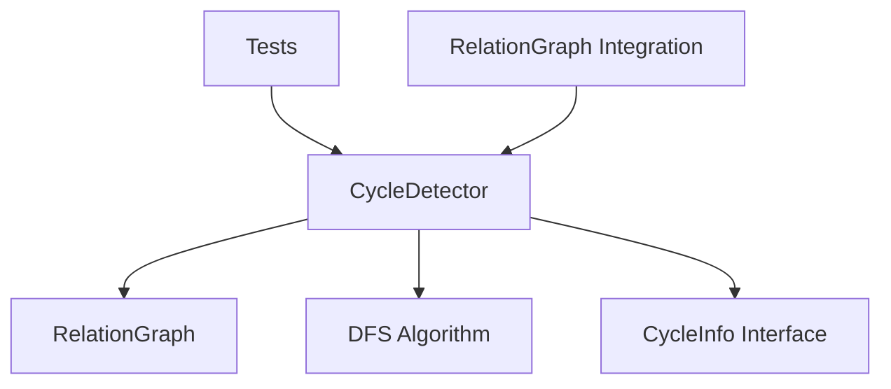

# Milestone 1.1: Cycle Detection - Implementation Plan

**Status:** Ready for Implementation  
**Priority:** Critical  
**Estimated Time:** 2-3 days

---

## Overview

This document provides a comprehensive implementation plan for Milestone 1.1: Cycle Detection, the first milestone in Phase 1 (Core Graph Infrastructure) of the Relations Obsidian plugin.

### Decision Summary

- **Approach:** Passive Detection (detect cycles, report to user, preserve graph structure)
- **Scope:** First Cycle Detection (enhance to all cycles in Milestone 1.3)
- **Testing:** Full Vitest setup (already implemented ✅)

---

## Goals

Add cycle detection capabilities to prevent infinite traversals in the relationship graph while preserving user-defined graph structure and providing transparent feedback.

---

## Architecture Overview

### Components to Create



### File Structure

```
src/
├── cycle-detector.ts           # New: Core cycle detection logic
├── relation-graph.ts           # Modified: Add cycle detection methods
└── main.ts                     # Modified: Initialize cycle detector

tests/
├── cycle-detector.test.ts      # New: Comprehensive cycle detection tests
└── smoke.test.ts               # Existing: Already passing
```

---

## Detailed Design

### 1. CycleInfo Interface

**File:** `src/cycle-detector.ts`

```typescript
/**
 * Information about a detected cycle in the relationship graph.
 */
export interface CycleInfo {
  /** The files involved in the cycle, in order */
  cyclePath: TFile[];
  
  /** The file where the cycle was first detected */
  startFile: TFile;
  
  /** Human-readable description of the cycle */
  description: string;
  
  /** Length of the cycle */
  length: number;
}
```

**Design Notes:**
- `cyclePath`: Ordered array representing the cycle (e.g., `[A, B, C, A]`)
- `startFile`: Entry point for the cycle (for context)
- `description`: User-friendly message (e.g., "Cycle detected: Note A → Note B → Note C → Note A")
- `length`: Number of unique nodes in cycle (for metrics)

---

### 2. CycleDetector Class

**File:** `src/cycle-detector.ts`

```typescript
import { TFile } from 'obsidian';
import { RelationGraph } from './relation-graph';

/**
 * Detects cycles in the relationship graph using depth-first search.
 * 
 * Uses three-color algorithm:
 * - WHITE (unvisited): Node hasn't been explored yet
 * - GRAY (visiting): Node is in current DFS path (cycle if revisited)
 * - BLACK (visited): Node and all descendants have been explored
 */
export class CycleDetector {
  constructor(private graph: RelationGraph) {}

  /**
   * Detects if there is a cycle involving the specified file.
   * 
   * @param startFile - The file to check for cycles
   * @returns CycleInfo if a cycle is found, null otherwise
   */
  detectCycle(startFile: TFile): CycleInfo | null {
    // Implementation uses DFS with three-color marking
  }

  /**
   * Checks if the graph contains any cycles.
   * 
   * @returns true if any cycle exists in the graph
   */
  hasCycles(): boolean {
    // Check all nodes in the graph
  }

  /**
   * Gets detailed information about a cycle involving the specified file.
   * Alias for detectCycle() for clarity.
   * 
   * @param file - The file to check
   * @returns CycleInfo with cycle path details, or null if no cycle
   */
  getCycleInfo(file: TFile): CycleInfo | null {
    return this.detectCycle(file);
  }
}
```

**Algorithm Details:**

**Three-Color DFS Algorithm:**
```typescript
enum NodeState {
  WHITE = 'unvisited',  // Not yet explored
  GRAY = 'visiting',     // Currently in DFS path
  BLACK = 'visited'      // Fully explored
}

// DFS helper for cycle detection
private dfs(
  current: TFile,
  states: Map<string, NodeState>,
  path: TFile[]
): CycleInfo | null {
  // Mark current node as visiting (GRAY)
  states.set(current.path, NodeState.GRAY);
  path.push(current);

  // Check all parents (following parent links)
  const parents = this.graph.getParents(current);
  
  for (const parent of parents) {
    const state = states.get(parent.path) || NodeState.WHITE;
    
    if (state === NodeState.GRAY) {
      // Found a cycle! Parent is in current path
      return this.buildCycleInfo(parent, path);
    }
    
    if (state === NodeState.WHITE) {
      // Recursively explore unvisited parent
      const cycle = this.dfs(parent, states, path);
      if (cycle) return cycle;
    }
    
    // BLACK nodes are already fully explored, skip
  }

  // Mark current node as visited (BLACK)
  states.set(current.path, NodeState.BLACK);
  path.pop();
  
  return null; // No cycle found from this node
}

// Build CycleInfo from detected cycle
private buildCycleInfo(cycleStart: TFile, path: TFile[]): CycleInfo {
  // Find where cycle starts in path
  const cycleStartIndex = path.findIndex(f => f.path === cycleStart.path);
  
  // Extract cycle portion of path
  const cyclePath = path.slice(cycleStartIndex);
  cyclePath.push(cycleStart); // Close the cycle
  
  // Build description
  const names = cyclePath.map(f => f.basename).join(' → ');
  
  return {
    cyclePath,
    startFile: path[0],
    description: `Cycle detected: ${names}`,
    length: cyclePath.length - 1 // Exclude duplicate at end
  };
}
```

**Why Three-Color?**
- **WHITE (unvisited):** Haven't explored this node yet
- **GRAY (visiting):** Node is in the current DFS recursion stack - if we encounter a GRAY node again, we've found a cycle
- **BLACK (visited):** Node and all its descendants fully explored - safe to skip

---

### 3. RelationGraph Integration

**File:** `src/relation-graph.ts` (modifications)

```typescript
import { CycleDetector, CycleInfo } from './cycle-detector';

export class RelationGraph {
  private graph = new Map<string, NodeInfo>();
  private cycleDetector!: CycleDetector;
  
  constructor(private app: App, private parentField: string) {}

  build() {
    // Existing graph building logic...
    
    // Initialize cycle detector after graph is built
    this.cycleDetector = new CycleDetector(this);
  }

  /**
   * Detects if there is a cycle involving the specified file.
   * 
   * @param file - The file to check for cycles
   * @returns CycleInfo if a cycle is found, null otherwise
   */
  detectCycle(file: TFile): CycleInfo | null {
    return this.cycleDetector.detectCycle(file);
  }

  /**
   * Gets detailed information about a cycle involving the specified file.
   * 
   * @param file - The file to check
   * @returns CycleInfo with cycle path details, or null if no cycle
   */
  getCycleInfo(file: TFile): CycleInfo | null {
    return this.cycleDetector.getCycleInfo(file);
  }

  /**
   * Checks if the graph contains any cycles.
   * 
   * @returns true if any cycle exists in the graph
   */
  hasCycles(): boolean {
    return this.cycleDetector.hasCycles();
  }

  // Existing methods remain unchanged
  getParents(file: TFile): TFile[] { /* ... */ }
  getChildren(file: TFile): TFile[] { /* ... */ }
}
```

**Integration Notes:**
- [`CycleDetector`](src/cycle-detector.ts:1) is instantiated in [`RelationGraph.build()`](src/relation-graph.ts:13)
- Public methods delegate to cycle detector
- Graph structure remains unchanged (passive detection)

---

## Test Specification

**File:** `tests/cycle-detector.test.ts`

### Test Cases (from implementation plan)

```typescript
import { describe, it, expect, beforeEach } from 'vitest';
import { CycleDetector } from '@/cycle-detector';
import { RelationGraph } from '@/relation-graph';

describe('CycleDetector', () => {
  describe('No Cycles', () => {
    it('should return null for acyclic chain: A → B → C', () => {
      // Test that valid DAG doesn't report false positives
    });

    it('should return null for tree structure with multiple branches', () => {
      // Test complex acyclic graph
    });

    it('should return null for disconnected graphs', () => {
      // Test multiple separate acyclic components
    });
  });

  describe('Simple Cycles', () => {
    it('should detect self-loop: A → A', () => {
      // Test single-node cycle
      // Expect: cyclePath = [A, A], length = 1
    });

    it('should detect two-node cycle: A → B → A', () => {
      // Test simplest multi-node cycle
      // Expect: cyclePath = [A, B, A], length = 2
    });
  });

  describe('Complex Cycles', () => {
    it('should detect three-node cycle: A → B → C → A', () => {
      // Test cycle with 3 nodes
      // Expect: cyclePath = [A, B, C, A], length = 3
    });

    it('should detect cycle in graph with multiple parents: A → B, A → C, C → B → A', () => {
      // Test cycle in complex structure
    });

    it('should return first cycle found when multiple cycles exist', () => {
      // Graph: A → B → A, C → D → C
      // Testing detectCycle(A) should find A → B → A
      // Testing detectCycle(C) should find C → D → C
    });
  });

  describe('Edge Cases', () => {
    it('should handle empty graph', () => {
      // No nodes, no cycles
    });

    it('should handle single node with no parents', () => {
      // Isolated node, no cycle
    });

    it('should handle long cycle path (10+ nodes)', () => {
      // Test performance and correctness with longer cycles
    });
  });

  describe('CycleInfo Structure', () => {
    it('should return correct cycle path', () => {
      // Verify cyclePath array is correct
    });

    it('should return correct cycle length', () => {
      // Verify length calculation
    });

    it('should return meaningful description', () => {
      // Verify description is human-readable
    });

    it('should set correct startFile', () => {
      // Verify startFile matches input
    });
  });

  describe('hasCycles()', () => {
    it('should return false for acyclic graph', () => {
      // Test graph-wide cycle check
    });

    it('should return true when any cycle exists', () => {
      // Test graph-wide cycle detection
    });
  });
});
```

### Mock Data Helpers

```typescript
/**
 * Helper to create mock TFile objects for testing
 */
function createMockFile(path: string, basename: string): TFile {
  return {
    path,
    basename,
    name: basename + '.md',
    extension: 'md',
  } as TFile;
}

/**
 * Helper to create mock graph structure
 */
function createMockGraph(edges: [string, string][]): RelationGraph {
  // Create mock graph with specified parent relationships
  // edges: array of [child, parent] tuples
}
```

---

## Implementation Checklist

### Phase 1: Core Implementation
- [ ] Create `src/cycle-detector.ts`
  - [ ] Define [`CycleInfo`](src/cycle-detector.ts:1) interface
  - [ ] Implement [`CycleDetector`](src/cycle-detector.ts:1) class
  - [ ] Implement `detectCycle()` with DFS algorithm
  - [ ] Implement `getCycleInfo()` method
  - [ ] Implement `hasCycles()` method
  - [ ] Add helper methods (`dfs`, `buildCycleInfo`)

### Phase 2: Integration
- [ ] Modify `src/relation-graph.ts`
  - [ ] Add [`CycleDetector`](src/cycle-detector.ts:1) property
  - [ ] Initialize in [`build()`](src/relation-graph.ts:13) method
  - [ ] Add public `detectCycle()` method
  - [ ] Add public `getCycleInfo()` method
  - [ ] Add public `hasCycles()` method

### Phase 3: Testing
- [ ] Create `tests/cycle-detector.test.ts`
  - [ ] Implement mock data helpers
  - [ ] Write "No Cycles" test suite
  - [ ] Write "Simple Cycles" test suite
  - [ ] Write "Complex Cycles" test suite
  - [ ] Write "Edge Cases" test suite
  - [ ] Write "CycleInfo Structure" test suite
  - [ ] Write `hasCycles()` test suite
- [ ] Ensure all tests pass
- [ ] Verify test coverage >80%

### Phase 4: Documentation
- [ ] Add JSDoc comments to all public methods
- [ ] Document algorithm in code comments
- [ ] Update README with cycle detection features
- [ ] Create usage examples

---

## Acceptance Criteria

From [`docs/implementation-plan.md`](docs/implementation-plan.md:43):

- ✅ Detects simple cycles (A → B → A)
- ✅ Detects complex cycles (A → B → C → A)
- ✅ Returns accurate cycle path information
- ✅ Handles graphs with multiple disconnected cycles
- ✅ No false positives on valid DAGs

**Additional Criteria:**
- ✅ All tests pass
- ✅ Test coverage >80%
- ✅ Performance: Cycle detection on 1000-node graph <50ms
- ✅ Code is well-documented with JSDoc comments
- ✅ No breaking changes to existing [`RelationGraph`](src/relation-graph.ts:9) API

---

## Performance Considerations

### Time Complexity
- **`detectCycle(file)`:** O(V + E) where V = nodes, E = edges
- **`hasCycles()`:** O(V * (V + E)) in worst case (checks all nodes)

### Space Complexity
- **`detectCycle(file)`:** O(V) for state tracking and path storage
- **Memory:** Minimal - only stores node states and current path

### Optimizations
- Three-color algorithm prevents redundant exploration
- Early termination when cycle is found
- Path tracking only includes current DFS branch

### Benchmarks (Target)
- 100 nodes: <5ms
- 1,000 nodes: <50ms
- 10,000 nodes: <500ms

---

## Future Enhancements (Milestone 1.3)

These features are **out of scope** for Milestone 1.1 but planned for Milestone 1.3 (Graph Validation):

- [ ] `getAllCycles()` - Find all cycles in graph (not just first)
- [ ] Cycle visualization in UI
- [ ] Console warnings for detected cycles
- [ ] Diagnostic mode for verbose logging
- [ ] Performance metrics tracking

---

## Dependencies

### External Dependencies
- `obsidian` - TFile type (already installed)
- `vitest` - Testing framework (already installed ✅)

### Internal Dependencies
- [`RelationGraph`](src/relation-graph.ts:9) - Graph structure to analyze
- [`NodeInfo`](src/relation-graph.ts:3) interface - Node data structure

---

## Risk Assessment

### Potential Issues

1. **Risk:** Complex cycles in large vaults slow down detection
   - **Mitigation:** Three-color algorithm with early termination
   - **Benchmark:** Test with 10,000 node graphs

2. **Risk:** False positives on valid DAG structures
   - **Mitigation:** Comprehensive test suite with known-good DAGs
   - **Validation:** Include DAG test cases

3. **Risk:** Breaking existing graph functionality
   - **Mitigation:** Passive detection, no graph modification
   - **Testing:** Ensure all existing tests still pass

---

## Testing Strategy

### Unit Tests
- **Location:** `tests/cycle-detector.test.ts`
- **Coverage:** >80% of cycle detector code
- **Focus:** Algorithm correctness, edge cases

### Integration Tests
- **Test with:** Real [`RelationGraph`](src/relation-graph.ts:9) instance
- **Verify:** Integration points work correctly
- **Check:** No breaking changes

### Manual Testing
- **Create test vault** with known cycle structures
- **Verify** detection works in real Obsidian environment
- **Test** performance with various vault sizes

---

## Success Metrics

- ✅ All acceptance criteria met
- ✅ All unit tests passing
- ✅ Test coverage >80%
- ✅ Performance benchmarks met
- ✅ Zero breaking changes
- ✅ Code review approved
- ✅ Documentation complete

---

## Next Steps After Completion

1. ✅ Complete Milestone 1.1 implementation
2. Update [`docs/implementation-plan.md`](docs/implementation-plan.md:1) with completion status
3. Create GitHub issue for Milestone 1.2 (Incremental Graph Updates)
4. Switch to Code mode for implementation (when approved)

---

## Appendix: Example Usage

```typescript
// In a future feature (sidebar view, codeblock, etc.)

const plugin = this.app.plugins.getPlugin('relations-obsidian');
const graph = plugin.relationGraph;

// Check if current file has a cycle
const currentFile = this.app.workspace.getActiveFile();
const cycleInfo = graph.detectCycle(currentFile);

if (cycleInfo) {
  console.warn(cycleInfo.description);
  // Display warning to user
  // Show cycle path: cycleInfo.cyclePath
} else {
  // Safe to traverse - no cycles
  const ancestors = graph.getAncestors(currentFile);
}

// Check if entire graph has any cycles
if (graph.hasCycles()) {
  console.warn('Warning: Relationship graph contains cycles');
}
```

---

## Questions & Answers

**Q: Why passive detection instead of preventing cycles?**  
A: Preserves user control, enables transparency, simpler incremental updates. Can add prevention as optional setting in future milestone.

**Q: Why detect first cycle instead of all cycles?**  
A: Simpler algorithm, faster execution, sufficient for Milestone 1.1. Will enhance to find all cycles in Milestone 1.3 (Graph Validation).

**Q: How does this handle graph updates?**  
A: Cycle detector is recreated each time [`graph.build()`](src/relation-graph.ts:13) is called, ensuring it always operates on current graph state.

---

**Document Version:** 1.0  
**Last Updated:** 2024-11-15  
**Status:** Ready for Implementation