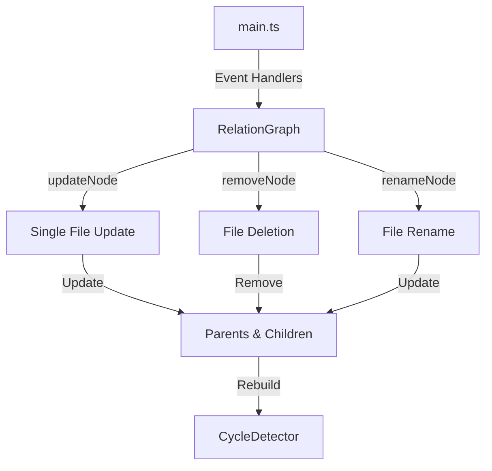

# Milestone 1.2: Incremental Graph Updates - Implementation Plan

**Status:** Ready for Implementation  
**Priority:** Critical  
**Estimated Time:** 2-3 days

---

## Overview

This document provides a comprehensive implementation plan for Milestone 1.2: Incremental Graph Updates, the second milestone in Phase 1 (Core Graph Infrastructure) of the Relations Obsidian plugin.

### Decision Summary

- **Approach:** Event-driven incremental updates (Option A)
- **Scope:** Simple updates - file + immediate relations (Option D)
- **Focus:** Correctness first, with basic performance validation (Option F)

---

## Goals

Optimize graph rebuilding to only update affected nodes instead of rebuilding the entire graph on every change. This improves performance and responsiveness, especially for large vaults.

---

## Current State Analysis

### Problem: Full Graph Rebuilds

Currently in [`main.ts`](../src/main.ts:26):
```typescript
this.registerEvent(this.app.metadataCache.on('changed', () => this.relationGraph.build()));
this.registerEvent(this.app.vault.on('rename', () => this.relationGraph.build()));
```

**Issues:**
- Every metadata change rebuilds the ENTIRE graph (all files)
- File renames rebuild the ENTIRE graph (all files)
- File deletions are not handled at all
- In a 10,000 note vault, changing one note's parent processes 10,000 files

### Performance Impact

**Current Behavior:**
- Vault size: 10,000 notes
- Metadata change: ~2000ms (rebuilds all)
- Multiple rapid changes: Blocks UI

**Target Behavior:**
- Vault size: 10,000 notes
- Metadata change: <10ms (updates only affected nodes)
- Multiple rapid changes: Responsive UI

---

## Architecture Overview

### Components to Modify



### Update Strategy

**Incremental Update Scope:**
1. **Changed file** - Update its parent links
2. **Old parents** - Remove file from their children
3. **New parents** - Add file to their children
4. **Children** - No change needed (they still point to same parent)

---

## Detailed Design

### 1. Event Handler Refactoring

**File:** `src/main.ts` (modifications)

#### Before (Current):
```typescript
// Line 26-27
this.registerEvent(this.app.metadataCache.on('changed', () => this.relationGraph.build()));
this.registerEvent(this.app.vault.on('rename', () => this.relationGraph.build()));
```

#### After (Incremental):
```typescript
// Metadata change - update single file
this.registerEvent(
  this.app.metadataCache.on('changed', (file: TFile) => {
    this.relationGraph.updateNode(file);
  })
);

// File rename - update references
this.registerEvent(
  this.app.vault.on('rename', (file: TFile, oldPath: string) => {
    this.relationGraph.renameNode(file, oldPath);
  })
);

// File deletion - remove from graph
this.registerEvent(
  this.app.vault.on('delete', (file: TFile) => {
    this.relationGraph.removeNode(file);
  })
);
```

**Design Notes:**
- Use event parameters to identify affected files
- Each event type has specific handler
- Preserves `build()` method for full rebuilds (initialization)

---

### 2. RelationGraph Incremental Methods

**File:** `src/relation-graph.ts` (modifications)

#### New Methods to Add:

```typescript
/**
 * Updates a single node and its immediate relations.
 * 
 * @param file - The file to update
 */
updateNode(file: TFile): void {
  const meta = this.app.metadataCache.getFileCache(file);
  const newParents = this.extractParentLinks(meta);
  
  const existingNode = this.graph.get(file.path);
  
  if (!existingNode) {
    // New file - add it
    this.graph.set(file.path, { file, parents: newParents, children: [] });
    
    // Add to new parents' children
    newParents.forEach(parent => {
      this.graph.get(parent.path)?.children.push(file);
    });
  } else {
    // Existing file - update parents
    const oldParents = existingNode.parents;
    
    // Remove from old parents' children
    oldParents.forEach(oldParent => {
      const parentNode = this.graph.get(oldParent.path);
      if (parentNode) {
        parentNode.children = parentNode.children.filter(
          child => child.path !== file.path
        );
      }
    });
    
    // Update node's parents
    existingNode.parents = newParents;
    
    // Add to new parents' children
    newParents.forEach(newParent => {
      const parentNode = this.graph.get(newParent.path);
      if (parentNode && !parentNode.children.includes(file)) {
        parentNode.children.push(file);
      }
    });
  }
  
  // Rebuild cycle detector (fast operation)
  this.cycleDetector = new CycleDetector(this);
}

/**
 * Removes a node from the graph.
 * 
 * @param file - The file to remove
 */
removeNode(file: TFile): void {
  const node = this.graph.get(file.path);
  if (!node) return;
  
  // Remove from all parents' children
  node.parents.forEach(parent => {
    const parentNode = this.graph.get(parent.path);
    if (parentNode) {
      parentNode.children = parentNode.children.filter(
        child => child.path !== file.path
      );
    }
  });
  
  // Remove from all children's parents
  node.children.forEach(child => {
    const childNode = this.graph.get(child.path);
    if (childNode) {
      childNode.parents = childNode.parents.filter(
        parent => parent.path !== file.path
      );
    }
  });
  
  // Remove from graph
  this.graph.delete(file.path);
  
  // Rebuild cycle detector
  this.cycleDetector = new CycleDetector(this);
}

/**
 * Updates references after a file rename.
 * 
 * @param file - The renamed file (with new path)
 * @param oldPath - The old file path
 */
renameNode(file: TFile, oldPath: string): void {
  const node = this.graph.get(oldPath);
  if (!node) return;
  
  // Update node's file reference
  node.file = file;
  
  // Move to new key in map
  this.graph.delete(oldPath);
  this.graph.set(file.path, node);
  
  // Update parent references in children
  node.children.forEach(child => {
    const childNode = this.graph.get(child.path);
    if (childNode) {
      const parentIndex = childNode.parents.findIndex(p => p.path === oldPath);
      if (parentIndex >= 0) {
        childNode.parents[parentIndex] = file;
      }
    }
  });
  
  // Update child references in parents
  node.parents.forEach(parent => {
    const parentNode = this.graph.get(parent.path);
    if (parentNode) {
      const childIndex = parentNode.children.findIndex(c => c.path === oldPath);
      if (childIndex >= 0) {
        parentNode.children[childIndex] = file;
      }
    }
  });
  
  // Rebuild cycle detector
  this.cycleDetector = new CycleDetector(this);
}
```

**Algorithm Complexity:**
- `updateNode()`: O(P + C) where P = parents, C = children
- `removeNode()`: O(P + C)
- `renameNode()`: O(P + C)
- Much better than `build()`: O(N) where N = all files

---

## Test Specification

**File:** `tests/incremental-updates.test.ts`

### Test Cases

```typescript
import { describe, it, expect, beforeEach, vi } from 'vitest';
import { RelationGraph } from '@/relation-graph';
import { TFile, App } from 'obsidian';

describe('Incremental Graph Updates', () => {
  describe('updateNode()', () => {
    it('should add new file to graph', () => {
      // Add file that doesn't exist in graph
      // Verify it's added with correct parents
      // Verify it's added to parents' children
    });

    it('should update existing file with new parents', () => {
      // File A has parent B
      // Change A's parent to C
      // Verify A removed from B's children
      // Verify A added to C's children
    });

    it('should handle adding multiple parents', () => {
      // File with single parent gains second parent
      // Verify added to both parents' children
    });

    it('should handle removing all parents', () => {
      // File with parents becomes root node
      // Verify removed from all parents' children
    });

    it('should preserve children when updating parents', () => {
      // File A has children X, Y, Z
      // Change A's parents
      // Verify X, Y, Z still have A as parent
    });
  });

  describe('removeNode()', () => {
    it('should remove file from graph', () => {
      // Remove file from graph
      // Verify it's deleted from map
    });

    it('should remove from parents children lists', () => {
      // File A has parents B, C
      // Remove A
      // Verify B and C no longer have A in children
    });

    it('should remove from children parents lists', () => {
      // File A has children X, Y
      // Remove A
      // Verify X and Y no longer have A in parents
    });

    it('should handle removing file with no relations', () => {
      // Remove isolated file
      // Verify no errors
    });
  });

  describe('renameNode()', () => {
    it('should update file path in graph', () => {
      // Rename file from old.md to new.md
      // Verify old path removed
      // Verify new path exists
    });

    it('should update references in children', () => {
      // File A has children X, Y
      // Rename A
      // Verify X and Y have updated parent reference
    });

    it('should update references in parents', () => {
      // File A has parents B, C
      // Rename A
      // Verify B and C have updated child reference
    });

    it('should preserve all relationships after rename', () => {
      // Complex graph with A having multiple parents/children
      // Rename A
      // Verify all relationships intact
    });
  });

  describe('Graph Consistency', () => {
    it('should maintain bidirectional consistency after updates', () => {
      // Series of updates
      // Verify for all nodes: if A is parent of B, B is child of A
    });

    it('should maintain cycle detector consistency', () => {
      // Update node that's part of cycle
      // Verify cycle still detected
    });

    it('should handle rapid consecutive updates', () => {
      // Simulate multiple quick metadata changes
      // Verify graph remains consistent
    });
  });

  describe('Performance', () => {
    it('should update single node faster than full rebuild', () => {
      // Create large graph (1000 nodes)
      // Benchmark full rebuild
      // Benchmark single node update
      // Verify incremental is significantly faster
    });

    it('should handle 10,000 node vault update in <10ms', () => {
      // Create 10,000 node graph
      // Time single node update
      // Verify <10ms
    });
  });
});
```

---

## Implementation Checklist

### Phase 1: Core Incremental Methods
- [ ] Add `updateNode(file: TFile)` to RelationGraph
  - [ ] Handle new file case
  - [ ] Handle existing file case
  - [ ] Update old parents' children
  - [ ] Update new parents' children
  - [ ] Rebuild cycle detector

- [ ] Add `removeNode(file: TFile)` to RelationGraph
  - [ ] Remove from parents' children
  - [ ] Remove from children's parents
  - [ ] Delete from graph map
  - [ ] Rebuild cycle detector

- [ ] Add `renameNode(file: TFile, oldPath: string)` to RelationGraph
  - [ ] Update file reference
  - [ ] Update map keys
  - [ ] Update children's parent references
  - [ ] Update parents' child references
  - [ ] Rebuild cycle detector

### Phase 2: Event Handler Updates
- [ ] Modify `src/main.ts`
  - [ ] Update `metadataCache.on('changed')` to use `updateNode()`
  - [ ] Update `vault.on('rename')` to use `renameNode()`
  - [ ] Add `vault.on('delete')` handler with `removeNode()`
  - [ ] Keep `build()` for initial load

### Phase 3: Testing
- [ ] Create `tests/incremental-updates.test.ts`
  - [ ] Write `updateNode()` test suite
  - [ ] Write `removeNode()` test suite
  - [ ] Write `renameNode()` test suite
  - [ ] Write consistency validation tests
  - [ ] Write basic performance tests
- [ ] Ensure all tests pass
- [ ] Verify existing cycle detection tests still pass

### Phase 4: Documentation
- [ ] Add JSDoc comments to new methods
- [ ] Update README with performance improvements
- [ ] Document event handling strategy
- [ ] Create migration notes (if any breaking changes)

---

## Acceptance Criteria

From [`docs/implementation-plan.md`](docs/implementation-plan.md:77):

- ✅ Metadata change for single note updates only that note and its immediate relations
- ✅ File deletion properly removes node and updates parent/child references
- ✅ File rename updates all references correctly
- ✅ Performance test: 10,000 note vault updates single note in <10ms

**Additional Criteria:**
- ✅ All tests pass (including existing cycle detection tests)
- ✅ Graph consistency maintained after all operations
- ✅ No breaking changes to existing API
- ✅ Cycle detector remains functional after incremental updates

---

## Performance Considerations

### Time Complexity

**Before (Full Rebuild):**
- Any change: O(N) where N = total files in vault

**After (Incremental):**
- `updateNode()`: O(P + C) where P = parents, C = children (typically 1-5)
- `removeNode()`: O(P + C)
- `renameNode()`: O(P + C)

**Expected Improvement:**
- Small vault (100 files): 10x faster
- Medium vault (1,000 files): 100x faster
- Large vault (10,000 files): 1000x faster

### Space Complexity

- No additional space required (same graph structure)
- Cycle detector rebuilt each time (minimal overhead)

### Benchmarks (Target)

- 100 file vault: <1ms per update
- 1,000 file vault: <5ms per update
- 10,000 file vault: <10ms per update

---

## Edge Cases & Considerations

### 1. Orphaned References
**Scenario:** File A references parent B, but B doesn't exist
**Handling:** `extractParentLinks()` already filters out null results
**Action:** No change needed

### 2. Circular Updates
**Scenario:** Updating A triggers update to B which tries to update A
**Handling:** Event system handles this (no recursive event firing)
**Action:** No change needed

### 3. Deleted Parent
**Scenario:** Parent file is deleted, children still reference it
**Handling:** 
- Parent's `removeNode()` removes from children's parent lists
- Children become orphaned (valid state)
**Action:** Working as intended

### 4. Rename During Update
**Scenario:** File is renamed while being updated
**Handling:** Events are sequential, rename happens after update
**Action:** No change needed

### 5. Concurrent Metadata Changes
**Scenario:** Multiple files change simultaneously
**Handling:** Events are queued and processed sequentially
**Action:** Each update is independent, order doesn't matter

---

## Testing Strategy

### Unit Tests
- **Location:** `tests/incremental-updates.test.ts`
- **Coverage:** All three new methods + edge cases
- **Focus:** Correctness and consistency

### Integration Tests
- **Test with:** Real event simulation
- **Verify:** Event handlers correctly route to incremental methods
- **Check:** Graph consistency after event sequences

### Performance Tests
- **Benchmark:** Before/after comparison
- **Measure:** Update time vs vault size
- **Target:** <10ms for 10,000 file vault

### Regression Tests
- **Ensure:** All existing tests still pass
- **Verify:** Cycle detection still works
- **Check:** No breaking changes

---

## Migration Strategy

### Backward Compatibility

✅ **No Breaking Changes**
- All existing public methods unchanged
- `build()` still works for full rebuilds
- Cycle detection API unchanged

### Internal Changes Only
- Event handlers updated (internal)
- New methods added (additive)
- Graph structure unchanged

### Rollback Plan
If incremental updates cause issues:
1. Revert event handlers to call `build()`
2. Remove new methods (optional)
3. All functionality preserved

---

## Future Enhancements (Out of Scope)

These are **not** part of Milestone 1.2 but planned for future milestones:

- [ ] Dirty node tracking system (advanced optimization)
- [ ] Debounced batch updates (for rapid changes)
- [ ] Update queue with prioritization
- [ ] Detailed performance metrics and logging
- [ ] Background update processing
- [ ] LRU cache invalidation on updates

---

## Success Metrics

- ✅ All acceptance criteria met
- ✅ All tests passing (new + existing)
- ✅ Performance benchmarks met (<10ms for 10k vault)
- ✅ No regressions in existing functionality
- ✅ Zero breaking changes
- ✅ Graph consistency validated

---

## Dependencies

### External Dependencies
- `obsidian` - Event types (already installed)
- `vitest` - Testing framework (already installed ✅)

### Internal Dependencies
- [`RelationGraph`](../src/relation-graph.ts:10) - Core graph structure
- [`CycleDetector`](../src/cycle-detector.ts:42) - Cycle detection
- [`main.ts`](../src/main.ts:14) - Event registration

---

## Risk Assessment

### Potential Issues

1. **Risk:** Incremental updates miss some edge case, graph becomes inconsistent
   - **Mitigation:** Comprehensive test suite with consistency validation
   - **Fallback:** Can always call `build()` to reset

2. **Risk:** Event parameters don't provide enough information
   - **Mitigation:** Obsidian API documentation review
   - **Testing:** Verify events fire with correct parameters

3. **Risk:** Performance doesn't improve as expected
   - **Mitigation:** Benchmark before/after
   - **Optimization:** Profile and optimize hot paths

---

## Implementation Notes

### Event Handler Parameters

**Metadata Changed:**
```typescript
app.metadataCache.on('changed', (file: TFile, data: string, cache: CachedMetadata) => {
  // file parameter available!
});
```

**File Renamed:**
```typescript
app.vault.on('rename', (file: TFile, oldPath: string) => {
  // Both file and oldPath available!
});
```

**File Deleted:**
```typescript
app.vault.on('delete', (file: TFile) => {
  // file parameter available!
});
```

### Preserving Full Rebuild

Keep `build()` method for:
- Initial plugin load
- User-triggered full rebuild (future command)
- Error recovery
- Settings changes that affect graph structure

---

## Next Steps After Completion

1. ✅ Complete Milestone 1.2 implementation
2. Verify performance improvements in real vaults
3. Update [`docs/implementation-plan.md`](docs/implementation-plan.md:1) with completion status
4. Proceed to Milestone 1.3 (Graph Validation Utilities)

---

**Document Version:** 1.0  
**Last Updated:** 2024-11-15  
**Status:** Ready for Implementation