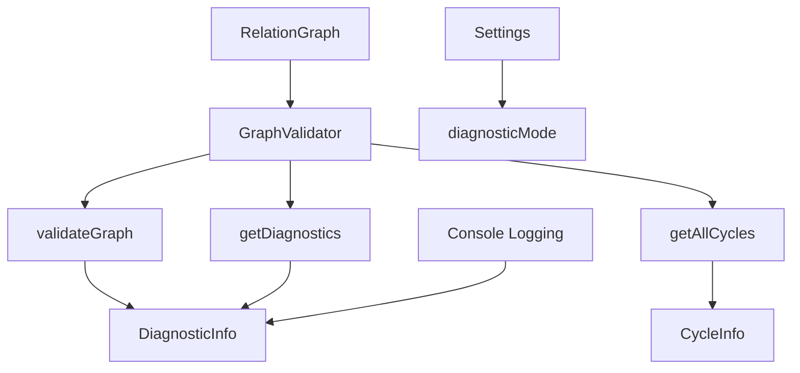

# Milestone 1.3: Graph Validation Utilities - Implementation Plan

**Status:** Ready for Implementation
**Priority:** High
**Estimated Time:** 2-3 days

---

## Overview

This document provides a comprehensive implementation plan for Milestone 1.3: Graph Validation Utilities, the third and final milestone in Phase 1 (Core Graph Infrastructure) of the Relations Obsidian plugin.

### Decision Summary

- **Approach:** Comprehensive validation with detailed diagnostics
- **Scope:** All cycles detection (enhancement from Milestone 1.1's first-cycle detection)
- **Output:** Structured diagnostic reports with actionable messages
- **Integration:** Optional diagnostic mode in settings + on-demand validation

---

## Goals

Add diagnostic tools for graph health and integrity, enabling users and developers to identify and resolve issues such as broken links, cycles, and orphaned nodes.

---

## Current State Analysis

### Existing Capabilities

From Milestone 1.1 (Cycle Detection):
- ✅ `detectCycle(file)` - Detects **first** cycle involving a file
- ✅ `getCycleInfo(file)` - Returns cycle path information
- ✅ `hasCycles()` - Boolean check for any cycles

From Milestone 1.2 (Incremental Updates):
- ✅ Incremental graph updates maintain consistency
- ✅ Bidirectional parent/child relationships

### Missing Capabilities

- ❌ **All cycles detection** - Currently only finds first cycle
- ❌ **Unresolved link detection** - No validation for broken parent references
- ❌ **Orphaned node detection** - No identification of isolated nodes
- ❌ **Comprehensive diagnostics** - No structured error reporting
- ❌ **Diagnostic mode** - No optional verbose logging
- ❌ **Validation command** - No on-demand health check

---

## Architecture Overview

### Components to Create



### File Structure

```
src/
├── graph-validator.ts          # New: Validation and diagnostics
├── relation-graph.ts            # Modified: Add validator integration
├── settings.ts                  # Modified: Add diagnostic mode setting
└── main.ts                      # Modified: Initialize validator, add logging

tests/
└── graph-validator.test.ts      # New: Comprehensive validation tests
```

---

## Detailed Design

### 1. DiagnosticInfo Interface

**File:** `src/graph-validator.ts`

```typescript
/**
 * Severity level for diagnostic issues
 */
export enum DiagnosticSeverity {
  ERROR = 'error',     // Critical issues (cycles, broken references)
  WARNING = 'warning', // Potential issues (orphaned nodes)
  INFO = 'info'        // Informational (graph statistics)
}

/**
 * Type of diagnostic issue
 */
export enum DiagnosticType {
  CYCLE = 'cycle',
  UNRESOLVED_LINK = 'unresolved_link',
  ORPHANED_NODE = 'orphaned_node',
  BROKEN_REFERENCE = 'broken_reference',
  GRAPH_STATS = 'graph_stats'
}

/**
 * Individual diagnostic issue
 */
export interface DiagnosticIssue {
  /** Severity level */
  severity: DiagnosticSeverity;

  /** Type of issue */
  type: DiagnosticType;

  /** Human-readable message */
  message: string;

  /** File(s) involved */
  files: TFile[];

  /** Additional context (e.g., cycle path, link text) */
  context?: Record<string, any>;
}

/**
 * Complete diagnostic report for the graph
 */
export interface DiagnosticInfo {
  /** Timestamp of validation */
  timestamp: number;

  /** Total number of nodes in graph */
  totalNodes: number;

  /** Total number of edges (parent-child relationships) */
  totalEdges: number;

  /** All diagnostic issues found */
  issues: DiagnosticIssue[];

  /** Summary counts by severity */
  summary: {
    errors: number;
    warnings: number;
    info: number;
  };

  /** Whether the graph is considered healthy */
  isHealthy: boolean;
}
```

**Design Notes:**
- Clear severity levels for prioritizing issues
- Structured issue types for filtering and reporting
- Rich context information for debugging
- Summary statistics for quick health assessment

---

### 2. GraphValidator Class

**File:** `src/graph-validator.ts`

```typescript
import { TFile } from 'obsidian';
import { RelationGraph } from './relation-graph';
import { CycleDetector, CycleInfo } from './cycle-detector';

/**
 * Validates graph health and provides diagnostic information.
 *
 * Checks for:
 * - Cycles in the relationship graph
 * - Unresolved parent links (references to non-existent files)
 * - Orphaned nodes (no parents, no children)
 * - Broken bidirectional references
 */
export class GraphValidator {
  constructor(
    private graph: RelationGraph,
    private cycleDetector: CycleDetector
  ) {}

  /**
   * Performs comprehensive graph validation.
   *
   * @returns Complete diagnostic report
   */
  validateGraph(): DiagnosticInfo {
    const issues: DiagnosticIssue[] = [];
    const startTime = Date.now();

    // Check for all cycles
    const cycles = this.getAllCycles();
    cycles.forEach(cycle => {
      issues.push({
        severity: DiagnosticSeverity.ERROR,
        type: DiagnosticType.CYCLE,
        message: cycle.description,
        files: cycle.cyclePath,
        context: { length: cycle.length }
      });
    });

    // Check for unresolved parent links
    const unresolvedLinks = this.findUnresolvedLinks();
    unresolvedLinks.forEach(({ file, unresolvedParents }) => {
      issues.push({
        severity: DiagnosticSeverity.ERROR,
        type: DiagnosticType.UNRESOLVED_LINK,
        message: `File "${file.basename}" references non-existent parent(s): ${unresolvedParents.join(', ')}`,
        files: [file],
        context: { unresolvedParents }
      });
    });

    // Check for orphaned nodes
    const orphanedNodes = this.findOrphanedNodes();
    orphanedNodes.forEach(file => {
      issues.push({
        severity: DiagnosticSeverity.WARNING,
        type: DiagnosticType.ORPHANED_NODE,
        message: `File "${file.basename}" has no parents and no children`,
        files: [file],
        context: {}
      });
    });

    // Check for broken bidirectional references
    const brokenRefs = this.findBrokenReferences();
    brokenRefs.forEach(({ parent, child, direction }) => {
      issues.push({
        severity: DiagnosticSeverity.ERROR,
        type: DiagnosticType.BROKEN_REFERENCE,
        message: `Broken ${direction} reference: "${parent.basename}" <-> "${child.basename}"`,
        files: [parent, child],
        context: { direction }
      });
    });

    // Calculate statistics
    const stats = this.getGraphStats();
    issues.push({
      severity: DiagnosticSeverity.INFO,
      type: DiagnosticType.GRAPH_STATS,
      message: `Graph contains ${stats.nodes} nodes, ${stats.edges} edges, ${stats.roots} roots, ${stats.leaves} leaves`,
      files: [],
      context: stats
    });

    // Build summary
    const summary = {
      errors: issues.filter(i => i.severity === DiagnosticSeverity.ERROR).length,
      warnings: issues.filter(i => i.severity === DiagnosticSeverity.WARNING).length,
      info: issues.filter(i => i.severity === DiagnosticSeverity.INFO).length
    };

    return {
      timestamp: startTime,
      totalNodes: stats.nodes,
      totalEdges: stats.edges,
      issues,
      summary,
      isHealthy: summary.errors === 0
    };
  }

  /**
   * Gets diagnostic information (alias for validateGraph).
   *
   * @returns Diagnostic report
   */
  getDiagnostics(): DiagnosticInfo {
    return this.validateGraph();
  }

  /**
   * Finds ALL cycles in the graph (enhancement from Milestone 1.1).
   *
   * Uses iterative DFS to find all unique cycles, not just the first one.
   *
   * @returns Array of all cycles found
   */
  getAllCycles(): CycleInfo[] {
    const cycles: CycleInfo[] = [];
    const visited = new Set<string>();
    const allNodes = this.graph.getAllNodes();

    for (const node of allNodes) {
      // Skip if we've already found this node in a cycle
      if (visited.has(node.path)) continue;

      const cycleInfo = this.cycleDetector.detectCycle(node);

      if (cycleInfo) {
        cycles.push(cycleInfo);
        // Mark all nodes in this cycle as visited
        cycleInfo.cyclePath.forEach(file => visited.add(file.path));
      }
    }

    return cycles;
  }

  /**
   * Finds unresolved parent links.
   *
   * Detects when a file's frontmatter references a parent that doesn't exist
   * in the vault.
   *
   * @returns Array of files with unresolved parent links
   */
  private findUnresolvedLinks(): Array<{ file: TFile; unresolvedParents: string[] }> {
    const unresolved: Array<{ file: TFile; unresolvedParents: string[] }> = [];
    const allNodes = this.graph.getAllNodes();

    for (const file of allNodes) {
      const node = this.graph.getNode(file);
      if (!node) continue;

      // Get parent links from frontmatter
      const declaredParents = this.graph.extractParentLinksRaw(file);

      // Get actual resolved parents
      const resolvedParents = node.parents.map(p => p.path);

      // Find parents that were declared but not resolved
      const unresolvedParents = declaredParents.filter(
        declared => !resolvedParents.some(resolved =>
          resolved.includes(declared) || declared.includes(resolved)
        )
      );

      if (unresolvedParents.length > 0) {
        unresolved.push({ file, unresolvedParents });
      }
    }

    return unresolved;
  }

  /**
   * Finds orphaned nodes (no parents, no children).
   *
   * These nodes are isolated and not part of any relationship structure.
   *
   * @returns Array of orphaned files
   */
  private findOrphanedNodes(): TFile[] {
    const orphaned: TFile[] = [];
    const allNodes = this.graph.getAllNodes();

    for (const file of allNodes) {
      const node = this.graph.getNode(file);
      if (!node) continue;

      if (node.parents.length === 0 && node.children.length === 0) {
        orphaned.push(file);
      }
    }

    return orphaned;
  }

  /**
   * Finds broken bidirectional references.
   *
   * Validates that if A is a parent of B, then B is a child of A (and vice versa).
   *
   * @returns Array of broken references
   */
  private findBrokenReferences(): Array<{
    parent: TFile;
    child: TFile;
    direction: 'parent->child' | 'child->parent';
  }> {
    const broken: Array<{
      parent: TFile;
      child: TFile;
      direction: 'parent->child' | 'child->parent';
    }> = [];

    const allNodes = this.graph.getAllNodes();

    for (const file of allNodes) {
      const node = this.graph.getNode(file);
      if (!node) continue;

      // Check each parent relationship
      for (const parent of node.parents) {
        const parentNode = this.graph.getNode(parent);
        if (!parentNode) continue;

        // Parent should have this file in its children
        if (!parentNode.children.some(child => child.path === file.path)) {
          broken.push({
            parent,
            child: file,
            direction: 'child->parent'
          });
        }
      }

      // Check each child relationship
      for (const child of node.children) {
        const childNode = this.graph.getNode(child);
        if (!childNode) continue;

        // Child should have this file in its parents
        if (!childNode.parents.some(parent => parent.path === file.path)) {
          broken.push({
            parent: file,
            child,
            direction: 'parent->child'
          });
        }
      }
    }

    return broken;
  }

  /**
   * Gets graph statistics.
   *
   * @returns Statistics about the graph structure
   */
  private getGraphStats(): {
    nodes: number;
    edges: number;
    roots: number;
    leaves: number;
    avgParents: number;
    avgChildren: number;
  } {
    const allNodes = this.graph.getAllNodes();
    let totalEdges = 0;
    let totalParents = 0;
    let totalChildren = 0;
    let roots = 0;
    let leaves = 0;

    for (const file of allNodes) {
      const node = this.graph.getNode(file);
      if (!node) continue;

      totalParents += node.parents.length;
      totalChildren += node.children.length;
      totalEdges += node.parents.length; // Each parent link is an edge

      if (node.parents.length === 0) roots++;
      if (node.children.length === 0) leaves++;
    }

    const nodeCount = allNodes.length;

    return {
      nodes: nodeCount,
      edges: totalEdges,
      roots,
      leaves,
      avgParents: nodeCount > 0 ? totalParents / nodeCount : 0,
      avgChildren: nodeCount > 0 ? totalChildren / nodeCount : 0
    };
  }
}
```

**Design Notes:**
- Comprehensive validation covering all issue types
- Efficient algorithms (single pass per check)
- Enhancement: `getAllCycles()` finds all cycles, not just first
- Rich context in diagnostic issues for actionable feedback

---

### 3. RelationGraph Integration

**File:** `src/relation-graph.ts` (modifications)

```typescript
import { GraphValidator, DiagnosticInfo } from './graph-validator';

export class RelationGraph {
  private graph = new Map<string, NodeInfo>();
  private cycleDetector!: CycleDetector;
  private graphValidator!: GraphValidator;

  constructor(private app: App, private parentField: string) {}

  build() {
    // Existing graph building logic...

    // Initialize cycle detector and validator
    this.cycleDetector = new CycleDetector(this);
    this.graphValidator = new GraphValidator(this, this.cycleDetector);
  }

  /**
   * Validates the graph and returns diagnostic information.
   *
   * @returns Complete diagnostic report
   */
  validateGraph(): DiagnosticInfo {
    return this.graphValidator.validateGraph();
  }

  /**
   * Gets diagnostic information about graph health.
   *
   * @returns Diagnostic report
   */
  getDiagnostics(): DiagnosticInfo {
    return this.graphValidator.getDiagnostics();
  }

  /**
   * Finds all cycles in the graph.
   *
   * @returns Array of all detected cycles
   */
  getAllCycles(): CycleInfo[] {
    return this.graphValidator.getAllCycles();
  }

  /**
   * Gets all nodes in the graph.
   *
   * @returns Array of all files in the graph
   */
  getAllNodes(): TFile[] {
    return Array.from(this.graph.values()).map(node => node.file);
  }

  /**
   * Gets a specific node's information.
   *
   * @param file - The file to get node info for
   * @returns NodeInfo if found, undefined otherwise
   */
  getNode(file: TFile): NodeInfo | undefined {
    return this.graph.get(file.path);
  }

  /**
   * Extracts raw parent link strings from frontmatter (for validation).
   *
   * @param file - The file to extract from
   * @returns Array of parent link strings (unresolved)
   */
  extractParentLinksRaw(file: TFile): string[] {
    const meta = this.app.metadataCache.getFileCache(file);
    if (!meta?.frontmatter) return [];

    const parentValue = meta.frontmatter[this.parentField];

    if (!parentValue) return [];

    // Handle array
    if (Array.isArray(parentValue)) {
      return parentValue.map(v => String(v));
    }

    // Handle single value
    return [String(parentValue)];
  }

  // Existing methods remain unchanged...
}
```

**Integration Notes:**
- GraphValidator initialized after CycleDetector in `build()`
- Public validation methods delegate to validator
- New helper methods (`getAllNodes`, `getNode`, `extractParentLinksRaw`) support validation
- All incremental update methods (`updateNode`, `removeNode`, `renameNode`) should rebuild validator

---

### 4. Settings Integration

**File:** `src/settings.ts` (modifications)

```typescript
export interface ParentRelationSettings {
  parentField: string;
  maxDepth: number;
  diagnosticMode: boolean;  // NEW: Enable verbose diagnostic logging
}

export const DEFAULT_SETTINGS: ParentRelationSettings = {
  parentField: 'parent',
  maxDepth: 10,
  diagnosticMode: false  // NEW: Default to off
};

export class ParentRelationSettingTab extends PluginSettingTab {
  plugin: ParentRelationPlugin;

  constructor(app: App, plugin: ParentRelationPlugin) {
    super(app, plugin);
    this.plugin = plugin;
  }

  display(): void {
    const { containerEl } = this;
    containerEl.empty();

    containerEl.createEl('h2', { text: 'Parent Relation Settings' });

    // Existing settings...

    // NEW: Diagnostic Mode Setting
    new Setting(containerEl)
      .setName('Diagnostic Mode')
      .setDesc('Enable verbose logging for graph validation and diagnostics. Useful for troubleshooting.')
      .addToggle(toggle => toggle
        .setValue(this.plugin.settings.diagnosticMode)
        .onChange(async (value) => {
          this.plugin.settings.diagnosticMode = value;
          await this.plugin.saveSettings();

          // Log status change
          if (value) {
            console.log('[Relations] Diagnostic mode enabled');
            // Run initial validation
            const diagnostics = this.plugin.relationGraph.getDiagnostics();
            this.plugin.logDiagnostics(diagnostics);
          } else {
            console.log('[Relations] Diagnostic mode disabled');
          }
        })
      );
  }
}
```

---

### 5. Diagnostic Logging

**File:** `src/main.ts` (modifications)

```typescript
export default class ParentRelationPlugin extends Plugin {
  settings!: ParentRelationSettings;
  relationGraph!: RelationGraph;

  async onload() {
    // Existing initialization...

    // Add periodic validation in diagnostic mode
    this.registerInterval(
      window.setInterval(() => {
        if (this.settings.diagnosticMode) {
          this.runDiagnostics();
        }
      }, 60000) // Every 60 seconds
    );
  }

  /**
   * Runs graph diagnostics and logs results.
   */
  runDiagnostics(): void {
    const diagnostics = this.relationGraph.getDiagnostics();
    this.logDiagnostics(diagnostics);
  }

  /**
   * Logs diagnostic information to console.
   *
   * @param diagnostics - Diagnostic report to log
   */
  logDiagnostics(diagnostics: DiagnosticInfo): void {
    if (!this.settings.diagnosticMode) return;

    const { summary, isHealthy } = diagnostics;

    // Log summary
    console.log(
      `[Relations] Graph Health: ${isHealthy ? '✅ HEALTHY' : '❌ ISSUES FOUND'} ` +
      `(${summary.errors} errors, ${summary.warnings} warnings)`
    );

    // Log errors
    const errors = diagnostics.issues.filter(i => i.severity === DiagnosticSeverity.ERROR);
    if (errors.length > 0) {
      console.group('[Relations] Errors:');
      errors.forEach(issue => {
        console.error(`${issue.type}: ${issue.message}`);
        if (issue.files.length > 0) {
          console.log('  Files:', issue.files.map(f => f.basename).join(', '));
        }
      });
      console.groupEnd();
    }

    // Log warnings
    const warnings = diagnostics.issues.filter(i => i.severity === DiagnosticSeverity.WARNING);
    if (warnings.length > 0) {
      console.group('[Relations] Warnings:');
      warnings.forEach(issue => {
        console.warn(`${issue.type}: ${issue.message}`);
      });
      console.groupEnd();
    }

    // Log info (only in diagnostic mode, collapsed)
    const info = diagnostics.issues.filter(i => i.severity === DiagnosticSeverity.INFO);
    if (info.length > 0) {
      console.groupCollapsed('[Relations] Graph Statistics:');
      info.forEach(issue => {
        console.info(issue.message);
        if (issue.context) {
          console.table(issue.context);
        }
      });
      console.groupEnd();
    }
  }
}
```

**Design Notes:**
- Periodic validation when diagnostic mode is enabled
- Structured console logging with grouping
- Errors are logged with `console.error`, warnings with `console.warn`
- Statistics are collapsed by default to avoid clutter

---

## Test Specification

**File:** `tests/graph-validator.test.ts`

### Test Cases

```typescript
import { describe, it, expect, beforeEach, vi } from 'vitest';
import { GraphValidator, DiagnosticSeverity, DiagnosticType } from '@/graph-validator';
import { RelationGraph } from '@/relation-graph';
import { CycleDetector } from '@/cycle-detector';
import { TFile } from 'obsidian';

describe('GraphValidator', () => {
  describe('validateGraph()', () => {
    it('should return healthy status for valid graph', () => {
      // Create valid acyclic graph with proper relationships
      // Verify isHealthy = true
      // Verify summary.errors = 0
    });

    it('should include graph statistics', () => {
      // Create graph with known structure
      // Verify totalNodes and totalEdges are correct
      // Verify statistics issue is present
    });

    it('should detect multiple issue types in single validation', () => {
      // Create graph with cycle + unresolved link + orphaned node
      // Verify all three issues are detected
    });
  });

  describe('getAllCycles()', () => {
    it('should find all cycles in graph', () => {
      // Create graph with 3 separate cycles: A→B→A, C→D→C, E→F→G→E
      // Verify all 3 cycles are found
      // Compare to Milestone 1.1's detectCycle which only finds first
    });

    it('should handle overlapping cycles', () => {
      // Create graph where cycles share nodes: A→B→C→A and B→C→D→B
      // Verify both cycles detected
    });

    it('should return empty array for acyclic graph', () => {
      // Create DAG
      // Verify getAllCycles returns []
    });

    it('should handle large graph with many cycles efficiently', () => {
      // Create graph with 100 nodes and 20 cycles
      // Verify all cycles found
      // Verify performance <500ms
    });
  });

  describe('Unresolved Links Detection', () => {
    it('should detect unresolved parent links', () => {
      // File A references parent "[[NonExistent]]"
      // Verify unresolved link detected
      // Verify error severity
      // Verify message includes link text
    });

    it('should handle multiple unresolved links in one file', () => {
      // File A references ["[[Missing1]]", "[[Missing2]]"]
      // Verify both detected in single issue
    });

    it('should not report false positives for valid links', () => {
      // File A references parent "[[B]]" and B exists
      // Verify no unresolved link issue
    });

    it('should handle partial path matches', () => {
      // File references "folder/note" when full path is "folder/subfolder/note.md"
      // Verify correct resolution or appropriate error
    });
  });

  describe('Orphaned Nodes Detection', () => {
    it('should detect nodes with no parents and no children', () => {
      // Create isolated file with no relationships
      // Verify orphaned node detected
      // Verify warning severity (not error)
    });

    it('should not report nodes with only parents', () => {
      // Leaf node (has parents, no children)
      // Verify not flagged as orphaned
    });

    it('should not report nodes with only children', () => {
      // Root node (no parents, has children)
      // Verify not flagged as orphaned
    });

    it('should find multiple orphaned nodes', () => {
      // Create 5 isolated files
      // Verify all 5 detected as orphaned
    });
  });

  describe('Broken References Detection', () => {
    it('should detect when parent-child relationship is not bidirectional', () => {
      // Manually create broken graph: A.children includes B, but B.parents doesn't include A
      // Verify broken reference detected
      // Verify direction is reported
    });

    it('should detect child->parent inconsistency', () => {
      // B.parents includes A, but A.children doesn't include B
      // Verify detected with correct direction
    });

    it('should not report false positives in valid graph', () => {
      // Create properly structured graph
      // Verify no broken references
    });
  });

  describe('getDiagnostics()', () => {
    it('should be an alias for validateGraph', () => {
      // Verify getDiagnostics() returns same result as validateGraph()
    });
  });

  describe('Graph Statistics', () => {
    it('should calculate correct node count', () => {
      // Create graph with 10 nodes
      // Verify totalNodes = 10
    });

    it('should calculate correct edge count', () => {
      // Create graph with known number of parent links
      // Verify totalEdges matches
    });

    it('should identify root nodes (no parents)', () => {
      // Create graph with 3 root nodes
      // Verify stats.roots = 3
    });

    it('should identify leaf nodes (no children)', () => {
      // Create graph with 5 leaf nodes
      // Verify stats.leaves = 5
    });

    it('should calculate average parents and children', () => {
      // Create graph with known structure
      // Verify avgParents and avgChildren are correct
    });
  });

  describe('DiagnosticInfo Structure', () => {
    it('should include timestamp', () => {
      // Run validation
      // Verify timestamp is recent
    });

    it('should categorize issues by severity', () => {
      // Create graph with errors, warnings, and info
      // Verify summary counts match actual issues
    });

    it('should set isHealthy based on errors', () => {
      // Graph with only warnings: isHealthy = true
      // Graph with errors: isHealthy = false
    });

    it('should include file references in issues', () => {
      // Create issue involving specific files
      // Verify files array contains correct TFile objects
    });

    it('should include context in issues', () => {
      // Create cycle
      // Verify context includes cycle length
    });
  });

  describe('Edge Cases', () => {
    it('should handle empty graph', () => {
      // Empty graph
      // Verify no errors, isHealthy = true
    });

    it('should handle single node', () => {
      // Graph with one isolated node
      // Verify orphaned node warning
    });

    it('should handle large graphs efficiently', () => {
      // 10,000 node graph
      // Verify validation completes in <2s
    });
  });
});
```

### Mock Data Helpers

```typescript
/**
 * Helper to create mock graph with intentional issues
 */
function createGraphWithIssues(config: {
  cycles?: number;
  unresolvedLinks?: number;
  orphanedNodes?: number;
  brokenRefs?: number;
}): RelationGraph {
  // Create mock graph with specified issues
}

/**
 * Helper to create valid graph
 */
function createValidGraph(nodeCount: number): RelationGraph {
  // Create properly structured graph
}
```

---

## Implementation Checklist

### Phase 1: Core Validator Implementation
- [ ] Create `src/graph-validator.ts`
  - [ ] Define `DiagnosticSeverity` enum
  - [ ] Define `DiagnosticType` enum
  - [ ] Define `DiagnosticIssue` interface
  - [ ] Define `DiagnosticInfo` interface
  - [ ] Implement `GraphValidator` class
  - [ ] Implement `validateGraph()` method
  - [ ] Implement `getDiagnostics()` method
  - [ ] Implement `getAllCycles()` method

### Phase 2: Validation Methods
- [ ] Implement `findUnresolvedLinks()` private method
  - [ ] Extract raw parent links from frontmatter
  - [ ] Compare with resolved parents
  - [ ] Identify unresolved references
- [ ] Implement `findOrphanedNodes()` private method
  - [ ] Check each node for no parents AND no children
  - [ ] Return list of orphaned files
- [ ] Implement `findBrokenReferences()` private method
  - [ ] Validate bidirectional parent-child relationships
  - [ ] Detect direction of breakage
- [ ] Implement `getGraphStats()` private method
  - [ ] Count nodes, edges, roots, leaves
  - [ ] Calculate averages

### Phase 3: Integration
- [ ] Modify `src/relation-graph.ts`
  - [ ] Add `GraphValidator` property
  - [ ] Initialize in `build()` method
  - [ ] Add `validateGraph()` public method
  - [ ] Add `getDiagnostics()` public method
  - [ ] Add `getAllCycles()` public method
  - [ ] Add `getAllNodes()` helper method
  - [ ] Add `getNode()` helper method
  - [ ] Add `extractParentLinksRaw()` helper method
  - [ ] Update incremental methods to rebuild validator

### Phase 4: Settings & Logging
- [ ] Modify `src/settings.ts`
  - [ ] Add `diagnosticMode` to settings interface
  - [ ] Update default settings
  - [ ] Add diagnostic mode toggle in settings UI
- [ ] Modify `src/main.ts`
  - [ ] Add `runDiagnostics()` method
  - [ ] Add `logDiagnostics()` method
  - [ ] Add periodic validation interval (when diagnostic mode enabled)
  - [ ] Import diagnostic types

### Phase 5: Testing
- [ ] Create `tests/graph-validator.test.ts`
  - [ ] Write `validateGraph()` test suite
  - [ ] Write `getAllCycles()` test suite
  - [ ] Write unresolved links test suite
  - [ ] Write orphaned nodes test suite
  - [ ] Write broken references test suite
  - [ ] Write graph statistics test suite
  - [ ] Write diagnostic info structure tests
  - [ ] Write edge cases tests
- [ ] Create mock data helpers
- [ ] Ensure all tests pass
- [ ] Verify test coverage >80%

### Phase 6: Documentation
- [ ] Add JSDoc comments to all public methods
- [ ] Document diagnostic types and severities
- [ ] Add usage examples
- [ ] Update README with validation features
- [ ] Document diagnostic mode in user guide

---

## Acceptance Criteria

From [`docs/implementation-plan.md`](docs/implementation-plan.md:105):

- ✅ Identifies unresolved parent links (links to non-existent notes)
- ✅ Reports all cycles in the graph
- ✅ Detects orphaned nodes (no parents, no children)
- ✅ Provides actionable error messages
- ✅ Can run validation on-demand via method call

**Additional Criteria:**
- ✅ All tests pass
- ✅ Test coverage >80%
- ✅ Diagnostic mode toggle in settings works
- ✅ Console logging structured and helpful
- ✅ Enhancement: `getAllCycles()` finds all cycles (not just first)
- ✅ No breaking changes to existing API
- ✅ Performance: Validation of 10,000 node graph <2s

---

## Performance Considerations

### Time Complexity

- **`validateGraph()`:** O(V + E) where V = nodes, E = edges
  - Cycle detection: O(V + E)
  - Unresolved links: O(V)
  - Orphaned nodes: O(V)
  - Broken references: O(V + E)
  - Statistics: O(V)
  - Overall: O(V + E) - single pass for most operations

- **`getAllCycles()`:** O(V * (V + E)) worst case
  - Must check each node as potential cycle start
  - Early termination when node already in found cycle
  - Typical case much faster than worst case

### Space Complexity

- **Memory:** O(V) for visited sets and issue arrays
- **Output:** O(I) where I = number of issues found

### Benchmarks (Target)

- 100 nodes: <10ms
- 1,000 nodes: <100ms
- 10,000 nodes: <2s
- Memory overhead: <10MB for diagnostic data

---

## Edge Cases & Considerations

### 1. Performance with Many Cycles
**Scenario:** Graph has 100+ cycles
**Handling:** `getAllCycles()` marks visited nodes to avoid redundant searching
**Action:** Benchmark with high-cycle graphs

### 2. Unresolved Links with Partial Paths
**Scenario:** Link is "note" but file is "folder/note.md"
**Handling:** Current `extractParentLinks()` resolves via Obsidian's link resolver
**Action:** Trust existing resolution, report only truly unresolved

### 3. Large Orphaned Node Count
**Scenario:** Vault has 1000+ notes without parent field
**Handling:** These are legitimate orphans, report as warnings (not errors)
**Action:** Consider adding filter to hide intentional orphans

### 4. Broken References After Incremental Update
**Scenario:** Edge case bug in incremental update creates broken reference
**Handling:** Validation detects and reports
**Action:** This validates correctness of Milestone 1.2

### 5. Diagnostic Mode Performance Impact
**Scenario:** Periodic validation slows down Obsidian
**Handling:** 60-second interval, only when enabled, lightweight operation
**Action:** Make interval configurable in future if needed

---

## Testing Strategy

### Unit Tests
- **Location:** `tests/graph-validator.test.ts`
- **Coverage:** All validation methods and edge cases
- **Focus:** Correctness of issue detection

### Integration Tests
- **Test with:** Real RelationGraph and CycleDetector
- **Verify:** Integration points work correctly
- **Check:** Diagnostic mode toggle affects behavior

### Manual Testing
- **Create test vault** with intentional issues
- **Enable diagnostic mode** and check console output
- **Verify** all issues are reported
- **Check** performance with various vault sizes

### Regression Tests
- **Ensure:** All existing tests still pass
- **Verify:** Milestones 1.1 and 1.2 functionality unchanged
- **Check:** No breaking changes

---

## Dependencies

### External Dependencies
- `obsidian` - TFile type (already installed)
- `vitest` - Testing framework (already installed ✅)

### Internal Dependencies
- `RelationGraph` - Graph structure to validate
- `CycleDetector` - For cycle detection
- `Settings` - For diagnostic mode toggle

---

## Risk Assessment

### Potential Issues

1. **Risk:** `getAllCycles()` is slow on graphs with many cycles
   - **Mitigation:** Optimize with visited set, benchmark with stress tests
   - **Fallback:** Make it optional/lazy, only run on-demand

2. **Risk:** Unresolved link detection has false positives
   - **Mitigation:** Use Obsidian's built-in link resolver
   - **Testing:** Test with various link formats (wikilinks, paths, aliases)

3. **Risk:** Diagnostic logging is too verbose
   - **Mitigation:** Only enable when diagnostic mode is on
   - **Improvement:** Add log level controls in future

4. **Risk:** Validation breaks after graph updates
   - **Mitigation:** Validator is rebuilt on every graph change
   - **Testing:** Test validation after incremental updates

---

## Future Enhancements (Out of Scope)

These features are **not** part of Milestone 1.3 but could be added later:

- [ ] Command palette command to run validation (Phase 6)
- [ ] UI panel to display diagnostics visually
- [ ] Auto-fix common issues (create missing files, remove broken links)
- [ ] Export diagnostic report to markdown file
- [ ] Customizable validation rules
- [ ] Performance profiling and optimization recommendations
- [ ] Integration with graph visualization (highlight issues in UI)

---

## Success Metrics

- ✅ All acceptance criteria met
- ✅ All tests passing (new + existing)
- ✅ Test coverage >80%
- ✅ Performance benchmarks met
- ✅ Zero breaking changes
- ✅ Diagnostic mode works as intended
- ✅ Console output is helpful and actionable

---

## Integration with Future Milestones

### Phase 2: Relationship Engine
- Validation can check for issues in ancestor/descendant traversals
- Detect infinite loops despite cycle guards

### Phase 4: Sidebar View
- Display diagnostic warnings in sidebar UI
- Visual indicators for nodes with issues

### Phase 6: Commands
- Add "Validate relationship graph" command
- Add "Show all cycles" command
- Add "Export diagnostics" command

---

## Next Steps After Completion

1. ✅ Complete Milestone 1.3 implementation
2. Verify validation works on real vaults with various issue types
3. Update [`docs/implementation-plan.md`](docs/implementation-plan.md:1) marking Phase 1 complete
4. Proceed to Phase 2, Milestone 2.1 (Ancestor Traversal)
5. Consider creating issue templates for users to report validation findings

---

## Appendix: Example Usage

```typescript
// In plugin code

// Get diagnostic report
const diagnostics = this.relationGraph.getDiagnostics();

console.log(`Graph health: ${diagnostics.isHealthy ? 'Healthy' : 'Issues found'}`);
console.log(`Total issues: ${diagnostics.issues.length}`);

// Check for specific issue types
const cycles = diagnostics.issues.filter(i => i.type === DiagnosticType.CYCLE);
if (cycles.length > 0) {
  console.warn(`Found ${cycles.length} cycles in the graph`);
  cycles.forEach(cycle => {
    console.log(cycle.message);
  });
}

// Find all cycles (enhancement from Milestone 1.1)
const allCycles = this.relationGraph.getAllCycles();
console.log(`Total cycles: ${allCycles.length}`);

// Enable diagnostic mode
this.settings.diagnosticMode = true;
await this.saveSettings();
// Now validation runs automatically every 60 seconds

// Manual validation
this.runDiagnostics();
```

### Example Console Output (Diagnostic Mode)

```
[Relations] Graph Health: ❌ ISSUES FOUND (2 errors, 1 warnings)

[Relations] Errors:
  cycle: Cycle detected: ProjectA → ProjectB → ProjectA
    Files: ProjectA, ProjectB
  unresolved_link: File "TaskList" references non-existent parent(s): [[ArchivedProject]]
    Files: TaskList

[Relations] Warnings:
  orphaned_node: File "RandomNote" has no parents and no children

[Relations] Graph Statistics:
  Graph contains 847 nodes, 1203 edges, 23 roots, 412 leaves
  ┌──────────────┬─────────┐
  │ Metric       │ Value   │
  ├──────────────┼─────────┤
  │ nodes        │ 847     │
  │ edges        │ 1203    │
  │ roots        │ 23      │
  │ leaves       │ 412     │
  │ avgParents   │ 1.42    │
  │ avgChildren  │ 1.42    │
  └──────────────┴─────────┘
```

---

## Questions & Answers

**Q: Why detect all cycles instead of just first cycle?**
A: Milestone 1.1 provided basic cycle detection for safety. Milestone 1.3 enhances this for comprehensive diagnostics, giving users full visibility into graph health.

**Q: Why are orphaned nodes warnings instead of errors?**
A: Isolated notes are valid - users may have notes without relationships. Warnings alert users without implying the graph is broken.

**Q: Why rebuild validator on every graph change?**
A: Simple and correct approach. Validator is lightweight, and rebuilding ensures it always operates on current graph state. Can optimize later if needed.

**Q: Should validation run automatically?**
A: Only when diagnostic mode is enabled. Avoids performance impact for most users while providing detailed feedback when needed.

---

**Document Version:** 1.0
**Last Updated:** 2025-11-15
**Status:** Ready for Implementation
