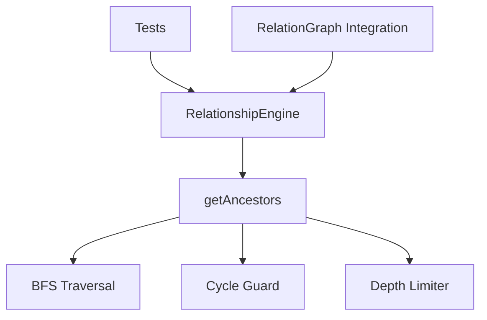

# Milestone 2.1: Ancestor Traversal - Implementation Plan

**Status:** Ready for Implementation
**Priority:** Critical
**Estimated Time:** 2-3 days

---

## Overview

This document provides a comprehensive implementation plan for Milestone 2.1: Ancestor Traversal, the first milestone in Phase 2 (Relationship Engine) of the Relations Obsidian plugin.

### Decision Summary

- **Approach:** Breadth-First Search (BFS) for generation-based traversal
- **Return Format:** Array of arrays (generations): `[[parents], [grandparents], [great-grandparents], ...]`
- **Cycle Protection:** Visited set to prevent infinite loops
- **Depth Limiting:** Respect `maxDepth` from plugin settings

---

## Goals

Implement depth-limited ancestor computation that safely traverses parent relationships up the tree, handling cycles gracefully and organizing results by generation level.

---

## Architecture Overview

### Components to Create



### File Structure

```
src/
├── relationship-engine.ts      # New: Core relationship computation engine
├── relation-graph.ts           # Existing: Graph structure
├── cycle-detector.ts           # Existing: Cycle detection
└── main.ts                     # Modified: Integrate relationship engine

tests/
├── relationship-engine.test.ts # New: Comprehensive ancestor tests
├── cycle-detector.test.ts      # Existing: Cycle tests
└── incremental-updates.test.ts # Existing: Update tests
```

---

## Detailed Design

### 1. RelationshipEngine Class

**File:** `src/relationship-engine.ts` (new file)

```typescript
import { TFile } from 'obsidian';
import { RelationGraph } from './relation-graph';

/**
 * Engine for computing extended relationships (ancestors, descendants, siblings, cousins).
 *
 * All traversal methods include cycle protection to prevent infinite loops.
 */
export class RelationshipEngine {
  constructor(private graph: RelationGraph) {}

  /**
   * Gets ancestors of a file, organized by generation.
   *
   * @param file - The file to get ancestors for
   * @param maxDepth - Maximum depth to traverse (default: from settings)
   * @returns Array of arrays: [[parents], [grandparents], [great-grandparents], ...]
   *
   * @example
   * // Given: A → B → C → D
   * // getAncestors(A, 3) returns:
   * // [
   * //   [B],           // Generation 1: parents
   * //   [C],           // Generation 2: grandparents
   * //   [D]            // Generation 3: great-grandparents
   * // ]
   *
   * @example
   * // Given: A → B, A → C; B → D, C → D
   * // getAncestors(A, 2) returns:
   * // [
   * //   [B, C],        // Generation 1: parents
   * //   [D]            // Generation 2: grandparents (merged from both paths)
   * // ]
   */
  getAncestors(file: TFile, maxDepth?: number): TFile[][] {
    const depth = maxDepth ?? this.graph.getMaxDepth();
    const result: TFile[][] = [];
    const visited = new Set<string>();

    // Mark starting file as visited to prevent cycles back to self
    visited.add(file.path);

    // BFS: current generation
    let currentGeneration = [file];

    for (let level = 0; level < depth; level++) {
      const nextGeneration: TFile[] = [];
      const seenInGeneration = new Set<string>();

      // Process all files in current generation
      for (const current of currentGeneration) {
        const parents = this.graph.getParents(current);

        for (const parent of parents) {
          // Skip if already visited (cycle protection)
          if (visited.has(parent.path)) continue;

          // Skip if already added to this generation (deduplication)
          if (seenInGeneration.has(parent.path)) continue;

          nextGeneration.push(parent);
          seenInGeneration.add(parent.path);
          visited.add(parent.path);
        }
      }

      // If no more parents, stop traversal
      if (nextGeneration.length === 0) break;

      result.push(nextGeneration);
      currentGeneration = nextGeneration;
    }

    return result;
  }
}
```

**Design Rationale:**

**Why BFS instead of DFS?**
- BFS naturally organizes results by generation level
- Easier to limit depth (just count levels)
- Consistent ordering within generations
- Better for visualization (tree rendering by level)

**Why Array of Arrays?**
- Clearly separates generations (parents vs grandparents vs great-grandparents)
- Makes UI rendering easier (can display each generation distinctly)
- Allows depth-based filtering
- Matches mental model of family trees

**Cycle Protection Strategy:**
- Global `visited` set prevents revisiting any node
- Prevents infinite loops in cyclic graphs
- Detects cycles without throwing errors
- Gracefully stops traversal when cycle encountered

---

### 2. Integration with RelationGraph

**File:** `src/relation-graph.ts` (modifications)

```typescript
export class RelationGraph {
  private graph = new Map<string, NodeInfo>();
  private cycleDetector!: CycleDetector;
  private maxDepth: number;

  constructor(private app: App, private parentField: string, maxDepth: number) {
    this.maxDepth = maxDepth;
  }

  /**
   * Gets the maximum depth setting for traversals.
   *
   * @returns Maximum depth from plugin settings
   */
  getMaxDepth(): number {
    return this.maxDepth;
  }

  /**
   * Updates the maximum depth setting.
   *
   * @param maxDepth - New maximum depth value
   */
  setMaxDepth(maxDepth: number): void {
    this.maxDepth = maxDepth;
  }

  // Existing methods remain unchanged
  getParents(file: TFile): TFile[] { /* ... */ }
  getChildren(file: TFile): TFile[] { /* ... */ }
}
```

**Integration Notes:**
- Add `maxDepth` property to store plugin setting
- Add getter/setter for relationship engine to access
- No breaking changes to existing API

---

### 3. Main Plugin Integration

**File:** `src/main.ts` (modifications)

```typescript
import { RelationshipEngine } from './relationship-engine';

export default class ParentRelationPlugin extends Plugin {
  settings!: ParentRelationSettings;
  relationGraph!: RelationGraph;
  relationshipEngine!: RelationshipEngine;

  async onload() {
    await this.loadSettings();

    // Build relation graph
    this.relationGraph = new RelationGraph(
      this.app,
      this.settings.parentField,
      this.settings.maxDepth
    );

    // Initialize relationship engine
    this.relationshipEngine = new RelationshipEngine(this.relationGraph);

    // ... rest of initialization
  }

  async loadSettings() {
    this.settings = Object.assign({}, DEFAULT_SETTINGS, await this.loadData());
  }

  async saveSettings() {
    await this.saveData(this.settings);
    // Update maxDepth in graph when settings change
    this.relationGraph.setMaxDepth(this.settings.maxDepth);
  }
}
```

---

## Test Specification

**File:** `tests/relationship-engine.test.ts` (new file)

### Test Cases

```typescript
import { describe, it, expect, beforeEach } from 'vitest';
import { RelationshipEngine } from '@/relationship-engine';
import { RelationGraph } from '@/relation-graph';
import { TFile } from 'obsidian';

describe('RelationshipEngine - getAncestors', () => {
  describe('Linear Chains', () => {
    it('should return ancestors for linear chain: A → B → C → D', () => {
      // Setup: A has parent B, B has parent C, C has parent D
      // Test: getAncestors(A, 3)
      // Expect: [[B], [C], [D]]
    });

    it('should respect depth limit in linear chain', () => {
      // Setup: A → B → C → D → E → F
      // Test: getAncestors(A, 2)
      // Expect: [[B], [C]]
      // D, E, F should not be included
    });

    it('should return empty array for root node (no parents)', () => {
      // Setup: A has no parents
      // Test: getAncestors(A)
      // Expect: []
    });

    it('should handle depth 1 (immediate parents only)', () => {
      // Setup: A → B → C → D
      // Test: getAncestors(A, 1)
      // Expect: [[B]]
    });
  });

  describe('Multiple Parents (Diamond Structures)', () => {
    it('should handle multiple parents: A → B, A → C', () => {
      // Setup: A has parents B and C
      // Test: getAncestors(A, 1)
      // Expect: [[B, C]] (both in same generation)
    });

    it('should merge ancestors when paths converge: A → B, A → C; B → D, C → D', () => {
      // Setup:
      //     D
      //    / \
      //   B   C
      //    \ /
      //     A
      // Test: getAncestors(A, 2)
      // Expect: [[B, C], [D]]
      // D should appear only once even though reachable via two paths
    });

    it('should handle complex multi-parent hierarchy', () => {
      // Setup:
      //       F
      //      / \
      //     D   E
      //    / \ / \
      //   B   C   G
      //    \ /
      //     A
      // Test: getAncestors(A, 3)
      // Verify all ancestors at correct generation levels
    });
  });

  describe('Cycle Protection', () => {
    it('should stop at cycle without infinite loop: A → B → C → B', () => {
      // Setup: A → B → C → B (cycle between B and C)
      // Test: getAncestors(A, 10)
      // Expect: Should complete without hanging
      // Should not include B twice
    });

    it('should handle self-loop: A → B → B', () => {
      // Setup: A has parent B, B has parent B (self-loop)
      // Test: getAncestors(A)
      // Expect: [[B]]
      // Should not infinitely loop on B
    });

    it('should handle cycle to starting node: A → B → A', () => {
      // Setup: A has parent B, B has parent A
      // Test: getAncestors(A)
      // Expect: [[B]]
      // Should not include A again
    });

    it('should handle long cycle: A → B → C → D → E → C', () => {
      // Setup: Cycle exists at generation 4
      // Test: getAncestors(A, 10)
      // Expect: Should stop when cycle detected
      // Should include each node only once
    });
  });

  describe('Edge Cases', () => {
    it('should handle empty graph', () => {
      // Setup: Empty graph
      // Test: getAncestors(A)
      // Expect: [] or graceful handling
    });

    it('should handle single node with no parents', () => {
      // Setup: Isolated node A
      // Test: getAncestors(A)
      // Expect: []
    });

    it('should handle maxDepth = 0', () => {
      // Setup: A → B → C
      // Test: getAncestors(A, 0)
      // Expect: []
    });

    it('should handle maxDepth larger than tree height', () => {
      // Setup: A → B → C (height 2)
      // Test: getAncestors(A, 100)
      // Expect: [[B], [C]]
      // Should not error or return undefined generations
    });

    it('should use default maxDepth from settings when not provided', () => {
      // Setup: Settings has maxDepth = 5, tree has depth 10
      // Test: getAncestors(A) (no maxDepth parameter)
      // Expect: Should only traverse 5 levels
    });
  });

  describe('Generation Ordering', () => {
    it('should maintain consistent ordering within generation', () => {
      // Setup: A → B, A → C, A → D (multiple parents)
      // Test: getAncestors(A, 1) multiple times
      // Expect: Same order each time (deterministic)
    });

    it('should not have duplicates within same generation', () => {
      // Setup: Complex graph with multiple paths to same ancestor
      // Test: getAncestors(A)
      // Expect: Each ancestor appears exactly once per generation
    });
  });

  describe('Performance', () => {
    it('should process 1000-node lineage in <50ms', () => {
      // Setup: Linear chain of 1000 nodes
      // Test: getAncestors(firstNode, 1000)
      // Measure: Execution time
      // Expect: <50ms
    });

    it('should handle wide tree (100 parents per level)', () => {
      // Setup: Node with 100 parents, each with 100 parents
      // Test: getAncestors(node, 2)
      // Expect: Completes quickly, no performance degradation
    });

    it('should handle deep tree (100 levels)', () => {
      // Setup: Linear chain of 100 nodes
      // Test: getAncestors(firstNode, 100)
      // Expect: Completes quickly with correct results
    });
  });
});
```

### Mock Data Helpers

```typescript
/**
 * Helper to create mock TFile objects for testing
 */
function createMockFile(path: string, basename: string): TFile {
  return {
    path,
    basename,
    name: basename + '.md',
    extension: 'md',
    vault: {} as any,
    parent: null,
    stat: { ctime: 0, mtime: 0, size: 0 }
  } as TFile;
}

/**
 * Helper to create mock graph with specified relationships
 *
 * @param relationships - Array of [child, parent] tuples
 * @returns Mock RelationGraph instance
 */
function createMockGraphWithRelationships(
  relationships: [string, string][]
): { graph: RelationGraph; files: Map<string, TFile> } {
  // Create mock files
  const files = new Map<string, TFile>();
  const uniqueNames = new Set<string>();

  relationships.forEach(([child, parent]) => {
    uniqueNames.add(child);
    uniqueNames.add(parent);
  });

  uniqueNames.forEach(name => {
    files.set(name, createMockFile(`${name}.md`, name));
  });

  // Create mock graph
  // ... implementation details

  return { graph, files };
}

/**
 * Helper to create linear chain: A → B → C → D → ...
 *
 * @param length - Number of nodes in chain
 * @returns Mock graph with linear chain
 */
function createLinearChain(length: number): {
  graph: RelationGraph;
  files: TFile[];
} {
  const nodes = Array.from({ length }, (_, i) =>
    String.fromCharCode(65 + i) // A, B, C, D, ...
  );

  const relationships: [string, string][] = [];
  for (let i = 0; i < nodes.length - 1; i++) {
    relationships.push([nodes[i], nodes[i + 1]]);
  }

  const { graph, files: fileMap } = createMockGraphWithRelationships(relationships);
  const files = nodes.map(name => fileMap.get(name)!);

  return { graph, files };
}

/**
 * Helper to create diamond structure:
 *     D
 *    / \
 *   B   C
 *    \ /
 *     A
 */
function createDiamondStructure(): {
  graph: RelationGraph;
  files: { A: TFile; B: TFile; C: TFile; D: TFile };
} {
  const relationships: [string, string][] = [
    ['A', 'B'],
    ['A', 'C'],
    ['B', 'D'],
    ['C', 'D']
  ];

  const { graph, files } = createMockGraphWithRelationships(relationships);

  return {
    graph,
    files: {
      A: files.get('A')!,
      B: files.get('B')!,
      C: files.get('C')!,
      D: files.get('D')!
    }
  };
}
```

---

## Implementation Checklist

### Phase 1: Core Implementation
- [ ] Create `src/relationship-engine.ts`
  - [ ] Define `RelationshipEngine` class
  - [ ] Implement `getAncestors()` method
  - [ ] Implement BFS traversal algorithm
  - [ ] Add cycle protection with visited set
  - [ ] Add depth limiting logic
  - [ ] Add JSDoc documentation

### Phase 2: Graph Integration
- [ ] Modify `src/relation-graph.ts`
  - [ ] Add `maxDepth` property
  - [ ] Add `getMaxDepth()` method
  - [ ] Add `setMaxDepth()` method
  - [ ] Update constructor to accept `maxDepth` parameter

### Phase 3: Plugin Integration
- [ ] Modify `src/main.ts`
  - [ ] Import `RelationshipEngine`
  - [ ] Add `relationshipEngine` property
  - [ ] Initialize engine in `onload()`
  - [ ] Pass `maxDepth` to `RelationGraph` constructor
  - [ ] Update graph's `maxDepth` when settings change

### Phase 4: Testing
- [ ] Create `tests/relationship-engine.test.ts`
  - [ ] Implement mock data helpers
  - [ ] Write "Linear Chains" test suite
  - [ ] Write "Multiple Parents" test suite
  - [ ] Write "Cycle Protection" test suite
  - [ ] Write "Edge Cases" test suite
  - [ ] Write "Generation Ordering" test suite
  - [ ] Write "Performance" test suite
- [ ] Ensure all tests pass
- [ ] Verify test coverage >80%
- [ ] Ensure existing tests still pass

### Phase 5: Documentation
- [ ] Add JSDoc comments to all public methods
- [ ] Document algorithm in code comments
- [ ] Add usage examples
- [ ] Update README with relationship engine features

---

## Acceptance Criteria

From [`docs/implementation-plan.md`](../docs/implementation-plan.md:139):

- ✅ Returns correct ancestors up to specified depth
- ✅ Stops at cycles without infinite loop
- ✅ Handles multiple parents correctly (explores all branches)
- ✅ Returns empty array for root nodes (no parents)
- ✅ Performance: processes 1000-node lineage in <50ms

**Additional Criteria:**
- ✅ All tests pass
- ✅ Test coverage >80%
- ✅ Generation-based organization (array of arrays)
- ✅ No duplicates within same generation
- ✅ Respects `maxDepth` setting from plugin config
- ✅ No breaking changes to existing APIs

---

## Performance Considerations

### Time Complexity
- **Best case (linear chain):** O(d) where d = depth
- **Worst case (wide tree):** O(b^d) where b = branching factor, d = depth
- **With visited set:** O(V) where V = unique nodes visited (at most all nodes in graph)

### Space Complexity
- **Visited set:** O(V) where V = nodes visited
- **Result array:** O(A) where A = total ancestors
- **Current generation:** O(b^d) in worst case

### Optimizations
- Visited set prevents redundant exploration
- Early termination when no more parents
- Deduplication within each generation
- BFS is naturally breadth-limited

### Benchmarks (Target)
- Linear chain (100 nodes): <5ms
- Linear chain (1000 nodes): <50ms
- Wide tree (10 parents/level, 5 levels): <20ms
- Diamond structure (100 nodes): <30ms

---

## Edge Cases & Considerations

### 1. Multiple Paths to Same Ancestor
**Scenario:** Node A has parents B and C, both B and C have parent D
**Handling:** D appears only once in generation 2 (deduplication)
**Implementation:** Use `seenInGeneration` set

### 2. Cycles in Ancestry
**Scenario:** A → B → C → B (cycle)
**Handling:** Visited set prevents infinite loop, traversal stops gracefully
**Implementation:** Global `visited` set across all generations

### 3. Depth Exceeds Tree Height
**Scenario:** maxDepth = 100, but tree only has 5 levels
**Handling:** Returns all available ancestors, stops when no more parents
**Implementation:** `if (nextGeneration.length === 0) break;`

### 4. maxDepth = 0
**Scenario:** User sets depth to 0
**Handling:** Returns empty array (no generations)
**Implementation:** Loop runs 0 times

### 5. Undefined maxDepth
**Scenario:** Method called without maxDepth parameter
**Handling:** Uses default from plugin settings
**Implementation:** `const depth = maxDepth ?? this.graph.getMaxDepth();`

### 6. Parent Links to Non-existent Files
**Scenario:** Parent field references file that doesn't exist
**Handling:** Already handled by `RelationGraph.getParents()` (filters out nulls)
**Implementation:** No changes needed

---

## Testing Strategy

### Unit Tests
- **Location:** `tests/relationship-engine.test.ts`
- **Coverage:** All aspects of `getAncestors()` method
- **Focus:** Algorithm correctness, cycle handling, edge cases

### Integration Tests
- **Test with:** Real `RelationGraph` instance
- **Verify:** Integration with cycle detector
- **Check:** Settings integration works correctly

### Performance Tests
- **Benchmark:** Various graph structures and sizes
- **Measure:** Execution time for different scenarios
- **Target:** <50ms for 1000-node lineage

### Regression Tests
- **Ensure:** All existing tests still pass
- **Verify:** Cycle detection unaffected
- **Check:** Incremental updates still work

---

## Success Metrics

- ✅ All acceptance criteria met
- ✅ All unit tests passing
- ✅ All existing tests still passing
- ✅ Test coverage >80%
- ✅ Performance benchmarks met
- ✅ Zero breaking changes
- ✅ Code review approved
- ✅ Documentation complete

---

## Dependencies

### External Dependencies
- `obsidian` - TFile type (already installed)
- `vitest` - Testing framework (already installed ✅)

### Internal Dependencies
- `RelationGraph` - Graph structure to traverse
- `CycleDetector` - For cycle awareness (not directly used, but related)
- Plugin settings - For default `maxDepth` value

---

## Risk Assessment

### Potential Issues

1. **Risk:** BFS may be slow for very wide trees
   - **Mitigation:** Depth limiting prevents excessive exploration
   - **Benchmark:** Test with wide trees (100+ parents per level)
   - **Fallback:** Can optimize with early termination strategies

2. **Risk:** Memory usage with very large result sets
   - **Mitigation:** Depth limiting and visited set
   - **Monitoring:** Add memory usage tests
   - **Optimization:** Consider streaming results in future

3. **Risk:** Inconsistent ordering within generations
   - **Mitigation:** `getParents()` returns consistent order
   - **Testing:** Verify deterministic ordering
   - **Note:** May need to sort for guaranteed alphabetical order

4. **Risk:** Breaking existing functionality
   - **Mitigation:** Only additive changes, no modifications to existing code
   - **Testing:** Run all existing tests
   - **Validation:** Regression test suite

---

## Implementation Notes

### BFS Algorithm Details

**Breadth-First Search** is ideal for this use case because:
1. **Level-by-level traversal:** Naturally separates generations
2. **Shortest path:** Always finds ancestors at their nearest generation
3. **Predictable memory:** Bounded by width of tree at each level
4. **Easy depth limiting:** Just count the levels

**Algorithm Steps:**
1. Initialize with starting file
2. Mark starting file as visited (prevent cycles back to self)
3. For each level (up to maxDepth):
   - Get all parents of current generation
   - Filter out visited nodes (cycle protection)
   - Filter out duplicates within generation (deduplication)
   - Add to results
   - Move to next generation
4. Stop when no more parents or depth limit reached

### Visited Set vs Cycle Detector

**Visited Set (used here):**
- Prevents revisiting any node during traversal
- Lightweight and fast
- Sufficient for preventing infinite loops

**Cycle Detector (separate concern):**
- Analyzes graph structure to identify cycles
- Provides detailed cycle information
- Used for validation and diagnostics
- Not needed during traversal (visited set is enough)

### Why Not DFS?

**DFS would:**
- Require backtracking to organize by generation
- Return results in path order, not generation order
- Be harder to limit by depth
- Potentially explore same nodes multiple times

**BFS advantages:**
- Natural generation-based grouping
- Simpler depth limiting
- More intuitive for family tree visualization
- Better matches user mental model

---

## Future Enhancements (Out of Scope)

These features are **not** part of Milestone 2.1 but may be added in future:

- [ ] Sorting options (alphabetical, by creation date, etc.)
- [ ] Filtering by tags, folders, or custom criteria
- [ ] Path tracking (show which path led to each ancestor)
- [ ] Caching frequently accessed ancestry chains
- [ ] Lazy loading for very deep trees
- [ ] Ancestor statistics (total count, max depth, etc.)

---

## Next Steps After Completion

1. ✅ Complete Milestone 2.1 implementation
2. Update [`docs/implementation-plan.md`](../docs/implementation-plan.md) with completion status
3. Proceed to Milestone 2.2 (Descendant Traversal)
   - Will mirror ancestor implementation but in reverse direction
   - Can reuse much of the testing infrastructure
4. Begin planning tree rendering (Phase 3) for visualization

---

## Appendix: Example Usage

```typescript
// In a future feature (sidebar view, codeblock, etc.)

const plugin = this.app.plugins.getPlugin('relations-obsidian');
const engine = plugin.relationshipEngine;

// Get ancestors of current file
const currentFile = this.app.workspace.getActiveFile();
const ancestors = engine.getAncestors(currentFile);

// Display in UI
console.log('Ancestors by generation:');
ancestors.forEach((generation, index) => {
  console.log(`Generation ${index + 1}:`, generation.map(f => f.basename));
});

// Example output:
// Generation 1: ["Parent A", "Parent B"]
// Generation 2: ["Grandparent C"]
// Generation 3: ["Great-grandparent D", "Great-grandparent E"]

// Limit depth
const immediateParents = engine.getAncestors(currentFile, 1);
console.log('Parents:', immediateParents[0]?.map(f => f.basename));

// Check for cycles before traversal (optional)
const cycleInfo = plugin.relationGraph.detectCycle(currentFile);
if (cycleInfo) {
  console.warn('Cycle detected:', cycleInfo.description);
}
```

---

## Appendix: Algorithm Walkthrough

### Example: Diamond Structure

**Graph:**
```
    D
   / \
  B   C
   \ /
    A
```

**Call:** `getAncestors(A, 3)`

**Execution:**

**Level 0 (Initialization):**
- `visited = {A}`
- `currentGeneration = [A]`
- `result = []`

**Level 1:**
- Get parents of A: `[B, C]`
- B not visited, not in generation → add to nextGeneration
- C not visited, not in generation → add to nextGeneration
- `visited = {A, B, C}`
- `result = [[B, C]]`
- `currentGeneration = [B, C]`

**Level 2:**
- Get parents of B: `[D]`
- D not visited, not in generation → add to nextGeneration
- Get parents of C: `[D]`
- D not visited, but already in generation → skip
- `visited = {A, B, C, D}`
- `result = [[B, C], [D]]`
- `currentGeneration = [D]`

**Level 3:**
- Get parents of D: `[]`
- No parents found
- `nextGeneration = []`
- Loop breaks

**Return:** `[[B, C], [D]]`

---

**Document Version:** 1.0
**Last Updated:** 2025-11-15
**Status:** Ready for Implementation
