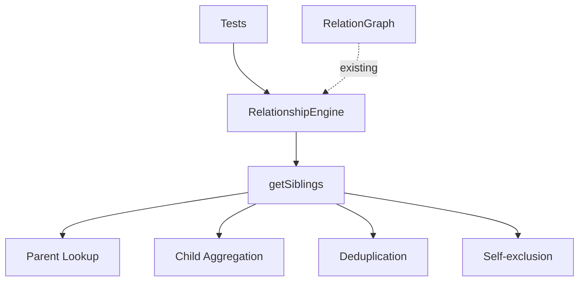

# Milestone 2.3: Sibling Resolution - Implementation Plan

**Status:** Ready for Implementation
**Priority:** Critical
**Estimated Time:** 1-2 days

---

## Overview

This document provides a comprehensive implementation plan for Milestone 2.3: Sibling Resolution, the third milestone in Phase 2 (Relationship Engine) of the Relations Obsidian plugin.

### Decision Summary

- **Approach:** Set-based sibling computation with deduplication
- **Return Format:** Flat array of TFile objects (siblings are same generation)
- **Scope:** Union of all sibling sets (half-siblings included)
- **Advanced Feature:** Optional full-siblings vs half-siblings distinction (future enhancement)

---

## Goals

Implement sibling computation that finds all notes sharing at least one parent with the queried note, with options to include or exclude the queried note itself, and proper handling of multiple-parent scenarios.

---

## Architecture Overview

### Components to Modify



### Sibling Resolution Strategy

**Definition:** Siblings are notes that share at least one parent

**Sibling Types:**
1. **Full siblings:** Share all parents
2. **Half-siblings:** Share at least one parent (but not all)
3. **Union approach (default):** Return all half-siblings and full siblings

**Algorithm:**
1. Get all parents of the queried file
2. For each parent, get all children
3. Collect all unique children (union of sibling sets)
4. Optionally filter out self
5. Return deduplicated list

---

## Detailed Design

### 1. getSiblings() Method

**File:** `src/relationship-engine.ts` (modifications)

```typescript
/**
 * Gets siblings of a file (notes sharing at least one parent).
 *
 * Returns all notes that share at least one parent with the specified file.
 * This includes both full siblings (sharing all parents) and half-siblings
 * (sharing only some parents).
 *
 * @param file - The file to get siblings for
 * @param includeSelf - Whether to include the queried file in results (default: false)
 * @returns Array of sibling files
 *
 * @example
 * // Given: Parent P has children A, B, C
 * // getSiblings(A, false) returns: [B, C]
 * // getSiblings(A, true) returns: [A, B, C]
 *
 * @example
 * // Given: Parent P1 has children A, B; Parent P2 has children A, C
 * // getSiblings(A, false) returns: [B, C]
 * // A has half-sibling B (via P1) and half-sibling C (via P2)
 *
 * @example
 * // Given: A has no parents (root node)
 * // getSiblings(A) returns: []
 * // Root nodes have no siblings
 */
getSiblings(file: TFile, includeSelf: boolean = false): TFile[] {
  // Get all parents of the file
  const parents = this.graph.getParents(file);

  // Root nodes (no parents) have no siblings
  if (parents.length === 0) {
    return [];
  }

  // Collect all unique children from all parents
  const siblingSet = new Set<string>();

  for (const parent of parents) {
    const children = this.graph.getChildren(parent);

    for (const child of children) {
      siblingSet.add(child.path);
    }
  }

  // Convert set to array of TFile objects
  const siblings: TFile[] = [];

  for (const siblingPath of siblingSet) {
    // Skip self if not including self
    if (!includeSelf && siblingPath === file.path) {
      continue;
    }

    // Get TFile object for sibling
    const siblingFile = this.graph.getFileByPath(siblingPath);
    if (siblingFile) {
      siblings.push(siblingFile);
    }
  }

  return siblings;
}
```

**Design Notes:**
- Uses `Set` for automatic deduplication
- Simple and efficient O(P * C) where P = parents, C = children per parent
- Handles multiple parents naturally (union of child sets)
- Self-exclusion is configurable
- Returns empty array for root nodes (correct behavior)

---

### 2. RelationGraph Helper Method

**File:** `src/relation-graph.ts` (modification)

We need to add a helper method to get a file by path:

```typescript
/**
 * Gets a file by its path.
 *
 * @param path - The file path to look up
 * @returns The TFile object if found, null otherwise
 */
getFileByPath(path: string): TFile | null {
  const node = this.graph.get(path);
  return node?.file ?? null;
}
```

**Why needed:**
- `getSiblings()` collects paths in a Set
- Need to convert paths back to TFile objects
- Centralized lookup ensures consistency

---

## Test Specification

**File:** `tests/relationship-engine.test.ts` (add to existing file)

### Test Cases

```typescript
describe('RelationshipEngine - getSiblings', () => {
  describe('Single Parent Scenarios', () => {
    it('should return siblings with single parent: P → A, B, C', () => {
      // Setup: Parent P has children A, B, C
      // Test: getSiblings(A, false)
      // Expect: [B, C]
      // A's siblings are B and C (excluding self)
    });

    it('should include self when requested: P → A, B, C', () => {
      // Setup: Parent P has children A, B, C
      // Test: getSiblings(A, true)
      // Expect: [A, B, C]
      // Including self in results
    });

    it('should return empty array for only child: P → A', () => {
      // Setup: Parent P has only one child A
      // Test: getSiblings(A, false)
      // Expect: []
      // A has no siblings (only child)
    });

    it('should return self for only child when including self: P → A', () => {
      // Setup: Parent P has only one child A
      // Test: getSiblings(A, true)
      // Expect: [A]
      // Only child with includeSelf=true returns self
    });

    it('should handle many siblings: P → A, B, C, D, E, F', () => {
      // Setup: Parent P has 6 children
      // Test: getSiblings(A, false)
      // Expect: [B, C, D, E, F]
      // All other children are siblings
    });
  });

  describe('Multiple Parent Scenarios', () => {
    it('should return union of siblings: P1 → A, B; P2 → A, C', () => {
      // Setup:
      //   P1 has children A, B
      //   P2 has children A, C
      //   A has two parents (P1 and P2)
      // Test: getSiblings(A, false)
      // Expect: [B, C]
      // B is half-sibling via P1, C is half-sibling via P2
    });

    it('should deduplicate siblings from multiple parents: P1 → A, B; P2 → A, B', () => {
      // Setup:
      //   P1 has children A, B
      //   P2 has children A, B
      //   A and B are full siblings (share both parents)
      // Test: getSiblings(A, false)
      // Expect: [B]
      // B appears only once even though reachable via two parents
    });

    it('should handle complex multi-parent structure', () => {
      // Setup:
      //   P1 → A, B, C
      //   P2 → A, D, E
      //   P3 → A, F
      //   A has three parents
      // Test: getSiblings(A, false)
      // Expect: [B, C, D, E, F]
      // Union of all sibling sets
    });

    it('should handle overlapping sibling sets', () => {
      // Setup:
      //   P1 → A, B, C
      //   P2 → A, C, D
      //   C appears as sibling via both parents
      // Test: getSiblings(A, false)
      // Expect: [B, C, D]
      // C appears only once despite being in both sets
    });
  });

  describe('Root Nodes (No Parents)', () => {
    it('should return empty array for root node', () => {
      // Setup: A has no parents
      // Test: getSiblings(A, false)
      // Expect: []
      // Root nodes have no siblings
    });

    it('should return empty array for root node even with includeSelf', () => {
      // Setup: A has no parents
      // Test: getSiblings(A, true)
      // Expect: []
      // Root nodes have no siblings, includeSelf doesn't apply
    });
  });

  describe('Edge Cases', () => {
    it('should handle file not in graph', () => {
      // Setup: File X doesn't exist in graph
      // Test: getSiblings(X)
      // Expect: [] or graceful handling
      // Should not throw error
    });

    it('should handle parent with no other children', () => {
      // Setup: P → A (only child)
      // Test: getSiblings(A, false)
      // Expect: []
      // Covered by "only child" test but worth verifying
    });

    it('should handle cyclical parent-child relationships', () => {
      // Setup: A → B → C → B (cycle in graph)
      // Test: getSiblings(C)
      // Expect: Should handle gracefully
      // Cycle doesn't affect sibling computation (only one level)
    });

    it('should maintain consistent ordering across calls', () => {
      // Setup: P → A, B, C, D
      // Test: getSiblings(A) multiple times
      // Expect: Same order each time (deterministic)
      // Note: May need to sort for guaranteed order
    });
  });

  describe('Self-inclusion Toggle', () => {
    it('should exclude self by default', () => {
      // Setup: P → A, B
      // Test: getSiblings(A)
      // Expect: [B]
      // Default includeSelf=false
    });

    it('should include self when explicitly true', () => {
      // Setup: P → A, B
      // Test: getSiblings(A, true)
      // Expect: [A, B]
      // Explicit includeSelf=true
    });

    it('should exclude self when explicitly false', () => {
      // Setup: P → A, B
      // Test: getSiblings(A, false)
      // Expect: [B]
      // Explicit includeSelf=false
    });
  });

  describe('Deduplication', () => {
    it('should not return duplicates', () => {
      // Setup: Complex graph with multiple paths
      // Test: getSiblings(A)
      // Expect: Each sibling appears exactly once
      // Set-based implementation ensures this
    });

    it('should deduplicate when siblings share multiple parents', () => {
      // Setup:
      //   P1 → A, B, C
      //   P2 → A, B, D
      //   B is sibling via both P1 and P2
      // Test: getSiblings(A, false)
      // Expect: [B, C, D]
      // B appears only once
    });
  });

  describe('Integration with Existing Methods', () => {
    it('should work with files that also have ancestors', () => {
      // Setup: GP → P → A, B, C
      // Test: getSiblings(A)
      // Expect: [B, C]
      // Sibling computation independent of ancestors
    });

    it('should work with files that also have descendants', () => {
      // Setup: P → A, B; A → X, Y, Z
      // Test: getSiblings(A)
      // Expect: [B]
      // Sibling computation independent of descendants
    });

    it('should work in graph with cycles', () => {
      // Setup: Complex graph with cycles
      // Test: getSiblings(A)
      // Expect: Correct siblings without infinite loops
      // Sibling method doesn't traverse, so cycles don't affect it
    });
  });
});
```

### Mock Data Helpers

```typescript
/**
 * Helper to create sibling structure
 *
 * @param parent - Parent node name
 * @param children - Array of child node names
 * @returns Mock graph with parent-child relationships
 */
function createSiblingStructure(
  parent: string,
  children: string[]
): { graph: RelationGraph; files: Map<string, TFile> } {
  const relationships: [string, string][] = children.map(child => [child, parent]);
  return createMockGraphWithRelationships(relationships);
}

/**
 * Helper to create multi-parent sibling structure
 *
 * @param structure - Map of parent to children
 * @returns Mock graph with complex parent-child relationships
 *
 * @example
 * createMultiParentStructure({
 *   P1: ['A', 'B', 'C'],
 *   P2: ['A', 'D', 'E']
 * })
 * // Creates: P1 → A, B, C; P2 → A, D, E
 */
function createMultiParentStructure(
  structure: Record<string, string[]>
): { graph: RelationGraph; files: Map<string, TFile> } {
  const relationships: [string, string][] = [];

  for (const [parent, children] of Object.entries(structure)) {
    for (const child of children) {
      relationships.push([child, parent]);
    }
  }

  return createMockGraphWithRelationships(relationships);
}
```

---

## Implementation Checklist

### Phase 1: Core Implementation
- [ ] Add `getFileByPath()` method to `RelationGraph`
  - [ ] Implement path lookup
  - [ ] Return TFile or null
  - [ ] Add JSDoc documentation

- [ ] Add `getSiblings()` method to `RelationshipEngine`
  - [ ] Implement parent lookup
  - [ ] Implement child aggregation
  - [ ] Implement Set-based deduplication
  - [ ] Implement self-exclusion logic
  - [ ] Add JSDoc documentation with examples
  - [ ] Add inline code comments

### Phase 2: Testing
- [ ] Add test suite to `tests/relationship-engine.test.ts`
  - [ ] Implement mock data helpers
  - [ ] Write "Single Parent Scenarios" test suite
  - [ ] Write "Multiple Parent Scenarios" test suite
  - [ ] Write "Root Nodes" test suite
  - [ ] Write "Edge Cases" test suite
  - [ ] Write "Self-inclusion Toggle" test suite
  - [ ] Write "Deduplication" test suite
  - [ ] Write "Integration" test suite
- [ ] Ensure all tests pass
- [ ] Verify test coverage >80%
- [ ] Ensure existing tests still pass

### Phase 3: Documentation
- [ ] Add JSDoc comments to all public methods
- [ ] Add usage examples in comments
- [ ] Update README with sibling resolution features
- [ ] Document sibling types (full vs half)

---

## Acceptance Criteria

From [`docs/implementation-plan.md`](../docs/implementation-plan.md:200):

- ✅ Returns all notes sharing at least one parent
- ✅ Correctly handles notes with multiple parents
- ✅ Option to include/exclude self works correctly
- ✅ Returns empty array for root notes (no parents, thus no siblings)
- ✅ No duplicates in result set

**Additional Criteria:**
- ✅ All tests pass
- ✅ Test coverage >80%
- ✅ Proper deduplication when siblings share multiple parents
- ✅ Consistent behavior across multiple calls
- ✅ No breaking changes to existing APIs
- ✅ Integration with existing relationship methods

---

## Performance Considerations

### Time Complexity
- **Best case (single parent, few children):** O(C) where C = children
- **Average case:** O(P * C) where P = parents, C = children per parent
- **Worst case:** O(P * C) (linear in total children across all parents)

### Space Complexity
- **Set for deduplication:** O(S) where S = total unique siblings
- **Result array:** O(S)
- **Total:** O(S) - very efficient

### Performance Characteristics
- **No recursion:** Single-level lookup only
- **No traversal:** Doesn't explore beyond immediate parents/children
- **Efficient deduplication:** Set operations are O(1) per insertion
- **No cycle issues:** Doesn't traverse, so cycles don't affect performance

### Benchmarks (Target)
- Single parent, 10 children: <1ms
- Single parent, 100 children: <5ms
- 10 parents, 10 children each: <10ms
- Complex multi-parent structure: <20ms

**Note:** Sibling computation is inherently faster than ancestor/descendant traversal because it only looks one level deep.

---

## Edge Cases & Considerations

### 1. Multiple Parents with Overlapping Children
**Scenario:** A has parents P1 and P2; both P1 and P2 have child B
**Handling:** B appears only once in results (Set-based deduplication)
**Implementation:** `siblingSet` automatically handles this

### 2. Root Nodes (No Parents)
**Scenario:** File has no parents
**Handling:** Returns empty array (correct semantic - can't have siblings without parents)
**Implementation:** Early return when `parents.length === 0`

### 3. Only Child
**Scenario:** Parent has only one child
**Handling:**
- `includeSelf=false`: Returns empty array
- `includeSelf=true`: Returns array with self
**Implementation:** Self-exclusion filter handles this

### 4. Self-Inclusion Edge Case
**Scenario:** Only child with `includeSelf=true`
**Handling:** Returns `[self]` (single-element array)
**Implementation:** Self is added to siblingSet, not filtered out

### 5. File Not in Graph
**Scenario:** Query for siblings of file not in graph
**Handling:** `getParents()` returns empty array, so `getSiblings()` returns empty array
**Implementation:** No special handling needed (graceful degradation)

### 6. Orphaned Parent References
**Scenario:** Parent field references non-existent file
**Handling:** Already handled by `RelationGraph.getParents()` (filters nulls)
**Implementation:** No changes needed

---

## Testing Strategy

### Unit Tests
- **Location:** `tests/relationship-engine.test.ts`
- **Coverage:** All aspects of `getSiblings()` method
- **Focus:** Correctness, deduplication, self-exclusion

### Integration Tests
- **Test with:** Real `RelationGraph` instance
- **Verify:** Works with existing ancestor/descendant methods
- **Check:** Consistent with graph state

### Edge Case Tests
- **Cover:** All documented edge cases
- **Verify:** Graceful handling of unusual scenarios
- **Check:** No errors or unexpected behavior

### Regression Tests
- **Ensure:** All existing tests still pass
- **Verify:** Ancestor/descendant methods unaffected
- **Check:** Cycle detection still works

---

## Success Metrics

- ✅ All acceptance criteria met
- ✅ All unit tests passing
- ✅ All existing tests still passing
- ✅ Test coverage >80%
- ✅ Performance benchmarks met
- ✅ Zero breaking changes
- ✅ Code review approved
- ✅ Documentation complete

---

## Dependencies

### External Dependencies
- `obsidian` - TFile type (already installed)
- `vitest` - Testing framework (already installed ✅)

### Internal Dependencies
- `RelationGraph` - Graph structure to query
- `getParents()` - To find parents of file
- `getChildren()` - To find children of each parent

---

## Risk Assessment

### Potential Issues

1. **Risk:** Deduplication might be inefficient for large sibling sets
   - **Mitigation:** Set operations are O(1), very efficient
   - **Benchmark:** Test with 100+ siblings
   - **Impact:** Low - sibling sets are typically small

2. **Risk:** Inconsistent ordering across calls
   - **Mitigation:** May need to sort results for determinism
   - **Testing:** Verify ordering consistency
   - **Resolution:** Add `.sort()` if needed

3. **Risk:** `getFileByPath()` might not find file
   - **Mitigation:** Return null and filter in getSiblings
   - **Testing:** Test with various graph states
   - **Impact:** Low - graceful degradation

4. **Risk:** Breaking existing functionality
   - **Mitigation:** Only additive changes, no modifications
   - **Testing:** Run all existing tests
   - **Impact:** Very low - no API changes

---

## Implementation Notes

### Why Flat Array Instead of Nested?

**Siblings are all the same generation** - unlike ancestors/descendants which have multiple generation levels, all siblings are at the same level (generation 0 relative to the queried file).

**Return type:** `TFile[]` (flat array)
**Not:** `TFile[][]` (nested array)

### Why Union Approach (Half-siblings Included)?

**Simplicity:** Most use cases want all siblings, regardless of whether they're full or half siblings.

**Future Enhancement:** Can add `getFullSiblings()` method later that filters to only nodes sharing ALL parents.

**Flexibility:** Union approach is more inclusive and useful for visualization.

### Why Set-Based Deduplication?

**Automatic:** Set data structure handles deduplication naturally
**Efficient:** O(1) insertion and lookup
**Clean:** No manual duplicate checking needed

### Self-Exclusion Logic

**Default `includeSelf=false`:** Most use cases want "other siblings"
**Optional `includeSelf=true`:** Useful for "all children of my parents" use case
**Implementation:** Simple filter in final loop

---

## Future Enhancements (Out of Scope)

These features are **not** part of Milestone 2.3 but may be added in future:

- [ ] `getFullSiblings()` - Only siblings sharing ALL parents
- [ ] `getHalfSiblings()` - Only siblings sharing SOME parents (not all)
- [ ] `getSiblingCount()` - Count without returning full list
- [ ] `getSiblingsByParent()` - Group siblings by shared parent
- [ ] Sorting options (alphabetical, by creation date, etc.)
- [ ] Filtering by tags, folders, or custom criteria

---

## Next Steps After Completion

1. ✅ Complete Milestone 2.3 implementation
2. Update [`docs/implementation-plan.md`](../docs/implementation-plan.md) with completion status
3. Proceed to Milestone 2.4 (Cousin Resolution)
   - Cousins are more complex (grandparent's grandchildren, excluding siblings)
   - Can build on sibling implementation
4. Continue building out relationship engine before moving to Phase 3 (Tree Rendering)

---

## Appendix: Example Usage

```typescript
// In a future feature (sidebar view, codeblock, etc.)

const plugin = this.app.plugins.getPlugin('relations-obsidian');
const engine = plugin.relationshipEngine;

// Get siblings of current file
const currentFile = this.app.workspace.getActiveFile();
const siblings = engine.getSiblings(currentFile);

// Display in UI
console.log('Siblings:', siblings.map(f => f.basename));

// Example output:
// Siblings: ["Sister Note", "Brother Note", "Other Sibling"]

// Include self
const allChildren = engine.getSiblings(currentFile, true);
console.log('All children of my parents:', allChildren.map(f => f.basename));

// Example output:
// All children of my parents: ["Current Note", "Sister Note", "Brother Note"]

// Check if file has siblings
const hasSiblings = engine.getSiblings(currentFile).length > 0;
if (hasSiblings) {
  console.log('This note has siblings');
} else {
  console.log('This note is an only child or root node');
}
```

---

## Appendix: Algorithm Walkthrough

### Example: Multiple Parents with Overlapping Children

**Graph:**
```
  P1    P2
 / | \  /|\
A  B  C A D
```

**Setup:**
- P1 has children: A, B, C
- P2 has children: A, D
- A has parents: P1, P2

**Call:** `getSiblings(A, false)`

**Execution:**

**Step 1: Get Parents**
- `parents = [P1, P2]`

**Step 2: Collect Children from P1**
- `children of P1 = [A, B, C]`
- Add to set: `siblingSet = {A, B, C}`

**Step 3: Collect Children from P2**
- `children of P2 = [A, D]`
- Add to set: `siblingSet = {A, B, C, D}`
- Note: A already in set, not duplicated

**Step 4: Filter Self**
- `includeSelf = false`
- Remove A from results
- `result = [B, C, D]`

**Return:** `[B, C, D]`

---

### Example: Only Child

**Graph:**
```
  P
  |
  A
```

**Setup:**
- P has children: A
- A has parents: P

**Call:** `getSiblings(A, false)`

**Execution:**

**Step 1: Get Parents**
- `parents = [P]`

**Step 2: Collect Children from P**
- `children of P = [A]`
- Add to set: `siblingSet = {A}`

**Step 3: Filter Self**
- `includeSelf = false`
- Remove A from results
- `result = []`

**Return:** `[]` (only child, no siblings)

---

**Document Version:** 1.0
**Last Updated:** 2025-11-15
**Status:** Ready for Implementation
