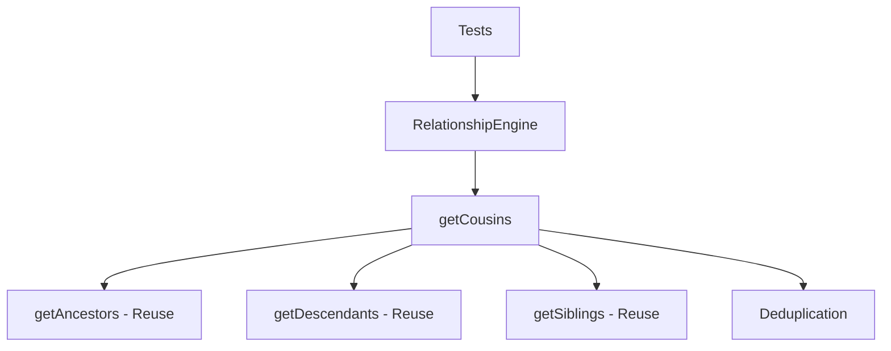

# Milestone 2.4: Cousin Resolution - Implementation Plan

**Status:** Ready for Implementation
**Priority:** Critical
**Estimated Time:** 2-3 days

---

## Overview

This document provides a comprehensive implementation plan for Milestone 2.4: Cousin Resolution, the fourth milestone in Phase 2 (Relationship Engine) of the Relations Obsidian plugin.

### Decision Summary

- **Approach:** Ancestor-based traversal combined with descendant gathering
- **Return Format:** Flat array of cousin files: `TFile[]`
- **Cycle Protection:** Leverage existing visited sets from ancestor/descendant methods
- **Degree Support:** Parameterized cousin degree (1 = first cousins, 2 = second cousins, etc.)

---

## Goals

Implement cousin computation that identifies notes sharing common ancestors at a specified generation level, while excluding siblings and self from the results.

---

## Understanding Cousin Relationships

### Terminology

**Cousin Degree:**
- **First cousins (degree 1):** Share grandparents (generation 2 ancestors)
- **Second cousins (degree 2):** Share great-grandparents (generation 3 ancestors)
- **Nth cousins (degree n):** Share generation (n+1) ancestors

**Key Relationships:**
- **Siblings:** Share parents (generation 1) - must be excluded
- **Self:** The starting node - must be excluded
- **Cousins:** Share ancestors at generation (degree + 1), but not at generation 1

### Algorithm Concept

For degree N cousins:
1. Get all ancestors at generation (N + 1) - these are the "shared ancestors"
2. For each shared ancestor, get their descendants at depth (N + 1)
3. These descendants include: the starting node, siblings, and cousins
4. Filter out self and siblings to get only cousins

### Example: First Cousins (degree 1)

```
    Grandparent (GP)
       /      \
   Parent1   Parent2
      |         |
   You(A)    Cousin(B)
```

- A and B are first cousins
- They share grandparent GP (generation 2)
- GP's grandchildren include: A (via Parent1) and B (via Parent2)
- B is A's cousin; they share GP but not a parent

### Example: Second Cousins (degree 2)

```
      Great-Grandparent (GGP)
           /        \
    Grandparent1   Grandparent2
         |              |
      Parent1        Parent2
         |              |
       You(A)       Cousin(B)
```

- A and B are second cousins
- They share great-grandparent GGP (generation 3)
- GGP's great-grandchildren include: A and B
- They do not share grandparents or parents

---

## Architecture Overview

### Components to Modify



### File Structure

```
src/
├── relationship-engine.ts      # Modified: Add getCousins() method
├── relation-graph.ts           # Existing: Graph structure
└── main.ts                     # Existing: Plugin integration

tests/
├── relationship-engine.test.ts # Modified: Add cousin tests
├── cycle-detector.test.ts      # Existing: Cycle tests
└── incremental-updates.test.ts # Existing: Update tests
```

---

## Detailed Design

### 1. getCousins() Method

**File:** `src/relationship-engine.ts` (modifications)

```typescript
/**
 * Gets cousins of a file at the specified degree.
 *
 * Cousins are notes that share a common ancestor at generation (degree + 1),
 * but do not share parents (i.e., are not siblings). This method excludes
 * both siblings and the queried file itself from results.
 *
 * @param file - The file to get cousins for
 * @param degree - Cousin degree (1 = first cousins, 2 = second cousins, etc.). Default: 1
 * @returns Array of cousin files (may be empty if no cousins exist)
 *
 * @example
 * // Given:
 * //     GP
 * //    /  \
 * //   P1   P2
 * //   |    |
 * //   A    B
 * // getCousins(A, 1) returns: [B]
 * // A and B are first cousins (share grandparent GP)
 *
 * @example
 * // Given:
 * //       GGP
 * //      /   \
 * //    GP1   GP2
 * //     |     |
 * //    P1    P2
 * //     |     |
 * //     A     B
 * // getCousins(A, 2) returns: [B]
 * // A and B are second cousins (share great-grandparent GGP)
 *
 * @example
 * // Given: A has no ancestors at generation 2 (no grandparents)
 * // getCousins(A, 1) returns: []
 * // Cannot have first cousins without grandparents
 *
 * @example
 * // Given:
 * //      GP
 * //     /  \
 * //    P1  P2
 * //   / \   \
 * //  A   B   C
 * // getCousins(A, 1) returns: [C]
 * // B is excluded because B is a sibling (shares parent P1)
 * // C is included because C shares grandparent GP but not parent P1
 */
getCousins(file: TFile, degree: number = 1): TFile[] {
  // Validate degree
  if (degree < 1) {
    return [];
  }

  // Get ancestors at generation (degree + 1)
  // These are the "shared ancestors" for cousins of this degree
  const ancestorGenerations = this.getAncestors(file, degree + 1);

  // If we don't have ancestors at the required generation, no cousins exist
  if (ancestorGenerations.length < degree + 1) {
    return [];
  }

  // Get the specific generation we need (index is degree because arrays are 0-indexed)
  // For first cousins (degree 1), we need generation 2 (index 1)
  // For second cousins (degree 2), we need generation 3 (index 2)
  const sharedAncestors = ancestorGenerations[degree];

  // Collect all descendants at generation (degree + 1) from each shared ancestor
  const cousinCandidates = new Set<string>();

  for (const ancestor of sharedAncestors) {
    const descendantGenerations = this.getDescendants(ancestor, degree + 1);

    // Get descendants at generation (degree + 1)
    if (descendantGenerations.length >= degree + 1) {
      const descendantsAtLevel = descendantGenerations[degree];

      for (const descendant of descendantsAtLevel) {
        cousinCandidates.add(descendant.path);
      }
    }
  }

  // Get siblings to exclude them
  const siblings = this.getSiblings(file, false); // Don't include self
  const siblingPaths = new Set(siblings.map(s => s.path));

  // Filter out self and siblings
  const cousins: TFile[] = [];

  for (const candidatePath of cousinCandidates) {
    // Skip self
    if (candidatePath === file.path) continue;

    // Skip siblings
    if (siblingPaths.has(candidatePath)) continue;

    // Get TFile object
    const cousinFile = this.graph.getFileByPath(candidatePath);
    if (cousinFile) {
      cousins.push(cousinFile);
    }
  }

  return cousins;
}
```

**Design Rationale:**

**Why This Approach?**
1. **Reuses existing methods:** Leverages `getAncestors()` and `getDescendants()` for robustness
2. **Cycle protection built-in:** Both ancestor and descendant methods handle cycles
3. **Clear separation of concerns:** Each step has a single responsibility
4. **Leverages existing sibling detection:** Uses `getSiblings()` for accurate filtering

**Algorithm Complexity:**
- **Time:** O(A × D) where A = shared ancestors at generation (degree+1), D = their descendants
- **Space:** O(C) where C = total cousin candidates before filtering
- **Worst case:** Small due to exponential decrease in relatives at higher generations

**Why Flat Array Instead of Nested?**
- Cousins are all at the same "level" (generation) relative to starting node
- Unlike ancestors/descendants which naturally group by generation
- Simpler return type for common use case
- Can be extended to return metadata if needed in future

---

## Test Specification

**File:** `tests/relationship-engine.test.ts` (additions)

### Test Cases

```typescript
describe('RelationshipEngine - getCousins', () => {
  describe('First Cousins (degree 1)', () => {
    it('should return first cousins sharing one grandparent', () => {
      // Setup:
      //      GP
      //     /  \
      //    P1   P2
      //    |    |
      //    A    B
      // Test: getCousins(A, 1)
      // Expect: [B]
    });

    it('should return first cousins from multiple grandparents', () => {
      // Setup:
      //     GP1        GP2
      //    /  \       /  \
      //   P1   P2    P3   P4
      //   |    |     |    |
      //   A    B     C    D
      // Test: getCousins(A, 1)
      // Expect: [B] (shares GP1)
      // Note: C and D are not cousins (different grandparent lineage)
    });

    it('should handle multiple cousins from one grandparent', () => {
      // Setup:
      //         GP
      //      / / \ \
      //     P1 P2 P3 P4
      //     |  |  |  |
      //     A  B  C  D
      // Test: getCousins(A, 1)
      // Expect: [B, C, D] (all share GP but different parents)
    });

    it('should exclude siblings from cousin results', () => {
      // Setup:
      //        GP
      //       /  \
      //      P1   P2
      //     / \   |
      //    A   B  C
      // Test: getCousins(A, 1)
      // Expect: [C]
      // B is excluded (sibling, shares parent P1)
      // C is included (cousin, shares GP but not P1)
    });

    it('should exclude self from cousin results', () => {
      // Setup:
      //      GP
      //     /  \
      //    P1   P2
      //    |    |
      //    A    B
      // Test: getCousins(A, 1)
      // Expect: [B]
      // A is not in results (self-exclusion)
    });

    it('should return empty array when no grandparents exist', () => {
      // Setup: A → P (only one generation)
      // Test: getCousins(A, 1)
      // Expect: []
      // Cannot have cousins without grandparents
    });

    it('should return empty array when grandparents have no other grandchildren', () => {
      // Setup:
      //      GP
      //      |
      //      P
      //      |
      //      A
      // Test: getCousins(A, 1)
      // Expect: []
      // A is the only grandchild
    });
  });

  describe('Second Cousins (degree 2)', () => {
    it('should return second cousins sharing great-grandparent', () => {
      // Setup:
      //         GGP
      //        /   \
      //      GP1   GP2
      //       |     |
      //      P1    P2
      //       |     |
      //       A     B
      // Test: getCousins(A, 2)
      // Expect: [B]
      // A and B are second cousins
    });

    it('should exclude first cousins from second cousin results', () => {
      // Setup:
      //           GGP
      //          /   \
      //        GP1   GP2
      //       / \     |
      //      P1  P2  P3
      //      |   |   |
      //      A   B   C
      // Test: getCousins(A, 2)
      // Expect: [C]
      // B is a first cousin (shares GP1), not a second cousin
      // C is a second cousin (shares GGP but not GP)
    });

    it('should return empty array when no great-grandparents exist', () => {
      // Setup: A → P → GP (only two generations)
      // Test: getCousins(A, 2)
      // Expect: []
      // Cannot have second cousins without great-grandparents
    });
  });

  describe('Higher Degree Cousins', () => {
    it('should support third cousins (degree 3)', () => {
      // Setup: Deep family tree with great-great-grandparents
      // Test: getCousins(A, 3)
      // Expect: Cousins at appropriate generation
    });

    it('should support arbitrary cousin degrees', () => {
      // Setup: Very deep family tree (10+ generations)
      // Test: getCousins(A, 5)
      // Expect: Fifth cousins correctly identified
    });
  });

  describe('Complex Family Structures', () => {
    it('should handle diamond structures in ancestry', () => {
      // Setup:
      //        GGP
      //       /   \
      //     GP1   GP2
      //       \   /
      //         P
      //         |
      //         A
      // Test: getCousins(A, 1)
      // Verify correct handling of converging lineages
    });

    it('should handle multiple paths to same cousin', () => {
      // Setup: Complex graph where cousin is reachable via multiple ancestors
      // Test: getCousins(A, 1)
      // Expect: Each cousin appears only once (deduplication)
    });

    it('should handle nodes with multiple parents', () => {
      // Setup:
      //      GP1    GP2
      //       |      |
      //      P1     P2
      //       \    /
      //         A      (A has two parents)
      // Test: getCousins(A, 1)
      // Expect: Cousins from both lineages
    });
  });

  describe('Cycle Protection', () => {
    it('should handle cycles in ancestry without infinite loop', () => {
      // Setup: A → P → GP → P (cycle back to parent)
      // Test: getCousins(A, 1)
      // Expect: Completes without hanging
    });

    it('should handle cycles in descendant paths', () => {
      // Setup: Cycle exists in descendant traversal from grandparent
      // Test: getCousins(A, 1)
      // Expect: Cycle handled gracefully
    });

    it('should handle self-loops in family tree', () => {
      // Setup: Node that is its own parent/grandparent
      // Test: getCousins(A, 1)
      // Expect: No errors, sensible results
    });
  });

  describe('Edge Cases', () => {
    it('should handle degree = 0', () => {
      // Test: getCousins(A, 0)
      // Expect: [] (degree must be >= 1)
    });

    it('should handle negative degree', () => {
      // Test: getCousins(A, -1)
      // Expect: [] (invalid degree)
    });

    it('should handle very large degree (100)', () => {
      // Setup: Tree with depth 5
      // Test: getCousins(A, 100)
      // Expect: [] (no ancestors at generation 101)
    });

    it('should handle empty graph', () => {
      // Setup: Empty graph
      // Test: getCousins(A, 1)
      // Expect: [] or graceful handling
    });

    it('should handle isolated node (no relations)', () => {
      // Setup: Node A with no parents or children
      // Test: getCousins(A, 1)
      // Expect: []
    });

    it('should handle root node (no parents)', () => {
      // Setup: Node A with children but no parents
      // Test: getCousins(A, 1)
      // Expect: []
    });
  });

  describe('Symmetry & Consistency', () => {
    it('should be symmetric: if A is cousin of B, B is cousin of A', () => {
      // Setup: A and B are first cousins
      // Test: getCousins(A, 1) and getCousins(B, 1)
      // Expect: A in results of B, B in results of A
    });

    it('should not include duplicates in result', () => {
      // Setup: Complex graph with multiple paths to same cousin
      // Test: getCousins(A, 1)
      // Expect: Each cousin appears exactly once
    });

    it('should return consistent results across multiple calls', () => {
      // Test: getCousins(A, 1) called multiple times
      // Expect: Same results each time (deterministic)
    });
  });

  describe('Sibling Exclusion', () => {
    it('should exclude full siblings (share all parents)', () => {
      // Setup: A and B both have parents P1 and P2
      // Test: getCousins(A, 1)
      // Expect: B not in results (sibling, not cousin)
    });

    it('should exclude half-siblings (share some parents)', () => {
      // Setup: A has parents P1 and P2, B has parent P1
      // Test: getCousins(A, 1)
      // Expect: B not in results (half-sibling via P1)
    });

    it('should include cousins even if they share some distant ancestors', () => {
      // Setup: A and B share great-great-grandparent but are first cousins
      // Test: getCousins(A, 1)
      // Expect: B in results (cousins at degree 1)
    });
  });

  describe('Performance', () => {
    it('should compute cousins for complex graph in <50ms', () => {
      // Setup: Graph with 100 nodes, multiple generations
      // Test: getCousins(A, 1)
      // Measure: Execution time
      // Expect: <50ms
    });

    it('should handle large sibling sets efficiently', () => {
      // Setup: Node with 100 siblings
      // Test: getCousins(A, 1)
      // Expect: All siblings excluded, only cousins returned
    });

    it('should handle wide family tree (many branches)', () => {
      // Setup: Grandparent with 50 children, each with 10 children
      // Test: getCousins(A, 1)
      // Expect: ~500 potential cousins handled efficiently
    });
  });
});
```

### Mock Data Helpers

```typescript
/**
 * Helper to create family tree structure for cousin testing
 *
 * @param structure - Description of family tree
 * @returns Mock graph and file references
 */
function createFamilyTree(structure: {
  greatGrandparents?: string[];
  grandparents?: [string, string[]][]; // [grandparent, parents[]]
  parents?: [string, string[]][]; // [parent, children[]]
}): { graph: RelationGraph; files: Map<string, TFile> } {
  // Implementation to create complex family structures
  // ...
}

/**
 * Helper to create first cousin relationship
 * Standard pattern:
 *      GP
 *     /  \
 *    P1   P2
 *    |    |
 *    A    B
 */
function createFirstCousinStructure(): {
  graph: RelationGraph;
  files: { GP: TFile; P1: TFile; P2: TFile; A: TFile; B: TFile };
} {
  // ...
}

/**
 * Helper to create second cousin relationship
 * Standard pattern:
 *         GGP
 *        /   \
 *      GP1   GP2
 *       |     |
 *      P1    P2
 *       |     |
 *       A     B
 */
function createSecondCousinStructure(): {
  graph: RelationGraph;
  files: { GGP: TFile; GP1: TFile; GP2: TFile; P1: TFile; P2: TFile; A: TFile; B: TFile };
} {
  // ...
}

/**
 * Helper to create complex multi-branch family tree
 */
function createMultiBranchFamily(
  generations: number,
  branchingFactor: number
): { graph: RelationGraph; nodes: TFile[] } {
  // Creates tree with specified depth and width
  // ...
}
```

---

## Implementation Checklist

### Phase 1: Core Implementation
- [ ] Add `getCousins(file: TFile, degree?: number)` to RelationshipEngine
  - [ ] Validate degree parameter (must be >= 1)
  - [ ] Get ancestors at generation (degree + 1)
  - [ ] Check if ancestors exist at required generation
  - [ ] Collect descendants from shared ancestors
  - [ ] Get siblings for exclusion
  - [ ] Filter out self and siblings
  - [ ] Return deduplicated cousin array
  - [ ] Add comprehensive JSDoc documentation

### Phase 2: Testing
- [ ] Add cousin test suite to `tests/relationship-engine.test.ts`
  - [ ] Implement mock family tree helpers
  - [ ] Write "First Cousins (degree 1)" test suite
  - [ ] Write "Second Cousins (degree 2)" test suite
  - [ ] Write "Higher Degree Cousins" test suite
  - [ ] Write "Complex Family Structures" test suite
  - [ ] Write "Cycle Protection" test suite
  - [ ] Write "Edge Cases" test suite
  - [ ] Write "Symmetry & Consistency" test suite
  - [ ] Write "Sibling Exclusion" test suite
  - [ ] Write "Performance" test suite
- [ ] Ensure all tests pass
- [ ] Verify test coverage >80%
- [ ] Ensure existing tests still pass

### Phase 3: Documentation
- [ ] Add JSDoc comments with examples
- [ ] Document algorithm in code comments
- [ ] Add usage examples
- [ ] Update README with cousin relationship features

### Phase 4: Integration Validation
- [ ] Verify integration with existing RelationshipEngine methods
- [ ] Test with real vault structures (if available)
- [ ] Validate performance with benchmark tests
- [ ] Check memory usage with large family trees

---

## Acceptance Criteria

From [`docs/implementation-plan.md`](../docs/implementation-plan.md:232):

- ✅ Returns correct first cousins (grandparent's grandchildren, excluding siblings)
- ✅ Supports configurable cousin degree
- ✅ Handles multiple grandparents correctly
- ✅ No duplicates or self-inclusion
- ✅ Returns empty array when no cousins exist

**Additional Criteria:**
- ✅ All tests pass
- ✅ Test coverage >80% for new code
- ✅ Properly excludes siblings (both full and half-siblings)
- ✅ Handles cycles gracefully (no infinite loops)
- ✅ Symmetric relationship (if A cousin of B, then B cousin of A)
- ✅ Performance meets benchmarks (<50ms for complex graphs)
- ✅ No breaking changes to existing APIs

---

## Performance Considerations

### Time Complexity

**Algorithm Steps:**
1. **Get ancestors:** O(V + E) where V = nodes, E = edges (BFS)
2. **Get descendants per ancestor:** O(A × (V + E)) where A = shared ancestors
3. **Get siblings:** O(P × C) where P = parents, C = children per parent
4. **Filtering:** O(D) where D = descendant candidates

**Overall:** O(A × (V + E) + P × C)

**Typical Case:**
- Small A (1-4 shared ancestors)
- Small P (1-2 parents)
- Result: Very fast (<10ms)

**Worst Case:**
- Many shared ancestors with large descendant trees
- Still bounded by graph size
- Early termination when no ancestors exist

### Space Complexity

- **Ancestor storage:** O(A)
- **Descendant candidates:** O(D)
- **Sibling set:** O(S)
- **Result array:** O(C) where C = cousins

**Overall:** O(A + D + S + C)

**Typical case:** Small (tens of nodes)

### Optimizations

1. **Early termination:** Return empty if no ancestors at required generation
2. **Reuse existing methods:** Leverage optimized BFS traversals
3. **Set-based deduplication:** O(1) lookup for duplicates
4. **Lazy evaluation:** Only compute descendants from actual shared ancestors

### Benchmarks (Target)

- **First cousins, simple tree:** <5ms
- **Second cousins, complex tree:** <20ms
- **First cousins, wide tree (50+ cousins):** <50ms
- **Higher degree cousins (degree 5+):** <100ms

---

## Edge Cases & Considerations

### 1. No Ancestors at Required Generation
**Scenario:** Node has parents but no grandparents (for degree 1)
**Handling:** Return empty array immediately
**Implementation:** Check `ancestorGenerations.length < degree + 1`

### 2. Only Child of Only Child
**Scenario:** Node is sole grandchild of grandparent
**Handling:** Return empty array (no cousins)
**Implementation:** Natural result of filtering (only self in results, excluded)

### 3. Sibling is Also Descendant of Grandparent
**Scenario:** Multiple paths to same person
**Handling:** Correctly identified as sibling, excluded
**Implementation:** `getSiblings()` handles this

### 4. Cousin via Multiple Paths
**Scenario:** Cousin reachable through multiple grandparents
**Handling:** Appears once (deduplication)
**Implementation:** Use Set for candidate collection

### 5. Degree Larger Than Tree Depth
**Scenario:** Request 5th cousins but tree only 3 deep
**Handling:** Return empty array
**Implementation:** `ancestorGenerations.length < degree + 1`

### 6. Invalid Degree (0 or negative)
**Scenario:** `getCousins(file, 0)` or `getCousins(file, -1)`
**Handling:** Return empty array
**Implementation:** `if (degree < 1) return [];`

### 7. Cycle in Ancestry or Descendants
**Scenario:** Graph contains cycle
**Handling:** Handled by `getAncestors()` and `getDescendants()` visited sets
**Implementation:** No additional code needed (inherited protection)

---

## Testing Strategy

### Unit Tests
- **Location:** `tests/relationship-engine.test.ts`
- **Coverage:** All aspects of `getCousins()` method
- **Focus:** Algorithm correctness, edge cases, sibling exclusion

### Integration Tests
- **Test with:** Real RelationGraph instance
- **Verify:** Works with other RelationshipEngine methods
- **Check:** Cycle protection from ancestor/descendant methods works

### Symmetry Tests
- **Verify:** Cousin relationship is bidirectional
- **Test:** If A is cousin of B, B is cousin of A
- **Validate:** Consistent results

### Performance Tests
- **Benchmark:** Various tree structures and degrees
- **Measure:** Execution time
- **Target:** <50ms for complex graphs

### Regression Tests
- **Ensure:** All existing tests still pass
- **Verify:** No impact on ancestor/descendant/sibling methods
- **Check:** No breaking changes

---

## Success Metrics

- ✅ All acceptance criteria met
- ✅ All unit tests passing (new and existing)
- ✅ Test coverage >80% for new code
- ✅ Performance benchmarks met
- ✅ Symmetry verified (bidirectional cousin relationships)
- ✅ Zero breaking changes
- ✅ Code review approved
- ✅ Documentation complete

---

## Dependencies

### External Dependencies
- `obsidian` - TFile type (already installed)
- `vitest` - Testing framework (already installed ✅)

### Internal Dependencies
- `RelationGraph` - Graph structure (`getParents()`, `getChildren()`, `getFileByPath()`)
- `RelationshipEngine.getAncestors()` - For finding shared ancestors
- `RelationshipEngine.getDescendants()` - For finding cousin candidates
- `RelationshipEngine.getSiblings()` - For sibling exclusion

**All dependencies already implemented ✅**

---

## Risk Assessment

### Potential Issues

1. **Risk:** Complex family structures cause performance issues
   - **Mitigation:** Early termination, depth limiting
   - **Benchmark:** Test with wide trees (100+ cousins)
   - **Fallback:** Can add max results limit if needed

2. **Risk:** Sibling exclusion misses edge cases
   - **Mitigation:** Leverage robust `getSiblings()` method
   - **Testing:** Comprehensive sibling exclusion test suite
   - **Validation:** Symmetry tests catch inconsistencies

3. **Risk:** Higher degree cousins harder to test/validate
   - **Mitigation:** Programmatic test data generation
   - **Testing:** Create deep family trees algorithmically
   - **Validation:** Verify against known cousin relationships

4. **Risk:** Cycles cause incorrect results
   - **Mitigation:** Inherited cycle protection from ancestor/descendant methods
   - **Testing:** Specific cycle test cases
   - **Validation:** Ensure no duplicates or infinite loops

---

## Implementation Notes

### Algorithm Walkthrough

**Example:** First Cousins (degree 1)

**Graph:**
```
      GP
     /  \
    P1   P2
    |    |
    A    B
```

**Call:** `getCousins(A, 1)`

**Steps:**

1. **Validate degree:** `degree = 1` (valid)

2. **Get ancestors at generation 2:**
   - `ancestorGenerations = getAncestors(A, 2)`
   - Result: `[[P1], [GP]]`

3. **Check generation exists:**
   - `ancestorGenerations.length = 2` (>= `degree + 1 = 2`) ✓

4. **Get shared ancestors:**
   - `sharedAncestors = ancestorGenerations[1]` (index 1 for generation 2)
   - Result: `[GP]`

5. **Collect descendants from each shared ancestor:**
   - For GP:
     - `descendantGenerations = getDescendants(GP, 2)`
     - Result: `[[P1, P2], [A, B]]`
     - Descendants at generation 2: `[A, B]`
   - `cousinCandidates = {A, B}`

6. **Get siblings:**
   - `siblings = getSiblings(A, false)`
   - Result: `[]` (A has no siblings)
   - `siblingPaths = {}`

7. **Filter candidates:**
   - Check A: self, skip ✗
   - Check B: not self, not sibling, add ✓
   - Result: `[B]`

**Return:** `[B]`

---

### Why This Design?

**Advantages:**
1. **Reusability:** Uses existing ancestor/descendant methods (DRY)
2. **Robustness:** Inherits cycle protection and optimization
3. **Maintainability:** Single place to update traversal logic
4. **Testability:** Can test ancestor/descendant logic independently
5. **Flexibility:** Easy to extend for filtered cousin queries

**Trade-offs:**
- Slightly less efficient than custom traversal (but negligible)
- Depends on correctness of ancestor/descendant methods (already validated)

---

## Future Enhancements (Out of Scope)

These features are **not** part of Milestone 2.4 but may be added in future:

- [ ] Removed cousins (e.g., "first cousin once removed")
- [ ] Cousin metadata (which grandparent shared, path to cousin)
- [ ] Filtering cousins by tags, folders, or custom criteria
- [ ] Sorting options (alphabetical, by proximity, etc.)
- [ ] Caching frequently accessed cousin relationships
- [ ] "Degree range" query (e.g., all cousins degree 1-3)
- [ ] Visualization of cousin relationships in family tree

---

## Next Steps After Completion

1. ✅ Complete Milestone 2.4 implementation
2. Update [`docs/implementation-plan.md`](../docs/implementation-plan.md) with completion status
3. Proceed to Milestone 2.5 (Relationship Engine Integration)
   - Expose all relationship methods via plugin API
   - Create public TypeScript interfaces
   - Document API for external use
4. Begin planning tree rendering (Phase 3) for visualization

---

## Appendix: Example Usage

```typescript
// In a future feature (sidebar view, codeblock, etc.)

const plugin = this.app.plugins.getPlugin('relations-obsidian');
const engine = plugin.relationshipEngine;

// Get first cousins of current file
const currentFile = this.app.workspace.getActiveFile();
const firstCousins = engine.getCousins(currentFile, 1);

console.log('First cousins:', firstCousins.map(f => f.basename));
// Example output: ["Cousin Alice", "Cousin Bob", "Cousin Charlie"]

// Get second cousins
const secondCousins = engine.getCousins(currentFile, 2);
console.log('Second cousins:', secondCousins.map(f => f.basename));
// Example output: ["Second Cousin David", "Second Cousin Emma"]

// Check if any cousins exist
if (firstCousins.length > 0) {
  console.log(`You have ${firstCousins.length} first cousin(s)`);
} else {
  console.log('No first cousins found');
}

// Compare with siblings
const siblings = engine.getSiblings(currentFile);
console.log('Siblings:', siblings.map(f => f.basename));
console.log('First cousins:', firstCousins.map(f => f.basename));
// Note: No overlap between siblings and cousins

// Verify symmetry (if A cousin of B, B cousin of A)
const fileA = currentFile;
const fileB = firstCousins[0];
if (fileB) {
  const bCousins = engine.getCousins(fileB, 1);
  const isSymmetric = bCousins.some(cousin => cousin.path === fileA.path);
  console.log('Cousin relationship is symmetric:', isSymmetric);
  // Output: true
}
```

---

## Appendix: Cousin Degree Reference

| Degree | Shared Ancestor | Example |
|--------|----------------|---------|
| 1 | Grandparent (generation 2) | Your parent's sibling's child |
| 2 | Great-grandparent (generation 3) | Your grandparent's sibling's grandchild |
| 3 | Great-great-grandparent (generation 4) | Your great-grandparent's sibling's great-grandchild |
| N | Generation (N+1) ancestor | Shares ancestor N+1 generations up |

**Note on "Removed" Cousins (Future Enhancement):**
- "Once removed" = one generation apart
- "Twice removed" = two generations apart
- Example: Your first cousin's child is your "first cousin once removed"
- **Not implemented in Milestone 2.4** (all cousins at same generation)

---

**Document Version:** 1.0
**Last Updated:** 2025-11-15
**Status:** Ready for Implementation
