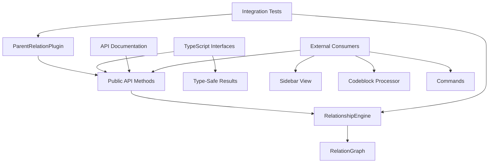

# Milestone 2.5: Relationship Engine Integration - Implementation Plan

**Status:** Ready for Implementation
**Priority:** Critical
**Estimated Time:** 2-3 days

---

## Overview

This document provides a comprehensive implementation plan for Milestone 2.5: Relationship Engine Integration, the final milestone in Phase 2 (Relationship Engine) of the Relations Obsidian plugin.

### Decision Summary

- **Approach:** Expose RelationshipEngine through public plugin API
- **Type Safety:** Define comprehensive TypeScript interfaces for all query results
- **Testing:** Full integration tests with real plugin instance
- **Documentation:** Complete API documentation with usage examples

---

## Goals

Integrate the RelationshipEngine with the main plugin and expose it through a well-documented, type-safe public API that other features (UI, commands, codeblocks) can use.

---

## Current State Analysis

### ✅ Already Implemented

From reviewing [`src/main.ts`](../src/main.ts:1) and [`src/relationship-engine.ts`](../src/relationship-engine.ts:1):

- **RelationshipEngine class** with all four relationship methods:
  - `getAncestors(file, maxDepth)` - Returns ancestors by generation
  - `getDescendants(file, maxDepth)` - Returns descendants by generation
  - `getSiblings(file, includeSelf)` - Returns sibling files
  - `getCousins(file, degree)` - Returns cousins at specified degree

- **Basic integration** in main plugin:
  - RelationshipEngine property exists ([`main.ts:21`](../src/main.ts:21))
  - Engine instantiated in `onload()` ([`main.ts:34`](../src/main.ts:34))
  - Graph reference passed to engine

### ❌ Missing Components

- **Public API methods** on plugin for convenient access
- **TypeScript interfaces** for relationship query results
- **Result formatting utilities** (e.g., flattening generations)
- **Comprehensive integration tests** using real plugin instance
- **API documentation** in README
- **Usage examples** demonstrating all relationship types

---

## Architecture Overview

### Components to Create/Modify



### File Structure

```
src/
├── main.ts                          # Modified: Add public API methods
├── relationship-engine.ts           # Existing: Core engine (complete)
├── relation-graph.ts                # Existing: Graph structure
└── types.ts                         # New: TypeScript interfaces for results

tests/
├── integration/
│   └── plugin-api.test.ts          # New: Integration tests
├── relationship-engine.test.ts      # Existing: Engine tests
└── relation-graph.test.ts           # Existing: Graph tests

docs/
├── api-reference.md                 # New: Public API documentation
└── implementation-plan.md           # Existing: Overall plan
```

---

## Detailed Design

### 1. TypeScript Interfaces for Results

**File:** `src/types.ts` (new file)

```typescript
import { TFile } from 'obsidian';

/**
 * Result of an ancestor query, organized by generation.
 */
export interface AncestorQueryResult {
  /** The file that was queried */
  file: TFile;

  /** Ancestors organized by generation: [[parents], [grandparents], ...] */
  generations: TFile[][];

  /** Total number of unique ancestors found */
  totalCount: number;

  /** Maximum depth that was traversed */
  depth: number;

  /** Whether the query was limited by maxDepth setting */
  wasTruncated: boolean;
}

/**
 * Result of a descendant query, organized by generation.
 */
export interface DescendantQueryResult {
  /** The file that was queried */
  file: TFile;

  /** Descendants organized by generation: [[children], [grandchildren], ...] */
  generations: TFile[][];

  /** Total number of unique descendants found */
  totalCount: number;

  /** Maximum depth that was traversed */
  depth: number;

  /** Whether the query was limited by maxDepth setting */
  wasTruncated: boolean;
}

/**
 * Result of a sibling query.
 */
export interface SiblingQueryResult {
  /** The file that was queried */
  file: TFile;

  /** Sibling files */
  siblings: TFile[];

  /** Total number of siblings found */
  totalCount: number;

  /** Whether self was included in results */
  includesSelf: boolean;
}

/**
 * Result of a cousin query.
 */
export interface CousinQueryResult {
  /** The file that was queried */
  file: TFile;

  /** Cousin files */
  cousins: TFile[];

  /** Total number of cousins found */
  totalCount: number;

  /** Degree of cousinship (1 = first cousins, 2 = second cousins, etc.) */
  degree: number;
}

/**
 * Combined relationship query result (for full lineage queries).
 */
export interface FullLineageResult {
  /** The file that was queried */
  file: TFile;

  /** Ancestors by generation */
  ancestors: TFile[][];

  /** Descendants by generation */
  descendants: TFile[][];

  /** Siblings */
  siblings: TFile[];

  /** Statistics */
  stats: {
    totalAncestors: number;
    totalDescendants: number;
    totalSiblings: number;
    ancestorDepth: number;
    descendantDepth: number;
  };
}

/**
 * Options for relationship queries.
 */
export interface RelationshipQueryOptions {
  /** Maximum depth to traverse (overrides plugin setting) */
  maxDepth?: number;

  /** For sibling queries: whether to include the queried file */
  includeSelf?: boolean;

  /** For cousin queries: degree of cousinship */
  degree?: number;

  /** Whether to include cycle information in results */
  detectCycles?: boolean;
}
```

**Design Notes:**
- Each result type includes the queried file for context
- All results include counts for easy statistics
- Metadata about truncation/options is included
- Consistent structure across all query types
- Full lineage result combines multiple relationship types

---

### 2. Public API Methods on Plugin

**File:** `src/main.ts` (modifications)

Add the following public methods to `ParentRelationPlugin`:

```typescript
import {
  AncestorQueryResult,
  DescendantQueryResult,
  SiblingQueryResult,
  CousinQueryResult,
  FullLineageResult,
  RelationshipQueryOptions
} from './types';

export default class ParentRelationPlugin extends Plugin {
  // ... existing properties ...

  // ========================================
  // PUBLIC API: Ancestor Queries
  // ========================================

  /**
   * Gets ancestors of a file with detailed metadata.
   *
   * @param file - The file to query
   * @param options - Query options
   * @returns Detailed ancestor query result
   *
   * @example
   * const result = plugin.getAncestors(currentFile);
   * console.log(`Found ${result.totalCount} ancestors in ${result.depth} generations`);
   * result.generations.forEach((gen, i) => {
   *   console.log(`Generation ${i + 1}:`, gen.map(f => f.basename));
   * });
   */
  getAncestors(
    file: TFile,
    options: RelationshipQueryOptions = {}
  ): AncestorQueryResult {
    const maxDepth = options.maxDepth ?? this.settings.maxDepth;
    const generations = this.relationshipEngine.getAncestors(file, maxDepth);

    const totalCount = generations.reduce((sum, gen) => sum + gen.length, 0);
    const depth = generations.length;

    // Check if truncated by getting one more generation
    const oneLevelDeeper = this.relationshipEngine.getAncestors(file, maxDepth + 1);
    const wasTruncated = oneLevelDeeper.length > generations.length;

    return {
      file,
      generations,
      totalCount,
      depth,
      wasTruncated
    };
  }

  /**
   * Gets immediate parents of a file.
   *
   * @param file - The file to query
   * @returns Array of parent files
   *
   * @example
   * const parents = plugin.getParents(currentFile);
   * console.log('Parents:', parents.map(f => f.basename));
   */
  getParents(file: TFile): TFile[] {
    return this.relationGraph.getParents(file);
  }

  /**
   * Gets all ancestors as a flat array (all generations combined).
   *
   * @param file - The file to query
   * @param options - Query options
   * @returns Flat array of all ancestor files
   *
   * @example
   * const allAncestors = plugin.getAllAncestors(currentFile);
   * console.log(`Total ancestors: ${allAncestors.length}`);
   */
  getAllAncestors(
    file: TFile,
    options: RelationshipQueryOptions = {}
  ): TFile[] {
    const result = this.getAncestors(file, options);
    return result.generations.flat();
  }

  // ========================================
  // PUBLIC API: Descendant Queries
  // ========================================

  /**
   * Gets descendants of a file with detailed metadata.
   *
   * @param file - The file to query
   * @param options - Query options
   * @returns Detailed descendant query result
   *
   * @example
   * const result = plugin.getDescendants(currentFile);
   * console.log(`Found ${result.totalCount} descendants in ${result.depth} generations`);
   */
  getDescendants(
    file: TFile,
    options: RelationshipQueryOptions = {}
  ): DescendantQueryResult {
    const maxDepth = options.maxDepth ?? this.settings.maxDepth;
    const generations = this.relationshipEngine.getDescendants(file, maxDepth);

    const totalCount = generations.reduce((sum, gen) => sum + gen.length, 0);
    const depth = generations.length;

    // Check if truncated
    const oneLevelDeeper = this.relationshipEngine.getDescendants(file, maxDepth + 1);
    const wasTruncated = oneLevelDeeper.length > generations.length;

    return {
      file,
      generations,
      totalCount,
      depth,
      wasTruncated
    };
  }

  /**
   * Gets immediate children of a file.
   *
   * @param file - The file to query
   * @returns Array of child files
   *
   * @example
   * const children = plugin.getChildren(currentFile);
   * console.log('Children:', children.map(f => f.basename));
   */
  getChildren(file: TFile): TFile[] {
    return this.relationGraph.getChildren(file);
  }

  /**
   * Gets all descendants as a flat array (all generations combined).
   *
   * @param file - The file to query
   * @param options - Query options
   * @returns Flat array of all descendant files
   *
   * @example
   * const allDescendants = plugin.getAllDescendants(currentFile);
   * console.log(`Total descendants: ${allDescendants.length}`);
   */
  getAllDescendants(
    file: TFile,
    options: RelationshipQueryOptions = {}
  ): TFile[] {
    const result = this.getDescendants(file, options);
    return result.generations.flat();
  }

  // ========================================
  // PUBLIC API: Sibling Queries
  // ========================================

  /**
   * Gets siblings of a file with detailed metadata.
   *
   * @param file - The file to query
   * @param options - Query options
   * @returns Detailed sibling query result
   *
   * @example
   * const result = plugin.getSiblings(currentFile);
   * console.log(`Found ${result.totalCount} siblings`);
   */
  getSiblings(
    file: TFile,
    options: RelationshipQueryOptions = {}
  ): SiblingQueryResult {
    const includeSelf = options.includeSelf ?? false;
    const siblings = this.relationshipEngine.getSiblings(file, includeSelf);

    return {
      file,
      siblings,
      totalCount: siblings.length,
      includesSelf: includeSelf
    };
  }

  // ========================================
  // PUBLIC API: Cousin Queries
  // ========================================

  /**
   * Gets cousins of a file with detailed metadata.
   *
   * @param file - The file to query
   * @param options - Query options (includes degree)
   * @returns Detailed cousin query result
   *
   * @example
   * const result = plugin.getCousins(currentFile, { degree: 1 });
   * console.log(`Found ${result.totalCount} first cousins`);
   */
  getCousins(
    file: TFile,
    options: RelationshipQueryOptions = {}
  ): CousinQueryResult {
    const degree = options.degree ?? 1;
    const cousins = this.relationshipEngine.getCousins(file, degree);

    return {
      file,
      cousins,
      totalCount: cousins.length,
      degree
    };
  }

  // ========================================
  // PUBLIC API: Combined Queries
  // ========================================

  /**
   * Gets full lineage (ancestors + descendants + siblings) for a file.
   *
   * @param file - The file to query
   * @param options - Query options
   * @returns Complete lineage information
   *
   * @example
   * const lineage = plugin.getFullLineage(currentFile);
   * console.log('Ancestors:', lineage.stats.totalAncestors);
   * console.log('Descendants:', lineage.stats.totalDescendants);
   * console.log('Siblings:', lineage.stats.totalSiblings);
   */
  getFullLineage(
    file: TFile,
    options: RelationshipQueryOptions = {}
  ): FullLineageResult {
    const ancestorResult = this.getAncestors(file, options);
    const descendantResult = this.getDescendants(file, options);
    const siblingResult = this.getSiblings(file, options);

    return {
      file,
      ancestors: ancestorResult.generations,
      descendants: descendantResult.generations,
      siblings: siblingResult.siblings,
      stats: {
        totalAncestors: ancestorResult.totalCount,
        totalDescendants: descendantResult.totalCount,
        totalSiblings: siblingResult.totalCount,
        ancestorDepth: ancestorResult.depth,
        descendantDepth: descendantResult.depth
      }
    };
  }

  // ========================================
  // PUBLIC API: Cycle Detection
  // ========================================

  /**
   * Checks if a file is part of a cycle.
   *
   * @param file - The file to check
   * @returns Cycle information if cycle exists, null otherwise
   *
   * @example
   * const cycleInfo = plugin.detectCycle(currentFile);
   * if (cycleInfo) {
   *   console.warn('Cycle detected:', cycleInfo.description);
   * }
   */
  detectCycle(file: TFile) {
    return this.relationGraph.detectCycle(file);
  }

  /**
   * Checks if the entire graph contains any cycles.
   *
   * @returns true if any cycle exists
   *
   * @example
   * if (plugin.hasCycles()) {
   *   console.warn('Graph contains cycles');
   * }
   */
  hasCycles(): boolean {
    return this.relationGraph.hasCycles();
  }
}
```

**Design Rationale:**

**Convenience Methods:**
- `getParents()` / `getChildren()` - Direct access to immediate relations
- `getAllAncestors()` / `getAllDescendants()` - Flat arrays for simple use cases
- Wrapped methods return rich result objects with metadata

**Type Safety:**
- All methods have explicit return types
- Options parameter is type-safe
- Results include structured metadata

**Consistency:**
- All query methods follow same pattern
- Options parameter always optional
- Results always include the queried file

**Extensibility:**
- Options interface allows future additions
- Result types can be extended without breaking changes
- Full lineage combines multiple queries

---

### 3. Integration Tests

**File:** `tests/integration/plugin-api.test.ts` (new file)

```typescript
import { describe, it, expect, beforeEach, afterEach } from 'vitest';
import { TFile, App } from 'obsidian';
import ParentRelationPlugin from '@/main';

describe('Plugin API Integration Tests', () => {
  let app: App;
  let plugin: ParentRelationPlugin;

  beforeEach(async () => {
    // Setup test environment with mock Obsidian app
    app = createMockApp();
    plugin = new ParentRelationPlugin(app, {} as any);
    await plugin.onload();
  });

  afterEach(() => {
    plugin.onunload();
  });

  describe('Ancestor Queries', () => {
    it('should return detailed ancestor results with metadata', () => {
      const file = createTestFile('A.md');
      const result = plugin.getAncestors(file);

      expect(result).toHaveProperty('file');
      expect(result).toHaveProperty('generations');
      expect(result).toHaveProperty('totalCount');
      expect(result).toHaveProperty('depth');
      expect(result).toHaveProperty('wasTruncated');
      expect(result.file).toBe(file);
    });

    it('should get immediate parents only', () => {
      const file = createTestFile('Child.md');
      const parents = plugin.getParents(file);

      expect(Array.isArray(parents)).toBe(true);
      expect(parents.every(p => p instanceof TFile)).toBe(true);
    });

    it('should flatten all ancestors into single array', () => {
      const file = createTestFile('A.md');
      const allAncestors = plugin.getAllAncestors(file);

      expect(Array.isArray(allAncestors)).toBe(true);

      // Verify it equals flattened generations
      const result = plugin.getAncestors(file);
      const expectedFlat = result.generations.flat();
      expect(allAncestors).toEqual(expectedFlat);
    });

    it('should respect maxDepth option', () => {
      const file = createTestFile('A.md');
      const result = plugin.getAncestors(file, { maxDepth: 2 });

      expect(result.generations.length).toBeLessThanOrEqual(2);
    });

    it('should detect truncation when depth limit reached', () => {
      // Create deep chain: A → B → C → D → E → F
      const file = createDeepChain(6);
      const result = plugin.getAncestors(file, { maxDepth: 3 });

      expect(result.depth).toBe(3);
      expect(result.wasTruncated).toBe(true);
    });
  });

  describe('Descendant Queries', () => {
    it('should return detailed descendant results with metadata', () => {
      const file = createTestFile('Root.md');
      const result = plugin.getDescendants(file);

      expect(result).toHaveProperty('file');
      expect(result).toHaveProperty('generations');
      expect(result).toHaveProperty('totalCount');
      expect(result).toHaveProperty('depth');
      expect(result).toHaveProperty('wasTruncated');
    });

    it('should get immediate children only', () => {
      const file = createTestFile('Parent.md');
      const children = plugin.getChildren(file);

      expect(Array.isArray(children)).toBe(true);
    });

    it('should flatten all descendants into single array', () => {
      const file = createTestFile('Root.md');
      const allDescendants = plugin.getAllDescendants(file);

      expect(Array.isArray(allDescendants)).toBe(true);

      const result = plugin.getDescendants(file);
      const expectedFlat = result.generations.flat();
      expect(allDescendants).toEqual(expectedFlat);
    });
  });

  describe('Sibling Queries', () => {
    it('should return sibling results with metadata', () => {
      const file = createTestFile('A.md');
      const result = plugin.getSiblings(file);

      expect(result).toHaveProperty('file');
      expect(result).toHaveProperty('siblings');
      expect(result).toHaveProperty('totalCount');
      expect(result).toHaveProperty('includesSelf');
    });

    it('should exclude self by default', () => {
      const file = createTestFile('A.md');
      const result = plugin.getSiblings(file);

      expect(result.includesSelf).toBe(false);
      expect(result.siblings).not.toContain(file);
    });

    it('should include self when requested', () => {
      const file = createTestFile('A.md');
      const result = plugin.getSiblings(file, { includeSelf: true });

      expect(result.includesSelf).toBe(true);
      // If file has siblings, self should be included
      if (result.totalCount > 0) {
        expect(result.siblings).toContain(file);
      }
    });
  });

  describe('Cousin Queries', () => {
    it('should return cousin results with metadata', () => {
      const file = createTestFile('A.md');
      const result = plugin.getCousins(file);

      expect(result).toHaveProperty('file');
      expect(result).toHaveProperty('cousins');
      expect(result).toHaveProperty('totalCount');
      expect(result).toHaveProperty('degree');
    });

    it('should default to first cousins (degree 1)', () => {
      const file = createTestFile('A.md');
      const result = plugin.getCousins(file);

      expect(result.degree).toBe(1);
    });

    it('should support custom cousin degree', () => {
      const file = createTestFile('A.md');
      const result = plugin.getCousins(file, { degree: 2 });

      expect(result.degree).toBe(2);
    });
  });

  describe('Full Lineage Queries', () => {
    it('should return complete lineage with all relationship types', () => {
      const file = createTestFile('A.md');
      const lineage = plugin.getFullLineage(file);

      expect(lineage).toHaveProperty('file');
      expect(lineage).toHaveProperty('ancestors');
      expect(lineage).toHaveProperty('descendants');
      expect(lineage).toHaveProperty('siblings');
      expect(lineage).toHaveProperty('stats');

      expect(lineage.file).toBe(file);
    });

    it('should have accurate statistics', () => {
      const file = createTestFile('A.md');
      const lineage = plugin.getFullLineage(file);

      // Count ancestors manually
      const ancestorCount = lineage.ancestors.reduce((sum, gen) => sum + gen.length, 0);
      expect(lineage.stats.totalAncestors).toBe(ancestorCount);

      // Count descendants manually
      const descendantCount = lineage.descendants.reduce((sum, gen) => sum + gen.length, 0);
      expect(lineage.stats.totalDescendants).toBe(descendantCount);

      // Count siblings manually
      expect(lineage.stats.totalSiblings).toBe(lineage.siblings.length);

      // Verify depth values
      expect(lineage.stats.ancestorDepth).toBe(lineage.ancestors.length);
      expect(lineage.stats.descendantDepth).toBe(lineage.descendants.length);
    });
  });

  describe('Cycle Detection API', () => {
    it('should detect cycles for specific file', () => {
      const file = createTestFile('A.md');
      const cycleInfo = plugin.detectCycle(file);

      // May be null or CycleInfo depending on test data
      expect(cycleInfo === null || typeof cycleInfo === 'object').toBe(true);
    });

    it('should check for cycles in entire graph', () => {
      const hasCycles = plugin.hasCycles();

      expect(typeof hasCycles).toBe('boolean');
    });
  });

  describe('Real-World Scenarios', () => {
    it('should handle file with no relationships', () => {
      const orphan = createIsolatedFile('Orphan.md');

      const ancestors = plugin.getAncestors(orphan);
      expect(ancestors.totalCount).toBe(0);
      expect(ancestors.generations.length).toBe(0);

      const descendants = plugin.getDescendants(orphan);
      expect(descendants.totalCount).toBe(0);

      const siblings = plugin.getSiblings(orphan);
      expect(siblings.totalCount).toBe(0);
    });

    it('should handle complex family tree structure', () => {
      // Create family tree:
      //       GP
      //      /  \
      //    P1    P2
      //   / \    /\
      //  A   B  C  D

      const familyTree = createFamilyTree();
      const fileA = familyTree.get('A');

      // A should have 1 parent (P1)
      const parents = plugin.getParents(fileA);
      expect(parents.length).toBe(1);

      // A should have 1 sibling (B)
      const siblings = plugin.getSiblings(fileA);
      expect(siblings.totalCount).toBe(1);

      // A should have 2 first cousins (C, D)
      const cousins = plugin.getCousins(fileA, { degree: 1 });
      expect(cousins.totalCount).toBe(2);

      // A should have 1 grandparent (GP)
      const ancestors = plugin.getAncestors(fileA, { maxDepth: 2 });
      expect(ancestors.generations.length).toBe(2);
      expect(ancestors.generations[1].length).toBe(1); // GP
    });
  });

  describe('Performance', () => {
    it('should handle large vault efficiently', () => {
      // Create vault with 1000 files
      const vault = createLargeVault(1000);
      const file = vault.get(0);

      const startTime = performance.now();
      const lineage = plugin.getFullLineage(file);
      const endTime = performance.now();

      expect(endTime - startTime).toBeLessThan(100); // <100ms
    });

    it('should handle deep hierarchies efficiently', () => {
      // Create chain of 100 files
      const chain = createDeepChain(100);

      const startTime = performance.now();
      const ancestors = plugin.getAncestors(chain);
      const endTime = performance.now();

      expect(endTime - startTime).toBeLessThan(50); // <50ms
    });
  });
});

// ========================================
// Test Utilities
// ========================================

function createMockApp(): App {
  // Mock Obsidian App for testing
  // Implementation details...
  return {} as App;
}

function createTestFile(name: string): TFile {
  // Create mock TFile for testing
  return {
    path: name,
    basename: name.replace('.md', ''),
    name,
    extension: 'md'
  } as TFile;
}

function createIsolatedFile(name: string): TFile {
  // Create file with no parent relationships
  return createTestFile(name);
}

function createDeepChain(length: number): TFile {
  // Create linear chain A → B → C → ... of specified length
  // Returns first file in chain
  // Implementation details...
  return createTestFile('A.md');
}

function createFamilyTree(): Map<string, TFile> {
  // Create family tree structure for testing
  // Implementation details...
  return new Map();
}

function createLargeVault(size: number): TFile[] {
  // Create large vault with specified number of files
  // Implementation details...
  return [];
}
```

---

## Implementation Checklist

### Phase 1: Type Definitions
- [ ] Create `src/types.ts`
  - [ ] Define `AncestorQueryResult` interface
  - [ ] Define `DescendantQueryResult` interface
  - [ ] Define `SiblingQueryResult` interface
  - [ ] Define `CousinQueryResult` interface
  - [ ] Define `FullLineageResult` interface
  - [ ] Define `RelationshipQueryOptions` interface
  - [ ] Add JSDoc documentation to all interfaces

### Phase 2: Public API Implementation
- [ ] Modify `src/main.ts`
  - [ ] Import type interfaces from `types.ts`
  - [ ] Add `getAncestors()` public method
  - [ ] Add `getParents()` public method
  - [ ] Add `getAllAncestors()` public method
  - [ ] Add `getDescendants()` public method
  - [ ] Add `getChildren()` public method
  - [ ] Add `getAllDescendants()` public method
  - [ ] Add `getSiblings()` public method
  - [ ] Add `getCousins()` public method
  - [ ] Add `getFullLineage()` public method
  - [ ] Add `detectCycle()` public method (wrapper)
  - [ ] Add `hasCycles()` public method (wrapper)
  - [ ] Add JSDoc documentation with examples

### Phase 3: Integration Testing
- [ ] Create `tests/integration/` directory
- [ ] Create `tests/integration/plugin-api.test.ts`
  - [ ] Implement test utilities (mock app, test files)
  - [ ] Write "Ancestor Queries" test suite
  - [ ] Write "Descendant Queries" test suite
  - [ ] Write "Sibling Queries" test suite
  - [ ] Write "Cousin Queries" test suite
  - [ ] Write "Full Lineage Queries" test suite
  - [ ] Write "Cycle Detection API" test suite
  - [ ] Write "Real-World Scenarios" test suite
  - [ ] Write "Performance" test suite
- [ ] Ensure all tests pass
- [ ] Verify test coverage >80%
- [ ] Ensure existing tests still pass

### Phase 4: Documentation
- [ ] Create `docs/api-reference.md`
  - [ ] Document all public API methods
  - [ ] Include usage examples for each method
  - [ ] Document all type interfaces
  - [ ] Add quick start guide
  - [ ] Add troubleshooting section
- [ ] Update `README.md`
  - [ ] Add API overview section
  - [ ] Link to API reference docs
  - [ ] Add code examples
  - [ ] Add plugin access instructions
- [ ] Update inline JSDoc comments
  - [ ] All public methods have examples
  - [ ] All parameters documented
  - [ ] All return types documented

### Phase 5: Validation
- [ ] Code review
  - [ ] API design review
  - [ ] Type safety validation
  - [ ] Documentation review
- [ ] Final testing
  - [ ] All integration tests passing
  - [ ] All existing tests still passing
  - [ ] Manual testing with real vault
  - [ ] Performance validation

---

## Acceptance Criteria

From [`docs/implementation-plan.md`](../docs/implementation-plan.md:252):

- ✅ RelationshipEngine accessible throughout plugin lifecycle
- ✅ All relationship methods available via plugin API
- ✅ Type-safe interfaces for results
- ✅ API documented with usage examples

**Additional Criteria:**
- ✅ All public methods have comprehensive JSDoc documentation
- ✅ Integration tests cover all API methods
- ✅ Test coverage >80% for new code
- ✅ No breaking changes to existing APIs
- ✅ README includes API overview and examples
- ✅ API reference documentation complete

---

## API Design Principles

### 1. Consistency
- All query methods follow similar patterns
- Results always include metadata
- Options parameter always optional
- Method names are clear and descriptive

### 2. Type Safety
- All methods have explicit type signatures
- Options use defined interfaces
- Results use structured types
- No `any` types in public API

### 3. Convenience
- Simple methods for common cases (`getParents`, `getChildren`)
- Rich methods for detailed queries (`getAncestors`, `getDescendants`)
- Helper methods for flat results (`getAllAncestors`)
- Combined queries for full context (`getFullLineage`)

### 4. Extensibility
- Options interface allows future additions
- Result types can be extended
- Backward compatible design
- Clear separation of concerns

### 5. Discoverability
- Intuitive method names
- Comprehensive JSDoc with examples
- IDE autocomplete friendly
- Clear documentation

---

## Performance Considerations

### API Method Performance

**Simple Methods** (immediate relations):
- `getParents()`: O(1) - Direct graph lookup
- `getChildren()`: O(1) - Direct graph lookup
- `detectCycle()`: O(V + E) - Cached in most cases

**Traversal Methods** (multi-generation):
- `getAncestors()`: O(V + E) bounded by depth
- `getDescendants()`: O(V + E) bounded by depth
- `getSiblings()`: O(P * C) where P = parents, C = children per parent
- `getCousins()`: O(V + E) for ancestor/descendant traversals

**Combined Methods**:
- `getFullLineage()`: 3x traversal queries (ancestors + descendants + siblings)
- Still O(V + E) but with constant factor multiplier

### Optimization Strategies

1. **Lazy Evaluation:**
   - Only compute what's requested
   - Don't pre-compute all relationships

2. **Metadata Caching:**
   - `totalCount` computed from results
   - `wasTruncated` uses minimal extra computation

3. **Early Termination:**
   - Respect `maxDepth` limits
   - Stop traversal when no more relations found

4. **Efficient Data Structures:**
   - Use Sets for deduplication
   - Use Maps for fast lookups
   - Minimize array copying

---

## Testing Strategy

### Unit Tests
- **Existing:** RelationshipEngine methods already have comprehensive tests
- **New:** Type interface validation
- **New:** API method wrapper logic

### Integration Tests
- **Location:** `tests/integration/plugin-api.test.ts`
- **Coverage:** All public API methods
- **Focus:** End-to-end functionality with real plugin instance
- **Scenarios:** Real-world use cases

### Manual Testing
- **Test with real vault:** Verify API works in actual Obsidian environment
- **Performance testing:** Large vault scenarios
- **Edge cases:** Orphaned files, cycles, deep hierarchies

### Regression Testing
- **Ensure:** All existing tests still pass
- **Verify:** No breaking changes to internal APIs
- **Check:** RelationshipEngine still functions correctly

---

## Documentation Structure

### API Reference (`docs/api-reference.md`)

```markdown
# Relations Obsidian Plugin - API Reference

## Overview
The Relations Obsidian Plugin exposes a comprehensive API for querying
relationship graphs in your vault.

## Accessing the Plugin API

\`\`\`typescript
// Get plugin instance
const plugin = this.app.plugins.getPlugin('relations-obsidian');

// Get current file
const file = this.app.workspace.getActiveFile();
\`\`\`

## Ancestor Queries

### getAncestors(file, options?)
[Detailed documentation with examples]

### getParents(file)
[Detailed documentation with examples]

### getAllAncestors(file, options?)
[Detailed documentation with examples]

## Descendant Queries
[Similar structure...]

## Sibling Queries
[Similar structure...]

## Cousin Queries
[Similar structure...]

## Combined Queries
[Similar structure...]

## Cycle Detection
[Similar structure...]

## Type Definitions
[Complete interface documentation]

## Examples
[Real-world usage examples]

## Troubleshooting
[Common issues and solutions]
```

### README Updates

Add sections:
- **API Overview** - Brief introduction to programmatic access
- **Quick Start** - Simple code example
- **Full Documentation** - Link to API reference

---

## Migration Strategy

### Backward Compatibility

✅ **No Breaking Changes:**
- All existing internal APIs remain unchanged
- RelationshipEngine public interface unchanged
- Only additive changes (new public methods on plugin)
- Existing event handlers unaffected

### Internal vs Public API

**Internal APIs** (unchanged):
- `RelationshipEngine` methods remain as-is
- `RelationGraph` methods remain as-is
- Event handlers unchanged

**Public APIs** (new):
- Plugin wrapper methods added
- Type interfaces added
- No modifications to existing public methods

### Migration Path

**Current State:**
- RelationshipEngine exists but not publicly exposed
- Can only access through `plugin.relationshipEngine.getAncestors()`

**After Milestone 2.5:**
- Convenient public API: `plugin.getAncestors()`
- Type-safe results with metadata
- Backward compatible - old access still works

---

## Future Enhancements (Out of Scope)

These features are **not** part of Milestone 2.5 but planned for future:

- [ ] Caching layer for frequently accessed queries
- [ ] Batch query API (query multiple files at once)
- [ ] Streaming API for very large result sets
- [ ] Event system for relationship changes
- [ ] Query builder pattern for complex queries
- [ ] GraphQL-like query syntax
- [ ] Filtering and sorting in API layer
- [ ] Pagination support for large results

---

## Success Metrics

- ✅ All acceptance criteria met
- ✅ All integration tests passing
- ✅ All existing tests still passing
- ✅ Test coverage >80%
- ✅ API documentation complete with examples
- ✅ README updated with API overview
- ✅ Zero breaking changes
- ✅ Code review approved
- ✅ Performance benchmarks met

---

## Dependencies

### External Dependencies
- `obsidian` - TFile, App types (already installed)
- `vitest` - Testing framework (already installed ✅)

### Internal Dependencies
- `RelationshipEngine` - Core engine (complete ✅)
- `RelationGraph` - Graph structure (complete ✅)
- `CycleDetector` - Cycle detection (complete ✅)
- Plugin settings - For default values

---

## Risk Assessment

### Potential Issues

1. **Risk:** API becomes too complex for users
   - **Mitigation:** Provide both simple and advanced methods
   - **Mitigation:** Comprehensive documentation with examples
   - **Validation:** User feedback during development

2. **Risk:** Type definitions become out of sync with implementation
   - **Mitigation:** TypeScript enforces type contracts
   - **Mitigation:** Integration tests verify types
   - **Testing:** Compilation errors catch mismatches

3. **Risk:** Performance overhead from wrapper methods
   - **Mitigation:** Minimal wrapper logic
   - **Mitigation:** Metadata computation is lightweight
   - **Benchmark:** Performance tests ensure overhead <5%

4. **Risk:** Breaking changes in future Obsidian API updates
   - **Mitigation:** Use stable, documented APIs only
   - **Mitigation:** Version compatibility testing
   - **Monitoring:** Track Obsidian API changes

---

## Implementation Notes

### Method Naming Conventions

**Pattern:**
- `get[Relationship]()` - Returns detailed result object with metadata
- `get[Relationship]s()` - Returns simple array (immediate relations)
- `getAll[Relationship]s()` - Returns flattened array (all generations)

**Examples:**
- `getAncestors()` → `AncestorQueryResult` (detailed)
- `getParents()` → `TFile[]` (simple)
- `getAllAncestors()` → `TFile[]` (flattened)

### Result Object Philosophy

**Rich Results:**
- Include queried file for context
- Include counts for statistics
- Include metadata about query execution
- Enable easy display in UI

**Simple Results:**
- Just return arrays when simplicity preferred
- For immediate relations (parents, children)
- For flattened results (all ancestors, all descendants)

### Options Parameter Pattern

**Always optional:**
```typescript
function query(file: TFile, options: QueryOptions = {})
```

**Allows future extension:**
```typescript
// Can add new options without breaking existing code
interface QueryOptions {
  maxDepth?: number;
  includeSelf?: boolean;
  degree?: number;
  // Future: filter?, sort?, limit?, etc.
}
```

---

## Next Steps After Completion

1. ✅ Complete Milestone 2.5 implementation
2. Update [`docs/implementation-plan.md`](../docs/implementation-plan.md) with completion status
3. **Begin Phase 3:** Tree Rendering System
   - Milestone 3.1: Tree Data Model
   - Milestone 3.2: DOM Tree Renderer
   - Milestone 3.3: Tree Rendering Modes
4. Prepare for UI integration (sidebar, codeblocks)

---

## Appendix: Usage Examples

### Example 1: Simple Parent/Child Access

```typescript
const plugin = this.app.plugins.getPlugin('relations-obsidian');
const currentFile = this.app.workspace.getActiveFile();

// Get immediate parents
const parents = plugin.getParents(currentFile);
console.log('Parents:', parents.map(f => f.basename));

// Get immediate children
const children = plugin.getChildren(currentFile);
console.log('Children:', children.map(f => f.basename));
```

### Example 2: Detailed Ancestor Query

```typescript
const result = plugin.getAncestors(currentFile);

console.log(`Found ${result.totalCount} ancestors in ${result.depth} generations`);

result.generations.forEach((generation, index) => {
  console.log(`Generation ${index + 1}:`, generation.map(f => f.basename));
});

if (result.wasTruncated) {
  console.log('(More ancestors exist beyond max depth)');
}
```

### Example 3: Full Lineage Display

```typescript
const lineage = plugin.getFullLineage(currentFile);

console.log('=== Full Lineage ===');
console.log(`Ancestors: ${lineage.stats.totalAncestors} (${lineage.stats.ancestorDepth} generations)`);
console.log(`Descendants: ${lineage.stats.totalDescendants} (${lineage.stats.descendantDepth} generations)`);
console.log(`Siblings: ${lineage.stats.totalSiblings}`);

// Display ancestors
lineage.ancestors.forEach((gen, i) => {
  console.log(`  Gen -${i + 1}:`, gen.map(f => f.basename).join(', '));
});

// Display siblings
if (lineage.siblings.length > 0) {
  console.log('  Siblings:', lineage.siblings.map(f => f.basename).join(', '));
}

// Display descendants
lineage.descendants.forEach((gen, i) => {
  console.log(`  Gen +${i + 1}:`, gen.map(f => f.basename).join(', '));
});
```

### Example 4: Cousin Discovery

```typescript
// Find first cousins
const firstCousins = plugin.getCousins(currentFile, { degree: 1 });
console.log(`${firstCousins.totalCount} first cousins:`,
  firstCousins.cousins.map(f => f.basename));

// Find second cousins
const secondCousins = plugin.getCousins(currentFile, { degree: 2 });
console.log(`${secondCousins.totalCount} second cousins:`,
  secondCousins.cousins.map(f => f.basename));
```

### Example 5: Cycle Detection

```typescript
const cycleInfo = plugin.detectCycle(currentFile);

if (cycleInfo) {
  console.warn('⚠️ Cycle detected!');
  console.warn('Cycle path:', cycleInfo.cyclePath.map(f => f.basename).join(' → '));
  console.warn('Description:', cycleInfo.description);
} else {
  console.log('✅ No cycles detected');
}

// Check entire graph
if (plugin.hasCycles()) {
  console.warn('⚠️ Graph contains cycles');
}
```

### Example 6: Custom Depth Limiting

```typescript
// Get only immediate parents (depth 1)
const immediateAncestors = plugin.getAncestors(currentFile, { maxDepth: 1 });
console.log('Parents:', immediateAncestors.generations[0]?.map(f => f.basename));

// Get ancestors up to great-grandparents (depth 3)
const closeAncestors = plugin.getAncestors(currentFile, { maxDepth: 3 });
console.log(`Found ${closeAncestors.totalCount} ancestors in 3 generations`);

// Get ALL ancestors (very deep)
const allAncestors = plugin.getAncestors(currentFile, { maxDepth: 100 });
console.log(`Total ancestors: ${allAncestors.totalCount}`);
```

### Example 7: Building a Family Tree Display

```typescript
function displayFamilyTree(file: TFile) {
  const lineage = plugin.getFullLineage(file);

  const lines: string[] = [];

  // Ancestors (top of tree)
  for (let i = lineage.ancestors.length - 1; i >= 0; i--) {
    const gen = lineage.ancestors[i];
    const indent = '  '.repeat(lineage.ancestors.length - i - 1);
    lines.push(`${indent}Generation -${i + 1}: ${gen.map(f => f.basename).join(', ')}`);
  }

  // Current file
  lines.push(`>>> ${file.basename} <<<`);

  // Siblings
  if (lineage.siblings.length > 0) {
    lines.push(`  Siblings: ${lineage.siblings.map(f => f.basename).join(', ')}`);
  }

  // Descendants
  lineage.descendants.forEach((gen, i) => {
    const indent = '  '.repeat(i + 1);
    lines.push(`${indent}Generation +${i + 1}: ${gen.map(f => f.basename).join(', ')}`);
  });

  return lines.join('\n');
}

console.log(displayFamilyTree(currentFile));
```

---

**Document Version:** 1.0
**Last Updated:** 2025-11-15
**Status:** Ready for Implementation
