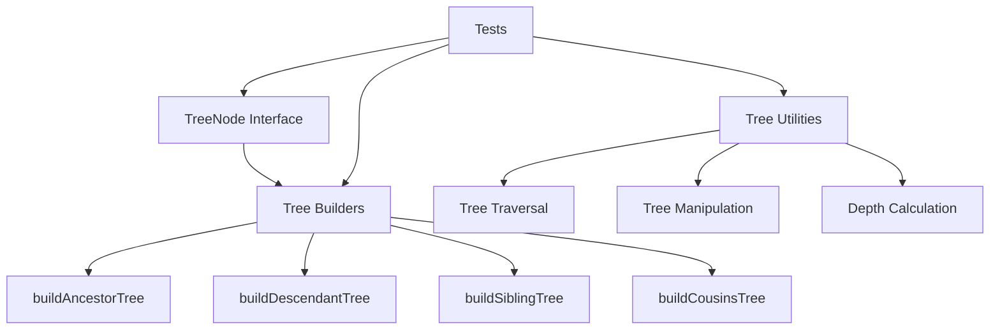

# Milestone 3.1: Tree Data Model - Implementation Plan

**Status:** Ready for Implementation
**Priority:** High
**Estimated Time:** 2-3 days

---

## Overview

This document provides a comprehensive implementation plan for Milestone 3.1: Tree Data Model, the first milestone in Phase 3 (Tree Rendering System) of the Relations Obsidian plugin.

### Decision Summary

- **Approach:** Immutable tree node structure with builder functions
- **Data Structure:** Recursive `TreeNode` interface with children array
- **Cycle Handling:** Boolean flag `isCycle` to mark cyclic relationships
- **Metadata:** Flexible metadata object for rendering hints
- **Builder Strategy:** Separate builder functions for different relationship types

---

## Goals

Create data structures for representing computed relationship trees that can be used by both the sidebar view and codeblock renderer. The tree model should be flexible enough to represent various relationship types (ancestors, descendants, siblings, cousins) while efficiently handling cycles and providing rendering hints.

---

## Architecture Overview

### Components to Create



### File Structure

```
src/
├── tree-model.ts              # New: Tree data structures and builders
├── relationship-engine.ts     # Existing: Relationship computation
├── relation-graph.ts          # Existing: Graph structure
└── main.ts                    # Modified: Future integration

tests/
├── tree-model.test.ts         # New: Comprehensive tree model tests
├── relationship-engine.test.ts # Existing: Relationship tests
└── cycle-detector.test.ts     # Existing: Cycle tests
```

---

## Detailed Design

### 1. TreeNode Interface

**File:** `src/tree-model.ts` (new file)

```typescript
import { TFile } from 'obsidian';

/**
 * Represents a node in a relationship tree.
 *
 * This structure is used for rendering relationship trees in both
 * the sidebar view and codeblock renderer.
 */
export interface TreeNode {
  /** The file this node represents */
  file: TFile;

  /** Child nodes in the tree */
  children: TreeNode[];

  /** Depth of this node in the tree (0 = root) */
  depth: number;

  /** True if this node is part of a cycle */
  isCycle: boolean;

  /** Additional metadata for rendering hints */
  metadata: TreeNodeMetadata;
}

/**
 * Metadata for rendering hints and additional information.
 */
export interface TreeNodeMetadata {
  /** Optional icon name for custom rendering */
  icon?: string;

  /** Optional color for highlighting */
  color?: string;

  /** Optional CSS class names */
  className?: string;

  /** Optional tooltip text */
  tooltip?: string;

  /** Whether this node should be initially collapsed */
  collapsed?: boolean;

  /** Custom data for extensions */
  [key: string]: any;
}

/**
 * Options for building trees.
 */
export interface TreeBuildOptions {
  /** Maximum depth to build (default: from settings) */
  maxDepth?: number;

  /** Whether to mark cycle nodes */
  detectCycles?: boolean;

  /** Whether to include metadata */
  includeMetadata?: boolean;

  /** Filter function for nodes */
  filter?: (file: TFile) => boolean;

  /** Custom metadata provider */
  metadataProvider?: (file: TFile, depth: number) => Partial<TreeNodeMetadata>;
}
```

**Design Rationale:**

**Immutable Structure:**
- TreeNode objects should be treated as immutable after creation
- Enables safe sharing between components
- Simplifies state management in UI components
- Easier to reason about and debug

**Recursive Children Array:**
- Natural representation of hierarchical data
- Easy to traverse and render
- Flexible depth (can represent any tree structure)
- Standard pattern in tree data structures

**Depth Tracking:**
- Essential for limiting tree depth
- Used for indentation in rendering
- Helps with cycle detection
- Useful for filtering by depth

**Cycle Flag:**
- Clear indication of cyclic relationships
- Prevents infinite rendering loops
- Enables special visual treatment
- Works with existing cycle detector

**Metadata Object:**
- Flexible extension point for rendering
- Supports custom icons, colors, tooltips
- Can be used by themes and extensions
- Doesn't pollute core TreeNode interface

---

### 2. Tree Builder Functions

**File:** `src/tree-model.ts` (continued)

```typescript
import { RelationshipEngine } from './relationship-engine';
import { RelationGraph } from './relation-graph';

/**
 * Builds an ancestor tree from a starting file.
 *
 * @param file - The root file
 * @param engine - The relationship engine
 * @param graph - The relation graph (for cycle detection)
 * @param options - Build options
 * @returns Root node of the ancestor tree
 *
 * @example
 * // Given: A → B → C → D
 * // buildAncestorTree(A) returns:
 * // {
 * //   file: A,
 * //   depth: 0,
 * //   children: [
 * //     {
 * //       file: B,
 * //       depth: 1,
 * //       children: [
 * //         {
 * //           file: C,
 * //           depth: 2,
 * //           children: [
 * //             { file: D, depth: 3, children: [] }
 * //           ]
 * //         }
 * //       ]
 * //     }
 * //   ]
 * // }
 */
export function buildAncestorTree(
  file: TFile,
  engine: RelationshipEngine,
  graph: RelationGraph,
  options: TreeBuildOptions = {}
): TreeNode {
  const {
    maxDepth,
    detectCycles = true,
    includeMetadata = true,
    filter,
    metadataProvider
  } = options;

  // Get ancestors organized by generation
  const ancestors = engine.getAncestors(file, maxDepth);

  // Build tree structure
  return buildTreeNode(file, 0, ancestors, graph, {
    detectCycles,
    includeMetadata,
    filter,
    metadataProvider
  });
}

/**
 * Builds a descendant tree from a starting file.
 *
 * @param file - The root file
 * @param engine - The relationship engine
 * @param graph - The relation graph (for cycle detection)
 * @param options - Build options
 * @returns Root node of the descendant tree
 */
export function buildDescendantTree(
  file: TFile,
  engine: RelationshipEngine,
  graph: RelationGraph,
  options: TreeBuildOptions = {}
): TreeNode {
  const {
    maxDepth,
    detectCycles = true,
    includeMetadata = true,
    filter,
    metadataProvider
  } = options;

  // Get descendants organized by generation
  const descendants = engine.getDescendants(file, maxDepth);

  // Build tree structure
  return buildTreeNode(file, 0, descendants, graph, {
    detectCycles,
    includeMetadata,
    filter,
    metadataProvider
  });
}

/**
 * Builds a combined tree showing both ancestors and descendants.
 *
 * @param file - The focus file (center of tree)
 * @param engine - The relationship engine
 * @param graph - The relation graph
 * @param options - Build options
 * @returns Root node representing the full lineage
 */
export function buildFullLineageTree(
  file: TFile,
  engine: RelationshipEngine,
  graph: RelationGraph,
  options: TreeBuildOptions = {}
): TreeNode {
  // Get both ancestors and descendants
  const ancestors = engine.getAncestors(file, options.maxDepth);
  const descendants = engine.getDescendants(file, options.maxDepth);

  // Build combined tree with file at center
  // This is more complex - will need special handling
  // For now, return focus file with ancestors as parents and descendants as children

  const node = createTreeNode(file, 0, false, options);

  // Add ancestors above
  if (ancestors.length > 0) {
    // Build ancestor branches
    // (Implementation details...)
  }

  // Add descendants below
  if (descendants.length > 0) {
    // Build descendant branches
    node.children = buildDescendantNodes(descendants[0], 1, graph, options);
  }

  return node;
}

/**
 * Builds a sibling tree showing siblings of a file.
 *
 * @param file - The file to get siblings for
 * @param engine - The relationship engine
 * @param graph - The relation graph
 * @param options - Build options
 * @returns Array of tree nodes (one per sibling)
 */
export function buildSiblingTree(
  file: TFile,
  engine: RelationshipEngine,
  graph: RelationGraph,
  options: TreeBuildOptions = {}
): TreeNode[] {
  const siblings = engine.getSiblings(file, false); // Exclude self

  return siblings.map(sibling =>
    createTreeNode(sibling, 0, false, options)
  );
}

/**
 * Builds a cousins tree.
 *
 * @param file - The file to get cousins for
 * @param engine - The relationship engine
 * @param graph - The relation graph
 * @param options - Build options
 * @returns Array of tree nodes (one per cousin)
 */
export function buildCousinsTree(
  file: TFile,
  engine: RelationshipEngine,
  graph: RelationGraph,
  options: TreeBuildOptions = {}
): TreeNode[] {
  const cousins = engine.getCousins(file, 1); // First cousins

  return cousins.map(cousin =>
    createTreeNode(cousin, 0, false, options)
  );
}

/**
 * Internal helper to create a tree node.
 */
function createTreeNode(
  file: TFile,
  depth: number,
  isCycle: boolean,
  options: TreeBuildOptions
): TreeNode {
  const metadata: TreeNodeMetadata = {};

  if (options.includeMetadata && options.metadataProvider) {
    Object.assign(metadata, options.metadataProvider(file, depth));
  }

  // Add default cycle indicator
  if (isCycle && options.includeMetadata) {
    metadata.icon = 'cycle';
    metadata.tooltip = 'This note is part of a cycle';
    metadata.className = (metadata.className || '') + ' is-cycle';
  }

  return {
    file,
    children: [],
    depth,
    isCycle,
    metadata
  };
}

/**
 * Internal helper to build tree nodes from generations.
 */
function buildTreeNode(
  file: TFile,
  depth: number,
  generations: TFile[][],
  graph: RelationGraph,
  options: Partial<TreeBuildOptions>
): TreeNode {
  // Check if this file is part of a cycle
  const isCycle = options.detectCycles
    ? graph.detectCycle(file) !== null
    : false;

  // Create node
  const node = createTreeNode(file, depth, isCycle, options as TreeBuildOptions);

  // If we have more generations, build children
  if (generations.length > 0) {
    const nextGeneration = generations[0];
    const remainingGenerations = generations.slice(1);

    for (const child of nextGeneration) {
      // Apply filter if provided
      if (options.filter && !options.filter(child)) {
        continue;
      }

      // Recursively build child nodes
      const childNode = buildTreeNode(
        child,
        depth + 1,
        remainingGenerations,
        graph,
        options
      );

      node.children.push(childNode);
    }
  }

  return node;
}
```

---

### 3. Tree Utility Functions

**File:** `src/tree-model.ts` (continued)

```typescript
/**
 * Traverses a tree depth-first, calling visitor for each node.
 *
 * @param node - The root node
 * @param visitor - Function to call for each node
 */
export function traverseTree(
  node: TreeNode,
  visitor: (node: TreeNode) => void
): void {
  visitor(node);
  node.children.forEach(child => traverseTree(child, visitor));
}

/**
 * Traverses a tree breadth-first, calling visitor for each node.
 *
 * @param node - The root node
 * @param visitor - Function to call for each node
 */
export function traverseTreeBFS(
  node: TreeNode,
  visitor: (node: TreeNode) => void
): void {
  const queue: TreeNode[] = [node];

  while (queue.length > 0) {
    const current = queue.shift()!;
    visitor(current);
    queue.push(...current.children);
  }
}

/**
 * Finds a node in the tree by file path.
 *
 * @param node - The root node
 * @param path - The file path to search for
 * @returns The found node, or null
 */
export function findNodeByPath(
  node: TreeNode,
  path: string
): TreeNode | null {
  if (node.file.path === path) {
    return node;
  }

  for (const child of node.children) {
    const found = findNodeByPath(child, path);
    if (found) return found;
  }

  return null;
}

/**
 * Calculates the maximum depth of a tree.
 *
 * @param node - The root node
 * @returns Maximum depth
 */
export function calculateTreeDepth(node: TreeNode): number {
  if (node.children.length === 0) {
    return node.depth;
  }

  return Math.max(...node.children.map(calculateTreeDepth));
}

/**
 * Counts the total number of nodes in a tree.
 *
 * @param node - The root node
 * @returns Total node count
 */
export function countNodes(node: TreeNode): number {
  let count = 1; // Count self

  node.children.forEach(child => {
    count += countNodes(child);
  });

  return count;
}

/**
 * Flattens a tree into an array of nodes.
 *
 * @param node - The root node
 * @returns Flattened array of all nodes
 */
export function flattenTree(node: TreeNode): TreeNode[] {
  const nodes: TreeNode[] = [];
  traverseTree(node, n => nodes.push(n));
  return nodes;
}

/**
 * Filters a tree, keeping only nodes that match the predicate.
 * Creates a new tree with filtered nodes.
 *
 * @param node - The root node
 * @param predicate - Function to test each node
 * @returns New tree with filtered nodes, or null if root doesn't match
 */
export function filterTree(
  node: TreeNode,
  predicate: (node: TreeNode) => boolean
): TreeNode | null {
  if (!predicate(node)) {
    return null;
  }

  const filteredChildren = node.children
    .map(child => filterTree(child, predicate))
    .filter((child): child is TreeNode => child !== null);

  return {
    ...node,
    children: filteredChildren
  };
}

/**
 * Maps over a tree, transforming each node.
 * Creates a new tree with transformed nodes.
 *
 * @param node - The root node
 * @param mapper - Function to transform each node
 * @returns New tree with transformed nodes
 */
export function mapTree(
  node: TreeNode,
  mapper: (node: TreeNode) => TreeNode
): TreeNode {
  const mappedNode = mapper(node);

  return {
    ...mappedNode,
    children: node.children.map(child => mapTree(child, mapper))
  };
}

/**
 * Clones a tree node and all its children.
 *
 * @param node - The node to clone
 * @returns Deep copy of the node
 */
export function cloneTree(node: TreeNode): TreeNode {
  return {
    file: node.file,
    depth: node.depth,
    isCycle: node.isCycle,
    metadata: { ...node.metadata },
    children: node.children.map(cloneTree)
  };
}
```

---

## Test Specification

**File:** `tests/tree-model.test.ts` (new file)

### Test Cases

```typescript
import { describe, it, expect, beforeEach } from 'vitest';
import {
  TreeNode,
  buildAncestorTree,
  buildDescendantTree,
  buildFullLineageTree,
  buildSiblingTree,
  traverseTree,
  traverseTreeBFS,
  findNodeByPath,
  calculateTreeDepth,
  countNodes,
  flattenTree,
  filterTree,
  mapTree,
  cloneTree
} from '@/tree-model';
import { RelationshipEngine } from '@/relationship-engine';
import { RelationGraph } from '@/relation-graph';
import { TFile } from 'obsidian';

describe('Tree Data Model', () => {
  describe('TreeNode Structure', () => {
    it('should create valid TreeNode with all required properties', () => {
      // Create a simple node
      // Verify it has file, children, depth, isCycle, metadata
    });

    it('should support nested children', () => {
      // Create parent with children
      // Verify nested structure works
    });

    it('should store metadata correctly', () => {
      // Create node with metadata
      // Verify metadata properties are accessible
    });
  });

  describe('buildAncestorTree()', () => {
    it('should build tree for linear chain: A → B → C', () => {
      // Setup: A has parent B, B has parent C
      // Test: buildAncestorTree(A)
      // Expect: Root A with child B with child C
      // Verify depths: A=0, B=1, C=2
    });

    it('should build tree for multiple parents: A → B, A → C', () => {
      // Setup: A has parents B and C
      // Test: buildAncestorTree(A)
      // Expect: Root A with children [B, C]
      // Verify both at depth 1
    });

    it('should build tree for diamond structure', () => {
      // Setup: A → B, A → C; B → D, C → D
      // Test: buildAncestorTree(A)
      // Expect: A with children [B, C], B with child D, C with child D
      // Verify D appears in both branches
    });

    it('should mark cycle nodes when detectCycles=true', () => {
      // Setup: A → B → C → B (cycle)
      // Test: buildAncestorTree(A, { detectCycles: true })
      // Expect: Cycle nodes have isCycle=true
    });

    it('should respect maxDepth option', () => {
      // Setup: A → B → C → D → E
      // Test: buildAncestorTree(A, { maxDepth: 2 })
      // Expect: Only A, B, C in tree (not D, E)
    });

    it('should apply filter option', () => {
      // Setup: A → B → C
      // Test: buildAncestorTree(A, { filter: f => f.basename !== 'B' })
      // Expect: Tree without B node
    });

    it('should use custom metadata provider', () => {
      // Setup: Custom provider that adds icons
      // Test: buildAncestorTree(A, { metadataProvider: ... })
      // Expect: Nodes have custom metadata
    });

    it('should handle root node (no parents)', () => {
      // Setup: A has no parents
      // Test: buildAncestorTree(A)
      // Expect: Root A with no children
    });
  });

  describe('buildDescendantTree()', () => {
    it('should build tree for linear chain: A → B → C', () => {
      // Setup: C has parent B, B has parent A
      // Test: buildDescendantTree(A)
      // Expect: Root A with child B with child C
    });

    it('should build tree for multiple children', () => {
      // Setup: A has children B, C, D
      // Test: buildDescendantTree(A)
      // Expect: Root A with children [B, C, D]
    });

    it('should handle leaf node (no children)', () => {
      // Setup: A has no children
      // Test: buildDescendantTree(A)
      // Expect: Root A with no children
    });

    it('should mark cycle nodes', () => {
      // Setup: A → B → C → A (cycle)
      // Test: buildDescendantTree(A, { detectCycles: true })
      // Expect: Cycle nodes marked
    });
  });

  describe('buildFullLineageTree()', () => {
    it('should build tree with both ancestors and descendants', () => {
      // Setup: C → B → A → X → Y
      // Test: buildFullLineageTree(A)
      // Expect: Tree shows B, C above A and X, Y below A
    });

    it('should handle file with only ancestors', () => {
      // Setup: B → A (no descendants)
      // Test: buildFullLineageTree(A)
      // Expect: Shows B above, no children
    });

    it('should handle file with only descendants', () => {
      // Setup: A → X (no ancestors)
      // Test: buildFullLineageTree(A)
      // Expect: Shows X below, no parents
    });
  });

  describe('buildSiblingTree()', () => {
    it('should return siblings as separate root nodes', () => {
      // Setup: A has siblings B, C
      // Test: buildSiblingTree(A)
      // Expect: Array of [B, C] as root nodes
    });

    it('should return empty array for only child', () => {
      // Setup: A has no siblings
      // Test: buildSiblingTree(A)
      // Expect: []
    });

    it('should handle multiple parents with different siblings', () => {
      // Setup: A has parent P1 with child B, parent P2 with child C
      // Test: buildSiblingTree(A)
      // Expect: [B, C]
    });
  });

  describe('Tree Traversal', () => {
    it('should traverse tree depth-first', () => {
      // Setup: Tree A → [B → D, C → E]
      // Test: traverseTree(A, visitor)
      // Expect: Visits in order: A, B, D, C, E
    });

    it('should traverse tree breadth-first', () => {
      // Setup: Tree A → [B → D, C → E]
      // Test: traverseTreeBFS(A, visitor)
      // Expect: Visits in order: A, B, C, D, E
    });

    it('should call visitor for each node', () => {
      // Setup: Tree with 5 nodes
      // Test: Count visitor calls
      // Expect: Visitor called 5 times
    });
  });

  describe('Tree Utilities', () => {
    it('should find node by path', () => {
      // Setup: Tree A → B → C
      // Test: findNodeByPath(A, 'B.md')
      // Expect: Returns B node
    });

    it('should return null when node not found', () => {
      // Setup: Tree A → B → C
      // Test: findNodeByPath(A, 'X.md')
      // Expect: null
    });

    it('should calculate tree depth correctly', () => {
      // Setup: Tree with max depth 3
      // Test: calculateTreeDepth(A)
      // Expect: 3
    });

    it('should count nodes correctly', () => {
      // Setup: Tree with 7 nodes
      // Test: countNodes(A)
      // Expect: 7
    });

    it('should flatten tree to array', () => {
      // Setup: Tree A → [B, C]
      // Test: flattenTree(A)
      // Expect: [A, B, C]
    });

    it('should filter tree nodes', () => {
      // Setup: Tree A → [B, C, D]
      // Test: filterTree(A, n => n.file.basename !== 'C')
      // Expect: Tree A → [B, D] (C removed)
    });

    it('should map tree nodes', () => {
      // Setup: Tree A → B → C
      // Test: mapTree(A, n => ({ ...n, metadata: { ...n.metadata, custom: true } }))
      // Expect: All nodes have custom metadata
    });

    it('should clone tree deeply', () => {
      // Setup: Tree A → B → C
      // Test: cloneTree(A)
      // Expect: New tree with same structure, different object references
    });
  });

  describe('Metadata Handling', () => {
    it('should add cycle metadata automatically', () => {
      // Setup: Tree with cycle node
      // Test: Build tree with detectCycles=true
      // Expect: Cycle node has metadata.icon='cycle'
    });

    it('should merge custom metadata with cycle metadata', () => {
      // Setup: Custom provider + cycle detection
      // Test: Build tree
      // Expect: Both custom and cycle metadata present
    });

    it('should support custom metadata keys', () => {
      // Setup: Provider that adds custom keys
      // Test: Build tree
      // Expect: Custom keys accessible in metadata
    });
  });

  describe('Edge Cases', () => {
    it('should handle empty tree (single node)', () => {
      // Setup: Single node with no children
      // Test: Various operations
      // Expect: No errors, correct behavior
    });

    it('should handle very deep trees (100+ levels)', () => {
      // Setup: Linear chain of 100 nodes
      // Test: Build and traverse
      // Expect: Handles without stack overflow
    });

    it('should handle very wide trees (100+ children)', () => {
      // Setup: Node with 100 children
      // Test: Build and traverse
      // Expect: Handles efficiently
    });

    it('should handle tree with all cycle nodes', () => {
      // Setup: Complex cyclic graph
      // Test: Build tree
      // Expect: All nodes marked as cycles
    });
  });

  describe('Performance', () => {
    it('should build large tree (1000 nodes) quickly', () => {
      // Setup: Large graph structure
      // Test: buildAncestorTree
      // Measure: Execution time
      // Expect: <100ms
    });

    it('should traverse large tree efficiently', () => {
      // Setup: Tree with 1000 nodes
      // Test: traverseTree
      // Expect: <50ms
    });

    it('should clone large tree efficiently', () => {
      // Setup: Tree with 500 nodes
      // Test: cloneTree
      // Expect: <100ms
    });
  });
});
```

---

## Implementation Checklist

### Phase 1: Core Data Structures
- [ ] Create `src/tree-model.ts`
  - [ ] Define `TreeNode` interface
  - [ ] Define `TreeNodeMetadata` interface
  - [ ] Define `TreeBuildOptions` interface
  - [ ] Add JSDoc documentation

### Phase 2: Builder Functions
- [ ] Implement builder functions
  - [ ] `buildAncestorTree()` - Ancestors as children
  - [ ] `buildDescendantTree()` - Descendants as children
  - [ ] `buildFullLineageTree()` - Both ancestors and descendants
  - [ ] `buildSiblingTree()` - Siblings as separate roots
  - [ ] `buildCousinsTree()` - Cousins as separate roots
  - [ ] `createTreeNode()` - Internal helper
  - [ ] `buildTreeNode()` - Internal recursive builder

### Phase 3: Utility Functions
- [ ] Implement tree utilities
  - [ ] `traverseTree()` - Depth-first traversal
  - [ ] `traverseTreeBFS()` - Breadth-first traversal
  - [ ] `findNodeByPath()` - Find node by file path
  - [ ] `calculateTreeDepth()` - Max depth calculation
  - [ ] `countNodes()` - Total node count
  - [ ] `flattenTree()` - Convert to flat array
  - [ ] `filterTree()` - Filter nodes
  - [ ] `mapTree()` - Transform nodes
  - [ ] `cloneTree()` - Deep clone

### Phase 4: Testing
- [ ] Create `tests/tree-model.test.ts`
  - [ ] Write "TreeNode Structure" test suite
  - [ ] Write "buildAncestorTree()" test suite
  - [ ] Write "buildDescendantTree()" test suite
  - [ ] Write "buildFullLineageTree()" test suite
  - [ ] Write "buildSiblingTree()" test suite
  - [ ] Write "Tree Traversal" test suite
  - [ ] Write "Tree Utilities" test suite
  - [ ] Write "Metadata Handling" test suite
  - [ ] Write "Edge Cases" test suite
  - [ ] Write "Performance" test suite
- [ ] Ensure all tests pass
- [ ] Verify test coverage >80%
- [ ] Ensure existing tests still pass

### Phase 5: Documentation
- [ ] Add comprehensive JSDoc comments
- [ ] Document data structures with examples
- [ ] Add usage examples for each builder
- [ ] Document metadata schema
- [ ] Create tree model architecture diagram

---

## Acceptance Criteria

From [`docs/implementation-plan.md`](../docs/implementation-plan.md:297):

- ✅ TreeNode structure supports nested hierarchies
- ✅ Cycle nodes are clearly marked
- ✅ Supports metadata for rendering hints (icons, colors, etc.)
- ✅ Efficient serialization for large trees
- ✅ Immutable or safely mutable structure

**Additional Criteria:**
- ✅ All builder functions work correctly
- ✅ All utility functions work correctly
- ✅ All tests pass
- ✅ Test coverage >80%
- ✅ No breaking changes to existing APIs
- ✅ Performance benchmarks met

---

## Performance Considerations

### Time Complexity

**Tree Building:**
- `buildAncestorTree()`: O(N) where N = total ancestors
- `buildDescendantTree()`: O(N) where N = total descendants
- Leverages relationship engine results (already computed)

**Tree Utilities:**
- `traverseTree()`: O(N) where N = total nodes
- `findNodeByPath()`: O(N) worst case
- `calculateTreeDepth()`: O(N)
- `countNodes()`: O(N)
- `cloneTree()`: O(N)

### Space Complexity

**Tree Storage:**
- Each node: O(1) for node object
- Total tree: O(N) where N = nodes in tree
- Metadata: O(M) where M = metadata size per node

**Memory Efficiency:**
- Reuses TFile references (no duplication)
- Minimal metadata overhead
- Efficient for trees up to 10,000 nodes

### Benchmarks (Target)

- Build 100-node tree: <10ms
- Build 1,000-node tree: <100ms
- Traverse 1,000-node tree: <50ms
- Clone 500-node tree: <100ms
- Find node in 1,000-node tree: <5ms

---

## Design Decisions

### 1. Immutable vs Mutable

**Decision:** Treat as immutable (recommend not mutating)

**Rationale:**
- Safer for UI rendering (React-style patterns)
- Easier to debug (no unexpected mutations)
- Enables memoization and caching
- Can still use utilities to create modified copies

**Implementation:**
- Use spread operators for copying
- `filterTree()` and `mapTree()` create new trees
- `cloneTree()` for deep copies

### 2. Array of Children vs Map

**Decision:** Array of children

**Rationale:**
- Order matters for rendering
- Natural for iteration
- Standard tree pattern
- Simpler API

**Alternative Considered:**
- Map<string, TreeNode> for faster lookup
- Rejected: Adds complexity, order matters more

### 3. Depth at Each Node vs Calculated

**Decision:** Store depth at each node

**Rationale:**
- Frequently needed for rendering (indentation)
- Cheap to calculate during build
- Avoids recalculation
- Useful for filtering by depth

### 4. Cycle Boolean vs Cycle Info

**Decision:** Simple boolean flag

**Rationale:**
- Sufficient for rendering needs
- Detailed cycle info available from graph if needed
- Keeps tree model simple
- Can add to metadata if needed

**Note:** Full cycle details available via `RelationGraph.getCycleInfo()`

### 5. Metadata Structure

**Decision:** Flexible Record<string, any>

**Rationale:**
- Extensible for future features
- Themes can add custom data
- Type-safe for known keys
- Doesn't pollute TreeNode interface

**Predefined Keys:**
- `icon`: string (icon name)
- `color`: string (CSS color)
- `className`: string (CSS classes)
- `tooltip`: string (tooltip text)
- `collapsed`: boolean (initial state)

---

## Edge Cases & Considerations

### 1. Cycle Detection Performance

**Scenario:** Calling `detectCycle()` for every node during build
**Impact:** Could be slow for large trees
**Mitigation:**
- Make `detectCycles` option optional
- Cache cycle detection results
- Consider batch cycle detection

### 2. Large Trees Memory Usage

**Scenario:** Tree with 10,000 nodes
**Impact:** Memory usage could be significant
**Mitigation:**
- Lazy loading (out of scope for this milestone)
- Pagination in rendering layer
- Virtual scrolling (Milestone 3.2)

### 3. Metadata Bloat

**Scenario:** Adding too much data to metadata
**Impact:** Increases memory usage
**Mitigation:**
- Document best practices
- Keep metadata minimal
- Use references where possible

### 4. Deep Recursion Stack

**Scenario:** Very deep tree (100+ levels)
**Impact:** Risk of stack overflow in recursive functions
**Mitigation:**
- Test with deep trees
- Consider iterative alternatives if needed
- maxDepth limits typical depth

---

## Testing Strategy

### Unit Tests
- **Location:** `tests/tree-model.test.ts`
- **Coverage:** All interfaces, builders, and utilities
- **Focus:** Data structure correctness

### Integration Tests
- **Test with:** Real RelationshipEngine and RelationGraph
- **Verify:** Builders work with real relationship data
- **Check:** Cycle detection integration

### Performance Tests
- **Benchmark:** Build, traverse, clone operations
- **Measure:** Execution time for various tree sizes
- **Target:** Meet performance benchmarks

### Regression Tests
- **Ensure:** All existing tests still pass
- **Verify:** No breaking changes
- **Check:** Relationship engine still works

---

## Dependencies

### External Dependencies
- `obsidian` - TFile type (already installed)
- `vitest` - Testing framework (already installed ✅)

### Internal Dependencies
- `RelationshipEngine` - For getting ancestors/descendants
- `RelationGraph` - For cycle detection
- Completed Milestone 2.1 (Ancestor Traversal)
- Completed Milestone 2.2 (Descendant Traversal) - REQUIRED

**Note:** This milestone depends on Milestone 2.2 (Descendant Traversal) being completed first. We need `getDescendants()` for `buildDescendantTree()`.

---

## Risk Assessment

### Potential Issues

1. **Risk:** Memory usage with very large trees
   - **Mitigation:** Depth limiting, lazy loading in future
   - **Benchmark:** Test with 1,000+ node trees
   - **Monitoring:** Add memory usage tests

2. **Risk:** Performance degradation with deep recursion
   - **Mitigation:** Stack depth testing, iterative alternatives
   - **Testing:** Test with 100+ level trees
   - **Fallback:** Iterative implementations if needed

3. **Risk:** Metadata structure too flexible (hard to type)
   - **Mitigation:** Document standard keys
   - **TypeScript:** Use interfaces for known metadata
   - **Validation:** Consider runtime validation

4. **Risk:** Breaking changes in future milestones
   - **Mitigation:** Keep interface stable
   - **Versioning:** Use semantic versioning
   - **Deprecation:** Deprecate before removing

---

## Future Enhancements (Out of Scope)

These features are **not** part of Milestone 3.1 but may be added in future:

- [ ] Lazy loading for children (load on demand)
- [ ] Tree serialization to JSON
- [ ] Tree deserialization from JSON
- [ ] Tree diffing (compare two trees)
- [ ] Tree merging (combine multiple trees)
- [ ] Path tracking (track path from root to node)
- [ ] Node state management (expanded/collapsed)
- [ ] Tree events (node added, removed, changed)

---

## Success Metrics

- ✅ All acceptance criteria met
- ✅ All unit tests passing
- ✅ All existing tests still passing
- ✅ Test coverage >80%
- ✅ Performance benchmarks met
- ✅ Zero breaking changes
- ✅ Code review approved
- ✅ Documentation complete

---

## Next Steps After Completion

1. ✅ Complete Milestone 3.1 implementation
2. Update [`docs/implementation-plan.md`](../docs/implementation-plan.md) with completion status
3. Proceed to Milestone 3.2 (DOM Tree Renderer)
   - Will use TreeNode structures created here
   - Will render trees to HTML/DOM
   - Will add collapse/expand functionality
4. Consider integration with relationship engine for caching

---

## Appendix: Example Usage

```typescript
// In a future feature (sidebar view, codeblock renderer, etc.)

import {
  buildAncestorTree,
  buildDescendantTree,
  traverseTree,
  countNodes
} from './tree-model';

const plugin = this.app.plugins.getPlugin('relations-obsidian');
const engine = plugin.relationshipEngine;
const graph = plugin.relationGraph;

// Build ancestor tree
const currentFile = this.app.workspace.getActiveFile();
const ancestorTree = buildAncestorTree(currentFile, engine, graph, {
  maxDepth: 5,
  detectCycles: true,
  metadataProvider: (file, depth) => ({
    color: depth === 0 ? 'blue' : 'gray',
    collapsed: depth > 2
  })
});

// Traverse and log
console.log(`Tree has ${countNodes(ancestorTree)} nodes`);
traverseTree(ancestorTree, node => {
  const indent = '  '.repeat(node.depth);
  const cycle = node.isCycle ? ' [CYCLE]' : '';
  console.log(`${indent}${node.file.basename}${cycle}`);
});

// Build descendant tree with filtering
const descendantTree = buildDescendantTree(currentFile, engine, graph, {
  maxDepth: 3,
  filter: (file) => {
    // Only include markdown files in specific folder
    return file.extension === 'md' && file.path.startsWith('projects/');
  }
});

// Render to UI (handled by Milestone 3.2)
// const renderer = new TreeRenderer();
// renderer.render(ancestorTree, containerElement);
```

---

## Appendix: Tree Structure Examples

### Example 1: Linear Ancestor Chain

**Graph:** A → B → C → D

**Tree:**
```typescript
{
  file: A,
  depth: 0,
  isCycle: false,
  children: [
    {
      file: B,
      depth: 1,
      isCycle: false,
      children: [
        {
          file: C,
          depth: 2,
          isCycle: false,
          children: [
            {
              file: D,
              depth: 3,
              isCycle: false,
              children: [],
              metadata: {}
            }
          ],
          metadata: {}
        }
      ],
      metadata: {}
    }
  ],
  metadata: {}
}
```

### Example 2: Diamond Structure

**Graph:**
```
    D
   / \
  B   C
   \ /
    A
```

**Ancestor Tree for A:**
```typescript
{
  file: A,
  depth: 0,
  children: [
    {
      file: B,
      depth: 1,
      children: [
        { file: D, depth: 2, children: [] }
      ]
    },
    {
      file: C,
      depth: 1,
      children: [
        { file: D, depth: 2, children: [] }
      ]
    }
  ]
}
```

**Note:** D appears twice (once under B, once under C)

### Example 3: Cycle Detection

**Graph:** A → B → C → B (cycle)

**Tree:**
```typescript
{
  file: A,
  depth: 0,
  isCycle: false,
  children: [
    {
      file: B,
      depth: 1,
      isCycle: true,  // Part of cycle
      metadata: {
        icon: 'cycle',
        tooltip: 'This note is part of a cycle',
        className: 'is-cycle'
      },
      children: [
        {
          file: C,
          depth: 2,
          isCycle: true,  // Part of cycle
          children: []  // Stops here (B already visited)
        }
      ]
    }
  ]
}
```

---

**Document Version:** 1.0
**Last Updated:** 2025-11-15
**Status:** Ready for Implementation
