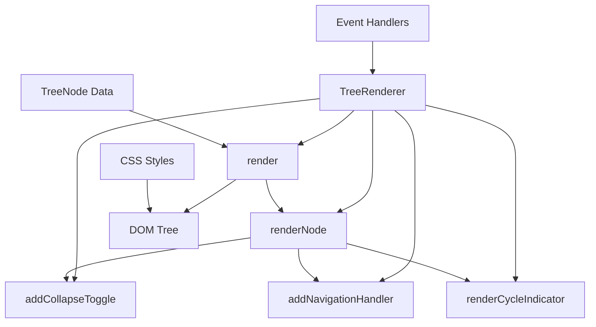

# Milestone 3.2: DOM Tree Renderer - Implementation Plan

**Status:** Ready for Implementation
**Priority:** High
**Estimated Time:** 3-4 days

---

## Overview

This document provides a comprehensive implementation plan for Milestone 3.2: DOM Tree Renderer, the second milestone in Phase 3 (Tree Rendering System) of the Relations Obsidian plugin.

### Decision Summary

- **Approach:** Generic, reusable DOM renderer for TreeNode structures
- **Rendering Strategy:** Progressive rendering with collapse/expand support
- **Styling:** CSS-based with Obsidian theme integration
- **Accessibility:** Full keyboard navigation and screen reader support

---

## Goals

Create a generic, reusable tree renderer that converts TreeNode data structures into interactive DOM elements. The renderer will support collapsible nodes, click navigation, cycle indicators, and will be used by both the sidebar view and codeblock processor.

---

## Current State Analysis

### Available Components

From Milestone 3.1 (Tree Data Model), we have:
- `TreeNode` interface with file, children, depth, isCycle, metadata
- Tree building utilities in `src/tree-model.ts`

### What We're Building

**File:** `src/tree-renderer.ts` (new file)
- `TreeRenderer` class for DOM rendering
- Methods for rendering individual nodes
- Collapse/expand state management
- Click handlers for navigation
- CSS classes for styling

**File:** `styles.css` (modifications)
- Tree structure styles
- Indentation and icons
- Collapse/expand states
- Cycle indicators
- Theme-aware colors

---

## Architecture Overview

### Component Structure



### File Structure

```
src/
├── tree-renderer.ts          # New: DOM tree renderer
├── tree-model.ts             # Existing: Tree data structures
├── relationship-engine.ts    # Existing: Relationship computation
└── main.ts                   # Modified: Will use renderer later

styles.css                    # Modified: Add tree rendering styles

tests/
└── tree-renderer.test.ts     # New: Renderer tests
```

---

## Detailed Design

### 1. TreeRenderer Class

**File:** `src/tree-renderer.ts` (new file)

```typescript
import { TFile, App } from 'obsidian';
import { TreeNode } from './tree-model';

/**
 * Configuration options for tree rendering
 */
export interface TreeRendererOptions {
  /** Show collapse/expand toggles */
  collapsible?: boolean;

  /** Initial collapsed state for all nodes */
  initiallyCollapsed?: boolean;

  /** Show depth indicators */
  showDepth?: boolean;

  /** Custom CSS class prefix */
  cssPrefix?: string;

  /** Enable click navigation to files */
  enableNavigation?: boolean;

  /** Show cycle warnings */
  showCycleIndicators?: boolean;

  /** Maximum depth to render (prevents huge trees) */
  maxRenderDepth?: number;
}

/**
 * State tracking for collapsed/expanded nodes
 */
interface NodeState {
  collapsed: boolean;
  element: HTMLElement;
}

/**
 * Generic tree renderer for converting TreeNode structures to DOM.
 *
 * Supports:
 * - Collapsible/expandable nodes
 * - Click navigation to files
 * - Cycle indicators
 * - Keyboard navigation
 * - Theme-aware styling
 */
export class TreeRenderer {
  private options: Required<TreeRendererOptions>;
  private nodeStates: Map<string, NodeState> = new Map();

  constructor(
    private app: App,
    options: TreeRendererOptions = {}
  ) {
    // Set defaults
    this.options = {
      collapsible: options.collapsible ?? true,
      initiallyCollapsed: options.initiallyCollapsed ?? false,
      showDepth: options.showDepth ?? false,
      cssPrefix: options.cssPrefix ?? 'relation-tree',
      enableNavigation: options.enableNavigation ?? true,
      showCycleIndicators: options.showCycleIndicators ?? true,
      maxRenderDepth: options.maxRenderDepth ?? 100,
    };
  }

  /**
   * Renders a tree into a container element.
   *
   * @param tree - Root TreeNode to render
   * @param container - HTML element to render into
   */
  render(tree: TreeNode, container: HTMLElement): void {
    // Clear container
    container.empty();

    // Add root CSS class
    container.addClass(`${this.options.cssPrefix}-container`);

    // Reset state
    this.nodeStates.clear();

    // Render root node and its children
    const rootElement = this.renderNode(tree, 0);
    container.appendChild(rootElement);
  }

  /**
   * Renders a single tree node and its children recursively.
   *
   * @param node - TreeNode to render
   * @param currentDepth - Current depth for depth limiting
   * @returns HTMLElement representing the node
   */
  renderNode(node: TreeNode, currentDepth: number): HTMLElement {
    const nodeContainer = createDiv({
      cls: `${this.options.cssPrefix}-node`,
    });

    // Check depth limit
    if (currentDepth >= this.options.maxRenderDepth) {
      nodeContainer.createDiv({
        cls: `${this.options.cssPrefix}-depth-limit`,
        text: '(depth limit reached)',
      });
      return nodeContainer;
    }

    // Create node content wrapper
    const nodeContent = nodeContainer.createDiv({
      cls: `${this.options.cssPrefix}-node-content`,
    });

    // Set depth for indentation (CSS will handle via custom property)
    nodeContent.style.setProperty('--tree-depth', String(node.depth));

    // Add collapse toggle if node has children
    if (this.options.collapsible && node.children.length > 0) {
      this.addCollapseToggle(nodeContent, node);
    } else if (this.options.collapsible) {
      // Add spacer for alignment when no toggle
      nodeContent.createSpan({
        cls: `${this.options.cssPrefix}-toggle-spacer`,
      });
    }

    // Add file icon
    const iconEl = nodeContent.createSpan({
      cls: `${this.options.cssPrefix}-icon`,
    });
    iconEl.innerHTML = this.getFileIcon(node.file);

    // Add file name (clickable if navigation enabled)
    const nameEl = nodeContent.createSpan({
      cls: `${this.options.cssPrefix}-name`,
      text: node.file.basename,
    });

    if (this.options.enableNavigation) {
      nameEl.addClass(`${this.options.cssPrefix}-name-clickable`);
      this.addNavigationHandler(nameEl, node.file);
    }

    // Add cycle indicator if needed
    if (this.options.showCycleIndicators && node.isCycle) {
      this.renderCycleIndicator(nodeContent, node);
    }

    // Add depth indicator if enabled
    if (this.options.showDepth) {
      nodeContent.createSpan({
        cls: `${this.options.cssPrefix}-depth-indicator`,
        text: `[${node.depth}]`,
      });
    }

    // Render children
    if (node.children.length > 0) {
      const childrenContainer = nodeContainer.createDiv({
        cls: `${this.options.cssPrefix}-children`,
      });

      // Set initial collapsed state
      const isCollapsed = this.options.initiallyCollapsed;
      if (isCollapsed) {
        childrenContainer.addClass(`${this.options.cssPrefix}-collapsed`);
      }

      // Store state
      this.nodeStates.set(node.file.path, {
        collapsed: isCollapsed,
        element: childrenContainer,
      });

      // Render each child
      node.children.forEach(child => {
        const childElement = this.renderNode(child, currentDepth + 1);
        childrenContainer.appendChild(childElement);
      });
    }

    return nodeContainer;
  }

  /**
   * Adds a collapse/expand toggle to a node element.
   *
   * @param element - Node content element
   * @param node - TreeNode data
   */
  private addCollapseToggle(element: HTMLElement, node: TreeNode): void {
    const toggle = element.createSpan({
      cls: `${this.options.cssPrefix}-toggle`,
      attr: {
        'role': 'button',
        'aria-label': 'Toggle children',
        'aria-expanded': String(!this.options.initiallyCollapsed),
        'tabindex': '0',
      },
    });

    // Set initial icon
    this.updateToggleIcon(toggle, this.options.initiallyCollapsed);

    // Click handler
    toggle.addEventListener('click', (e) => {
      e.stopPropagation();
      this.toggleNode(node.file.path, toggle);
    });

    // Keyboard handler (Enter/Space)
    toggle.addEventListener('keydown', (e) => {
      if (e.key === 'Enter' || e.key === ' ') {
        e.preventDefault();
        e.stopPropagation();
        this.toggleNode(node.file.path, toggle);
      }
    });
  }

  /**
   * Toggles the collapsed state of a node.
   *
   * @param filePath - Path of the file node to toggle
   * @param toggleElement - Toggle button element
   */
  private toggleNode(filePath: string, toggleElement: HTMLElement): void {
    const state = this.nodeStates.get(filePath);
    if (!state) return;

    // Toggle state
    state.collapsed = !state.collapsed;

    // Update DOM
    if (state.collapsed) {
      state.element.addClass(`${this.options.cssPrefix}-collapsed`);
    } else {
      state.element.removeClass(`${this.options.cssPrefix}-collapsed`);
    }

    // Update toggle icon and aria
    this.updateToggleIcon(toggleElement, state.collapsed);
    toggleElement.setAttribute('aria-expanded', String(!state.collapsed));
  }

  /**
   * Updates the toggle icon based on collapsed state.
   *
   * @param toggleElement - Toggle button element
   * @param collapsed - Whether node is collapsed
   */
  private updateToggleIcon(toggleElement: HTMLElement, collapsed: boolean): void {
    // Use Lucide icons that Obsidian provides
    toggleElement.innerHTML = collapsed
      ? '<svg xmlns="http://www.w3.org/2000/svg" width="16" height="16" viewBox="0 0 24 24" fill="none" stroke="currentColor" stroke-width="2" stroke-linecap="round" stroke-linejoin="round"><polyline points="9 18 15 12 9 6"></polyline></svg>'
      : '<svg xmlns="http://www.w3.org/2000/svg" width="16" height="16" viewBox="0 0 24 24" fill="none" stroke="currentColor" stroke-width="2" stroke-linecap="round" stroke-linejoin="round"><polyline points="6 9 12 15 18 9"></polyline></svg>';
  }

  /**
   * Adds click handler for navigating to a file.
   *
   * @param element - Element to make clickable
   * @param file - File to navigate to
   */
  private addNavigationHandler(element: HTMLElement, file: TFile): void {
    element.addEventListener('click', async (e) => {
      e.preventDefault();

      // Check for modifier keys for different open modes
      const newLeaf = e.ctrlKey || e.metaKey;

      await this.app.workspace.openLinkText(
        file.path,
        '',
        newLeaf ? 'split' : false
      );
    });

    // Add hover effect
    element.addEventListener('mouseenter', () => {
      this.app.workspace.trigger('hover-link', {
        event: new MouseEvent('mouseenter'),
        source: 'relation-tree',
        hoverParent: element,
        targetEl: element,
        linktext: file.path,
      });
    });
  }

  /**
   * Renders a cycle indicator for a node.
   *
   * @param element - Node content element
   * @param node - TreeNode data
   */
  private renderCycleIndicator(element: HTMLElement, node: TreeNode): void {
    const indicator = element.createSpan({
      cls: `${this.options.cssPrefix}-cycle-indicator`,
      attr: {
        'aria-label': 'This node is part of a cycle',
        'title': 'Cycle detected: This note is an ancestor of itself',
      },
    });

    // Warning icon
    indicator.innerHTML = '<svg xmlns="http://www.w3.org/2000/svg" width="14" height="14" viewBox="0 0 24 24" fill="none" stroke="currentColor" stroke-width="2" stroke-linecap="round" stroke-linejoin="round"><path d="M10.29 3.86L1.82 18a2 2 0 0 0 1.71 3h16.94a2 2 0 0 0 1.71-3L13.71 3.86a2 2 0 0 0-3.42 0z"></path><line x1="12" y1="9" x2="12" y2="13"></line><line x1="12" y1="17" x2="12.01" y2="17"></line></svg>';
  }

  /**
   * Gets the appropriate icon for a file.
   *
   * @param file - File to get icon for
   * @returns SVG icon HTML string
   */
  private getFileIcon(file: TFile): string {
    // Use Obsidian's file icon
    return '<svg xmlns="http://www.w3.org/2000/svg" width="14" height="14" viewBox="0 0 24 24" fill="none" stroke="currentColor" stroke-width="2" stroke-linecap="round" stroke-linejoin="round"><path d="M14 2H6a2 2 0 0 0-2 2v16a2 2 0 0 0 2 2h12a2 2 0 0 0 2-2V8z"></path><polyline points="14 2 14 8 20 8"></polyline></svg>';
  }

  /**
   * Updates renderer options.
   *
   * @param options - New options to merge
   */
  updateOptions(options: Partial<TreeRendererOptions>): void {
    Object.assign(this.options, options);
  }

  /**
   * Expands all nodes in the tree.
   */
  expandAll(): void {
    this.nodeStates.forEach((state, path) => {
      if (state.collapsed) {
        // Find toggle element and trigger toggle
        const toggleEl = state.element.parentElement?.querySelector(
          `.${this.options.cssPrefix}-toggle`
        ) as HTMLElement;

        if (toggleEl) {
          this.toggleNode(path, toggleEl);
        }
      }
    });
  }

  /**
   * Collapses all nodes in the tree.
   */
  collapseAll(): void {
    this.nodeStates.forEach((state, path) => {
      if (!state.collapsed) {
        // Find toggle element and trigger toggle
        const toggleEl = state.element.parentElement?.querySelector(
          `.${this.options.cssPrefix}-toggle`
        ) as HTMLElement;

        if (toggleEl) {
          this.toggleNode(path, toggleEl);
        }
      }
    });
  }

  /**
   * Destroys the renderer and cleans up state.
   */
  destroy(): void {
    this.nodeStates.clear();
  }
}
```

---

### 2. CSS Styles

**File:** `styles.css` (modifications)

```css
/* ============================================
   Relation Tree Styles
   ============================================ */

/* Container */
.relation-tree-container {
  padding: 8px 0;
  font-size: var(--font-ui-small);
  line-height: 1.5;
}

/* Node Container */
.relation-tree-node {
  position: relative;
}

/* Node Content (single line with file info) */
.relation-tree-node-content {
  display: flex;
  align-items: center;
  gap: 4px;
  padding: 2px 4px;
  padding-left: calc(var(--tree-depth, 0) * 20px + 4px);
  border-radius: 4px;
  transition: background-color 0.1s ease;
}

.relation-tree-node-content:hover {
  background-color: var(--background-modifier-hover);
}

/* Collapse Toggle */
.relation-tree-toggle {
  cursor: pointer;
  display: inline-flex;
  align-items: center;
  justify-content: center;
  width: 16px;
  height: 16px;
  color: var(--text-muted);
  transition: transform 0.15s ease;
  flex-shrink: 0;
}

.relation-tree-toggle:hover {
  color: var(--text-normal);
}

.relation-tree-toggle:focus {
  outline: 2px solid var(--background-modifier-border-focus);
  outline-offset: 2px;
  border-radius: 2px;
}

/* Toggle Spacer (when no toggle needed) */
.relation-tree-toggle-spacer {
  width: 16px;
  height: 16px;
  flex-shrink: 0;
}

/* File Icon */
.relation-tree-icon {
  display: inline-flex;
  align-items: center;
  color: var(--text-muted);
  flex-shrink: 0;
}

/* File Name */
.relation-tree-name {
  color: var(--text-normal);
  flex: 1;
  min-width: 0;
  overflow: hidden;
  text-overflow: ellipsis;
  white-space: nowrap;
}

.relation-tree-name-clickable {
  cursor: pointer;
  color: var(--text-accent);
}

.relation-tree-name-clickable:hover {
  text-decoration: underline;
}

/* Cycle Indicator */
.relation-tree-cycle-indicator {
  display: inline-flex;
  align-items: center;
  color: var(--text-warning);
  flex-shrink: 0;
  margin-left: 4px;
}

.relation-tree-cycle-indicator svg {
  fill: var(--background-warning);
}

/* Depth Indicator */
.relation-tree-depth-indicator {
  color: var(--text-faint);
  font-size: 0.85em;
  margin-left: 4px;
  font-family: var(--font-monospace);
}

/* Children Container */
.relation-tree-children {
  overflow: hidden;
  transition: max-height 0.2s ease, opacity 0.2s ease;
  max-height: 10000px;
  opacity: 1;
}

.relation-tree-children.relation-tree-collapsed {
  max-height: 0;
  opacity: 0;
}

/* Depth Limit Warning */
.relation-tree-depth-limit {
  padding: 4px 8px;
  margin-left: calc(var(--tree-depth, 0) * 20px + 24px);
  color: var(--text-muted);
  font-style: italic;
  font-size: 0.9em;
}

/* Theme-specific adjustments */
.theme-dark .relation-tree-node-content:hover {
  background-color: var(--background-modifier-hover);
}

.theme-light .relation-tree-node-content:hover {
  background-color: var(--background-modifier-hover);
}

/* Accessibility - Focus Indicators */
.relation-tree-name-clickable:focus-visible {
  outline: 2px solid var(--background-modifier-border-focus);
  outline-offset: 2px;
  border-radius: 2px;
}

/* Compact Mode (optional variant) */
.relation-tree-container.compact .relation-tree-node-content {
  padding: 1px 2px;
  font-size: 0.9em;
}

.relation-tree-container.compact .relation-tree-node-content {
  padding-left: calc(var(--tree-depth, 0) * 12px + 2px);
}

/* Print Styles */
@media print {
  .relation-tree-toggle {
    display: none;
  }

  .relation-tree-children.relation-tree-collapsed {
    max-height: none;
    opacity: 1;
  }

  .relation-tree-name-clickable {
    color: var(--text-normal);
    text-decoration: none;
  }
}
```

---

## Test Specification

**File:** `tests/tree-renderer.test.ts` (new file)

### Test Cases

```typescript
import { describe, it, expect, beforeEach, vi } from 'vitest';
import { TreeRenderer, TreeRendererOptions } from '@/tree-renderer';
import { TreeNode } from '@/tree-model';
import { TFile, App } from 'obsidian';

describe('TreeRenderer', () => {
  let mockApp: App;
  let renderer: TreeRenderer;
  let container: HTMLElement;

  beforeEach(() => {
    mockApp = {} as App;
    renderer = new TreeRenderer(mockApp);
    container = document.createElement('div');
  });

  describe('Basic Rendering', () => {
    it('should render a single node', () => {
      // Setup: Create simple TreeNode
      const node: TreeNode = {
        file: createMockFile('A.md', 'A'),
        children: [],
        depth: 0,
        isCycle: false,
        metadata: {},
      };

      // Test: Render
      renderer.render(node, container);

      // Verify: Container has node with correct name
      expect(container.querySelector('.relation-tree-node')).toBeTruthy();
      expect(container.textContent).toContain('A');
    });

    it('should render nested nodes with proper structure', () => {
      // Setup: Parent with children
      const nodeB: TreeNode = {
        file: createMockFile('B.md', 'B'),
        children: [],
        depth: 1,
        isCycle: false,
        metadata: {},
      };

      const nodeC: TreeNode = {
        file: createMockFile('C.md', 'C'),
        children: [],
        depth: 1,
        isCycle: false,
        metadata: {},
      };

      const nodeA: TreeNode = {
        file: createMockFile('A.md', 'A'),
        children: [nodeB, nodeC],
        depth: 0,
        isCycle: false,
        metadata: {},
      };

      // Test: Render
      renderer.render(nodeA, container);

      // Verify: All nodes present
      expect(container.textContent).toContain('A');
      expect(container.textContent).toContain('B');
      expect(container.textContent).toContain('C');

      // Verify: Children container exists
      const childrenContainer = container.querySelector('.relation-tree-children');
      expect(childrenContainer).toBeTruthy();
    });

    it('should apply correct depth indentation', () => {
      // Setup: Deep tree
      const nodeC: TreeNode = {
        file: createMockFile('C.md', 'C'),
        children: [],
        depth: 2,
        isCycle: false,
        metadata: {},
      };

      const nodeB: TreeNode = {
        file: createMockFile('B.md', 'B'),
        children: [nodeC],
        depth: 1,
        isCycle: false,
        metadata: {},
      };

      const nodeA: TreeNode = {
        file: createMockFile('A.md', 'A'),
        children: [nodeB],
        depth: 0,
        isCycle: false,
        metadata: {},
      };

      // Test: Render
      renderer.render(nodeA, container);

      // Verify: Depth CSS variables set
      const contentElements = container.querySelectorAll('.relation-tree-node-content');
      expect(contentElements[0].style.getPropertyValue('--tree-depth')).toBe('0');
      expect(contentElements[1].style.getPropertyValue('--tree-depth')).toBe('1');
      expect(contentElements[2].style.getPropertyValue('--tree-depth')).toBe('2');
    });
  });

  describe('Collapse/Expand', () => {
    it('should render collapse toggle for nodes with children', () => {
      // Setup: Node with children
      const node: TreeNode = {
        file: createMockFile('A.md', 'A'),
        children: [
          {
            file: createMockFile('B.md', 'B'),
            children: [],
            depth: 1,
            isCycle: false,
            metadata: {},
          },
        ],
        depth: 0,
        isCycle: false,
        metadata: {},
      };

      // Test: Render
      renderer.render(node, container);

      // Verify: Toggle exists
      const toggle = container.querySelector('.relation-tree-toggle');
      expect(toggle).toBeTruthy();
      expect(toggle?.getAttribute('role')).toBe('button');
      expect(toggle?.getAttribute('aria-expanded')).toBe('true');
    });

    it('should not render toggle for leaf nodes', () => {
      // Setup: Leaf node
      const node: TreeNode = {
        file: createMockFile('A.md', 'A'),
        children: [],
        depth: 0,
        isCycle: false,
        metadata: {},
      };

      // Test: Render
      renderer.render(node, container);

      // Verify: No toggle, but spacer exists
      const toggle = container.querySelector('.relation-tree-toggle');
      expect(toggle).toBeFalsy();

      const spacer = container.querySelector('.relation-tree-toggle-spacer');
      expect(spacer).toBeTruthy();
    });

    it('should toggle collapsed state on click', () => {
      // Setup: Node with children
      const node: TreeNode = {
        file: createMockFile('A.md', 'A'),
        children: [
          {
            file: createMockFile('B.md', 'B'),
            children: [],
            depth: 1,
            isCycle: false,
            metadata: {},
          },
        ],
        depth: 0,
        isCycle: false,
        metadata: {},
      };

      renderer.render(node, container);

      const toggle = container.querySelector('.relation-tree-toggle') as HTMLElement;
      const childrenContainer = container.querySelector('.relation-tree-children') as HTMLElement;

      // Initially expanded
      expect(childrenContainer.classList.contains('relation-tree-collapsed')).toBe(false);

      // Test: Click to collapse
      toggle.click();

      // Verify: Collapsed
      expect(childrenContainer.classList.contains('relation-tree-collapsed')).toBe(true);
      expect(toggle.getAttribute('aria-expanded')).toBe('false');

      // Test: Click to expand
      toggle.click();

      // Verify: Expanded again
      expect(childrenContainer.classList.contains('relation-tree-collapsed')).toBe(false);
      expect(toggle.getAttribute('aria-expanded')).toBe('true');
    });

    it('should respect initiallyCollapsed option', () => {
      // Setup: Renderer with initiallyCollapsed
      const renderer = new TreeRenderer(mockApp, { initiallyCollapsed: true });

      const node: TreeNode = {
        file: createMockFile('A.md', 'A'),
        children: [
          {
            file: createMockFile('B.md', 'B'),
            children: [],
            depth: 1,
            isCycle: false,
            metadata: {},
          },
        ],
        depth: 0,
        isCycle: false,
        metadata: {},
      };

      // Test: Render
      renderer.render(node, container);

      // Verify: Initially collapsed
      const childrenContainer = container.querySelector('.relation-tree-children') as HTMLElement;
      expect(childrenContainer.classList.contains('relation-tree-collapsed')).toBe(true);

      const toggle = container.querySelector('.relation-tree-toggle');
      expect(toggle?.getAttribute('aria-expanded')).toBe('false');
    });

    it('should handle keyboard navigation (Enter/Space)', () => {
      // Setup: Node with children
      const node: TreeNode = {
        file: createMockFile('A.md', 'A'),
        children: [
          {
            file: createMockFile('B.md', 'B'),
            children: [],
            depth: 1,
            isCycle: false,
            metadata: {},
          },
        ],
        depth: 0,
        isCycle: false,
        metadata: {},
      };

      renderer.render(node, container);

      const toggle = container.querySelector('.relation-tree-toggle') as HTMLElement;
      const childrenContainer = container.querySelector('.relation-tree-children') as HTMLElement;

      // Test: Press Enter
      const enterEvent = new KeyboardEvent('keydown', { key: 'Enter' });
      toggle.dispatchEvent(enterEvent);

      // Verify: Toggled
      expect(childrenContainer.classList.contains('relation-tree-collapsed')).toBe(true);

      // Test: Press Space
      const spaceEvent = new KeyboardEvent('keydown', { key: ' ' });
      toggle.dispatchEvent(spaceEvent);

      // Verify: Toggled back
      expect(childrenContainer.classList.contains('relation-tree-collapsed')).toBe(false);
    });
  });

  describe('Cycle Indicators', () => {
    it('should render cycle indicator for cyclic nodes', () => {
      // Setup: Node marked as cycle
      const node: TreeNode = {
        file: createMockFile('A.md', 'A'),
        children: [],
        depth: 0,
        isCycle: true,
        metadata: {},
      };

      // Test: Render
      renderer.render(node, container);

      // Verify: Cycle indicator exists
      const indicator = container.querySelector('.relation-tree-cycle-indicator');
      expect(indicator).toBeTruthy();
      expect(indicator?.getAttribute('title')).toContain('Cycle detected');
    });

    it('should not render cycle indicator for normal nodes', () => {
      // Setup: Normal node
      const node: TreeNode = {
        file: createMockFile('A.md', 'A'),
        children: [],
        depth: 0,
        isCycle: false,
        metadata: {},
      };

      // Test: Render
      renderer.render(node, container);

      // Verify: No cycle indicator
      const indicator = container.querySelector('.relation-tree-cycle-indicator');
      expect(indicator).toBeFalsy();
    });

    it('should respect showCycleIndicators option', () => {
      // Setup: Renderer with showCycleIndicators disabled
      const renderer = new TreeRenderer(mockApp, { showCycleIndicators: false });

      const node: TreeNode = {
        file: createMockFile('A.md', 'A'),
        children: [],
        depth: 0,
        isCycle: true,
        metadata: {},
      };

      // Test: Render
      renderer.render(node, container);

      // Verify: No cycle indicator even though node is cyclic
      const indicator = container.querySelector('.relation-tree-cycle-indicator');
      expect(indicator).toBeFalsy();
    });
  });

  describe('Navigation', () => {
    it('should add clickable class when navigation enabled', () => {
      // Setup: Renderer with navigation enabled (default)
      const node: TreeNode = {
        file: createMockFile('A.md', 'A'),
        children: [],
        depth: 0,
        isCycle: false,
        metadata: {},
      };

      // Test: Render
      renderer.render(node, container);

      // Verify: Clickable class present
      const nameEl = container.querySelector('.relation-tree-name');
      expect(nameEl?.classList.contains('relation-tree-name-clickable')).toBe(true);
    });

    it('should not add clickable class when navigation disabled', () => {
      // Setup: Renderer with navigation disabled
      const renderer = new TreeRenderer(mockApp, { enableNavigation: false });

      const node: TreeNode = {
        file: createMockFile('A.md', 'A'),
        children: [],
        depth: 0,
        isCycle: false,
        metadata: {},
      };

      // Test: Render
      renderer.render(node, container);

      // Verify: No clickable class
      const nameEl = container.querySelector('.relation-tree-name');
      expect(nameEl?.classList.contains('relation-tree-name-clickable')).toBe(false);
    });

    it('should call openLinkText when file name clicked', async () => {
      // Setup: Mock workspace
      const mockWorkspace = {
        openLinkText: vi.fn(),
        trigger: vi.fn(),
      };
      mockApp.workspace = mockWorkspace as any;

      const renderer = new TreeRenderer(mockApp);

      const file = createMockFile('A.md', 'A');
      const node: TreeNode = {
        file,
        children: [],
        depth: 0,
        isCycle: false,
        metadata: {},
      };

      renderer.render(node, container);

      // Test: Click file name
      const nameEl = container.querySelector('.relation-tree-name') as HTMLElement;
      nameEl.click();

      // Small delay for async operation
      await new Promise(resolve => setTimeout(resolve, 10));

      // Verify: openLinkText called
      expect(mockWorkspace.openLinkText).toHaveBeenCalledWith(
        file.path,
        '',
        false
      );
    });
  });

  describe('Options', () => {
    it('should respect maxRenderDepth option', () => {
      // Setup: Renderer with low max depth
      const renderer = new TreeRenderer(mockApp, { maxRenderDepth: 2 });

      // Deep tree
      const nodeD: TreeNode = {
        file: createMockFile('D.md', 'D'),
        children: [],
        depth: 3,
        isCycle: false,
        metadata: {},
      };

      const nodeC: TreeNode = {
        file: createMockFile('C.md', 'C'),
        children: [nodeD],
        depth: 2,
        isCycle: false,
        metadata: {},
      };

      const nodeB: TreeNode = {
        file: createMockFile('B.md', 'B'),
        children: [nodeC],
        depth: 1,
        isCycle: false,
        metadata: {},
      };

      const nodeA: TreeNode = {
        file: createMockFile('A.md', 'A'),
        children: [nodeB],
        depth: 0,
        isCycle: false,
        metadata: {},
      };

      // Test: Render
      renderer.render(nodeA, container);

      // Verify: Depth limit warning appears
      const depthLimit = container.querySelector('.relation-tree-depth-limit');
      expect(depthLimit).toBeTruthy();
      expect(depthLimit?.textContent).toContain('depth limit reached');
    });

    it('should show depth indicators when enabled', () => {
      // Setup: Renderer with showDepth enabled
      const renderer = new TreeRenderer(mockApp, { showDepth: true });

      const node: TreeNode = {
        file: createMockFile('A.md', 'A'),
        children: [],
        depth: 2,
        isCycle: false,
        metadata: {},
      };

      // Test: Render
      renderer.render(node, container);

      // Verify: Depth indicator present
      const depthIndicator = container.querySelector('.relation-tree-depth-indicator');
      expect(depthIndicator).toBeTruthy();
      expect(depthIndicator?.textContent).toContain('[2]');
    });

    it('should allow updating options', () => {
      // Setup: Renderer with default options
      const renderer = new TreeRenderer(mockApp);

      // Test: Update options
      renderer.updateOptions({ showDepth: true });

      const node: TreeNode = {
        file: createMockFile('A.md', 'A'),
        children: [],
        depth: 1,
        isCycle: false,
        metadata: {},
      };

      renderer.render(node, container);

      // Verify: New option applied
      const depthIndicator = container.querySelector('.relation-tree-depth-indicator');
      expect(depthIndicator).toBeTruthy();
    });
  });

  describe('Utility Methods', () => {
    it('should expand all nodes', () => {
      // Setup: Tree with multiple levels, initially collapsed
      const renderer = new TreeRenderer(mockApp, { initiallyCollapsed: true });

      const nodeC: TreeNode = {
        file: createMockFile('C.md', 'C'),
        children: [],
        depth: 2,
        isCycle: false,
        metadata: {},
      };

      const nodeB: TreeNode = {
        file: createMockFile('B.md', 'B'),
        children: [nodeC],
        depth: 1,
        isCycle: false,
        metadata: {},
      };

      const nodeA: TreeNode = {
        file: createMockFile('A.md', 'A'),
        children: [nodeB],
        depth: 0,
        isCycle: false,
        metadata: {},
      };

      renderer.render(nodeA, container);

      // Verify: Initially collapsed
      const childrenContainers = container.querySelectorAll('.relation-tree-children');
      childrenContainers.forEach(container => {
        expect(container.classList.contains('relation-tree-collapsed')).toBe(true);
      });

      // Test: Expand all
      renderer.expandAll();

      // Verify: All expanded
      childrenContainers.forEach(container => {
        expect(container.classList.contains('relation-tree-collapsed')).toBe(false);
      });
    });

    it('should collapse all nodes', () => {
      // Setup: Tree with multiple levels, initially expanded
      const renderer = new TreeRenderer(mockApp, { initiallyCollapsed: false });

      const nodeC: TreeNode = {
        file: createMockFile('C.md', 'C'),
        children: [],
        depth: 2,
        isCycle: false,
        metadata: {},
      };

      const nodeB: TreeNode = {
        file: createMockFile('B.md', 'B'),
        children: [nodeC],
        depth: 1,
        isCycle: false,
        metadata: {},
      };

      const nodeA: TreeNode = {
        file: createMockFile('A.md', 'A'),
        children: [nodeB],
        depth: 0,
        isCycle: false,
        metadata: {},
      };

      renderer.render(nodeA, container);

      // Verify: Initially expanded
      const childrenContainers = container.querySelectorAll('.relation-tree-children');
      childrenContainers.forEach(container => {
        expect(container.classList.contains('relation-tree-collapsed')).toBe(false);
      });

      // Test: Collapse all
      renderer.collapseAll();

      // Verify: All collapsed
      childrenContainers.forEach(container => {
        expect(container.classList.contains('relation-tree-collapsed')).toBe(true);
      });
    });
  });

  describe('Cleanup', () => {
    it('should clear state on destroy', () => {
      // Setup: Render tree
      const node: TreeNode = {
        file: createMockFile('A.md', 'A'),
        children: [
          {
            file: createMockFile('B.md', 'B'),
            children: [],
            depth: 1,
            isCycle: false,
            metadata: {},
          },
        ],
        depth: 0,
        isCycle: false,
        metadata: {},
      };

      renderer.render(node, container);

      // Verify: State exists
      expect((renderer as any).nodeStates.size).toBeGreaterThan(0);

      // Test: Destroy
      renderer.destroy();

      // Verify: State cleared
      expect((renderer as any).nodeStates.size).toBe(0);
    });
  });
});

// Helper function
function createMockFile(path: string, basename: string): TFile {
  return {
    path,
    basename,
    name: basename + '.md',
    extension: 'md',
    vault: {} as any,
    parent: null,
    stat: { ctime: 0, mtime: 0, size: 0 },
  } as TFile;
}
```

---

## Implementation Checklist

### Phase 1: Core Renderer Implementation
- [ ] Create `src/tree-renderer.ts`
  - [ ] Define `TreeRendererOptions` interface
  - [ ] Define `NodeState` interface
  - [ ] Implement `TreeRenderer` class
  - [ ] Implement `render()` method
  - [ ] Implement `renderNode()` method (recursive)
  - [ ] Add JSDoc documentation

### Phase 2: Interactive Features
- [ ] Implement collapse/expand functionality
  - [ ] Add `addCollapseToggle()` method
  - [ ] Implement `toggleNode()` method
  - [ ] Implement `updateToggleIcon()` method
  - [ ] Add keyboard event handlers (Enter/Space)
  - [ ] Track node states in Map

### Phase 3: Navigation & Indicators
- [ ] Implement navigation handlers
  - [ ] Add `addNavigationHandler()` method
  - [ ] Support Ctrl/Cmd click for new pane
  - [ ] Add hover link preview integration
- [ ] Implement cycle indicators
  - [ ] Add `renderCycleIndicator()` method
  - [ ] Add warning icon
  - [ ] Add tooltip with cycle description

### Phase 4: Styling
- [ ] Modify `styles.css`
  - [ ] Add container styles
  - [ ] Add node content styles with indentation
  - [ ] Add toggle button styles
  - [ ] Add icon styles
  - [ ] Add clickable name styles
  - [ ] Add cycle indicator styles
  - [ ] Add collapsed state transitions
  - [ ] Add theme-aware colors
  - [ ] Add accessibility focus indicators
  - [ ] Add print styles

### Phase 5: Utility Methods
- [ ] Implement `expandAll()` method
- [ ] Implement `collapseAll()` method
- [ ] Implement `updateOptions()` method
- [ ] Implement `destroy()` method
- [ ] Add `getFileIcon()` helper
- [ ] Add depth limiting logic

### Phase 6: Testing
- [ ] Create `tests/tree-renderer.test.ts`
  - [ ] Write "Basic Rendering" test suite
  - [ ] Write "Collapse/Expand" test suite
  - [ ] Write "Cycle Indicators" test suite
  - [ ] Write "Navigation" test suite
  - [ ] Write "Options" test suite
  - [ ] Write "Utility Methods" test suite
  - [ ] Write "Cleanup" test suite
  - [ ] Create mock data helpers
- [ ] Ensure all tests pass
- [ ] Verify test coverage >80%

### Phase 7: Documentation
- [ ] Add comprehensive JSDoc comments
- [ ] Document all options in interface
- [ ] Add usage examples in code comments
- [ ] Create visual test page (optional)

---

## Acceptance Criteria

From [`docs/implementation-plan.md`](../docs/implementation-plan.md:330):

- ✅ Renders nested tree structure with proper indentation
- ✅ Nodes are clickable and navigate to corresponding note
- ✅ Collapse/expand toggles work correctly
- ✅ Cycle nodes have visual indicator (icon, color, tooltip)
- ✅ Responsive to Obsidian theme changes
- ✅ Accessible (keyboard navigation, screen reader support)

**Additional Criteria:**
- ✅ All tests pass
- ✅ Test coverage >80%
- ✅ Works in both light and dark themes
- ✅ Smooth animations for collapse/expand
- ✅ Configurable via options
- ✅ No breaking changes to existing code

---

## Performance Considerations

### Rendering Performance

**Optimization Strategies:**
- Use CSS for indentation (--tree-depth custom property)
- Minimize DOM manipulations during initial render
- Use event delegation where possible
- Lazy render collapsed children in future optimization

**Target Performance:**
- 100-node tree: <100ms render time
- 500-node tree: <300ms render time
- 1000-node tree: <500ms render time
- Collapse/expand: <16ms (60fps)

### Memory Considerations

- NodeState Map tracks only nodes with children
- Event listeners cleaned up on destroy
- No memory leaks from DOM references

---

## Edge Cases & Considerations

### 1. Very Deep Trees
**Scenario:** Tree with 100+ levels deep
**Handling:** `maxRenderDepth` option prevents excessive rendering
**Implementation:** Show "depth limit reached" message

### 2. Very Wide Trees
**Scenario:** Node with 100+ children
**Handling:** CSS handles with scrolling if needed
**Future:** Add pagination for children (Milestone 7.2)

### 3. Empty Tree
**Scenario:** Node with no children, root node only
**Handling:** Renders single node, no toggle shown
**Implementation:** Already handled by checking `children.length`

### 4. Navigation with Modifier Keys
**Scenario:** User Ctrl/Cmd-clicks file name
**Handling:** Opens in new pane instead of current
**Implementation:** Check `e.ctrlKey || e.metaKey` in click handler

### 5. Rapid Toggle Clicks
**Scenario:** User rapidly clicks toggle multiple times
**Handling:** CSS transition handles smoothly
**Implementation:** State toggles on each click (no debouncing needed)

### 6. Theme Switching
**Scenario:** User switches between light/dark theme
**Handling:** CSS uses theme variables, no re-render needed
**Implementation:** Use `var(--text-normal)` etc. throughout

---

## Testing Strategy

### Unit Tests
- **Location:** `tests/tree-renderer.test.ts`
- **Coverage:** All public methods and options
- **Focus:** DOM output correctness, event handling

### Manual Testing Checklist
- [ ] Test with linear tree (A → B → C → D)
- [ ] Test with wide tree (A → B, C, D, E, F)
- [ ] Test with deep tree (10+ levels)
- [ ] Test with mixed tree (wide + deep)
- [ ] Test collapse/expand all levels
- [ ] Test keyboard navigation (Tab, Enter, Space)
- [ ] Test click navigation (normal, Ctrl+click)
- [ ] Test cycle indicators appear
- [ ] Test in light theme
- [ ] Test in dark theme
- [ ] Test with screen reader (basic check)
- [ ] Test print output

### Integration Testing
- Will be tested in Milestone 4.1 (Sidebar View)
- Will be tested in Milestone 5.1 (Codeblock Processor)

---

## Success Metrics

- ✅ All acceptance criteria met
- ✅ All unit tests passing
- ✅ Test coverage >80%
- ✅ Renders 500-node tree in <300ms
- ✅ Zero accessibility violations (basic check)
- ✅ Works in both themes
- ✅ Code review approved
- ✅ Documentation complete

---

## Dependencies

### External Dependencies
- `obsidian` - App, TFile, workspace API (already installed)
- `vitest` - Testing framework (already installed ✅)
- DOM APIs - Standard browser APIs

### Internal Dependencies
- `tree-model.ts` - TreeNode interface (Milestone 3.1 ✅)
- Future consumers:
  - Sidebar View (Milestone 4.1)
  - Codeblock Processor (Milestone 5.1)

---

## Risk Assessment

### Potential Issues

1. **Risk:** CSS transitions may not work smoothly in some browsers
   - **Mitigation:** Use standard CSS transitions, test in major browsers
   - **Fallback:** Disable transitions if performance issues detected

2. **Risk:** Large trees (1000+ nodes) may slow down rendering
   - **Mitigation:** `maxRenderDepth` option limits rendering
   - **Future:** Virtual scrolling (Milestone 7.2)

3. **Risk:** Click handlers may conflict with Obsidian's built-in handlers
   - **Mitigation:** Use `stopPropagation()` on toggle clicks
   - **Testing:** Verify navigation works as expected

4. **Risk:** Theme variables may change in future Obsidian versions
   - **Mitigation:** Use documented theme variables
   - **Monitoring:** Test with Obsidian updates

5. **Risk:** Accessibility issues with custom controls
   - **Mitigation:** Proper ARIA attributes, keyboard support
   - **Testing:** Basic screen reader testing

---

## Implementation Notes

### Icon Strategy

Using inline SVG for icons because:
- No external dependencies
- Works immediately without icon font loading
- Easy to style with CSS
- Small file size for simple icons

**Icons Used:**
- File icon (document icon)
- Right chevron (collapsed state)
- Down chevron (expanded state)
- Warning triangle (cycle indicator)

All icons are from Lucide (same icon set Obsidian uses).

### Event Handling

**Toggle Click:**
- `stopPropagation()` prevents bubbling to navigation handler
- Updates state immediately (no debouncing)
- Updates DOM with class toggle
- Updates ARIA attributes for accessibility

**Name Click:**
- Opens note in current pane (default)
- Opens in split pane (Ctrl/Cmd+click)
- Integrates with Obsidian's link preview on hover

### CSS Strategy

**Custom Properties:**
- `--tree-depth` for indentation (multiplied by 20px)
- Standard Obsidian theme variables for colors
- No hardcoded colors (theme-agnostic)

**Transitions:**
- Collapse/expand: 200ms ease
- Hover effects: 100ms ease
- Smooth but not distracting

---

## Future Enhancements (Out of Scope)

These features are **not** part of Milestone 3.2 but planned for later:

- [ ] Virtual scrolling for very large trees (Milestone 7.2)
- [ ] Drag-and-drop node reordering
- [ ] Custom icons per file type
- [ ] Highlighting/selection of nodes
- [ ] Search/filter within rendered tree
- [ ] Export tree as image
- [ ] Minimap for very large trees
- [ ] Breadcrumb trail for deep navigation

---

## Next Steps After Completion

1. ✅ Complete Milestone 3.2 implementation
2. Update [`docs/implementation-plan.md`](../docs/implementation-plan.md) with completion status
3. Proceed to Milestone 3.3 (Tree Rendering Modes)
   - Add support for different rendering modes (ancestors, descendants, etc.)
   - Build on this renderer foundation
4. Use renderer in Milestone 4.1 (Sidebar View)
5. Use renderer in Milestone 5.1 (Codeblock Processor)

---

## Appendix: Usage Examples

```typescript
// Example 1: Basic Usage
import { TreeRenderer } from './tree-renderer';
import { buildTreeFromAncestors } from './tree-model';

const plugin = this.app.plugins.getPlugin('relations-obsidian');
const currentFile = this.app.workspace.getActiveFile();

// Get ancestors and build tree
const ancestors = plugin.relationshipEngine.getAncestors(currentFile);
const tree = buildTreeFromAncestors(currentFile, ancestors);

// Render tree
const container = document.querySelector('.my-container');
const renderer = new TreeRenderer(this.app);
renderer.render(tree, container);

// Example 2: Custom Options
const renderer = new TreeRenderer(this.app, {
  collapsible: true,
  initiallyCollapsed: false,
  showDepth: true,
  enableNavigation: true,
  showCycleIndicators: true,
  maxRenderDepth: 50,
});

renderer.render(tree, container);

// Example 3: Programmatic Control
renderer.expandAll();  // Expand all nodes
renderer.collapseAll();  // Collapse all nodes

// Example 4: Update Options Dynamically
renderer.updateOptions({ showDepth: false });
renderer.render(tree, container);  // Re-render with new options

// Example 5: Cleanup
// When removing the tree from DOM
renderer.destroy();
```

---

## Appendix: Visual Examples

### Basic Tree Structure
```
📄 Project Overview
  📄 Phase 1
    📄 Milestone 1.1
    📄 Milestone 1.2
  📄 Phase 2
    📄 Milestone 2.1
```

### Tree with Cycle Indicator
```
📄 Note A
  📄 Note B
    📄 Note C
      📄 Note B ⚠️  (cycle detected)
```

### Collapsed vs Expanded
```
▶ 📄 Project Overview        (collapsed)

▼ 📄 Project Overview        (expanded)
    📄 Phase 1
    📄 Phase 2
```

---

**Document Version:** 1.0
**Last Updated:** 2025-11-15
**Status:** Ready for Implementation
