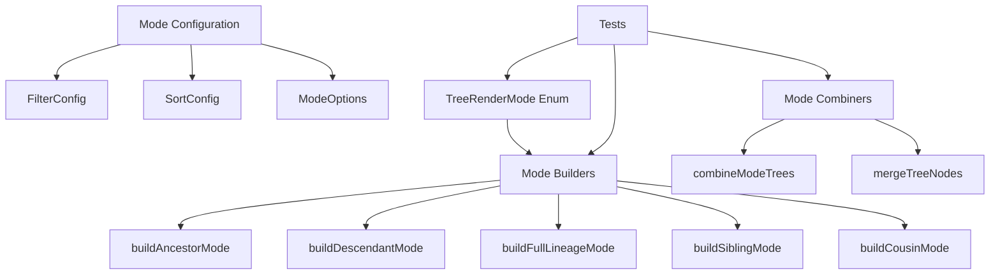

# Milestone 3.3: Tree Rendering Modes - Implementation Plan

**Status:** Ready for Implementation
**Priority:** High
**Estimated Time:** 3-4 days

---

## Overview

This document provides a comprehensive implementation plan for Milestone 3.3: Tree Rendering Modes, the third milestone in Phase 3 (Tree Rendering System) of the Relations Obsidian plugin.

### Decision Summary

- **Approach:** Enum-based mode system with dedicated tree builder for each mode
- **Mode Types:** ANCESTORS, DESCENDANTS, FULL_LINEAGE, SIBLINGS, COUSINS
- **Mode Composition:** Support combining multiple modes (e.g., "ancestors + siblings")
- **Filtering:** Tag-based, folder-based, and custom predicate filters
- **Sorting:** Alphabetical, creation date, modification date, custom comparator
- **Special Features:** "Show path to root" option for descendant trees

---

## Goals

Support different tree visualization modes that allow users to view relationships from multiple perspectives. Each mode should provide a distinct way of visualizing the relationship graph, with options for filtering, sorting, and combining modes to create rich, customized views.

---

## Architecture Overview

### Components to Create



### File Structure

```
src/
├── tree-model.ts              # Existing: Tree data structures
├── tree-render-modes.ts       # New: Rendering mode logic
├── tree-filters.ts            # New: Filtering utilities
├── tree-sorters.ts            # New: Sorting utilities
├── relationship-engine.ts     # Existing: Relationship computation
└── main.ts                    # Modified: Future integration

tests/
├── tree-render-modes.test.ts  # New: Mode tests
├── tree-filters.test.ts       # New: Filter tests
├── tree-sorters.test.ts       # New: Sorter tests
└── tree-model.test.ts         # Existing: Tree model tests
```

---

## Detailed Design

### 1. TreeRenderMode Enum

**File:** `src/tree-render-modes.ts` (new file)

```typescript
import { TFile } from 'obsidian';
import { TreeNode, TreeBuildOptions } from './tree-model';
import { RelationshipEngine } from './relationship-engine';
import { RelationGraph } from './relation-graph';

/**
 * Enumeration of available tree rendering modes.
 */
export enum TreeRenderMode {
	/** Show ancestors (parents, grandparents, etc.) */
	ANCESTORS = 'ancestors',

	/** Show descendants (children, grandchildren, etc.) */
	DESCENDANTS = 'descendants',

	/** Show both ancestors and descendants (full lineage) */
	FULL_LINEAGE = 'full-lineage',

	/** Show siblings (notes sharing same parent) */
	SIBLINGS = 'siblings',

	/** Show cousins (notes sharing same grandparent) */
	COUSINS = 'cousins'
}

/**
 * Configuration for tree rendering modes.
 */
export interface RenderModeConfig {
	/** Primary rendering mode */
	mode: TreeRenderMode;

	/** Additional modes to combine with primary mode */
	additionalModes?: TreeRenderMode[];

	/** Maximum depth for tree traversal */
	maxDepth?: number;

	/** Filter configuration */
	filter?: FilterConfig;

	/** Sort configuration */
	sort?: SortConfig;

	/** Show path to root for descendant trees */
	showPathToRoot?: boolean;

	/** Detect and mark cycles */
	detectCycles?: boolean;

	/** Include rendering metadata */
	includeMetadata?: boolean;

	/** Custom metadata provider */
	metadataProvider?: (file: TFile, depth: number) => Partial<TreeNodeMetadata>;
}

/**
 * Result of building a tree with a specific mode.
 */
export interface ModeTreeResult {
	/** The root node(s) of the tree */
	roots: TreeNode[];

	/** The mode used to build the tree */
	mode: TreeRenderMode;

	/** Total number of nodes in the tree */
	nodeCount: number;

	/** Maximum depth of the tree */
	maxDepth: number;

	/** Whether any cycles were detected */
	hasCycles: boolean;
}
```

**Design Rationale:**

**Why Enum Instead of Strings?**
- Type safety (autocomplete in IDE)
- Prevents typos and invalid modes
- Easy to extend with new modes
- Clear documentation of available modes
- Better for switch statements

**Mode Composition:**
- Primary mode defines the main structure
- Additional modes can be combined (e.g., show ancestors + siblings)
- Combining modes creates richer visualizations
- Each mode contributes its own subtree

**ModeTreeResult:**
- Provides metadata about the built tree
- Useful for UI feedback (e.g., "Showing 47 ancestors")
- Helps with performance monitoring
- Enables conditional rendering based on tree characteristics

---

### 2. Filter Configuration

**File:** `src/tree-filters.ts` (new file)

```typescript
import { TFile } from 'obsidian';

/**
 * Configuration for filtering tree nodes.
 */
export interface FilterConfig {
	/** Filter by tags (include nodes with any of these tags) */
	includeTags?: string[];

	/** Exclude nodes with any of these tags */
	excludeTags?: string[];

	/** Include only nodes in these folders */
	includeFolders?: string[];

	/** Exclude nodes in these folders */
	excludeFolders?: string[];

	/** Custom filter predicate */
	predicate?: (file: TFile) => boolean;

	/** Filter mode: 'and' (all conditions must match) or 'or' (any condition matches) */
	mode?: 'and' | 'or';
}

/**
 * Creates a filter function from a filter configuration.
 *
 * @param config - The filter configuration
 * @param metadataCache - Obsidian's metadata cache for tag lookups
 * @returns Filter function that returns true if file should be included
 */
export function createFilter(
	config: FilterConfig,
	metadataCache: MetadataCache
): (file: TFile) => boolean {
	const filters: ((file: TFile) => boolean)[] = [];

	// Tag inclusion filter
	if (config.includeTags && config.includeTags.length > 0) {
		filters.push((file: TFile) => {
			const cache = metadataCache.getFileCache(file);
			const tags = cache?.tags?.map(t => t.tag) || [];
			const frontmatterTags = cache?.frontmatter?.tags || [];
			const allTags = [...tags, ...frontmatterTags].map(normalizeTag);

			return config.includeTags!.some(tag =>
				allTags.includes(normalizeTag(tag))
			);
		});
	}

	// Tag exclusion filter
	if (config.excludeTags && config.excludeTags.length > 0) {
		filters.push((file: TFile) => {
			const cache = metadataCache.getFileCache(file);
			const tags = cache?.tags?.map(t => t.tag) || [];
			const frontmatterTags = cache?.frontmatter?.tags || [];
			const allTags = [...tags, ...frontmatterTags].map(normalizeTag);

			return !config.excludeTags!.some(tag =>
				allTags.includes(normalizeTag(tag))
			);
		});
	}

	// Folder inclusion filter
	if (config.includeFolders && config.includeFolders.length > 0) {
		filters.push((file: TFile) => {
			return config.includeFolders!.some(folder =>
				file.path.startsWith(folder)
			);
		});
	}

	// Folder exclusion filter
	if (config.excludeFolders && config.excludeFolders.length > 0) {
		filters.push((file: TFile) => {
			return !config.excludeFolders!.some(folder =>
				file.path.startsWith(folder)
			);
		});
	}

	// Custom predicate
	if (config.predicate) {
		filters.push(config.predicate);
	}

	// No filters means include everything
	if (filters.length === 0) {
		return () => true;
	}

	// Combine filters based on mode
	const mode = config.mode || 'and';

	if (mode === 'and') {
		return (file: TFile) => filters.every(f => f(file));
	} else {
		return (file: TFile) => filters.some(f => f(file));
	}
}

/**
 * Normalizes a tag by ensuring it starts with #
 */
function normalizeTag(tag: string): string {
	return tag.startsWith('#') ? tag : `#${tag}`;
}

/**
 * Common filter presets for convenience.
 */
export const FilterPresets = {
	/** Only markdown files */
	markdownOnly: (file: TFile) => file.extension === 'md',

	/** Exclude attachments folder */
	noAttachments: (file: TFile) => !file.path.startsWith('attachments/'),

	/** Exclude templates folder */
	noTemplates: (file: TFile) => !file.path.startsWith('templates/'),

	/** Only files modified in last 7 days */
	recentlyModified: (file: TFile) => {
		const weekAgo = Date.now() - 7 * 24 * 60 * 60 * 1000;
		return file.stat.mtime > weekAgo;
	},

	/** Only files created in last 30 days */
	recentlyCreated: (file: TFile) => {
		const monthAgo = Date.now() - 30 * 24 * 60 * 60 * 1000;
		return file.stat.ctime > monthAgo;
	}
};
```

---

### 3. Sort Configuration

**File:** `src/tree-sorters.ts` (new file)

```typescript
import { TFile } from 'obsidian';
import { TreeNode } from './tree-model';

/**
 * Sort order direction.
 */
export type SortOrder = 'asc' | 'desc';

/**
 * Sort criteria.
 */
export type SortCriteria =
	| 'alphabetical'      // By file basename
	| 'created'           // By creation date
	| 'modified'          // By modification date
	| 'size'              // By file size
	| 'custom';           // Custom comparator

/**
 * Configuration for sorting tree nodes.
 */
export interface SortConfig {
	/** Primary sort criteria */
	criteria: SortCriteria;

	/** Sort order */
	order?: SortOrder;

	/** Custom comparator function (used when criteria is 'custom') */
	comparator?: (a: TFile, b: TFile) => number;

	/** Sort children recursively */
	recursive?: boolean;
}

/**
 * Creates a comparator function from a sort configuration.
 *
 * @param config - The sort configuration
 * @returns Comparator function for TFile objects
 */
export function createComparator(config: SortConfig): (a: TFile, b: TFile) => number {
	const order = config.order || 'asc';
	const multiplier = order === 'asc' ? 1 : -1;

	let baseComparator: (a: TFile, b: TFile) => number;

	switch (config.criteria) {
		case 'alphabetical':
			baseComparator = (a, b) =>
				a.basename.localeCompare(b.basename);
			break;

		case 'created':
			baseComparator = (a, b) =>
				a.stat.ctime - b.stat.ctime;
			break;

		case 'modified':
			baseComparator = (a, b) =>
				a.stat.mtime - b.stat.mtime;
			break;

		case 'size':
			baseComparator = (a, b) =>
				a.stat.size - b.stat.size;
			break;

		case 'custom':
			if (!config.comparator) {
				throw new Error('Custom sort requires a comparator function');
			}
			baseComparator = config.comparator;
			break;

		default:
			baseComparator = (a, b) =>
				a.basename.localeCompare(b.basename);
	}

	return (a, b) => multiplier * baseComparator(a, b);
}

/**
 * Sorts tree nodes in place or returns a sorted copy.
 *
 * @param nodes - Array of tree nodes to sort
 * @param config - Sort configuration
 * @param inPlace - Whether to sort in place or create a copy
 * @returns Sorted array of nodes
 */
export function sortTreeNodes(
	nodes: TreeNode[],
	config: SortConfig,
	inPlace: boolean = false
): TreeNode[] {
	const comparator = createComparator(config);
	const sorted = inPlace ? nodes : [...nodes];

	// Sort by comparing the file property
	sorted.sort((a, b) => comparator(a.file, b.file));

	// Recursively sort children if requested
	if (config.recursive) {
		sorted.forEach(node => {
			if (node.children.length > 0) {
				node.children = sortTreeNodes(node.children, config, inPlace);
			}
		});
	}

	return sorted;
}

/**
 * Common sort presets for convenience.
 */
export const SortPresets = {
	/** Alphabetical A-Z */
	alphabetical: { criteria: 'alphabetical' as SortCriteria, order: 'asc' as SortOrder },

	/** Alphabetical Z-A */
	alphabeticalReverse: { criteria: 'alphabetical' as SortCriteria, order: 'desc' as SortOrder },

	/** Newest first */
	newestFirst: { criteria: 'modified' as SortCriteria, order: 'desc' as SortOrder },

	/** Oldest first */
	oldestFirst: { criteria: 'modified' as SortCriteria, order: 'asc' as SortOrder },

	/** Recently created */
	recentlyCreated: { criteria: 'created' as SortCriteria, order: 'desc' as SortOrder },

	/** Largest first */
	largestFirst: { criteria: 'size' as SortCriteria, order: 'desc' as SortOrder }
};
```

---

### 4. Mode-Specific Tree Builders

**File:** `src/tree-render-modes.ts` (continued)

```typescript
/**
 * Builds a tree using the specified rendering mode.
 *
 * @param file - The file to build the tree from
 * @param config - Rendering mode configuration
 * @param engine - The relationship engine
 * @param graph - The relation graph
 * @param metadataCache - Obsidian's metadata cache
 * @returns Mode tree result with root nodes
 */
export function buildModeTree(
	file: TFile,
	config: RenderModeConfig,
	engine: RelationshipEngine,
	graph: RelationGraph,
	metadataCache: MetadataCache
): ModeTreeResult {
	// Create filter function
	const filterFn = config.filter
		? createFilter(config.filter, metadataCache)
		: undefined;

	// Build tree options
	const buildOptions: TreeBuildOptions = {
		maxDepth: config.maxDepth,
		detectCycles: config.detectCycles ?? true,
		includeMetadata: config.includeMetadata ?? true,
		filter: filterFn,
		metadataProvider: config.metadataProvider
	};

	// Build primary mode tree
	let roots: TreeNode[];

	switch (config.mode) {
		case TreeRenderMode.ANCESTORS:
			roots = [buildAncestorModeTree(file, engine, graph, buildOptions)];
			break;

		case TreeRenderMode.DESCENDANTS:
			roots = [buildDescendantModeTree(file, engine, graph, buildOptions, config.showPathToRoot)];
			break;

		case TreeRenderMode.FULL_LINEAGE:
			roots = [buildFullLineageModeTree(file, engine, graph, buildOptions)];
			break;

		case TreeRenderMode.SIBLINGS:
			roots = buildSiblingModeTree(file, engine, graph, buildOptions);
			break;

		case TreeRenderMode.COUSINS:
			roots = buildCousinModeTree(file, engine, graph, buildOptions);
			break;

		default:
			throw new Error(`Unknown render mode: ${config.mode}`);
	}

	// Combine with additional modes if specified
	if (config.additionalModes && config.additionalModes.length > 0) {
		for (const additionalMode of config.additionalModes) {
			const additionalConfig = { ...config, mode: additionalMode, additionalModes: undefined };
			const additionalResult = buildModeTree(file, additionalConfig, engine, graph, metadataCache);
			roots = combineTreeRoots(roots, additionalResult.roots);
		}
	}

	// Apply sorting if configured
	if (config.sort) {
		roots = sortTreeNodes(roots, config.sort);
	}

	// Calculate result metadata
	const nodeCount = roots.reduce((sum, root) => sum + countTreeNodes(root), 0);
	const maxDepth = roots.reduce((max, root) => Math.max(max, calculateTreeDepth(root)), 0);
	const hasCycles = roots.some(root => treeHasCycles(root));

	return {
		roots,
		mode: config.mode,
		nodeCount,
		maxDepth,
		hasCycles
	};
}

/**
 * Builds an ancestor mode tree.
 * Shows ancestors as a hierarchical tree.
 */
function buildAncestorModeTree(
	file: TFile,
	engine: RelationshipEngine,
	graph: RelationGraph,
	options: TreeBuildOptions
): TreeNode {
	return buildAncestorTree(file, engine, graph, options);
}

/**
 * Builds a descendant mode tree.
 * Shows descendants as a hierarchical tree.
 * Optionally shows path to root for context.
 */
function buildDescendantModeTree(
	file: TFile,
	engine: RelationshipEngine,
	graph: RelationGraph,
	options: TreeBuildOptions,
	showPathToRoot: boolean = false
): TreeNode {
	const tree = buildDescendantTree(file, engine, graph, options);

	if (showPathToRoot) {
		// Add breadcrumb path to root
		const pathToRoot = buildPathToRoot(file, engine);
		tree.metadata.pathToRoot = pathToRoot.map(f => f.basename).join(' > ');
	}

	return tree;
}

/**
 * Builds a full lineage mode tree.
 * Shows both ancestors and descendants with the file in the middle.
 */
function buildFullLineageModeTree(
	file: TFile,
	engine: RelationshipEngine,
	graph: RelationGraph,
	options: TreeBuildOptions
): TreeNode {
	return buildFullLineageTree(file, engine, graph, options);
}

/**
 * Builds a sibling mode tree.
 * Returns siblings as separate root nodes.
 */
function buildSiblingModeTree(
	file: TFile,
	engine: RelationshipEngine,
	graph: RelationGraph,
	options: TreeBuildOptions
): TreeNode[] {
	return buildSiblingTree(file, engine, graph, options);
}

/**
 * Builds a cousin mode tree.
 * Returns cousins as separate root nodes.
 */
function buildCousinModeTree(
	file: TFile,
	engine: RelationshipEngine,
	graph: RelationGraph,
	options: TreeBuildOptions
): TreeNode[] {
	return buildCousinsTree(file, engine, graph, options);
}

/**
 * Builds a path to root for showing context.
 */
function buildPathToRoot(file: TFile, engine: RelationshipEngine): TFile[] {
	const path: TFile[] = [file];
	const visited = new Set<string>([file.path]);

	let current = file;
	let depth = 0;
	const maxDepth = 10; // Prevent infinite loops

	while (depth < maxDepth) {
		const ancestors = engine.getAncestors(current, 1);
		if (ancestors.length === 0 || ancestors[0].length === 0) {
			break;
		}

		// Take first parent
		const parent = ancestors[0][0];

		// Check for cycle
		if (visited.has(parent.path)) {
			break;
		}

		path.unshift(parent);
		visited.add(parent.path);
		current = parent;
		depth++;
	}

	return path;
}

/**
 * Combines multiple tree root arrays, removing duplicates.
 */
function combineTreeRoots(roots1: TreeNode[], roots2: TreeNode[]): TreeNode[] {
	const combined = [...roots1];
	const existingPaths = new Set(roots1.map(r => r.file.path));

	for (const root of roots2) {
		if (!existingPaths.has(root.file.path)) {
			combined.push(root);
			existingPaths.add(root.file.path);
		}
	}

	return combined;
}

/**
 * Counts total nodes in a tree.
 */
function countTreeNodes(node: TreeNode): number {
	return 1 + node.children.reduce((sum, child) => sum + countTreeNodes(child), 0);
}

/**
 * Calculates maximum depth of a tree.
 */
function calculateTreeDepth(node: TreeNode): number {
	if (node.children.length === 0) {
		return node.depth;
	}
	return Math.max(...node.children.map(calculateTreeDepth));
}

/**
 * Checks if a tree contains any cycle nodes.
 */
function treeHasCycles(node: TreeNode): boolean {
	if (node.isCycle) return true;
	return node.children.some(treeHasCycles);
}
```

---

### 5. Mode Combination and Composition

**File:** `src/tree-render-modes.ts` (continued)

```typescript
/**
 * Preset mode combinations for common use cases.
 */
export const ModePresets = {
	/**
	 * Family view: Shows ancestors, descendants, and siblings
	 */
	family: (file: TFile): RenderModeConfig => ({
		mode: TreeRenderMode.FULL_LINEAGE,
		additionalModes: [TreeRenderMode.SIBLINGS],
		maxDepth: 3
	}),

	/**
	 * Context view: Shows immediate relations (parents, children, siblings)
	 */
	context: (file: TFile): RenderModeConfig => ({
		mode: TreeRenderMode.DESCENDANTS,
		additionalModes: [TreeRenderMode.ANCESTORS, TreeRenderMode.SIBLINGS],
		maxDepth: 1
	}),

	/**
	 * Ancestry view: Deep ancestor tree
	 */
	ancestry: (file: TFile): RenderModeConfig => ({
		mode: TreeRenderMode.ANCESTORS,
		maxDepth: 10,
		showPathToRoot: true
	}),

	/**
	 * Lineage view: Deep descendant tree
	 */
	lineage: (file: TFile): RenderModeConfig => ({
		mode: TreeRenderMode.DESCENDANTS,
		maxDepth: 10,
		showPathToRoot: true
	}),

	/**
	 * Network view: Shows extended family (ancestors, descendants, siblings, cousins)
	 */
	network: (file: TFile): RenderModeConfig => ({
		mode: TreeRenderMode.FULL_LINEAGE,
		additionalModes: [TreeRenderMode.SIBLINGS, TreeRenderMode.COUSINS],
		maxDepth: 2
	})
};

/**
 * Helper to create a mode configuration with common defaults.
 */
export function createModeConfig(
	mode: TreeRenderMode,
	options: Partial<RenderModeConfig> = {}
): RenderModeConfig {
	return {
		mode,
		maxDepth: 5,
		detectCycles: true,
		includeMetadata: true,
		...options
	};
}
```

---

## Test Specification

**File:** `tests/tree-render-modes.test.ts` (new file)

### Test Cases

```typescript
import { describe, it, expect, beforeEach } from 'vitest';
import {
	TreeRenderMode,
	RenderModeConfig,
	buildModeTree,
	ModePresets,
	createModeConfig
} from '@/tree-render-modes';
import { createFilter, FilterPresets } from '@/tree-filters';
import { sortTreeNodes, SortPresets } from '@/tree-sorters';
import { RelationshipEngine } from '@/relationship-engine';
import { RelationGraph } from '@/relation-graph';
import { TFile } from 'obsidian';

describe('Tree Rendering Modes', () => {
	describe('TreeRenderMode Enum', () => {
		it('should have all expected modes', () => {
			expect(TreeRenderMode.ANCESTORS).toBe('ancestors');
			expect(TreeRenderMode.DESCENDANTS).toBe('descendants');
			expect(TreeRenderMode.FULL_LINEAGE).toBe('full-lineage');
			expect(TreeRenderMode.SIBLINGS).toBe('siblings');
			expect(TreeRenderMode.COUSINS).toBe('cousins');
		});
	});

	describe('buildModeTree - ANCESTORS Mode', () => {
		it('should build ancestor tree in ANCESTORS mode', () => {
			// Setup: A → B → C → D
			// Test: buildModeTree(A, { mode: ANCESTORS })
			// Expect: Tree showing B, C, D as ancestors
		});

		it('should respect maxDepth in ANCESTORS mode', () => {
			// Setup: A → B → C → D → E
			// Test: buildModeTree(A, { mode: ANCESTORS, maxDepth: 2 })
			// Expect: Only B and C in tree
		});

		it('should apply filters in ANCESTORS mode', () => {
			// Setup: A → B (tagged) → C (not tagged)
			// Test: buildModeTree with tag filter
			// Expect: Only B appears
		});
	});

	describe('buildModeTree - DESCENDANTS Mode', () => {
		it('should build descendant tree in DESCENDANTS mode', () => {
			// Setup: A → B → C (A is root)
			// Test: buildModeTree(A, { mode: DESCENDANTS })
			// Expect: Tree showing B, C as descendants
		});

		it('should show path to root when enabled', () => {
			// Setup: E → D → C → B → A
			// Test: buildModeTree(A, { mode: DESCENDANTS, showPathToRoot: true })
			// Expect: Tree has pathToRoot metadata showing E > D > C > B
		});

		it('should handle leaf nodes', () => {
			// Setup: A has no children
			// Test: buildModeTree(A, { mode: DESCENDANTS })
			// Expect: Single node with no children
		});
	});

	describe('buildModeTree - FULL_LINEAGE Mode', () => {
		it('should show both ancestors and descendants', () => {
			// Setup: D → C → B → A → X → Y
			// Test: buildModeTree(A, { mode: FULL_LINEAGE })
			// Expect: Shows B, C, D above and X, Y below
		});

		it('should handle file with only ancestors', () => {
			// Setup: C → B → A (no descendants)
			// Test: buildModeTree(A, { mode: FULL_LINEAGE })
			// Expect: Shows ancestors only
		});

		it('should handle file with only descendants', () => {
			// Setup: A → X → Y (no ancestors)
			// Test: buildModeTree(A, { mode: FULL_LINEAGE })
			// Expect: Shows descendants only
		});
	});

	describe('buildModeTree - SIBLINGS Mode', () => {
		it('should return siblings as separate roots', () => {
			// Setup: Parent has children [A, B, C]
			// Test: buildModeTree(A, { mode: SIBLINGS })
			// Expect: Returns [B, C] as roots
		});

		it('should handle only child', () => {
			// Setup: A is only child
			// Test: buildModeTree(A, { mode: SIBLINGS })
			// Expect: Returns empty array
		});

		it('should handle multiple parents', () => {
			// Setup: A has parent P1 with child B, parent P2 with child C
			// Test: buildModeTree(A, { mode: SIBLINGS })
			// Expect: Returns [B, C]
		});
	});

	describe('buildModeTree - COUSINS Mode', () => {
		it('should return cousins as separate roots', () => {
			// Setup: Family tree with cousins
			// Test: buildModeTree(A, { mode: COUSINS })
			// Expect: Returns cousin nodes
		});

		it('should handle no cousins', () => {
			// Setup: A has no cousins
			// Test: buildModeTree(A, { mode: COUSINS })
			// Expect: Returns empty array
		});
	});

	describe('Mode Combination', () => {
		it('should combine multiple modes', () => {
			// Setup: Family structure
			// Test: buildModeTree(A, {
			//   mode: ANCESTORS,
			//   additionalModes: [SIBLINGS, DESCENDANTS]
			// })
			// Expect: Tree contains ancestors, siblings, and descendants
		});

		it('should deduplicate nodes when combining modes', () => {
			// Setup: Structure where modes overlap
			// Test: Combine ANCESTORS and FULL_LINEAGE
			// Expect: No duplicate nodes
		});

		it('should apply filters to all combined modes', () => {
			// Setup: Mixed tagged/untagged structure
			// Test: Combine modes with tag filter
			// Expect: All modes respect filter
		});
	});

	describe('Filtering', () => {
		it('should filter by included tags', () => {
			// Setup: Files with various tags
			// Test: buildModeTree with includeTags filter
			// Expect: Only files with specified tags
		});

		it('should filter by excluded tags', () => {
			// Setup: Files with various tags
			// Test: buildModeTree with excludeTags filter
			// Expect: Files without specified tags
		});

		it('should filter by included folders', () => {
			// Setup: Files in different folders
			// Test: buildModeTree with includeFolders filter
			// Expect: Only files in specified folders
		});

		it('should filter by excluded folders', () => {
			// Setup: Files in different folders
			// Test: buildModeTree with excludeFolders filter
			// Expect: Files not in specified folders
		});

		it('should combine filters with AND mode', () => {
			// Setup: Files with tags and folders
			// Test: Multiple filters with mode: 'and'
			// Expect: Only files matching all conditions
		});

		it('should combine filters with OR mode', () => {
			// Setup: Files with tags and folders
			// Test: Multiple filters with mode: 'or'
			// Expect: Files matching any condition
		});

		it('should use custom predicate filter', () => {
			// Setup: Files with various properties
			// Test: Custom filter predicate
			// Expect: Only files matching predicate
		});

		it('should use filter presets', () => {
			// Setup: Mix of markdown and non-markdown files
			// Test: FilterPresets.markdownOnly
			// Expect: Only markdown files
		});
	});

	describe('Sorting', () => {
		it('should sort alphabetically ascending', () => {
			// Setup: Tree with unsorted nodes
			// Test: buildModeTree with alphabetical sort
			// Expect: Nodes sorted A-Z
		});

		it('should sort alphabetically descending', () => {
			// Setup: Tree with unsorted nodes
			// Test: Sort with order: 'desc'
			// Expect: Nodes sorted Z-A
		});

		it('should sort by creation date', () => {
			// Setup: Files created at different times
			// Test: Sort by created criteria
			// Expect: Nodes sorted by creation time
		});

		it('should sort by modification date', () => {
			// Setup: Files modified at different times
			// Test: Sort by modified criteria
			// Expect: Nodes sorted by modification time
		});

		it('should sort by file size', () => {
			// Setup: Files of different sizes
			// Test: Sort by size criteria
			// Expect: Nodes sorted by size
		});

		it('should use custom comparator', () => {
			// Setup: Files with custom property
			// Test: Custom comparator function
			// Expect: Nodes sorted by custom logic
		});

		it('should sort recursively when enabled', () => {
			// Setup: Multi-level tree
			// Test: Sort with recursive: true
			// Expect: All levels sorted
		});

		it('should not sort children when recursive disabled', () => {
			// Setup: Multi-level tree
			// Test: Sort with recursive: false
			// Expect: Only top level sorted
		});

		it('should use sort presets', () => {
			// Setup: Unsorted tree
			// Test: SortPresets.newestFirst
			// Expect: Newest files first
		});
	});

	describe('Mode Presets', () => {
		it('should create family view preset', () => {
			// Test: ModePresets.family(file)
			// Expect: FULL_LINEAGE + SIBLINGS, maxDepth 3
		});

		it('should create context view preset', () => {
			// Test: ModePresets.context(file)
			// Expect: Multiple modes, maxDepth 1
		});

		it('should create ancestry view preset', () => {
			// Test: ModePresets.ancestry(file)
			// Expect: ANCESTORS, maxDepth 10, showPathToRoot
		});

		it('should create lineage view preset', () => {
			// Test: ModePresets.lineage(file)
			// Expect: DESCENDANTS, maxDepth 10, showPathToRoot
		});

		it('should create network view preset', () => {
			// Test: ModePresets.network(file)
			// Expect: FULL_LINEAGE + SIBLINGS + COUSINS
		});
	});

	describe('ModeTreeResult Metadata', () => {
		it('should calculate node count correctly', () => {
			// Setup: Tree with known number of nodes
			// Test: buildModeTree
			// Expect: result.nodeCount matches actual count
		});

		it('should calculate max depth correctly', () => {
			// Setup: Tree with known depth
			// Test: buildModeTree
			// Expect: result.maxDepth matches actual depth
		});

		it('should detect cycles', () => {
			// Setup: Tree with cycle
			// Test: buildModeTree
			// Expect: result.hasCycles is true
		});

		it('should report no cycles when none exist', () => {
			// Setup: Tree without cycles
			// Test: buildModeTree
			// Expect: result.hasCycles is false
		});
	});

	describe('Path to Root', () => {
		it('should build path to root correctly', () => {
			// Setup: E → D → C → B → A
			// Test: buildModeTree(A, { showPathToRoot: true })
			// Expect: Path shows E > D > C > B
		});

		it('should handle root node (no parents)', () => {
			// Setup: A has no parents
			// Test: buildModeTree(A, { showPathToRoot: true })
			// Expect: Path shows only A
		});

		it('should stop at cycle in path', () => {
			// Setup: A → B → C → B (cycle)
			// Test: buildPathToRoot(A)
			// Expect: Path stops when cycle detected
		});
	});

	describe('Edge Cases', () => {
		it('should handle empty mode results', () => {
			// Setup: File with no relations
			// Test: All modes
			// Expect: Valid results, empty trees
		});

		it('should handle very large trees (1000+ nodes)', () => {
			// Setup: Large tree structure
			// Test: buildModeTree
			// Expect: Completes efficiently
		});

		it('should handle mode with no valid results after filtering', () => {
			// Setup: Tree where all nodes filtered out
			// Test: buildModeTree with aggressive filter
			// Expect: Empty result, no errors
		});

		it('should handle combining same mode multiple times', () => {
			// Setup: Any structure
			// Test: additionalModes: [ANCESTORS, ANCESTORS]
			// Expect: Deduplication works
		});
	});

	describe('Performance', () => {
		it('should build mode tree efficiently (1000 nodes)', () => {
			// Setup: Large tree structure
			// Test: buildModeTree
			// Measure: Execution time
			// Expect: <200ms
		});

		it('should filter efficiently', () => {
			// Setup: 1000 nodes with tags
			// Test: buildModeTree with complex filter
			// Expect: <100ms
		});

		it('should sort efficiently', () => {
			// Setup: 1000 unsorted nodes
			// Test: sortTreeNodes
			// Expect: <50ms
		});
	});
});
```

---

## Implementation Checklist

### Phase 1: Core Mode System
- [ ] Create `src/tree-render-modes.ts`
  - [ ] Define `TreeRenderMode` enum
  - [ ] Define `RenderModeConfig` interface
  - [ ] Define `ModeTreeResult` interface
  - [ ] Add JSDoc documentation

### Phase 2: Filtering System
- [ ] Create `src/tree-filters.ts`
  - [ ] Define `FilterConfig` interface
  - [ ] Implement `createFilter()` function
  - [ ] Implement tag filtering (include/exclude)
  - [ ] Implement folder filtering (include/exclude)
  - [ ] Implement custom predicate support
  - [ ] Implement AND/OR filter combination
  - [ ] Create `FilterPresets` object
  - [ ] Add JSDoc documentation

### Phase 3: Sorting System
- [ ] Create `src/tree-sorters.ts`
  - [ ] Define `SortConfig` interface
  - [ ] Implement `createComparator()` function
  - [ ] Implement alphabetical sorting
  - [ ] Implement date-based sorting (created/modified)
  - [ ] Implement size-based sorting
  - [ ] Implement custom comparator support
  - [ ] Implement `sortTreeNodes()` function
  - [ ] Implement recursive sorting
  - [ ] Create `SortPresets` object
  - [ ] Add JSDoc documentation

### Phase 4: Mode Builders
- [ ] Implement mode-specific builders in `tree-render-modes.ts`
  - [ ] `buildModeTree()` - Main entry point
  - [ ] `buildAncestorModeTree()` - Ancestor mode
  - [ ] `buildDescendantModeTree()` - Descendant mode
  - [ ] `buildFullLineageModeTree()` - Full lineage mode
  - [ ] `buildSiblingModeTree()` - Sibling mode
  - [ ] `buildCousinModeTree()` - Cousin mode
  - [ ] `buildPathToRoot()` - Path to root helper
  - [ ] `combineTreeRoots()` - Mode combination
  - [ ] Helper functions (countTreeNodes, calculateTreeDepth, etc.)

### Phase 5: Mode Presets
- [ ] Implement mode presets
  - [ ] `ModePresets.family` - Family view
  - [ ] `ModePresets.context` - Context view
  - [ ] `ModePresets.ancestry` - Ancestry view
  - [ ] `ModePresets.lineage` - Lineage view
  - [ ] `ModePresets.network` - Network view
  - [ ] `createModeConfig()` - Config helper

### Phase 6: Testing
- [ ] Create `tests/tree-render-modes.test.ts`
  - [ ] Write "TreeRenderMode Enum" test suite
  - [ ] Write "ANCESTORS Mode" test suite
  - [ ] Write "DESCENDANTS Mode" test suite
  - [ ] Write "FULL_LINEAGE Mode" test suite
  - [ ] Write "SIBLINGS Mode" test suite
  - [ ] Write "COUSINS Mode" test suite
  - [ ] Write "Mode Combination" test suite
  - [ ] Write "Filtering" test suite
  - [ ] Write "Sorting" test suite
  - [ ] Write "Mode Presets" test suite
  - [ ] Write "ModeTreeResult Metadata" test suite
  - [ ] Write "Path to Root" test suite
  - [ ] Write "Edge Cases" test suite
  - [ ] Write "Performance" test suite
- [ ] Create `tests/tree-filters.test.ts`
  - [ ] Write filter configuration tests
  - [ ] Write tag filter tests
  - [ ] Write folder filter tests
  - [ ] Write filter combination tests
  - [ ] Write preset tests
- [ ] Create `tests/tree-sorters.test.ts`
  - [ ] Write sort configuration tests
  - [ ] Write sort criteria tests
  - [ ] Write recursive sort tests
  - [ ] Write preset tests
- [ ] Ensure all tests pass
- [ ] Verify test coverage >80%
- [ ] Ensure existing tests still pass

### Phase 7: Integration
- [ ] Update imports in tree-model.ts if needed
- [ ] Ensure compatibility with Milestone 3.2 (DOM Tree Renderer)
- [ ] Document integration points

### Phase 8: Documentation
- [ ] Add comprehensive JSDoc comments to all public APIs
- [ ] Document each rendering mode with examples
- [ ] Document filter configuration options
- [ ] Document sort configuration options
- [ ] Create mode preset usage examples
- [ ] Add migration notes if any breaking changes

---

## Acceptance Criteria

From [`docs/implementation-plan.md`](../docs/implementation-plan.md:362):

- ✅ Each mode renders appropriate relationship structure
- ✅ FULL_LINEAGE shows both ancestors and descendants
- ✅ Modes can be combined (e.g., "ancestors + siblings")
- ✅ Filtering works (e.g., by tag, folder)
- ✅ Sorting options available (alphabetical, by creation date, etc.)

**Additional Criteria:**
- ✅ All rendering modes implemented and functional
- ✅ Filter system supports tags, folders, and custom predicates
- ✅ Sort system supports multiple criteria and orders
- ✅ Mode presets work correctly
- ✅ All tests pass
- ✅ Test coverage >80%
- ✅ No breaking changes to existing APIs
- ✅ Performance benchmarks met

---

## Performance Considerations

### Time Complexity

**Mode Building:**
- `buildModeTree()`: O(N) where N = nodes in result tree
- Filtering: O(N × F) where F = filter complexity (typically O(1))
- Sorting: O(N log N) for each level if recursive

**Filter Operations:**
- Tag lookup: O(1) with metadata cache
- Folder check: O(1) with string.startsWith()
- Custom predicate: O(1) to O(N) depending on predicate

**Sort Operations:**
- Alphabetical: O(N log N)
- Date-based: O(N log N)
- Size-based: O(N log N)
- Custom: O(N log N)

### Space Complexity

**Memory Usage:**
- Mode result: O(N) where N = nodes in tree
- Filter function: O(1) (captures config)
- Sort comparator: O(1)
- Combined modes: O(N × M) where M = number of modes

### Benchmarks (Target)

- Build ANCESTORS mode (100 nodes): <20ms
- Build FULL_LINEAGE mode (200 nodes): <40ms
- Filter 1,000 nodes by tags: <50ms
- Sort 1,000 nodes alphabetically: <30ms
- Combine 3 modes (300 nodes total): <100ms

---

## Design Decisions

### 1. Enum vs String Literals

**Decision:** Use enum for TreeRenderMode

**Rationale:**
- Type safety and autocomplete
- Prevents typos
- Clear documentation
- Easy to extend
- Better for switch statements

### 2. Filter Combination Strategy

**Decision:** Support both AND and OR modes

**Rationale:**
- Maximum flexibility
- Covers common use cases
- Simple to understand
- Composable

**Alternative Considered:**
- Complex filter DSL (rejected: too complex)
- Only AND mode (rejected: not flexible enough)

### 3. Sort Configuration

**Decision:** Separate sort criteria and order

**Rationale:**
- Clear separation of concerns
- Easy to understand
- Supports all common patterns
- Extensible with custom comparators

### 4. Mode Combination

**Decision:** Primary mode + additional modes array

**Rationale:**
- Clear primary focus
- Supports layering additional context
- Simple to implement
- Intuitive API

**Alternative Considered:**
- Equal-weight mode array (rejected: unclear primary mode)
- Mode hierarchy (rejected: too complex)

### 5. Path to Root

**Decision:** Optional metadata added to tree nodes

**Rationale:**
- Provides context for descendant views
- Non-intrusive (optional)
- Stored in metadata (doesn't pollute TreeNode)
- Easy to render as breadcrumb

---

## Edge Cases & Considerations

### 1. Empty Mode Results

**Scenario:** Mode returns no nodes (e.g., SIBLINGS for only child)
**Handling:** Return valid ModeTreeResult with empty roots array
**Implementation:** Check for empty results, return gracefully

### 2. Filter Eliminates All Nodes

**Scenario:** Aggressive filter removes all nodes from tree
**Handling:** Return valid tree with filtered structure
**Implementation:** Filter respects tree structure, may leave gaps

### 3. Circular Mode Combinations

**Scenario:** FULL_LINEAGE + ANCESTORS + DESCENDANTS
**Handling:** Deduplicate nodes when combining
**Implementation:** Track seen nodes by path

### 4. Very Deep Trees

**Scenario:** Ancestor chain with 50+ levels
**Handling:** Respect maxDepth setting
**Implementation:** Depth limiting in relationship engine

### 5. Large Sibling/Cousin Sets

**Scenario:** 100+ siblings or cousins
**Handling:** Return all, rely on renderer for pagination
**Implementation:** No artificial limits, let caller handle

### 6. Tag Variations

**Scenario:** Tags with/without # prefix
**Handling:** Normalize tags in filter
**Implementation:** `normalizeTag()` helper function

---

## Dependencies

### External Dependencies
- `obsidian` - TFile, MetadataCache types (already installed)
- `vitest` - Testing framework (already installed ✅)

### Internal Dependencies
- `tree-model.ts` - TreeNode, buildAncestorTree, buildDescendantTree, etc.
- `relationship-engine.ts` - getAncestors, getDescendants, getSiblings, getCousins
- `relation-graph.ts` - Graph structure, cycle detection
- Completed Milestone 3.1 (Tree Data Model) ✅
- Completed Milestone 2.1-2.4 (All relationship methods) ✅

### Optional Dependencies
- Milestone 3.2 (DOM Tree Renderer) - Will use mode system for rendering

---

## Risk Assessment

### Potential Issues

1. **Risk:** Filter/sort performance degrades with very large trees
   - **Mitigation:** Benchmark with 1,000+ node trees
   - **Optimization:** Consider lazy filtering/sorting
   - **Fallback:** Add performance warnings in settings

2. **Risk:** Mode combinations create unexpectedly large trees
   - **Mitigation:** Document expected behavior
   - **Monitoring:** Track nodeCount in result
   - **Safeguard:** Consider max node limit option

3. **Risk:** Complex filter configurations confusing to users
   - **Mitigation:** Provide presets and examples
   - **Documentation:** Clear filter examples
   - **UI:** Future: visual filter builder

4. **Risk:** Breaking changes from tree-model.ts
   - **Mitigation:** Pin to stable interfaces
   - **Testing:** Integration tests with tree-model
   - **Versioning:** Semantic versioning

---

## Testing Strategy

### Unit Tests
- **Location:** `tests/tree-render-modes.test.ts`, `tests/tree-filters.test.ts`, `tests/tree-sorters.test.ts`
- **Coverage:** All modes, filters, sorters
- **Focus:** Correctness, edge cases, performance

### Integration Tests
- **Test with:** Real RelationshipEngine and RelationGraph
- **Verify:** Modes work with actual relationship data
- **Check:** Filter/sort integration

### Performance Tests
- **Benchmark:** Each mode with various tree sizes
- **Measure:** Build time, filter time, sort time
- **Target:** Meet performance benchmarks

### Regression Tests
- **Ensure:** All existing tests still pass
- **Verify:** Tree model functionality intact
- **Check:** Relationship engine unchanged

---

## Success Metrics

- ✅ All acceptance criteria met
- ✅ All unit tests passing (new + existing)
- ✅ Test coverage >80%
- ✅ Performance benchmarks met
- ✅ Zero breaking changes
- ✅ All modes functional
- ✅ Filter and sort systems working
- ✅ Mode presets available
- ✅ Documentation complete

---

## Future Enhancements (Out of Scope)

These features are **not** part of Milestone 3.3 but may be added in future:

- [ ] Visual filter builder UI
- [ ] Saved mode configurations
- [ ] Custom mode types (user-defined)
- [ ] Filter by file properties (frontmatter fields)
- [ ] Sort by custom frontmatter fields
- [ ] Mode templates (shareable configurations)
- [ ] Filter/sort performance optimizations (indexed filtering)
- [ ] Live mode switching in UI
- [ ] Mode transition animations

---

## Next Steps After Completion

1. ✅ Complete Milestone 3.3 implementation
2. Update [`docs/implementation-plan.md`](../docs/implementation-plan.md) with completion status
3. Integration with Milestone 3.2 (DOM Tree Renderer)
   - Renderer will use mode system for display
   - Mode selector UI component
   - Filter/sort controls in sidebar
4. Proceed to Milestone 4.1 (Basic Sidebar View)
   - Sidebar will use mode system
   - Mode selection dropdown
   - Filter/sort controls

---

## Appendix: Usage Examples

### Example 1: Basic Mode Usage

```typescript
import { buildModeTree, TreeRenderMode, createModeConfig } from './tree-render-modes';

// Get current file
const currentFile = this.app.workspace.getActiveFile();

// Build ancestor tree
const config = createModeConfig(TreeRenderMode.ANCESTORS, {
	maxDepth: 5
});

const result = buildModeTree(
	currentFile,
	config,
	plugin.relationshipEngine,
	plugin.relationGraph,
	this.app.metadataCache
);

console.log(`Found ${result.nodeCount} ancestors up to depth ${result.maxDepth}`);
```

### Example 2: Mode with Filtering

```typescript
import { TreeRenderMode, createModeConfig } from './tree-render-modes';

// Build descendant tree with tag filter
const config = createModeConfig(TreeRenderMode.DESCENDANTS, {
	maxDepth: 3,
	filter: {
		includeTags: ['#project', '#active'],
		excludeFolders: ['archive/', 'templates/'],
		mode: 'and'
	}
});

const result = buildModeTree(currentFile, config, engine, graph, metadataCache);
```

### Example 3: Mode with Sorting

```typescript
import { TreeRenderMode, createModeConfig } from './tree-render-modes';
import { SortPresets } from './tree-sorters';

// Build siblings sorted by modification date
const config = createModeConfig(TreeRenderMode.SIBLINGS, {
	sort: SortPresets.newestFirst
});

const result = buildModeTree(currentFile, config, engine, graph, metadataCache);
```

### Example 4: Combined Modes

```typescript
import { TreeRenderMode, createModeConfig } from './tree-render-modes';

// Build full lineage + siblings + cousins
const config = createModeConfig(TreeRenderMode.FULL_LINEAGE, {
	maxDepth: 3,
	additionalModes: [TreeRenderMode.SIBLINGS, TreeRenderMode.COUSINS],
	sort: { criteria: 'alphabetical', order: 'asc' }
});

const result = buildModeTree(currentFile, config, engine, graph, metadataCache);
console.log(`Network view: ${result.nodeCount} related notes`);
```

### Example 5: Using Mode Presets

```typescript
import { ModePresets, buildModeTree } from './tree-render-modes';

// Use family preset
const config = ModePresets.family(currentFile);
const result = buildModeTree(currentFile, config, engine, graph, metadataCache);

// Use context preset (immediate relations only)
const contextConfig = ModePresets.context(currentFile);
const contextResult = buildModeTree(currentFile, contextConfig, engine, graph, metadataCache);
```

### Example 6: Custom Filter and Sort

```typescript
import { TreeRenderMode, createModeConfig } from './tree-render-modes';
import { FilterPresets } from './tree-filters';

// Custom filter: recently modified markdown files in specific folder
const config = createModeConfig(TreeRenderMode.DESCENDANTS, {
	filter: {
		includeFolders: ['projects/'],
		predicate: (file) => {
			return FilterPresets.markdownOnly(file) &&
			       FilterPresets.recentlyModified(file);
		}
	},
	sort: {
		criteria: 'custom',
		comparator: (a, b) => {
			// Sort by basename length
			return a.basename.length - b.basename.length;
		}
	}
});

const result = buildModeTree(currentFile, config, engine, graph, metadataCache);
```

### Example 7: Path to Root

```typescript
import { TreeRenderMode, createModeConfig } from './tree-render-modes';

// Build descendant tree with path to root for context
const config = createModeConfig(TreeRenderMode.DESCENDANTS, {
	maxDepth: 5,
	showPathToRoot: true
});

const result = buildModeTree(currentFile, config, engine, graph, metadataCache);

// Access path in metadata
result.roots.forEach(root => {
	if (root.metadata.pathToRoot) {
		console.log(`Context: ${root.metadata.pathToRoot}`);
	}
});
```

---

## Appendix: Mode Comparison

### Mode Characteristics

| Mode | Returns | Use Case | Typical Depth |
|------|---------|----------|---------------|
| ANCESTORS | Single tree | See where note comes from | 3-10 |
| DESCENDANTS | Single tree | See what note leads to | 3-10 |
| FULL_LINEAGE | Single tree | See complete family tree | 2-5 |
| SIBLINGS | Multiple roots | See related notes at same level | 1 |
| COUSINS | Multiple roots | See extended family | 1-2 |

### Mode Use Cases

**ANCESTORS:**
- Understanding note hierarchy
- Finding root concepts
- Tracing idea origins
- Building knowledge chains

**DESCENDANTS:**
- Exploring derived notes
- Finding dependent notes
- Seeing impact of changes
- Project management

**FULL_LINEAGE:**
- Complete overview
- Family tree visualization
- Understanding full context
- Documentation navigation

**SIBLINGS:**
- Finding related topics
- Exploring alternatives
- Category browsing
- Peer comparison

**COUSINS:**
- Extended network
- Finding patterns
- Cross-category links
- Serendipitous discovery

---

## Appendix: Filter Examples

### Tag Filters

```typescript
// Include any of these tags
filter: {
	includeTags: ['#important', '#todo', '#review']
}

// Exclude archived notes
filter: {
	excludeTags: ['#archived', '#deprecated']
}

// Combine: important but not archived
filter: {
	includeTags: ['#important'],
	excludeTags: ['#archived'],
	mode: 'and'
}
```

### Folder Filters

```typescript
// Only project notes
filter: {
	includeFolders: ['projects/', 'work/']
}

// Exclude system folders
filter: {
	excludeFolders: ['templates/', '.obsidian/', 'attachments/']
}
```

### Custom Filters

```typescript
// Notes modified in last week
filter: {
	predicate: FilterPresets.recentlyModified
}

// Large notes (>1000 bytes)
filter: {
	predicate: (file) => file.stat.size > 1000
}

// Notes with specific frontmatter
filter: {
	predicate: (file) => {
		const cache = metadataCache.getFileCache(file);
		return cache?.frontmatter?.status === 'published';
	}
}
```

---

## Appendix: Sort Examples

### Basic Sorting

```typescript
// Alphabetical A-Z
sort: SortPresets.alphabetical

// Alphabetical Z-A
sort: SortPresets.alphabeticalReverse

// Newest first
sort: SortPresets.newestFirst

// Oldest first
sort: SortPresets.oldestFirst
```

### Custom Sorting

```typescript
// Sort by basename length
sort: {
	criteria: 'custom',
	comparator: (a, b) => a.basename.length - b.basename.length
}

// Sort by number of links
sort: {
	criteria: 'custom',
	comparator: (a, b) => {
		const aLinks = metadataCache.getFileCache(a)?.links?.length || 0;
		const bLinks = metadataCache.getFileCache(b)?.links?.length || 0;
		return bLinks - aLinks; // Descending
	}
}
```

---

**Document Version:** 1.0
**Last Updated:** 2025-11-15
**Status:** Ready for Implementation
