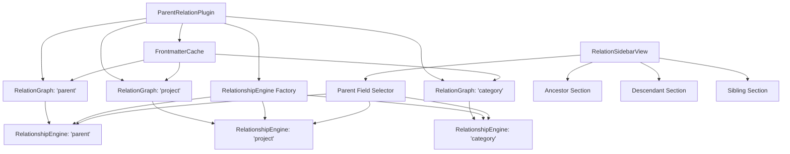

# Milestone 4.2A & 4.2B: Multi-Parent-Field Sidebar Enhancement

**Status:** Specification Review  
**Priority:** High  
**Estimated Time:** 
- Milestone 4.2A (Basic Multi-Field Support): 3-4 days
- Milestone 4.2B (Advanced Per-Field Configuration): 3-4 days

---

## Overview

This document outlines the redesigned Milestone 4.2A and the new Milestone 4.3, which together replace the original "Sidebar Configuration Panel" milestone. The new design supports multiple parent fields with independent configuration for each, featuring a modern segmented control UI and three separately collapsible sections (ancestors, descendants, siblings).

---

## Summary of Changes from Original Milestone 4.2

### Original Design
- Single parent field with mode selector dropdown
- Depth slider/input
- Pin to note button
- Filter controls

### New Design
- **Multiple parent fields** support with independent graphs
- **Segmented control** for parent field selection (auto-switches to dropdown for >4 fields)
- **Three collapsible sections** per parent field: Ancestors, Descendants, Siblings
- **Per-parent-field configuration** for section visibility, max depth, initial unfold depth
- **Customizable section display names** per parent field
- **Pin per parent field** functionality
- **Split into two milestones** for manageable implementation

---

## Architecture Overview

### Multiple Graph Architecture



### Key Architectural Decisions

1. **Multiple Separate Graphs**: One `RelationGraph` instance per parent field
2. **Shared Frontmatter Cache**: Single metadata parsing layer to avoid redundant work
3. **Segmented Control UI**: Clean, modern parent field selector (auto-switches to dropdown for >4 fields)
4. **Three Collapsible Sections**: Ancestors, Descendants, Siblings - each independently configurable
5. **Per-Field Pinning**: Pin sidebar to specific note for each parent field independently

---

## Data Structures

### New TypeScript Interfaces

```typescript
/**
 * Configuration for a single section (ancestors, descendants, or siblings)
 */
export interface SectionConfig {
  /** Display name for this section (e.g., "Parent Chain", "Children") */
  displayName: string;
  
  /** Whether this section is visible in the sidebar */
  visible: boolean;
  
  /** Whether this section is initially collapsed (only used if visible) */
  collapsed: boolean;
  
  /** Maximum depth to traverse (ancestors/descendants only) */
  maxDepth?: number;
  
  /** Initial unfold depth when rendering tree (ancestors/descendants only) */
  initialDepth?: number;
  
  /** Sort order for items (siblings only) */
  sortOrder?: 'alphabetical' | 'created' | 'modified';
  
  /** Whether to include the current file in results (siblings only) */
  includeSelf?: boolean;
}

/**
 * Configuration for a single parent field
 */
export interface ParentFieldConfig {
  /** Field name in frontmatter (e.g., "parent", "project") */
  name: string;
  
  /** Optional friendly display name for UI (e.g., "Project Hierarchy") */
  displayName?: string;
  
  /** Ancestors section configuration */
  ancestors: SectionConfig;
  
  /** Descendants section configuration */
  descendants: SectionConfig;
  
  /** Siblings section configuration */
  siblings: SectionConfig;
}

/**
 * Plugin settings with multi-parent-field support
 */
export interface ParentRelationSettings {
  /** Array of configured parent fields */
  parentFields: ParentFieldConfig[];
  
  /** Which parent field to show by default when opening sidebar */
  defaultParentField: string;
  
  /** UI style preference: 'auto', 'segmented', or 'dropdown' */
  uiStyle: 'auto' | 'segmented' | 'dropdown';
  
  /** Diagnostic mode toggle */
  diagnosticMode: boolean;
}

/**
 * Sidebar view state (per sidebar instance, persisted across sessions)
 */
export interface SidebarViewState {
  /** Currently selected parent field name */
  selectedParentField: string;
  
  /** Pin state per parent field */
  pinnedFiles: Map<string, string>;  // fieldName -> filePath
  
  /** Collapsed state per section per parent field */
  collapsedSections: Map<string, Set<'ancestors' | 'descendants' | 'siblings'>>;
}
```

### Default Configuration

```typescript
const DEFAULT_SECTION_CONFIG: SectionConfig = {
  displayName: '',  // Will be set per section type
  visible: true,
  collapsed: false,
  maxDepth: 5,
  initialDepth: 2,
  sortOrder: 'alphabetical',
  includeSelf: false
};

const DEFAULT_PARENT_FIELD_CONFIG: ParentFieldConfig = {
  name: 'parent',
  displayName: 'Parent',
  ancestors: {
    ...DEFAULT_SECTION_CONFIG,
    displayName: 'Ancestors',
    maxDepth: 5,
    initialDepth: 2
  },
  descendants: {
    ...DEFAULT_SECTION_CONFIG,
    displayName: 'Descendants',
    maxDepth: 5,
    initialDepth: 2
  },
  siblings: {
    ...DEFAULT_SECTION_CONFIG,
    displayName: 'Siblings',
    sortOrder: 'alphabetical',
    includeSelf: false
  }
};

const DEFAULT_SETTINGS: ParentRelationSettings = {
  parentFields: [DEFAULT_PARENT_FIELD_CONFIG],
  defaultParentField: 'parent',
  uiStyle: 'auto',
  diagnosticMode: false
};
```

---

## Milestone 4.2: Basic Multi-Parent-Field Support

### Goal
Implement core multi-parent-field functionality with UI for selection and basic section rendering.

### Tasks

#### 1. Create Frontmatter Cache Layer
- [ ] Create `src/frontmatter-cache.ts`
- [ ] Implement shared metadata parsing and caching
- [ ] Add cache invalidation on metadata changes
- [ ] Expose API: `getFieldValue(file: TFile, fieldName: string): any`

#### 2. Refactor Plugin for Multiple Graphs
- [ ] Modify `src/main.ts` to support multiple graphs
- [ ] Change `relationGraph` to `relationGraphs: Map<string, RelationGraph>`
- [ ] Create `RelationshipEngine` instance per graph
- [ ] Update event handlers to update all graphs on file changes
- [ ] Add graph management methods: `getGraphForField(fieldName: string)`

#### 3. Update Settings Structure
- [ ] Modify `ParentRelationSettings` interface in `src/main.ts`
- [ ] Add `parentFields: ParentFieldConfig[]`
- [ ] Add migration logic for existing single `parentField` setting
- [ ] Update `DEFAULT_SETTINGS` with new structure

#### 4. Create Parent Field Selector UI Component
- [ ] Create `src/components/parent-field-selector.ts` (new file)
- [ ] Implement segmented control component
- [ ] Implement dropdown fallback component
- [ ] Add auto-switching logic (segmented ≤4, dropdown >4)
- [ ] Respect `uiStyle` setting for manual override
- [ ] Emit selection change events

#### 5. Update Sidebar View
- [ ] Modify `src/sidebar-view.ts`
- [ ] Add parent field selector to header
- [ ] Update `buildTreeForMode()` to use selected parent field's graph
- [ ] Add three collapsible sections: ancestors, descendants, siblings
- [ ] Implement per-section rendering
- [ ] Add "No items found" messages for empty sections
- [ ] Update pin functionality to work per parent field

#### 6. Basic Settings UI
- [ ] Update `ParentRelationSettingTab` in `src/main.ts`
- [ ] Add simple parent field list editor (comma-separated)
- [ ] Add default parent field dropdown
- [ ] Add UI style selector (auto/segmented/dropdown)
- [ ] Note: Advanced per-field config deferred to Milestone 4.3

### Acceptance Criteria

- [x] Multiple parent fields can be defined (simple list format)
- [x] Segmented control shows for ≤4 fields, dropdown for >4
- [x] UI style can be overridden in settings
- [x] Sidebar displays selected parent field's relationships
- [x] Three sections (ancestors/descendants/siblings) render correctly
- [x] Sections show "No items found" when empty
- [x] Pin works per parent field
- [x] Switching parent fields updates all sections
- [x] State persists across sessions
- [x] Frontmatter cache improves performance
- [x] All graphs update on file changes

### Deliverables

- `src/frontmatter-cache.ts` - Shared metadata caching layer
- `src/components/parent-field-selector.ts` - UI component for field selection
- Updated `src/main.ts` - Multiple graph management
- Updated `src/sidebar-view.ts` - Three-section layout with field selector
- Updated settings UI - Basic multi-field configuration
- Migration logic for existing settings

---

## Milestone 4.3: Advanced Per-Field Configuration

### Goal
Implement comprehensive per-parent-field configuration with custom section names, visibility, depth settings, and advanced options.

### Tasks

#### 1. Enhanced Settings Data Structure
- [ ] Create `src/types.ts` exports for `ParentFieldConfig`, `SectionConfig`
- [ ] Update settings persistence to handle nested configurations
- [ ] Add validation for configuration values

#### 2. Advanced Settings UI
- [ ] Create `src/components/parent-field-config-form.ts` (new file)
- [ ] Implement form-like UI for each parent field configuration:
  - [ ] Field name and display name inputs
  - [ ] Per-section configuration (ancestors/descendants/siblings):
    - [ ] Display name input
    - [ ] Visible checkbox
    - [ ] Collapsed checkbox
    - [ ] Max depth input (ancestors/descendants)
    - [ ] Initial depth input (ancestors/descendants)
    - [ ] Sort order dropdown (siblings)
    - [ ] Include self checkbox (siblings)
- [ ] Add/Remove parent field buttons
- [ ] Reorder parent fields (drag handles)
- [ ] Preview how settings will appear in sidebar

#### 3. Update Sidebar to Use Per-Field Config
- [ ] Modify `src/sidebar-view.ts` to read per-field configuration
- [ ] Apply custom section display names
- [ ] Honor visibility settings (hide sections if `visible: false`)
- [ ] Apply collapsed state from settings as initial state
- [ ] Implement initial unfold depth logic in tree renderer
- [ ] Add per-section max depth limits
- [ ] Implement siblings sorting and "include self" options

#### 4. Tree Renderer Enhancements
- [ ] Modify `src/tree-renderer.ts`
- [ ] Add `initialDepth` option to constructor
- [ ] Implement progressive unfolding (collapsed beyond initial depth)
- [ ] Preserve user's expand/collapse actions in session state
- [ ] Add depth indicator UI (e.g., "Showing 2 of 5 levels")

#### 5. Settings Import/Export
- [ ] Add "Export Configuration" button (copies JSON to clipboard)
- [ ] Add "Import Configuration" button (paste JSON)
- [ ] Validate imported configurations
- [ ] Add preset configurations (e.g., "Project Management", "Knowledge Base")

### Acceptance Criteria

- [x] Each parent field can be fully configured independently
- [x] Custom display names work for fields and sections
- [x] Sections can be hidden or shown per parent field
- [x] Initial collapsed state respected
- [x] Max depth and initial depth work correctly
- [x] Siblings section supports sorting and "include self"
- [x] Settings UI is intuitive and well-organized
- [x] Configuration can be exported/imported
- [x] Tree renderer respects initial unfold depth
- [x] User's manual expand/collapse actions persist in session

### Deliverables

- `src/components/parent-field-config-form.ts` - Advanced configuration UI
- Updated `src/sidebar-view.ts` - Full per-field config support
- Updated `src/tree-renderer.ts` - Initial depth handling
- Import/Export functionality
- Configuration presets
- Comprehensive user documentation

---

## UI Mockups

### Sidebar Layout (Milestone 4.2)

```
┌─────────────────────────────────────┐
│ Relation Explorer            [📌][⚙] │
├─────────────────────────────────────┤
│                                      │
│  [ Parent | Project | Category ]    │  ← Segmented Control
│                                      │
├─────────────────────────────────────┤
│ ▼ Ancestors                          │
│   └─ Parent Note 1                   │
│       └─ Grandparent Note            │
├─────────────────────────────────────┤
│ ▼ Descendants                        │
│   └─ Child Note 1                    │
│   └─ Child Note 2                    │
├─────────────────────────────────────┤
│ ▶ Siblings                           │
│                                      │
└─────────────────────────────────────┘
```

### Sidebar Layout with Dropdown (>4 fields)

```
┌─────────────────────────────────────┐
│ Relation Explorer            [📌][⚙] │
├─────────────────────────────────────┤
│                                      │
│  Parent Field: [Project       ▼]    │  ← Dropdown
│                                      │
├─────────────────────────────────────┤
│ ▼ Project Hierarchy                  │
│   └─ Main Project                    │
│       └─ Program                     │
├─────────────────────────────────────┤
│ ▶ Sub-Projects                       │
├─────────────────────────────────────┤
│ ▶ Sibling Projects                   │
│                                      │
└─────────────────────────────────────┘
```

### Settings UI (Milestone 4.3)

```
┌─────────────────────────────────────────────────────────┐
│ Parent Relation Explorer Settings                       │
├─────────────────────────────────────────────────────────┤
│                                                          │
│ ┌─ Parent Fields ─────────────────────────────────────┐ │
│ │                                                      │ │
│ │ [+ Add Parent Field]                                │ │
│ │                                                      │ │
│ │ ┌─ Parent Field 1: "parent" ────────────────────┐   │ │
│ │ │ Field Name: [parent            ]              │   │ │
│ │ │ Display Name: [Parent          ]              │   │ │
│ │ │                                                │   │ │
│ │ │ ▼ Ancestors Section                            │   │ │
│ │ │   Display Name: [Ancestors     ]              │   │ │
│ │ │   ☑ Visible   ☐ Initially Collapsed           │   │ │
│ │ │   Max Depth: [5] Initial Depth: [2]           │   │ │
│ │ │                                                │   │ │
│ │ │ ▼ Descendants Section                          │   │ │
│ │ │   Display Name: [Descendants   ]              │   │ │
│ │ │   ☑ Visible   ☑ Initially Collapsed           │   │ │
│ │ │   Max Depth: [5] Initial Depth: [1]           │   │ │
│ │ │                                                │   │ │
│ │ │ ▼ Siblings Section                             │   │ │
│ │ │   Display Name: [Siblings      ]              │   │ │
│ │ │   ☑ Visible   ☐ Initially Collapsed           │   │ │
│ │ │   Sort: [Alphabetical ▼]  ☐ Include Self      │   │ │
│ │ │                                                │   │ │
│ │ │                       [Remove] [Duplicate]     │   │ │
│ │ └────────────────────────────────────────────────┘   │ │
│ │                                                      │ │
│ │ ┌─ Parent Field 2: "project" ────────────────────┐  │ │
│ │ │ ... (similar layout)                            │  │ │
│ │ └────────────────────────────────────────────────┘  │ │
│ │                                                      │ │
│ └──────────────────────────────────────────────────────┘ │
│                                                          │
│ Default Parent Field: [parent          ▼]              │
│ UI Style: [Auto                        ▼]              │
│                                                          │
│ ☐ Diagnostic Mode                                       │
│                                                          │
│ [Export Configuration] [Import Configuration]            │
│                                                          │
└─────────────────────────────────────────────────────────┘
```

---

## Implementation Sequence

### Phase 1: Milestone 4.2A (Basic Multi-Field Support)

1. **Week 1, Day 1-2: Core Infrastructure**
   - Create `FrontmatterCache` class
   - Refactor `main.ts` for multiple graphs
   - Update settings structure
   - Add migration logic

2. **Week 1, Day 3-4: UI Components**
   - Create `ParentFieldSelector` component
   - Implement segmented control
   - Implement dropdown fallback
   - Add auto-switching logic

3. **Week 2, Day 1-2: Sidebar Integration**
   - Update `RelationSidebarView`
   - Add three-section layout
   - Implement per-field rendering
   - Update pin functionality

4. **Week 2, Day 3: Testing & Polish**
   - Manual testing checklist
   - Bug fixes
   - Performance testing
   - Documentation updates

### Phase 2: Milestone 4.2B (Advanced Configuration)

1. **Week 3, Day 1-2: Settings UI**
   - Create `ParentFieldConfigForm` component
   - Implement add/remove/reorder fields
   - Build per-section configuration forms
   - Add validation

2. **Week 3, Day 3-4: Feature Implementation**
   - Update sidebar to use per-field config
   - Implement custom display names
   - Implement visibility toggling
   - Add siblings sorting and "include self"

3. **Week 4, Day 1-2: Tree Renderer Enhancements**
   - Add initial unfold depth support
   - Implement progressive expansion
   - Add depth indicators
   - Session state persistence

4. **Week 4, Day 3-4: Polish & Release**
   - Import/export functionality
   - Configuration presets
   - Comprehensive testing
   - Documentation updates

---

## Breaking Changes & Migration

### Breaking Changes

1. **Settings Structure**: Complete redesign of settings format
2. **Public API**: Graph access changes from single to multiple
3. **Sidebar View State**: New persistence format

### Migration Strategy

```typescript
/**
 * Migrates old single-field settings to new multi-field format
 */
function migrateSettings(oldSettings: any): ParentRelationSettings {
  // If already in new format, return as-is
  if (oldSettings.parentFields && Array.isArray(oldSettings.parentFields)) {
    return oldSettings as ParentRelationSettings;
  }
  
  // Migrate from old format
  const defaultField: ParentFieldConfig = {
    name: oldSettings.parentField || 'parent',
    displayName: (oldSettings.parentField || 'parent').charAt(0).toUpperCase() + 
                 (oldSettings.parentField || 'parent').slice(1),
    ancestors: {
      displayName: 'Ancestors',
      visible: true,
      collapsed: false,
      maxDepth: oldSettings.maxDepth || 5,
      initialDepth: 2
    },
    descendants: {
      displayName: 'Descendants',
      visible: true,
      collapsed: false,
      maxDepth: oldSettings.maxDepth || 5,
      initialDepth: 2
    },
    siblings: {
      displayName: 'Siblings',
      visible: true,
      collapsed: true,
      sortOrder: 'alphabetical',
      includeSelf: false
    }
  };
  
  return {
    parentFields: [defaultField],
    defaultParentField: defaultField.name,
    uiStyle: 'auto',
    diagnosticMode: oldSettings.diagnosticMode || false
  };
}
```

---

## Testing Strategy

### Manual Testing Checklist (Milestone 4.2)

- [ ] **Parent Field Selection**
  - [ ] Segmented control displays for 1-4 fields
  - [ ] Dropdown displays for >4 fields
  - [ ] Manual override in settings works
  - [ ] Switching fields updates all sections
  
- [ ] **Three-Section Layout**
  - [ ] All three sections render correctly
  - [ ] Sections are collapsible/expandable
  - [ ] Empty sections show "No items found"
  - [ ] Trees render with correct relationships
  
- [ ] **Multi-Graph Functionality**
  - [ ] Each parent field has independent graph
  - [ ] Metadata changes update all graphs
  - [ ] Performance is acceptable (<2s for 1000 notes, 3 fields)
  
- [ ] **Pin Functionality**
  - [ ] Pin works per parent field
  - [ ] Pinned file persists across sessions
  - [ ] Switching fields respects pins
  
- [ ] **Settings & Migration**
  - [ ] Old settings migrate correctly
  - [ ] New parent fields can be added
  - [ ] Default field setting works
  - [ ] Settings persist correctly

### Manual Testing Checklist (Milestone 4.3)

- [ ] **Advanced Configuration UI**
  - [ ] All form fields work correctly
  - [ ] Add/Remove parent fields works
  - [ ] Reordering fields works
  - [ ] Validation prevents invalid configs
  
- [ ] **Per-Field Configuration**
  - [ ] Custom display names apply correctly
  - [ ] Visibility toggles work
  - [ ] Collapsed state applies on load
  - [ ] Max/initial depth settings work
  - [ ] Sibling options work (sort, include self)
  
- [ ] **Tree Rendering**
  - [ ] Initial unfold depth works correctly
  - [ ] Manual expand/collapse persists in session
  - [ ] Depth indicators show correctly
  
- [ ] **Import/Export**
  - [ ] Export generates valid JSON
  - [ ] Import validates and applies config
  - [ ] Presets load correctly

---

## Performance Considerations

### Frontmatter Cache Performance

**Expected Improvement:**
- Without cache: Parse frontmatter N×F times (N notes, F fields)
- With cache: Parse frontmatter N times, cache hits for subsequent fields
- **3× speedup** for 3 parent fields

### Graph Building Performance

**Benchmarks (estimated):**
- 1,000 notes, 3 fields: ~300ms total (100ms per graph)
- 5,000 notes, 3 fields: ~1.5s total (500ms per graph)
- 10,000 notes, 3 fields: ~3s total (1s per graph)

**Optimization Strategy:**
- Build graphs in parallel (if feasible)
- Debounce metadata change events
- Incremental updates per graph

---

## Success Metrics

### Milestone 4.2
- ✅ Multiple parent fields supported
- ✅ UI adapts to number of fields
- ✅ Three sections render correctly
- ✅ Performance <2s for 1000 notes with 3 fields
- ✅ Settings migration works flawlessly
- ✅ Pin functionality works per field

### Milestone 4.3
- ✅ Complete per-field configuration UI
- ✅ All section options functional
- ✅ Import/export works reliably
- ✅ Tree renderer respects initial depth
- ✅ Documentation is comprehensive
- ✅ User feedback is positive

---

## Documentation Updates Required

1. **README.md**: Add section on multiple parent fields
2. **User Guide**: Step-by-step configuration tutorial
3. **API Reference**: Document new public API for multi-field access
4. **Migration Guide**: Help users upgrade from single to multi-field
5. **Configuration Examples**: Show common use cases

---

## Future Enhancements (Post 4.3)

Ideas to consider for later milestones:

1. **Auto-detect parent fields** from vault frontmatter
2. **Field-specific icons** for visual distinction
3. **Combined view** showing relationships from all fields simultaneously
4. **Cross-field relationship queries** (e.g., "files related by ANY field")
5. **Field-specific colors** in tree rendering
6. **Templates** for common field configurations
7. **Field groups** (organize related fields together)

---

## Questions for User Review

1. ✅ Does this specification fully capture your requirements?
2. ✅ Are there any edge cases we haven't considered?
3. ✅ Is the split between Milestone 4.2A and 4.2B reasonable?
4. ✅ Are the UI mockups intuitive and aligned with your vision?
5. ✅ Are there any additional configuration options needed?
6. ✅ Should we prioritize any particular feature?

---

**Document Version:** 1.0  
**Last Updated:** 2025-11-15  
**Status:** Ready for Review

Please review this specification and provide feedback. Once approved, I'll update the implementation plan and create detailed task breakdowns for both milestones.