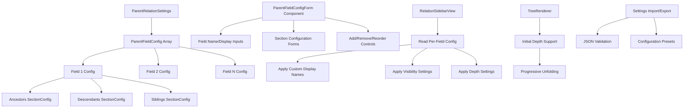

# Milestone 4.2B: Advanced Per-Field Configuration - Implementation Plan

**Status:** Ready for Implementation
**Priority:** High
**Estimated Time:** 3-4 days

---

## Overview

This document provides a comprehensive implementation plan for Milestone 4.2B: Advanced Per-Field Configuration, the second part of the Multi-Parent-Field Sidebar Enhancement for the Relations Obsidian plugin.

### Decision Summary

- **Approach:** Comprehensive per-parent-field configuration UI with live preview
- **Scope:** Full customization of sections (names, visibility, depth, sorting) per parent field
- **Settings UI:** Form-based interface with add/remove/reorder capabilities
- **Import/Export:** JSON-based configuration portability
- **Presets:** Common configuration templates for quick setup

### Prerequisites

This milestone builds upon Milestone 4.2A and requires:
- ✅ Frontmatter cache layer implemented
- ✅ Multiple RelationGraph instances working
- ✅ Parent field selector UI (segmented/dropdown)
- ✅ Three-section sidebar layout (ancestors/descendants/siblings)
- ✅ Basic multi-field settings

---

## Goals

Implement comprehensive per-parent-field configuration that allows users to:
1. Customize display names for fields and sections
2. Show/hide sections per parent field
3. Set initial collapsed state per section
4. Configure max depth and initial unfold depth for tree sections
5. Configure sorting and options for siblings section
6. Import/export configurations for sharing and backup
7. Use preset configurations for common use cases

---

## Architecture Overview

### Components to Create/Modify



### File Structure

```
src/
├── types.ts                           # New: Shared type definitions
├── components/
│   ├── parent-field-selector.ts       # Existing: Field selector UI
│   └── parent-field-config-form.ts    # New: Advanced config form
├── presets/
│   └── field-configurations.ts        # New: Preset configurations
├── main.ts                            # Modified: Enhanced settings tab
├── sidebar-view.ts                    # Modified: Use per-field config
└── tree-renderer.ts                   # Modified: Initial depth support

tests/
├── parent-field-config.test.ts        # New: Configuration tests
├── settings-persistence.test.ts       # New: Import/export tests
└── tree-renderer-depth.test.ts        # New: Initial depth tests
```

---

## Detailed Design

### 1. Shared Type Definitions

**File:** `src/types.ts` (new file)

```typescript
import { TFile } from 'obsidian';

/**
 * Configuration for a single section (ancestors, descendants, or siblings)
 */
export interface SectionConfig {
  /** Display name for this section (e.g., "Parent Chain", "Children") */
  displayName: string;

  /** Whether this section is visible in the sidebar */
  visible: boolean;

  /** Whether this section is initially collapsed (only used if visible) */
  collapsed: boolean;

  /** Maximum depth to traverse (ancestors/descendants only, undefined = unlimited) */
  maxDepth?: number;

  /** Initial unfold depth when rendering tree (ancestors/descendants only) */
  initialDepth?: number;

  /** Sort order for items (siblings only) */
  sortOrder?: 'alphabetical' | 'created' | 'modified';

  /** Whether to include the current file in results (siblings only) */
  includeSelf?: boolean;
}

/**
 * Configuration for a single parent field
 */
export interface ParentFieldConfig {
  /** Field name in frontmatter (e.g., "parent", "project") */
  name: string;

  /** Optional friendly display name for UI (e.g., "Project Hierarchy") */
  displayName?: string;

  /** Ancestors section configuration */
  ancestors: SectionConfig;

  /** Descendants section configuration */
  descendants: SectionConfig;

  /** Siblings section configuration */
  siblings: SectionConfig;
}

/**
 * Plugin settings with multi-parent-field support
 */
export interface ParentRelationSettings {
  /** Array of configured parent fields */
  parentFields: ParentFieldConfig[];

  /** Which parent field to show by default when opening sidebar */
  defaultParentField: string;

  /** UI style preference: 'auto', 'segmented', or 'dropdown' */
  uiStyle: 'auto' | 'segmented' | 'dropdown';

  /** Diagnostic mode toggle */
  diagnosticMode: boolean;
}

/**
 * Default configurations
 */
export const DEFAULT_SECTION_CONFIG: SectionConfig = {
  displayName: '',  // Will be set per section type
  visible: true,
  collapsed: false,
  maxDepth: 5,
  initialDepth: 2,
  sortOrder: 'alphabetical',
  includeSelf: false
};

export const DEFAULT_PARENT_FIELD_CONFIG: ParentFieldConfig = {
  name: 'parent',
  displayName: 'Parent',
  ancestors: {
    ...DEFAULT_SECTION_CONFIG,
    displayName: 'Ancestors',
    maxDepth: 5,
    initialDepth: 2
  },
  descendants: {
    ...DEFAULT_SECTION_CONFIG,
    displayName: 'Descendants',
    maxDepth: 5,
    initialDepth: 2
  },
  siblings: {
    ...DEFAULT_SECTION_CONFIG,
    displayName: 'Siblings',
    sortOrder: 'alphabetical',
    includeSelf: false
  }
};

export const DEFAULT_SETTINGS: ParentRelationSettings = {
  parentFields: [DEFAULT_PARENT_FIELD_CONFIG],
  defaultParentField: 'parent',
  uiStyle: 'auto',
  diagnosticMode: false
};

/**
 * Validation functions
 */
export function validateSectionConfig(config: Partial<SectionConfig>): boolean {
  if (config.maxDepth !== undefined && config.maxDepth < 0) return false;
  if (config.initialDepth !== undefined && config.initialDepth < 0) return false;
  if (config.initialDepth !== undefined && config.maxDepth !== undefined) {
    if (config.initialDepth > config.maxDepth) return false;
  }
  return true;
}

export function validateParentFieldConfig(config: Partial<ParentFieldConfig>): boolean {
  if (!config.name || config.name.trim() === '') return false;
  if (config.ancestors && !validateSectionConfig(config.ancestors)) return false;
  if (config.descendants && !validateSectionConfig(config.descendants)) return false;
  if (config.siblings && !validateSectionConfig(config.siblings)) return false;
  return true;
}

export function validateSettings(settings: Partial<ParentRelationSettings>): boolean {
  if (!settings.parentFields || settings.parentFields.length === 0) return false;
  return settings.parentFields.every(validateParentFieldConfig);
}
```

---

### 2. Parent Field Configuration Form Component

**File:** `src/components/parent-field-config-form.ts` (new file)

```typescript
import { Setting, TextComponent, DropdownComponent } from 'obsidian';
import { ParentFieldConfig, SectionConfig, DEFAULT_PARENT_FIELD_CONFIG } from '../types';

/**
 * Component for editing a single parent field configuration
 */
export class ParentFieldConfigForm {
  private containerEl: HTMLElement;
  private config: ParentFieldConfig;
  private onChange: (config: ParentFieldConfig) => void;
  private onRemove: () => void;
  private collapsed: boolean = false;

  constructor(
    containerEl: HTMLElement,
    config: ParentFieldConfig,
    onChange: (config: ParentFieldConfig) => void,
    onRemove: () => void
  ) {
    this.containerEl = containerEl;
    this.config = config;
    this.onChange = onChange;
    this.onRemove = onRemove;
  }

  /**
   * Renders the configuration form
   */
  render(): void {
    const formEl = this.containerEl.createDiv('parent-field-config');

    // Header with collapse toggle
    const headerEl = formEl.createDiv('parent-field-config-header');

    const collapseIcon = headerEl.createSpan('collapse-icon');
    collapseIcon.setText(this.collapsed ? '▶' : '▼');
    collapseIcon.onclick = () => this.toggleCollapse(formEl);

    const titleEl = headerEl.createSpan('config-title');
    titleEl.setText(`Field: "${this.config.name}"`);

    const removeBtn = headerEl.createEl('button', { text: 'Remove', cls: 'mod-warning' });
    removeBtn.onclick = () => {
      if (confirm(`Remove parent field "${this.config.name}"?`)) {
        this.onRemove();
      }
    };

    // Body (collapsible)
    const bodyEl = formEl.createDiv('parent-field-config-body');
    if (this.collapsed) {
      bodyEl.style.display = 'none';
    }

    this.renderFieldSettings(bodyEl);
    this.renderSectionConfig(bodyEl, 'ancestors', 'Ancestors Section');
    this.renderSectionConfig(bodyEl, 'descendants', 'Descendants Section');
    this.renderSectionConfig(bodyEl, 'siblings', 'Siblings Section');

    // Duplicate button
    const actionsEl = bodyEl.createDiv('config-actions');
    const duplicateBtn = actionsEl.createEl('button', { text: 'Duplicate Field' });
    duplicateBtn.onclick = () => this.duplicateField();
  }

  /**
   * Renders field-level settings (name, display name)
   */
  private renderFieldSettings(containerEl: HTMLElement): void {
    const settingsEl = containerEl.createDiv('field-settings');

    new Setting(settingsEl)
      .setName('Field Name')
      .setDesc('The frontmatter field name (e.g., "parent", "project")')
      .addText(text => {
        text.setValue(this.config.name);
        text.onChange(value => {
          this.config.name = value;
          this.onChange(this.config);
        });
      });

    new Setting(settingsEl)
      .setName('Display Name')
      .setDesc('Optional friendly name for UI (defaults to field name)')
      .addText(text => {
        text.setValue(this.config.displayName || '');
        text.setPlaceholder(this.config.name);
        text.onChange(value => {
          this.config.displayName = value || undefined;
          this.onChange(this.config);
        });
      });
  }

  /**
   * Renders configuration for a single section
   */
  private renderSectionConfig(
    containerEl: HTMLElement,
    sectionKey: 'ancestors' | 'descendants' | 'siblings',
    sectionTitle: string
  ): void {
    const sectionEl = containerEl.createDiv('section-config');

    // Section header
    const headerEl = sectionEl.createDiv('section-header');
    headerEl.createEl('h4', { text: sectionTitle });

    const config = this.config[sectionKey];

    // Display name
    new Setting(sectionEl)
      .setName('Display Name')
      .setDesc('Name shown in sidebar')
      .addText(text => {
        text.setValue(config.displayName);
        text.onChange(value => {
          config.displayName = value;
          this.onChange(this.config);
        });
      });

    // Visibility
    new Setting(sectionEl)
      .setName('Visible')
      .setDesc('Show this section in the sidebar')
      .addToggle(toggle => {
        toggle.setValue(config.visible);
        toggle.onChange(value => {
          config.visible = value;
          this.onChange(this.config);
        });
      });

    // Initial collapsed state
    new Setting(sectionEl)
      .setName('Initially Collapsed')
      .setDesc('Start with this section collapsed')
      .addToggle(toggle => {
        toggle.setValue(config.collapsed);
        toggle.onChange(value => {
          config.collapsed = value;
          this.onChange(this.config);
        });
      });

    // Section-specific settings
    if (sectionKey === 'ancestors' || sectionKey === 'descendants') {
      this.renderTreeSectionSettings(sectionEl, config);
    } else if (sectionKey === 'siblings') {
      this.renderSiblingSectionSettings(sectionEl, config);
    }
  }

  /**
   * Renders settings specific to tree sections (ancestors/descendants)
   */
  private renderTreeSectionSettings(containerEl: HTMLElement, config: SectionConfig): void {
    new Setting(containerEl)
      .setName('Max Depth')
      .setDesc('Maximum depth to traverse (leave empty for unlimited)')
      .addText(text => {
        text.setPlaceholder('5');
        text.setValue(config.maxDepth?.toString() || '');
        text.onChange(value => {
          const num = parseInt(value);
          config.maxDepth = isNaN(num) ? undefined : num;
          this.onChange(this.config);
        });
      });

    new Setting(containerEl)
      .setName('Initial Unfold Depth')
      .setDesc('How many levels to show expanded by default')
      .addText(text => {
        text.setPlaceholder('2');
        text.setValue(config.initialDepth?.toString() || '');
        text.onChange(value => {
          const num = parseInt(value);
          config.initialDepth = isNaN(num) ? undefined : num;
          this.onChange(this.config);
        });
      });
  }

  /**
   * Renders settings specific to siblings section
   */
  private renderSiblingSectionSettings(containerEl: HTMLElement, config: SectionConfig): void {
    new Setting(containerEl)
      .setName('Sort Order')
      .setDesc('How to sort sibling items')
      .addDropdown(dropdown => {
        dropdown.addOption('alphabetical', 'Alphabetical');
        dropdown.addOption('created', 'Created Date');
        dropdown.addOption('modified', 'Modified Date');
        dropdown.setValue(config.sortOrder || 'alphabetical');
        dropdown.onChange(value => {
          config.sortOrder = value as 'alphabetical' | 'created' | 'modified';
          this.onChange(this.config);
        });
      });

    new Setting(containerEl)
      .setName('Include Self')
      .setDesc('Include the current file in siblings list')
      .addToggle(toggle => {
        toggle.setValue(config.includeSelf || false);
        toggle.onChange(value => {
          config.includeSelf = value;
          this.onChange(this.config);
        });
      });
  }

  /**
   * Toggles collapse state of the form
   */
  private toggleCollapse(formEl: HTMLElement): void {
    this.collapsed = !this.collapsed;
    const bodyEl = formEl.querySelector('.parent-field-config-body') as HTMLElement;
    const icon = formEl.querySelector('.collapse-icon') as HTMLElement;

    if (this.collapsed) {
      bodyEl.style.display = 'none';
      icon.setText('▶');
    } else {
      bodyEl.style.display = 'block';
      icon.setText('▼');
    }
  }

  /**
   * Duplicates this field configuration
   */
  private duplicateField(): void {
    // This will be implemented by the parent settings tab
    // by creating a new config based on this one
    console.log('Duplicate requested for', this.config.name);
  }
}
```

---

### 3. Configuration Presets

**File:** `src/presets/field-configurations.ts` (new file)

```typescript
import { ParentFieldConfig } from '../types';

/**
 * Preset configurations for common use cases
 */
export const PRESET_CONFIGURATIONS: Record<string, ParentFieldConfig[]> = {
  /**
   * Simple parent-child hierarchy
   */
  'simple-hierarchy': [
    {
      name: 'parent',
      displayName: 'Parent',
      ancestors: {
        displayName: 'Ancestors',
        visible: true,
        collapsed: false,
        maxDepth: 5,
        initialDepth: 2
      },
      descendants: {
        displayName: 'Descendants',
        visible: true,
        collapsed: false,
        maxDepth: 5,
        initialDepth: 2
      },
      siblings: {
        displayName: 'Siblings',
        visible: true,
        collapsed: true,
        sortOrder: 'alphabetical',
        includeSelf: false
      }
    }
  ],

  /**
   * Project management with multiple hierarchies
   */
  'project-management': [
    {
      name: 'project',
      displayName: 'Project',
      ancestors: {
        displayName: 'Program / Portfolio',
        visible: true,
        collapsed: false,
        maxDepth: 3,
        initialDepth: 2
      },
      descendants: {
        displayName: 'Sub-Projects',
        visible: true,
        collapsed: false,
        maxDepth: 3,
        initialDepth: 1
      },
      siblings: {
        displayName: 'Related Projects',
        visible: true,
        collapsed: true,
        sortOrder: 'alphabetical',
        includeSelf: false
      }
    },
    {
      name: 'category',
      displayName: 'Category',
      ancestors: {
        displayName: 'Parent Categories',
        visible: true,
        collapsed: true,
        maxDepth: 5,
        initialDepth: 1
      },
      descendants: {
        displayName: 'Sub-Categories',
        visible: true,
        collapsed: true,
        maxDepth: 5,
        initialDepth: 1
      },
      siblings: {
        displayName: 'Same Category',
        visible: false,
        collapsed: true,
        sortOrder: 'alphabetical',
        includeSelf: false
      }
    }
  ],

  /**
   * Knowledge base / Zettelkasten
   */
  'knowledge-base': [
    {
      name: 'parent',
      displayName: 'Parent Topic',
      ancestors: {
        displayName: 'Parent Chain',
        visible: true,
        collapsed: false,
        maxDepth: 10,
        initialDepth: 3
      },
      descendants: {
        displayName: 'Subtopics',
        visible: true,
        collapsed: false,
        maxDepth: 10,
        initialDepth: 2
      },
      siblings: {
        displayName: 'Related Notes',
        visible: true,
        collapsed: false,
        sortOrder: 'modified',
        includeSelf: false
      }
    }
  ],

  /**
   * Compact view with minimal sections
   */
  'compact': [
    {
      name: 'parent',
      displayName: 'Parent',
      ancestors: {
        displayName: 'Up',
        visible: true,
        collapsed: false,
        maxDepth: 3,
        initialDepth: 1
      },
      descendants: {
        displayName: 'Down',
        visible: true,
        collapsed: true,
        maxDepth: 2,
        initialDepth: 1
      },
      siblings: {
        displayName: 'Siblings',
        visible: false,
        collapsed: true,
        sortOrder: 'alphabetical',
        includeSelf: false
      }
    }
  ]
};

/**
 * Get a preset configuration by name
 */
export function getPreset(name: string): ParentFieldConfig[] | null {
  return PRESET_CONFIGURATIONS[name] || null;
}

/**
 * Get list of available preset names
 */
export function getPresetNames(): string[] {
  return Object.keys(PRESET_CONFIGURATIONS);
}

/**
 * Get a human-readable description for a preset
 */
export function getPresetDescription(name: string): string {
  const descriptions: Record<string, string> = {
    'simple-hierarchy': 'Single parent field with standard sections',
    'project-management': 'Project and category hierarchies for PM workflows',
    'knowledge-base': 'Deep hierarchies optimized for knowledge management',
    'compact': 'Minimal view with reduced sections'
  };
  return descriptions[name] || '';
}
```

---

### 4. Enhanced Settings Tab

**File:** `src/main.ts` (modifications to settings tab)

```typescript
import { ParentFieldConfigForm } from './components/parent-field-config-form';
import { getPresetNames, getPreset, getPresetDescription } from './presets/field-configurations';
import { validateSettings } from './types';

class ParentRelationSettingTab extends PluginSettingTab {
  plugin: ParentRelationPlugin;
  private configForms: ParentFieldConfigForm[] = [];

  constructor(app: App, plugin: ParentRelationPlugin) {
    super(app, plugin);
    this.plugin = plugin;
  }

  display(): void {
    const { containerEl } = this;
    containerEl.empty();

    containerEl.createEl('h2', { text: 'Parent Relation Explorer Settings' });

    // Import/Export section
    this.renderImportExport(containerEl);

    // Presets section
    this.renderPresets(containerEl);

    // Parent fields configuration
    this.renderParentFieldsConfig(containerEl);

    // Global settings
    this.renderGlobalSettings(containerEl);
  }

  /**
   * Renders import/export section
   */
  private renderImportExport(containerEl: HTMLElement): void {
    const section = containerEl.createDiv('settings-section');
    section.createEl('h3', { text: 'Configuration Import/Export' });

    new Setting(section)
      .setName('Export Configuration')
      .setDesc('Copy configuration to clipboard as JSON')
      .addButton(button => {
        button
          .setButtonText('Export')
          .setCta()
          .onClick(async () => {
            const json = JSON.stringify(this.plugin.settings, null, 2);
            await navigator.clipboard.writeText(json);
            new Notice('Configuration exported to clipboard');
          });
      });

    new Setting(section)
      .setName('Import Configuration')
      .setDesc('Paste and import a JSON configuration')
      .addButton(button => {
        button
          .setButtonText('Import')
          .onClick(async () => {
            const json = await navigator.clipboard.readText();
            try {
              const imported = JSON.parse(json);
              if (validateSettings(imported)) {
                this.plugin.settings = imported;
                await this.plugin.saveSettings();
                this.display(); // Refresh UI
                new Notice('Configuration imported successfully');
              } else {
                new Notice('Invalid configuration format', 5000);
              }
            } catch (e) {
              new Notice('Failed to parse JSON: ' + e.message, 5000);
            }
          });
      });
  }

  /**
   * Renders preset configurations section
   */
  private renderPresets(containerEl: HTMLElement): void {
    const section = containerEl.createDiv('settings-section');
    section.createEl('h3', { text: 'Configuration Presets' });

    const presetNames = getPresetNames();

    new Setting(section)
      .setName('Load Preset')
      .setDesc('Load a predefined configuration template')
      .addDropdown(dropdown => {
        dropdown.addOption('', 'Select a preset...');
        presetNames.forEach(name => {
          dropdown.addOption(name, name);
        });
        dropdown.onChange(async (value) => {
          if (!value) return;

          const preset = getPreset(value);
          if (preset) {
            const confirm = await this.confirmLoadPreset(value);
            if (confirm) {
              this.plugin.settings.parentFields = preset;
              await this.plugin.saveSettings();
              this.display();
              new Notice(`Loaded preset: ${value}`);
            }
          }
        });
      });

    // Show descriptions of available presets
    const descEl = section.createDiv('preset-descriptions');
    presetNames.forEach(name => {
      const desc = getPresetDescription(name);
      descEl.createEl('p', {
        text: `${name}: ${desc}`,
        cls: 'setting-item-description'
      });
    });
  }

  /**
   * Confirms loading a preset (warns about overwriting)
   */
  private async confirmLoadPreset(presetName: string): Promise<boolean> {
    return new Promise((resolve) => {
      const modal = new Modal(this.app);
      modal.titleEl.setText('Load Preset Configuration?');
      modal.contentEl.createEl('p', {
        text: `This will replace your current configuration with the "${presetName}" preset. This action cannot be undone.`
      });

      const buttonContainer = modal.contentEl.createDiv('modal-button-container');

      const cancelBtn = buttonContainer.createEl('button', { text: 'Cancel' });
      cancelBtn.onclick = () => {
        modal.close();
        resolve(false);
      };

      const confirmBtn = buttonContainer.createEl('button', {
        text: 'Load Preset',
        cls: 'mod-cta'
      });
      confirmBtn.onclick = () => {
        modal.close();
        resolve(true);
      };

      modal.open();
    });
  }

  /**
   * Renders parent fields configuration section
   */
  private renderParentFieldsConfig(containerEl: HTMLElement): void {
    const section = containerEl.createDiv('settings-section');
    section.createEl('h3', { text: 'Parent Fields' });

    // Add field button
    new Setting(section)
      .addButton(button => {
        button
          .setButtonText('+ Add Parent Field')
          .setCta()
          .onClick(() => {
            this.addParentField();
          });
      });

    // Render each field configuration
    const fieldsContainer = section.createDiv('parent-fields-container');

    this.plugin.settings.parentFields.forEach((config, index) => {
      const form = new ParentFieldConfigForm(
        fieldsContainer,
        config,
        (updated) => this.updateFieldConfig(index, updated),
        () => this.removeFieldConfig(index)
      );
      form.render();
      this.configForms.push(form);
    });
  }

  /**
   * Renders global settings section
   */
  private renderGlobalSettings(containerEl: HTMLElement): void {
    const section = containerEl.createDiv('settings-section');
    section.createEl('h3', { text: 'Global Settings' });

    new Setting(section)
      .setName('Default Parent Field')
      .setDesc('Which field to show by default when opening sidebar')
      .addDropdown(dropdown => {
        this.plugin.settings.parentFields.forEach(field => {
          dropdown.addOption(field.name, field.displayName || field.name);
        });
        dropdown.setValue(this.plugin.settings.defaultParentField);
        dropdown.onChange(async (value) => {
          this.plugin.settings.defaultParentField = value;
          await this.plugin.saveSettings();
        });
      });

    new Setting(section)
      .setName('UI Style')
      .setDesc('Parent field selector style (auto adapts based on count)')
      .addDropdown(dropdown => {
        dropdown.addOption('auto', 'Auto (≤4: segmented, >4: dropdown)');
        dropdown.addOption('segmented', 'Always Segmented Control');
        dropdown.addOption('dropdown', 'Always Dropdown');
        dropdown.setValue(this.plugin.settings.uiStyle);
        dropdown.onChange(async (value) => {
          this.plugin.settings.uiStyle = value as 'auto' | 'segmented' | 'dropdown';
          await this.plugin.saveSettings();
        });
      });

    new Setting(section)
      .setName('Diagnostic Mode')
      .setDesc('Show diagnostic information in console')
      .addToggle(toggle => {
        toggle.setValue(this.plugin.settings.diagnosticMode);
        toggle.onChange(async (value) => {
          this.plugin.settings.diagnosticMode = value;
          await this.plugin.saveSettings();
        });
      });
  }

  /**
   * Adds a new parent field configuration
   */
  private async addParentField(): void {
    const newConfig: ParentFieldConfig = {
      ...DEFAULT_PARENT_FIELD_CONFIG,
      name: `field${this.plugin.settings.parentFields.length + 1}`
    };

    this.plugin.settings.parentFields.push(newConfig);
    await this.plugin.saveSettings();
    this.display(); // Refresh UI
  }

  /**
   * Updates a field configuration
   */
  private async updateFieldConfig(index: number, config: ParentFieldConfig): void {
    this.plugin.settings.parentFields[index] = config;
    await this.plugin.saveSettings();
  }

  /**
   * Removes a field configuration
   */
  private async removeFieldConfig(index: number): void {
    this.plugin.settings.parentFields.splice(index, 1);

    // If we removed the default field, reset to first field
    if (this.plugin.settings.parentFields.length > 0) {
      const stillExists = this.plugin.settings.parentFields.some(
        f => f.name === this.plugin.settings.defaultParentField
      );
      if (!stillExists) {
        this.plugin.settings.defaultParentField = this.plugin.settings.parentFields[0].name;
      }
    }

    await this.plugin.saveSettings();
    this.display(); // Refresh UI
  }
}
```

---

### 5. Sidebar View Integration

**File:** `src/sidebar-view.ts` (modifications)

```typescript
import { ParentFieldConfig, SectionConfig } from './types';

export class RelationSidebarView extends ItemView {
  // ... existing properties ...

  /**
   * Gets the configuration for the currently selected parent field
   */
  private getCurrentFieldConfig(): ParentFieldConfig | null {
    return this.plugin.settings.parentFields.find(
      f => f.name === this.selectedParentField
    ) || null;
  }

  /**
   * Renders the content with per-field configuration
   */
  async renderContent(): Promise<void> {
    const container = this.containerEl.children[1];
    container.empty();

    const fieldConfig = this.getCurrentFieldConfig();
    if (!fieldConfig) {
      container.createEl('p', { text: 'No parent field configured' });
      return;
    }

    const file = this.getPinnedOrActiveFile();
    if (!file) {
      container.createEl('p', { text: 'No file selected' });
      return;
    }

    // Render each section if visible
    if (fieldConfig.ancestors.visible) {
      await this.renderSection(container, 'ancestors', file, fieldConfig.ancestors);
    }

    if (fieldConfig.descendants.visible) {
      await this.renderSection(container, 'descendants', file, fieldConfig.descendants);
    }

    if (fieldConfig.siblings.visible) {
      await this.renderSection(container, 'siblings', file, fieldConfig.siblings);
    }
  }

  /**
   * Renders a single section with configuration
   */
  private async renderSection(
    container: HTMLElement,
    sectionType: 'ancestors' | 'descendants' | 'siblings',
    file: TFile,
    config: SectionConfig
  ): Promise<void> {
    const sectionEl = container.createDiv('relation-section');

    // Section header with custom display name
    const headerEl = sectionEl.createDiv('section-header');

    const collapseIcon = headerEl.createSpan('collapse-icon');
    const isCollapsed = this.getSectionCollapsedState(sectionType) ?? config.collapsed;
    collapseIcon.setText(isCollapsed ? '▶' : '▼');

    const titleEl = headerEl.createEl('h3', { text: config.displayName });

    headerEl.onclick = () => this.toggleSection(sectionEl, sectionType);

    // Section body
    const bodyEl = sectionEl.createDiv('section-body');
    if (isCollapsed) {
      bodyEl.style.display = 'none';
    }

    // Get appropriate engine
    const engine = this.plugin.relationshipEngines.get(this.selectedParentField);
    if (!engine) return;

    // Render section content based on type
    if (sectionType === 'ancestors') {
      const ancestors = engine.getAncestors(file, config.maxDepth);
      if (ancestors.length === 0) {
        bodyEl.createEl('p', { text: 'No ancestors found', cls: 'empty-message' });
      } else {
        this.renderTree(bodyEl, ancestors, config);
      }
    } else if (sectionType === 'descendants') {
      const descendants = engine.getDescendants(file, config.maxDepth);
      if (descendants.length === 0) {
        bodyEl.createEl('p', { text: 'No descendants found', cls: 'empty-message' });
      } else {
        this.renderTree(bodyEl, descendants, config);
      }
    } else if (sectionType === 'siblings') {
      const siblings = engine.getSiblings(file, config.includeSelf || false);

      // Apply sorting
      const sorted = this.sortSiblings(siblings, config.sortOrder || 'alphabetical');

      if (sorted.length === 0) {
        bodyEl.createEl('p', { text: 'No siblings found', cls: 'empty-message' });
      } else {
        this.renderSiblingsList(bodyEl, sorted);
      }
    }
  }

  /**
   * Renders a tree with initial depth configuration
   */
  private renderTree(
    container: HTMLElement,
    generations: TFile[][],
    config: SectionConfig
  ): void {
    const initialDepth = config.initialDepth ?? 2;

    // Use tree renderer with initial depth
    this.treeRenderer.render(container, generations, {
      initialDepth,
      maxDepth: config.maxDepth,
      onFileClick: (file) => this.handleFileClick(file)
    });
  }

  /**
   * Sorts siblings according to configuration
   */
  private sortSiblings(
    siblings: TFile[],
    sortOrder: 'alphabetical' | 'created' | 'modified'
  ): TFile[] {
    const sorted = [...siblings];

    switch (sortOrder) {
      case 'alphabetical':
        sorted.sort((a, b) => a.basename.localeCompare(b.basename));
        break;
      case 'created':
        sorted.sort((a, b) => a.stat.ctime - b.stat.ctime);
        break;
      case 'modified':
        sorted.sort((a, b) => b.stat.mtime - a.stat.mtime); // Most recent first
        break;
    }

    return sorted;
  }

  /**
   * Toggles a section's collapsed state
   */
  private toggleSection(sectionEl: HTMLElement, sectionType: string): void {
    const bodyEl = sectionEl.querySelector('.section-body') as HTMLElement;
    const icon = sectionEl.querySelector('.collapse-icon') as HTMLElement;

    const isCollapsed = bodyEl.style.display === 'none';

    if (isCollapsed) {
      bodyEl.style.display = 'block';
      icon.setText('▼');
    } else {
      bodyEl.style.display = 'none';
      icon.setText('▶');
    }

    // Save state
    this.setSectionCollapsedState(sectionType, !isCollapsed);
  }

  /**
   * Gets the collapsed state for a section (session state)
   */
  private getSectionCollapsedState(sectionType: string): boolean | null {
    const key = `${this.selectedParentField}-${sectionType}-collapsed`;
    const state = sessionStorage.getItem(key);
    return state === null ? null : state === 'true';
  }

  /**
   * Sets the collapsed state for a section (session state)
   */
  private setSectionCollapsedState(sectionType: string, collapsed: boolean): void {
    const key = `${this.selectedParentField}-${sectionType}-collapsed`;
    sessionStorage.setItem(key, collapsed.toString());
  }
}
```

---

### 6. Tree Renderer with Initial Depth

**File:** `src/tree-renderer.ts` (modifications)

```typescript
export interface TreeRenderOptions {
  /** Initial depth to unfold (nodes beyond this are collapsed) */
  initialDepth?: number;

  /** Maximum depth to render */
  maxDepth?: number;

  /** Callback when a file is clicked */
  onFileClick?: (file: TFile) => void;
}

export class TreeRenderer {
  private expandedNodes: Set<string> = new Set();

  /**
   * Renders a tree with progressive unfolding
   */
  render(
    container: HTMLElement,
    generations: TFile[][],
    options: TreeRenderOptions = {}
  ): void {
    const { initialDepth = 2, maxDepth, onFileClick } = options;

    container.empty();

    const treeEl = container.createDiv('tree-view');

    this.renderGenerations(treeEl, generations, 0, initialDepth, maxDepth, onFileClick);

    // Add depth indicator if applicable
    if (maxDepth && generations.length > 0) {
      const visibleDepth = Math.min(generations.length, maxDepth);
      const indicator = container.createDiv('depth-indicator');
      indicator.setText(`Showing ${visibleDepth} of ${maxDepth} levels`);
    }
  }

  /**
   * Recursively renders tree generations
   */
  private renderGenerations(
    container: HTMLElement,
    generations: TFile[][],
    currentDepth: number,
    initialDepth: number,
    maxDepth: number | undefined,
    onFileClick?: (file: TFile) => void
  ): void {
    if (generations.length === 0) return;
    if (maxDepth !== undefined && currentDepth >= maxDepth) return;

    const currentGen = generations[0];
    const remainingGens = generations.slice(1);

    currentGen.forEach(file => {
      const nodeEl = container.createDiv('tree-node');
      nodeEl.dataset.depth = currentDepth.toString();

      // Determine if this node should be initially expanded
      const hasChildren = remainingGens.length > 0;
      const shouldBeExpanded = currentDepth < initialDepth || this.expandedNodes.has(file.path);

      // Expand/collapse icon (if has children)
      if (hasChildren) {
        const expandIcon = nodeEl.createSpan('expand-icon');
        expandIcon.setText(shouldBeExpanded ? '▼' : '▶');
        expandIcon.onclick = (e) => {
          e.stopPropagation();
          this.toggleNode(nodeEl, file.path);
        };
      } else {
        nodeEl.createSpan('expand-icon-placeholder');
      }

      // File link
      const linkEl = nodeEl.createEl('a', {
        text: file.basename,
        cls: 'internal-link'
      });
      linkEl.onclick = (e) => {
        e.preventDefault();
        if (onFileClick) onFileClick(file);
      };

      // Children container
      if (hasChildren) {
        const childrenEl = nodeEl.createDiv('tree-children');

        if (shouldBeExpanded) {
          this.renderGenerations(
            childrenEl,
            remainingGens,
            currentDepth + 1,
            initialDepth,
            maxDepth,
            onFileClick
          );
        } else {
          childrenEl.style.display = 'none';
        }
      }
    });
  }

  /**
   * Toggles a tree node's expanded state
   */
  private toggleNode(nodeEl: HTMLElement, filePath: string): void {
    const childrenEl = nodeEl.querySelector('.tree-children') as HTMLElement;
    const icon = nodeEl.querySelector('.expand-icon') as HTMLElement;

    const isExpanded = childrenEl.style.display !== 'none';

    if (isExpanded) {
      childrenEl.style.display = 'none';
      icon.setText('▶');
      this.expandedNodes.delete(filePath);
    } else {
      childrenEl.style.display = 'block';
      icon.setText('▼');
      this.expandedNodes.add(filePath);
    }
  }

  /**
   * Clears the expanded nodes state
   */
  clearState(): void {
    this.expandedNodes.clear();
  }
}
```

---

## Test Specification

**File:** `tests/parent-field-config.test.ts` (new file)

### Test Cases

```typescript
import { describe, it, expect, beforeEach } from 'vitest';
import {
  ParentFieldConfig,
  SectionConfig,
  validateSectionConfig,
  validateParentFieldConfig,
  validateSettings
} from '@/types';

describe('Parent Field Configuration', () => {
  describe('Validation', () => {
    it('should validate valid section config', () => {
      const config: SectionConfig = {
        displayName: 'Test',
        visible: true,
        collapsed: false,
        maxDepth: 5,
        initialDepth: 2
      };
      expect(validateSectionConfig(config)).toBe(true);
    });

    it('should reject negative maxDepth', () => {
      const config: Partial<SectionConfig> = { maxDepth: -1 };
      expect(validateSectionConfig(config)).toBe(false);
    });

    it('should reject initialDepth > maxDepth', () => {
      const config: Partial<SectionConfig> = {
        maxDepth: 2,
        initialDepth: 5
      };
      expect(validateSectionConfig(config)).toBe(false);
    });

    it('should validate valid parent field config', () => {
      // Test valid field configuration
    });

    it('should reject empty field name', () => {
      // Test invalid field name
    });
  });

  describe('Settings Persistence', () => {
    it('should save and load settings correctly', () => {
      // Test settings save/load
    });

    it('should handle migration from old format', () => {
      // Test settings migration
    });
  });

  describe('Per-Field Configuration', () => {
    it('should apply custom display names', () => {
      // Test display name application
    });

    it('should respect visibility settings', () => {
      // Test section visibility
    });

    it('should apply initial collapsed state', () => {
      // Test collapsed state
    });

    it('should respect max depth limits', () => {
      // Test depth limits
    });

    it('should apply siblings sorting', () => {
      // Test sorting options
    });
  });
});
```

---

## Implementation Checklist

### Phase 1: Type Definitions and Validation
- [ ] Create `src/types.ts`
  - [ ] Define `SectionConfig` interface
  - [ ] Define `ParentFieldConfig` interface
  - [ ] Define `ParentRelationSettings` interface
  - [ ] Implement validation functions
  - [ ] Add default configurations
  - [ ] Add JSDoc documentation

### Phase 2: Configuration Presets
- [ ] Create `src/presets/field-configurations.ts`
  - [ ] Define preset configurations
  - [ ] Implement `getPreset()` function
  - [ ] Implement `getPresetNames()` function
  - [ ] Implement `getPresetDescription()` function
  - [ ] Add JSDoc documentation

### Phase 3: Configuration Form Component
- [ ] Create `src/components/parent-field-config-form.ts`
  - [ ] Implement `ParentFieldConfigForm` class
  - [ ] Implement field settings UI
  - [ ] Implement section configuration UI
  - [ ] Implement tree section settings
  - [ ] Implement sibling section settings
  - [ ] Implement collapse/expand functionality
  - [ ] Add duplicate functionality

### Phase 4: Enhanced Settings Tab
- [ ] Modify `src/main.ts` settings tab
  - [ ] Implement import/export section
  - [ ] Implement presets section
  - [ ] Implement parent fields configuration section
  - [ ] Implement global settings section
  - [ ] Add field management (add/remove/update)
  - [ ] Add confirmation dialogs

### Phase 5: Sidebar Integration
- [ ] Modify `src/sidebar-view.ts`
  - [ ] Implement `getCurrentFieldConfig()`
  - [ ] Update `renderContent()` to use per-field config
  - [ ] Implement `renderSection()` with config
  - [ ] Apply custom display names
  - [ ] Apply visibility settings
  - [ ] Apply collapsed state
  - [ ] Implement siblings sorting
  - [ ] Add session state management

### Phase 6: Tree Renderer Enhancements
- [ ] Modify `src/tree-renderer.ts`
  - [ ] Add `TreeRenderOptions` interface
  - [ ] Implement initial depth support
  - [ ] Implement progressive unfolding
  - [ ] Add expand/collapse state management
  - [ ] Add depth indicator UI
  - [ ] Preserve user interactions

### Phase 7: Testing
- [ ] Create `tests/parent-field-config.test.ts`
  - [ ] Write validation tests
  - [ ] Write settings persistence tests
  - [ ] Write per-field configuration tests
- [ ] Create `tests/settings-import-export.test.ts`
  - [ ] Write import tests
  - [ ] Write export tests
  - [ ] Write validation tests
- [ ] Create `tests/tree-renderer-depth.test.ts`
  - [ ] Write initial depth tests
  - [ ] Write progressive unfolding tests
  - [ ] Write state persistence tests
- [ ] Ensure all tests pass
- [ ] Verify test coverage >80%
- [ ] Ensure existing tests still pass

### Phase 8: Documentation
- [ ] Add JSDoc comments to all new code
- [ ] Update README with new features
- [ ] Create configuration guide
- [ ] Document presets
- [ ] Add screenshots/examples
- [ ] Update migration guide

---

## Acceptance Criteria

- ✅ Each parent field can be fully configured independently
- ✅ Custom display names work for fields and sections
- ✅ Sections can be hidden or shown per parent field
- ✅ Initial collapsed state respected
- ✅ Max depth and initial depth work correctly
- ✅ Siblings section supports sorting and "include self"
- ✅ Settings UI is intuitive and well-organized
- ✅ Configuration can be exported/imported
- ✅ Tree renderer respects initial unfold depth
- ✅ User's manual expand/collapse actions persist in session
- ✅ Validation prevents invalid configurations
- ✅ Presets load correctly
- ✅ All tests pass
- ✅ No breaking changes to existing functionality

---

## Performance Considerations

### Time Complexity

**Configuration Loading:**
- Load settings: O(1)
- Validate settings: O(F × S) where F = fields, S = sections
- Apply configuration: O(1) per section render

**Tree Rendering:**
- Initial depth rendering: O(N × D) where N = nodes, D = initial depth
- Progressive unfolding: O(N) for newly revealed nodes
- State management: O(1) per toggle

### Space Complexity

**Settings Storage:**
- Per field: ~1KB JSON
- Total: O(F) where F = number of fields
- Typical: <10KB for most configurations

**Session State:**
- Expanded nodes: O(E) where E = expanded nodes
- Section collapsed state: O(F × 3) for 3 sections per field
- Typical: <5KB in session storage

### Benchmarks (Target)

- Load configuration: <5ms
- Validate configuration: <10ms
- Apply configuration to sidebar: <20ms
- Render tree with initial depth: <50ms for 100 nodes
- Toggle node: <5ms
- Import/Export: <10ms for typical config

---

## Edge Cases & Considerations

### 1. Invalid Configuration Import

**Scenario:** User imports malformed or incompatible JSON
**Handling:** Validation catches errors, shows helpful message
**Implementation:** `validateSettings()` with detailed error messages

### 2. Initial Depth > Max Depth

**Scenario:** User sets initial depth greater than max depth
**Handling:** Validation prevents this in UI
**Implementation:** Real-time validation in form

### 3. All Sections Hidden

**Scenario:** User hides all sections for a parent field
**Handling:** Allow but show empty state message
**Implementation:** Check in `renderContent()`

### 4. Very Long Display Names

**Scenario:** User enters very long custom display names
**Handling:** CSS truncation with ellipsis and tooltip
**Implementation:** CSS `text-overflow: ellipsis`

### 5. Circular Preset Loading

**Scenario:** Loading preset while editing
**Handling:** Confirm dialog warns about losing changes
**Implementation:** `confirmLoadPreset()` modal

### 6. Session State Conflicts

**Scenario:** Multiple windows with different expanded states
**Handling:** Each window maintains independent session state
**Implementation:** Session storage (not local storage)

---

## Testing Strategy

### Unit Tests

- **Location:** `tests/parent-field-config.test.ts`
- **Coverage:** Validation, configuration objects
- **Focus:** Type safety, validation logic

### Integration Tests

- **Location:** `tests/settings-import-export.test.ts`
- **Coverage:** Settings persistence, import/export
- **Focus:** Data integrity, JSON serialization

### UI Tests

- **Manual:** Settings tab interaction
- **Verify:** Forms work correctly, validation prevents errors
- **Check:** Presets load, import/export works

### Regression Tests

- **Ensure:** Milestone 4.2A functionality still works
- **Verify:** Sidebar continues to render correctly
- **Check:** No breaking changes to existing features

---

## Success Metrics

- ✅ All acceptance criteria met
- ✅ All unit tests passing
- ✅ All integration tests passing
- ✅ Test coverage >80%
- ✅ Performance benchmarks met
- ✅ Zero breaking changes from 4.2A
- ✅ User testing feedback positive
- ✅ Documentation complete

---

## Dependencies

### External Dependencies

- `obsidian` - Settings API, UI components (already installed)
- `vitest` - Testing framework (already installed ✅)

### Internal Dependencies

- Completed Milestone 4.2A (REQUIRED):
  - Frontmatter cache
  - Multiple RelationGraph instances
  - Parent field selector
  - Three-section sidebar layout
- `RelationshipEngine` - For relationship queries
- `TreeRenderer` - For tree visualization

---

## Risk Assessment

### Potential Issues

1. **Risk:** Complex settings UI overwhelming to users
   - **Mitigation:** Collapsible sections, clear labels, presets
   - **Testing:** User testing for UX feedback
   - **Fallback:** Simplified mode option in future

2. **Risk:** Settings becoming too large (many fields × sections)
   - **Mitigation:** JSON validation, size warnings
   - **Monitoring:** Add settings size check
   - **Optimization:** Consider compression in future

3. **Risk:** Import/Export security concerns
   - **Mitigation:** Strict validation, no eval()
   - **Testing:** Test with malicious JSON
   - **Safety:** Parse-only, no code execution

4. **Risk:** Session state conflicts between windows
   - **Mitigation:** Use session storage (per-window)
   - **Testing:** Test with multiple windows
   - **Documentation:** Document expected behavior

5. **Risk:** Breaking changes from Milestone 4.2A
   - **Mitigation:** Extensive regression testing
   - **Validation:** All 4.2A tests must pass
   - **Rollback:** Settings migration allows reverting

---

## Implementation Notes

### Settings Migration

Settings from Milestone 4.2A should migrate automatically:

```typescript
// Migration from 4.2A to 4.2B (automatic)
function migrateSettings(settings: any): ParentRelationSettings {
  if (settings.parentFields && settings.parentFields[0].ancestors) {
    // Already in 4.2B format with full section configs
    return settings;
  }

  // Migrate from 4.2A (basic) to 4.2B (advanced)
  // Add default section configs if missing
  return {
    ...settings,
    parentFields: settings.parentFields.map((field: any) => ({
      ...field,
      ancestors: field.ancestors || DEFAULT_PARENT_FIELD_CONFIG.ancestors,
      descendants: field.descendants || DEFAULT_PARENT_FIELD_CONFIG.descendants,
      siblings: field.siblings || DEFAULT_PARENT_FIELD_CONFIG.siblings
    }))
  };
}
```

### JSON Import/Export Format

```json
{
  "parentFields": [
    {
      "name": "parent",
      "displayName": "Parent",
      "ancestors": {
        "displayName": "Ancestors",
        "visible": true,
        "collapsed": false,
        "maxDepth": 5,
        "initialDepth": 2
      },
      "descendants": {
        "displayName": "Descendants",
        "visible": true,
        "collapsed": false,
        "maxDepth": 5,
        "initialDepth": 2
      },
      "siblings": {
        "displayName": "Siblings",
        "visible": true,
        "collapsed": true,
        "sortOrder": "alphabetical",
        "includeSelf": false
      }
    }
  ],
  "defaultParentField": "parent",
  "uiStyle": "auto",
  "diagnosticMode": false
}
```

### CSS Styling Requirements

```css
/* Configuration form styling */
.parent-field-config {
  border: 1px solid var(--background-modifier-border);
  border-radius: 4px;
  margin-bottom: 1em;
  padding: 1em;
}

.parent-field-config-header {
  display: flex;
  align-items: center;
  gap: 0.5em;
  cursor: pointer;
}

.collapse-icon {
  user-select: none;
  font-size: 0.8em;
}

.section-config {
  margin-top: 1em;
  padding-left: 1em;
  border-left: 2px solid var(--background-modifier-border);
}

/* Tree renderer styling */
.tree-node {
  display: flex;
  align-items: center;
  gap: 0.25em;
  padding: 0.25em 0;
}

.expand-icon {
  cursor: pointer;
  user-select: none;
  font-size: 0.8em;
  width: 1em;
}

.tree-children {
  margin-left: 1.5em;
}

.depth-indicator {
  margin-top: 0.5em;
  font-size: 0.9em;
  color: var(--text-muted);
  font-style: italic;
}
```

---

## Future Enhancements (Out of Scope)

These features are **not** part of Milestone 4.2B but may be added in future:

- [ ] Drag-and-drop reordering of parent fields in settings
- [ ] Live preview of configuration in settings tab
- [ ] Configuration templates (save custom presets)
- [ ] Field-specific icons and colors
- [ ] Advanced filtering per section (by tags, folders, etc.)
- [ ] Per-section custom sort orders
- [ ] Keyboard shortcuts for common operations
- [ ] Configuration history/versioning
- [ ] Shared configuration repository

---

## Next Steps After Completion

1. ✅ Complete Milestone 4.2B implementation
2. ✅ Verify all acceptance criteria met
3. ✅ Complete comprehensive testing
4. ✅ Update documentation
5. Create pull request for review
6. Merge to main branch
7. Update implementation plan with completion status
8. Consider user feedback for future enhancements
9. Plan next milestone (if any)

---

## Appendix: Configuration Examples

### Example 1: Simple Parent-Child

```json
{
  "parentFields": [
    {
      "name": "parent",
      "displayName": "Parent",
      "ancestors": {
        "displayName": "Ancestors",
        "visible": true,
        "collapsed": false,
        "maxDepth": 5,
        "initialDepth": 2
      },
      "descendants": {
        "displayName": "Children",
        "visible": true,
        "collapsed": false,
        "maxDepth": 3,
        "initialDepth": 1
      },
      "siblings": {
        "displayName": "Siblings",
        "visible": false,
        "collapsed": true,
        "sortOrder": "alphabetical",
        "includeSelf": false
      }
    }
  ],
  "defaultParentField": "parent",
  "uiStyle": "auto",
  "diagnosticMode": false
}
```

### Example 2: Project Management

```json
{
  "parentFields": [
    {
      "name": "project",
      "displayName": "Project Hierarchy",
      "ancestors": {
        "displayName": "Program / Portfolio",
        "visible": true,
        "collapsed": false,
        "maxDepth": 3,
        "initialDepth": 2
      },
      "descendants": {
        "displayName": "Sub-Projects",
        "visible": true,
        "collapsed": false,
        "maxDepth": 3,
        "initialDepth": 1
      },
      "siblings": {
        "displayName": "Related Projects",
        "visible": true,
        "collapsed": true,
        "sortOrder": "modified",
        "includeSelf": false
      }
    },
    {
      "name": "category",
      "displayName": "Categories",
      "ancestors": {
        "displayName": "Parent Categories",
        "visible": true,
        "collapsed": true,
        "maxDepth": 5,
        "initialDepth": 1
      },
      "descendants": {
        "displayName": "Sub-Categories",
        "visible": true,
        "collapsed": true,
        "maxDepth": 5,
        "initialDepth": 1
      },
      "siblings": {
        "displayName": "Same Category",
        "visible": false,
        "collapsed": true,
        "sortOrder": "alphabetical",
        "includeSelf": false
      }
    }
  ],
  "defaultParentField": "project",
  "uiStyle": "auto",
  "diagnosticMode": false
}
```

---

**Document Version:** 1.0
**Last Updated:** 2025-11-15
**Status:** Ready for Implementation
