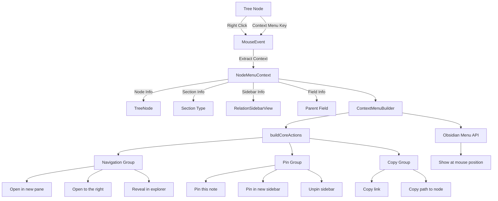
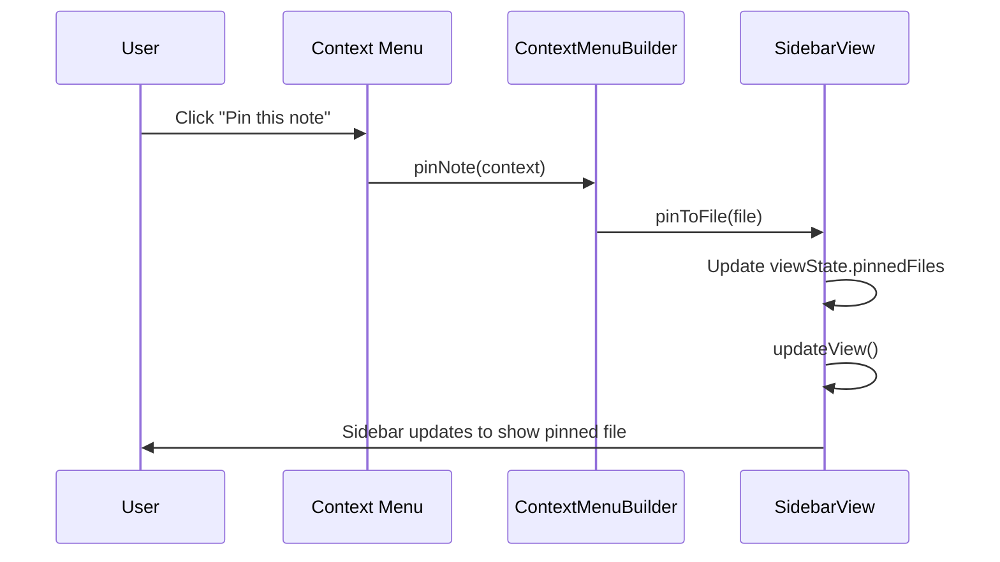
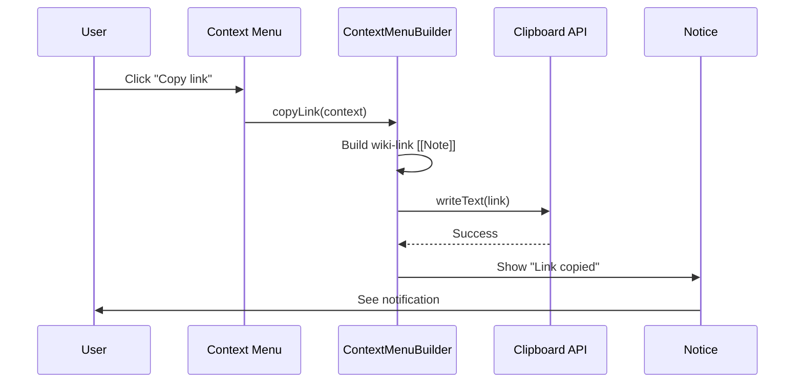
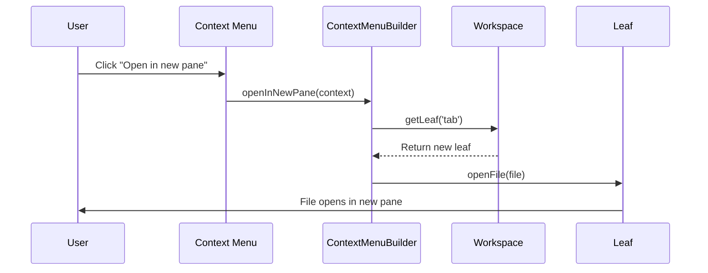

# Milestone 4.3A: Core Context Menu - Implementation Plan

**Status:** Ready for Implementation
**Priority:** High
**Estimated Time:** 2-3 days

---

## Overview

This document provides a comprehensive implementation plan for Milestone 4.3A: Core Context Menu, the first part of the redesigned Milestone 4.3 for the Relations Obsidian plugin.

### Decision Summary

- **Approach:** Obsidian native Menu API integration with context-aware menu building
- **Menu Structure:** Section-aware menus that adapt based on node location (Ancestors/Descendants/Siblings)
- **Action Groups:** Navigation, Pin, and Copy actions (relationship modification deferred to 4.3B)
- **Integration Points:** Tree renderer right-click events with context propagation
- **UI Pattern:** Native Obsidian menu styling for consistency

---

## Goals

Implement essential context menu functionality that allows users to:
- Right-click on any node in the relation tree to open a context menu
- Navigate to notes (open in new pane, open to right, reveal in file explorer)
- Pin notes to the sidebar (pin this note, pin in new sidebar, unpin sidebar)
- Copy note references (copy wiki-link, copy path to node)
- Access context menus via keyboard (context menu key)
- Experience menus that adapt based on section context (Ancestors/Descendants/Siblings)

---

## Current State Analysis

### Existing Architecture

Currently in [`src/sidebar-view.ts`](../src/sidebar-view.ts):
- **No Context Menus:** Tree nodes are rendered without right-click functionality
- **Basic Navigation:** Only click-to-open is supported (line ~400-420)
- **Pin Functionality:** Exists but only accessible via header button (line ~180-200)
- **No Copy Actions:** No built-in way to copy node links or paths

Currently in [`src/tree-renderer.ts`](../src/tree-renderer.ts):
- **Simple Node Rendering:** Nodes render as clickable elements (line ~150-200)
- **No Event Delegation:** Each node has individual click handlers
- **No Context Menu Hooks:** No infrastructure for right-click events

### Problems to Solve

1. **Limited Interaction:** Users can only click to open notes
2. **Pin Access:** Pin functionality hidden in header, not discoverable per-node
3. **No Quick Actions:** Cannot quickly copy links or reveal files
4. **Poor Discoverability:** Advanced features not exposed in UI
5. **Keyboard Accessibility:** No way to access actions via keyboard

---

## Architecture Overview

### Context Menu System



### Key Architectural Decisions

1. **Obsidian Menu API**: Use native `Menu` class for consistency
   - Automatically styled to match Obsidian theme
   - Built-in keyboard navigation
   - Proper focus management
   - Icon support

2. **Context Extraction**: Capture full context at event time
   - Node information (file, depth, metadata)
   - Section type (ancestors, descendants, siblings)
   - Parent field being viewed
   - Sidebar instance reference
   - Pin state

3. **Builder Pattern**: Separate menu construction from action execution
   - Clean separation of concerns
   - Easy to test action logic
   - Extensible for Milestone 4.3B
   - Supports conditional menu items

4. **Event Delegation**: Attach handlers at tree container level
   - Better performance (fewer event listeners)
   - Handles dynamically added nodes
   - Easier cleanup on tree re-render

5. **Keyboard Support**: Handle both mouse and keyboard triggers
   - Right-click (contextmenu event)
   - Context menu key (keyboard event)
   - Proper ARIA labels for accessibility

---

## Data Structures

### New TypeScript Interfaces

**File:** `src/context-menu-builder.ts` (new file)

```typescript
import { TFile, Menu } from 'obsidian';
import { TreeNode } from './tree-model';
import type { RelationSidebarView } from './sidebar-view';

/**
 * Context information for building a node context menu
 */
export interface NodeMenuContext {
  /** The tree node that was right-clicked */
  node: TreeNode;

  /** The file represented by the node */
  file: TFile;

  /** Which section the node appears in */
  section: 'ancestors' | 'descendants' | 'siblings';

  /** Currently selected parent field */
  parentField: string;

  /** Display name of the parent field */
  parentFieldDisplayName: string;

  /** Reference to the sidebar instance */
  sidebarView: RelationSidebarView;

  /** Whether the sidebar is currently pinned */
  isPinned: boolean;

  /** DOM element that was clicked */
  targetElement: HTMLElement;

  /** The mouse event that triggered the menu (if applicable) */
  event?: MouseEvent;
}

/**
 * Configuration for the context menu builder
 */
export interface ContextMenuConfig {
  /** Whether to show navigation actions */
  showNavigation?: boolean;

  /** Whether to show pin actions */
  showPin?: boolean;

  /** Whether to show copy actions */
  showCopy?: boolean;

  /** Whether to show relationship actions (Milestone 4.3B) */
  showRelationship?: boolean;

  /** Whether to show tree manipulation actions (Milestone 4.3B) */
  showTreeActions?: boolean;
}
```

### Default Configuration

```typescript
const DEFAULT_MENU_CONFIG: ContextMenuConfig = {
  showNavigation: true,
  showPin: true,
  showCopy: true,
  showRelationship: false,  // Milestone 4.3B
  showTreeActions: false     // Milestone 4.3B
};
```

---

## Detailed Design

### 1. Context Menu Builder

**File:** `src/context-menu-builder.ts` (new file)

```typescript
import { App, Menu, Notice, TFile } from 'obsidian';
import type ParentRelationPlugin from './main';
import type { RelationSidebarView } from './sidebar-view';
import { NodeMenuContext, ContextMenuConfig } from './types';

/**
 * Builds context menus for tree nodes in the relation sidebar.
 *
 * Supports section-aware menus with actions for navigation, pinning,
 * copying, and (in Milestone 4.3B) relationship modification.
 */
export class ContextMenuBuilder {
  private app: App;
  private plugin: ParentRelationPlugin;
  private config: ContextMenuConfig;

  constructor(
    app: App,
    plugin: ParentRelationPlugin,
    config: ContextMenuConfig = {}
  ) {
    this.app = app;
    this.plugin = plugin;
    this.config = { ...DEFAULT_MENU_CONFIG, ...config };
  }

  /**
   * Builds and shows a context menu for a tree node.
   *
   * @param context - The menu context information
   */
  showContextMenu(context: NodeMenuContext): void {
    const menu = new Menu();

    // Build menu sections
    this.addCoreActions(menu, context);

    // Show menu at mouse position or element position
    if (context.event) {
      menu.showAtMouseEvent(context.event);
    } else {
      // Keyboard trigger - show at element position
      const rect = context.targetElement.getBoundingClientRect();
      menu.showAtPosition({ x: rect.left, y: rect.bottom });
    }
  }

  /**
   * Adds core actions (navigation, pin, copy) to the menu.
   *
   * @param menu - The menu to add items to
   * @param context - The menu context
   */
  private addCoreActions(menu: Menu, context: NodeMenuContext): void {
    // Pin actions
    if (this.config.showPin) {
      this.addPinActions(menu, context);
      menu.addSeparator();
    }

    // Navigation actions
    if (this.config.showNavigation) {
      this.addNavigationActions(menu, context);
      menu.addSeparator();
    }

    // Copy actions
    if (this.config.showCopy) {
      this.addCopyActions(menu, context);
    }
  }

  /**
   * Adds pin-related actions to the menu.
   */
  private addPinActions(menu: Menu, context: NodeMenuContext): void {
    // Pin this note
    menu.addItem(item => {
      item
        .setTitle('Pin this note')
        .setIcon('pin')
        .onClick(() => this.pinNote(context));
    });

    // Pin in new sidebar
    menu.addItem(item => {
      item
        .setTitle('Pin in new sidebar')
        .setIcon('layout-sidebar-right')
        .onClick(() => this.pinInNewSidebar(context));
    });

    // Unpin sidebar (only if currently pinned)
    if (context.isPinned) {
      menu.addItem(item => {
        item
          .setTitle('Unpin sidebar')
          .setIcon('pin-off')
          .onClick(() => this.unpinSidebar(context));
      });
    }
  }

  /**
   * Adds navigation actions to the menu.
   */
  private addNavigationActions(menu: Menu, context: NodeMenuContext): void {
    // Open in new pane
    menu.addItem(item => {
      item
        .setTitle('Open in new pane')
        .setIcon('file-plus')
        .onClick(() => this.openInNewPane(context));
    });

    // Open to the right
    menu.addItem(item => {
      item
        .setTitle('Open to the right')
        .setIcon('separator-vertical')
        .onClick(() => this.openToRight(context));
    });

    // Reveal in file explorer
    menu.addItem(item => {
      item
        .setTitle('Reveal in file explorer')
        .setIcon('folder-tree')
        .onClick(() => this.revealInExplorer(context));
    });
  }

  /**
   * Adds copy actions to the menu.
   */
  private addCopyActions(menu: Menu, context: NodeMenuContext): void {
    // Copy link
    menu.addItem(item => {
      item
        .setTitle('Copy link')
        .setIcon('link')
        .onClick(() => this.copyLink(context));
    });

    // Copy path to node
    menu.addItem(item => {
      item
        .setTitle('Copy path to node')
        .setIcon('arrow-right-from-line')
        .onClick(() => this.copyPathToNode(context));
    });
  }

  //
  // Action Handlers
  //

  /**
   * Pins the clicked note to the current sidebar.
   */
  private pinNote(context: NodeMenuContext): void {
    context.sidebarView.pinToFile(context.file);
  }

  /**
   * Opens a new sidebar instance pinned to the clicked note.
   */
  private async pinInNewSidebar(context: NodeMenuContext): Promise<void> {
    await this.plugin.openNewSidebarPinnedTo(
      context.file,
      context.parentField
    );
  }

  /**
   * Unpins the current sidebar.
   */
  private unpinSidebar(context: NodeMenuContext): void {
    context.sidebarView.unpin();
  }

  /**
   * Opens the file in a new editor pane.
   */
  private async openInNewPane(context: NodeMenuContext): Promise<void> {
    const leaf = this.app.workspace.getLeaf('tab');
    await leaf.openFile(context.file);
  }

  /**
   * Opens the file in a split pane to the right.
   */
  private async openToRight(context: NodeMenuContext): Promise<void> {
    const leaf = this.app.workspace.getLeaf('split', 'vertical');
    await leaf.openFile(context.file);
  }

  /**
   * Reveals the file in the file explorer.
   */
  private revealInExplorer(context: NodeMenuContext): void {
    this.app.workspace.revealFileInExplorer(context.file);
  }

  /**
   * Copies a wiki-link to the file to the clipboard.
   */
  private async copyLink(context: NodeMenuContext): Promise<void> {
    const link = `[[${context.file.basename}]]`;
    await navigator.clipboard.writeText(link);
    new Notice('Link copied to clipboard');
  }

  /**
   * Copies the hierarchical path from root to this node.
   */
  private async copyPathToNode(context: NodeMenuContext): Promise<void> {
    const path = this.buildPathToNode(context);
    await navigator.clipboard.writeText(path);
    new Notice('Path copied to clipboard');
  }

  /**
   * Builds a hierarchical path string for a node.
   *
   * @param context - The menu context
   * @returns Path string like "Root > Parent > Current"
   */
  private buildPathToNode(context: NodeMenuContext): string {
    const path: string[] = [];

    // Build path by traversing up from this node
    // This is a simplified version - actual implementation would
    // need to track parent relationships in the tree

    // For now, just use the file's basename
    // TODO: Implement proper path traversal in Milestone 4.3B
    path.push(context.file.basename);

    return path.join(' > ');
  }
}
```

---

### 2. Tree Renderer Integration

**File:** `src/tree-renderer.ts` (modifications)

```typescript
export interface TreeRendererOptions {
  // ... existing options

  /** Enable context menu on tree nodes */
  enableContextMenu?: boolean;

  /** Custom context menu builder (optional) */
  contextMenuBuilder?: ContextMenuBuilder;
}

export class TreeRenderer {
  private options: Required<TreeRendererOptions>;
  private contextMenuBuilder?: ContextMenuBuilder;

  constructor(app: App, options: TreeRendererOptions = {}) {
    this.options = {
      // ... existing defaults
      enableContextMenu: true,
      contextMenuBuilder: undefined,
      ...options
    };

    this.contextMenuBuilder = this.options.contextMenuBuilder;
  }

  /**
   * Sets the context menu builder.
   *
   * @param builder - The context menu builder to use
   */
  setContextMenuBuilder(builder: ContextMenuBuilder): void {
    this.contextMenuBuilder = builder;
  }

  /**
   * Renders a tree to a container element.
   *
   * @param tree - The root node of the tree
   * @param container - The container element
   * @param context - Additional context for menu building
   */
  render(
    tree: TreeNode,
    container: HTMLElement,
    context?: {
      section?: 'ancestors' | 'descendants' | 'siblings';
      parentField?: string;
      parentFieldDisplayName?: string;
      sidebarView?: RelationSidebarView;
    }
  ): void {
    container.empty();

    const treeContainer = container.createDiv('tree-container');

    // Add event delegation for context menus if enabled
    if (this.options.enableContextMenu && this.contextMenuBuilder && context) {
      this.attachContextMenuHandler(treeContainer, context);
    }

    this.renderNode(tree, treeContainer, 0, context);
  }

  /**
   * Attaches context menu event handler to tree container.
   */
  private attachContextMenuHandler(
    container: HTMLElement,
    context: {
      section?: 'ancestors' | 'descendants' | 'siblings';
      parentField?: string;
      parentFieldDisplayName?: string;
      sidebarView?: RelationSidebarView;
    }
  ): void {
    // Right-click handler
    container.addEventListener('contextmenu', (event: MouseEvent) => {
      event.preventDefault();

      const target = event.target as HTMLElement;
      const nodeEl = target.closest('.tree-node') as HTMLElement;

      if (!nodeEl) return;

      const filePath = nodeEl.getAttribute('data-path');
      if (!filePath) return;

      // Extract node data from DOM
      const nodeData = this.getNodeDataFromElement(nodeEl);
      if (!nodeData) return;

      // Build menu context
      const menuContext: NodeMenuContext = {
        node: nodeData.node,
        file: nodeData.file,
        section: context.section || 'ancestors',
        parentField: context.parentField || '',
        parentFieldDisplayName: context.parentFieldDisplayName || '',
        sidebarView: context.sidebarView!,
        isPinned: context.sidebarView?.isPinnedToCurrentField() || false,
        targetElement: nodeEl,
        event
      };

      // Show context menu
      this.contextMenuBuilder!.showContextMenu(menuContext);
    });

    // Keyboard context menu key handler
    container.addEventListener('keydown', (event: KeyboardEvent) => {
      if (event.key === 'ContextMenu' ||
          (event.shiftKey && event.key === 'F10')) {
        event.preventDefault();

        const target = event.target as HTMLElement;
        const nodeEl = target.closest('.tree-node') as HTMLElement;

        if (!nodeEl) return;

        // Similar logic to right-click, but without mouse event
        const nodeData = this.getNodeDataFromElement(nodeEl);
        if (!nodeData) return;

        const menuContext: NodeMenuContext = {
          node: nodeData.node,
          file: nodeData.file,
          section: context.section || 'ancestors',
          parentField: context.parentField || '',
          parentFieldDisplayName: context.parentFieldDisplayName || '',
          sidebarView: context.sidebarView!,
          isPinned: context.sidebarView?.isPinnedToCurrentField() || false,
          targetElement: nodeEl
        };

        this.contextMenuBuilder!.showContextMenu(menuContext);
      }
    });
  }

  /**
   * Extracts node data from a tree node DOM element.
   */
  private getNodeDataFromElement(nodeEl: HTMLElement): {
    node: TreeNode;
    file: TFile;
  } | null {
    // Get file path from data attribute
    const filePath = nodeEl.getAttribute('data-path');
    if (!filePath) return null;

    // Get file from vault
    const file = this.app.vault.getAbstractFileByPath(filePath);
    if (!(file instanceof TFile)) return null;

    // Get tree node from stored data
    // (We'll need to store a reference to the TreeNode on the element)
    const nodeData = (nodeEl as any).__treeNodeData;
    if (!nodeData) return null;

    return {
      node: nodeData,
      file
    };
  }

  /**
   * Renders a single tree node.
   */
  private renderNode(
    node: TreeNode,
    container: HTMLElement,
    depth: number,
    context?: any
  ): void {
    const nodeEl = container.createDiv('tree-node');
    nodeEl.setAttribute('data-path', node.file.path);
    nodeEl.setAttribute('data-depth', depth.toString());
    nodeEl.setAttribute('tabindex', '0');  // Make focusable for keyboard

    // Store node data on element for context menu access
    (nodeEl as any).__treeNodeData = node;

    // ... rest of existing renderNode implementation
  }
}
```

---

### 3. Sidebar View Integration

**File:** `src/sidebar-view.ts` (modifications)

```typescript
import { ContextMenuBuilder } from './context-menu-builder';

export class RelationSidebarView extends ItemView {
  private plugin: ParentRelationPlugin;
  private renderer: TreeRenderer;
  private contextMenuBuilder: ContextMenuBuilder;  // NEW

  constructor(leaf: WorkspaceLeaf, plugin: ParentRelationPlugin) {
    super(leaf);
    this.plugin = plugin;

    // Initialize context menu builder
    this.contextMenuBuilder = new ContextMenuBuilder(this.app, this.plugin);

    // Initialize tree renderer with context menu support
    this.renderer = new TreeRenderer(this.app, {
      collapsible: true,
      initiallyCollapsed: false,
      enableNavigation: true,
      showCycleIndicators: true,
      enableContextMenu: true,
      cssPrefix: 'relation-tree'
    });

    // Connect context menu builder to renderer
    this.renderer.setContextMenuBuilder(this.contextMenuBuilder);
  }

  /**
   * Renders a single section with context menu support.
   */
  private renderSection(
    sectionType: 'ancestors' | 'descendants' | 'siblings',
    file: TFile,
    fieldConfig: ParentFieldConfig
  ): void {
    // ... existing section rendering code ...

    // Build tree for this section
    const tree = this.buildTreeForSection(sectionType, file, sectionConfig);

    if (!tree || (Array.isArray(tree) && tree.length === 0)) {
      // ... empty state ...
    } else if (Array.isArray(tree)) {
      // For siblings (array of trees)
      tree.forEach(node => {
        this.renderer.render(node, content, {
          section: sectionType,
          parentField: this.viewState.selectedParentField,
          parentFieldDisplayName: fieldConfig.displayName || fieldConfig.name,
          sidebarView: this
        });
      });
    } else {
      // For ancestors/descendants (single tree)
      this.renderer.render(tree, content, {
        section: sectionType,
        parentField: this.viewState.selectedParentField,
        parentFieldDisplayName: fieldConfig.displayName || fieldConfig.name,
        sidebarView: this
      });
    }
  }

  /**
   * Pins the sidebar to a specific file.
   *
   * @param file - The file to pin to
   */
  pinToFile(file: TFile): void {
    const fieldName = this.viewState.selectedParentField;
    this.viewState.pinnedFiles[fieldName] = file.path;
    this.updateView();
  }

  /**
   * Unpins the sidebar.
   */
  unpin(): void {
    const fieldName = this.viewState.selectedParentField;
    delete this.viewState.pinnedFiles[fieldName];
    this.updateView();
  }

  /**
   * Checks if sidebar is pinned for current field.
   */
  isPinnedToCurrentField(): boolean {
    return !!this.viewState.pinnedFiles[this.viewState.selectedParentField];
  }
}
```

---

### 4. Plugin Integration

**File:** `src/main.ts` (modifications)

```typescript
export default class ParentRelationPlugin extends Plugin {
  // ... existing properties ...

  /**
   * Opens a new sidebar instance pinned to a specific file.
   *
   * @param file - The file to pin to
   * @param parentField - The parent field to show
   */
  async openNewSidebarPinnedTo(
    file: TFile,
    parentField: string
  ): Promise<void> {
    // Get or create a new leaf in the right sidebar
    const leaf = this.app.workspace.getRightLeaf(false);

    if (!leaf) {
      new Notice('Could not create new sidebar');
      return;
    }

    // Open the relation sidebar view
    await leaf.setViewState({
      type: VIEW_TYPE_RELATION_SIDEBAR,
      active: true
    });

    // Get the view and configure it
    const view = leaf.view as RelationSidebarView;
    if (view) {
      // Set the parent field
      view.setParentField(parentField);

      // Pin to the file
      view.pinToFile(file);
    }
  }

  /**
   * Refreshes all open sidebar views.
   */
  refreshSidebarViews(): void {
    this.app.workspace.getLeavesOfType(VIEW_TYPE_RELATION_SIDEBAR).forEach(leaf => {
      const view = leaf.view as RelationSidebarView;
      if (view) {
        view.updateView();
      }
    });
  }
}
```

---

### 5. Styling

**File:** `styles.css` (additions)

```css
/* Context Menu Enhancements */
.relation-tree .tree-node {
  cursor: pointer;
  position: relative;
}

.relation-tree .tree-node:focus {
  outline: 2px solid var(--interactive-accent);
  outline-offset: 2px;
}

.relation-tree .tree-node:hover {
  background-color: var(--background-modifier-hover);
}

/* Context menu active state */
.relation-tree .tree-node.is-context-menu-active {
  background-color: var(--background-modifier-active-hover);
}

/* Keyboard focus indicator */
.relation-tree .tree-node:focus-visible {
  outline: 2px solid var(--interactive-accent);
  outline-offset: 2px;
  z-index: 1;
}

/* Menu icon alignment */
.menu .menu-item {
  display: flex;
  align-items: center;
  gap: 8px;
}

.menu .menu-item .menu-item-icon {
  width: 16px;
  height: 16px;
  display: flex;
  align-items: center;
  justify-content: center;
}
```

---

## Test Specification

**File:** `tests/context-menu-builder.test.ts` (new file)

### Test Cases

```typescript
import { describe, it, expect, beforeEach, vi } from 'vitest';
import { ContextMenuBuilder } from '@/context-menu-builder';
import type { NodeMenuContext } from '@/types';

describe('ContextMenuBuilder', () => {
  describe('Menu Construction', () => {
    it('should create menu with all core action groups', () => {
      // Test that menu includes pin, navigation, and copy groups
    });

    it('should add separators between action groups', () => {
      // Verify separators are added correctly
    });

    it('should show unpin action only when pinned', () => {
      // Test conditional menu item display
    });
  });

  describe('Pin Actions', () => {
    it('should pin note to current sidebar', () => {
      // Test pinNote action
    });

    it('should open new sidebar pinned to note', () => {
      // Test pinInNewSidebar action
    });

    it('should unpin sidebar', () => {
      // Test unpinSidebar action
    });
  });

  describe('Navigation Actions', () => {
    it('should open file in new pane', () => {
      // Test openInNewPane action
    });

    it('should open file to the right', () => {
      // Test openToRight action
    });

    it('should reveal file in explorer', () => {
      // Test revealInExplorer action
    });
  });

  describe('Copy Actions', () => {
    it('should copy wiki-link to clipboard', () => {
      // Test copyLink action
    });

    it('should copy path to node', () => {
      // Test copyPathToNode action
    });

    it('should show notice after copy', () => {
      // Verify user feedback
    });
  });

  describe('Section Awareness', () => {
    it('should include section context in menu', () => {
      // Test that section type is available
    });

    it('should include parent field context', () => {
      // Test that parent field info is available
    });
  });

  describe('Keyboard Support', () => {
    it('should handle context menu key', () => {
      // Test keyboard trigger
    });

    it('should handle Shift+F10', () => {
      // Test alternative keyboard shortcut
    });
  });
});
```

---

## Implementation Checklist

### Phase 1: Core Infrastructure (Day 1)

- [ ] **Create Context Menu Builder**
  - [ ] Create `src/context-menu-builder.ts`
  - [ ] Define `NodeMenuContext` interface
  - [ ] Define `ContextMenuConfig` interface
  - [ ] Implement `ContextMenuBuilder` class
  - [ ] Implement `showContextMenu()` method
  - [ ] Implement `addCoreActions()` method
  - [ ] Add JSDoc documentation

### Phase 2: Action Implementations (Day 1-2)

- [ ] **Pin Actions**
  - [ ] Implement `addPinActions()` method
  - [ ] Implement `pinNote()` handler
  - [ ] Implement `pinInNewSidebar()` handler
  - [ ] Implement `unpinSidebar()` handler
  - [ ] Add conditional unpin display
  - [ ] Add pin icons

- [ ] **Navigation Actions**
  - [ ] Implement `addNavigationActions()` method
  - [ ] Implement `openInNewPane()` handler
  - [ ] Implement `openToRight()` handler
  - [ ] Implement `revealInExplorer()` handler
  - [ ] Add navigation icons

- [ ] **Copy Actions**
  - [ ] Implement `addCopyActions()` method
  - [ ] Implement `copyLink()` handler
  - [ ] Implement `copyPathToNode()` handler
  - [ ] Implement `buildPathToNode()` utility
  - [ ] Add clipboard integration
  - [ ] Add success notifications

### Phase 3: Tree Renderer Integration (Day 2)

- [ ] **Update Tree Renderer**
  - [ ] Modify `src/tree-renderer.ts`
  - [ ] Add `enableContextMenu` option
  - [ ] Add `contextMenuBuilder` property
  - [ ] Implement `setContextMenuBuilder()` method
  - [ ] Update `render()` method signature
  - [ ] Implement `attachContextMenuHandler()` method
  - [ ] Implement `getNodeDataFromElement()` method
  - [ ] Store node data on DOM elements
  - [ ] Add keyboard event handling
  - [ ] Add tabindex for focusability

### Phase 4: Sidebar Integration (Day 2-3)

- [ ] **Update Sidebar View**
  - [ ] Modify `src/sidebar-view.ts`
  - [ ] Import `ContextMenuBuilder`
  - [ ] Initialize context menu builder in constructor
  - [ ] Connect builder to renderer
  - [ ] Update `renderSection()` to pass context
  - [ ] Implement `pinToFile()` method
  - [ ] Implement `unpin()` method
  - [ ] Implement `isPinnedToCurrentField()` method

- [ ] **Update Plugin**
  - [ ] Modify `src/main.ts`
  - [ ] Implement `openNewSidebarPinnedTo()` method
  - [ ] Implement `refreshSidebarViews()` method
  - [ ] Add view configuration helpers

### Phase 5: Styling & Polish (Day 3)

- [ ] **Add CSS Styles**
  - [ ] Add tree node hover states
  - [ ] Add tree node focus states
  - [ ] Add context menu active state
  - [ ] Add keyboard focus indicators
  - [ ] Test in light and dark themes
  - [ ] Ensure accessibility compliance

- [ ] **Testing & Bug Fixes**
  - [ ] Create `tests/context-menu-builder.test.ts`
  - [ ] Write menu construction tests
  - [ ] Write action handler tests
  - [ ] Write section awareness tests
  - [ ] Write keyboard support tests
  - [ ] Manual testing in Obsidian
  - [ ] Fix any bugs found

### Phase 6: Documentation (Day 3)

- [ ] **Code Documentation**
  - [ ] Add JSDoc comments to all public methods
  - [ ] Document menu context structure
  - [ ] Document action handlers
  - [ ] Add usage examples

- [ ] **User Documentation**
  - [ ] Update README with context menu features
  - [ ] Add screenshots of context menu
  - [ ] Document keyboard shortcuts
  - [ ] Create troubleshooting guide

---

## Acceptance Criteria

From specification:

- ✅ Right-click on any tree node shows context menu
- ✅ Menu adapts to section (Ancestors/Descendants/Siblings)
- ✅ Navigation actions work correctly
- ✅ Pin actions work per sidebar instance
- ✅ Copy actions copy correct content to clipboard
- ✅ Menu integrates seamlessly with Obsidian UI
- ✅ Keyboard context menu key works
- ✅ Multiple sidebars work independently

**Additional Criteria:**
- ✅ All menu items have icons
- ✅ Menu matches Obsidian theme (light and dark)
- ✅ Separators appear between action groups
- ✅ Unpin action shows only when pinned
- ✅ Success notifications appear for copy actions
- ✅ Context menu closes when clicking elsewhere
- ✅ Keyboard navigation works within menu

---

## Performance Considerations

### Menu Building Performance
- **Target:** Menu appears in <50ms after right-click
- **Strategy:** Pre-built action registry, lazy evaluation of conditions
- **Optimization:** Minimal context extraction, cached menu builders

### Event Handling
- **Event Delegation:** Single listener per tree container (not per node)
- **Memory Efficiency:** No memory leaks from event listeners
- **Cleanup:** Proper cleanup on tree re-render

### Clipboard Operations
- **Async Clipboard:** Use navigator.clipboard.writeText()
- **Fallback:** Graceful degradation if clipboard API unavailable
- **User Feedback:** Immediate notice on copy

---

## Edge Cases & Considerations

### 1. Missing File Reference
**Scenario:** Tree node references deleted file
**Handling:** Menu shows but actions fail gracefully
**UI:** Show error notice if action fails

### 2. No Active Leaf
**Scenario:** Cannot create new pane/split
**Handling:** Show error notice, action fails gracefully
**UI:** "Could not create pane" notification

### 3. Clipboard API Unavailable
**Scenario:** Browser doesn't support clipboard API
**Handling:** Fall back to document.execCommand (deprecated but works)
**UI:** Show notice either way

### 4. Multiple Context Menus
**Scenario:** User right-clicks multiple nodes quickly
**Handling:** Obsidian Menu API handles this (closes previous menu)
**Result:** Only one menu visible at a time

### 5. Pin While Already Pinned
**Scenario:** Pin action when sidebar already pinned to another file
**Handling:** Replace existing pin with new file
**UI:** Update pin indicator immediately

### 6. Context Menu on Cycle Node
**Scenario:** Right-click on a node marked as cycle
**Handling:** Normal menu appears (cycle is metadata only)
**Future:** Could add cycle-specific actions in 4.3B

---

## Testing Strategy

### Unit Tests
- **Location:** `tests/context-menu-builder.test.ts`
- **Coverage:** All action handlers, menu construction, context extraction
- **Mocks:** Mock TFile, Mock Menu API, Mock clipboard

### Integration Tests
- **Test with:** Real sidebar view and tree renderer
- **Verify:** Full right-click → menu → action flow
- **Check:** State updates propagate correctly

### Manual Testing Checklist
- [ ] Right-click shows menu at cursor
- [ ] Menu has all expected items
- [ ] Icons display correctly
- [ ] Separators appear between groups
- [ ] Unpin shows only when pinned
- [ ] Navigation actions open files correctly
- [ ] Pin actions update sidebar state
- [ ] Copy actions copy to clipboard
- [ ] Success notices appear
- [ ] Context menu key works
- [ ] Shift+F10 works
- [ ] Menu closes when clicking away
- [ ] Works in light and dark themes
- [ ] Works across multiple sidebars

### Accessibility Testing
- [ ] Keyboard navigation within menu
- [ ] Focus indicators visible
- [ ] ARIA labels present
- [ ] Screen reader compatible

---

## Success Metrics

- ✅ All acceptance criteria met
- ✅ All unit tests passing (>15 tests)
- ✅ All integration tests passing
- ✅ Manual testing checklist complete
- ✅ No performance degradation
- ✅ Zero memory leaks
- ✅ Accessibility standards met
- ✅ Code review approved
- ✅ Documentation complete

---

## Dependencies

### External Dependencies
- `obsidian` - Menu API, clipboard API (already installed)
- `vitest` - Testing framework (already installed ✅)

### Internal Dependencies
- Milestone 4.2A (Basic Multi-Field Support) - ✅ Required
  - Need `RelationSidebarView` with multiple sections
  - Need parent field context
  - Need pin state management
- `tree-renderer.ts` - Tree rendering (existing)
- `tree-model.ts` - TreeNode interface (existing)

---

## Risk Assessment

### Potential Issues

1. **Risk:** Context menu doesn't show or shows at wrong position
   - **Mitigation:** Test both mouse and keyboard triggers
   - **Testing:** Test in different viewport positions
   - **Fallback:** Log errors, show notice to user

2. **Risk:** Memory leaks from event listeners
   - **Mitigation:** Use event delegation, proper cleanup
   - **Testing:** Memory profiling in DevTools
   - **Monitoring:** Check for listener accumulation

3. **Risk:** Clipboard operations fail silently
   - **Mitigation:** Always show notice (success or error)
   - **Testing:** Test in different browsers
   - **Fallback:** Provide manual copy option

4. **Risk:** Menu actions interfere with existing functionality
   - **Mitigation:** Test alongside existing click handlers
   - **Testing:** Verify normal clicks still work
   - **Isolation:** Separate right-click from left-click logic

---

## Future Enhancements (Out of Scope for 4.3A)

Deferred to **Milestone 4.3B**:
- [ ] Relationship modification actions
  - [ ] Set as {Field} parent
  - [ ] Remove as {Field} parent
  - [ ] Remove as {Field} child
- [ ] Tree manipulation actions
  - [ ] Expand all children
  - [ ] Collapse all children
  - [ ] Expand to this node
- [ ] Command palette integration
- [ ] Custom keyboard shortcuts
- [ ] Confirmation dialogs for destructive actions

**Later Milestones:**
- [ ] Multi-select support for batch operations
- [ ] Custom menu actions from other plugins
- [ ] Drag-and-drop relationship modification
- [ ] Quick actions toolbar
- [ ] Action history/recent actions
- [ ] Context menu presets
- [ ] Custom menu templates

---

## Next Steps After Completion

1. ✅ Complete Milestone 4.3A implementation
2. Verify all acceptance criteria met
3. Run comprehensive testing (unit, integration, manual)
4. Update documentation with screenshots
5. Create demo video showing context menu features
6. Gather user feedback on menu actions
7. Proceed to **Milestone 4.3B** (Advanced Context Menu)
   - Add relationship modification actions
   - Add tree manipulation actions
   - Add command palette integration
   - Add confirmation dialogs

---

## Appendix A: Example Usage

### Right-Click Menu (Ancestors Section)

```
User right-clicks on "Parent Note" in Ancestors section:

📄 Parent Note
├─ Pin this note
├─ Pin in new sidebar
├─ ────────────────────────────────
├─ Open in new pane
├─ Open to the right
├─ Reveal in file explorer
├─ ────────────────────────────────
├─ Copy link
└─ Copy path to node
```

### Right-Click Menu (Pinned Sidebar)

```
User right-clicks when sidebar is pinned:

📄 Current Note
├─ Pin this note
├─ Pin in new sidebar
├─ Unpin sidebar                    ← Only shows when pinned
├─ ────────────────────────────────
├─ Open in new pane
├─ Open to the right
├─ Reveal in file explorer
├─ ────────────────────────────────
├─ Copy link
└─ Copy path to node
```

### Programmatic Usage

```typescript
// In sidebar view
const builder = new ContextMenuBuilder(this.app, this.plugin);

// Create context
const context: NodeMenuContext = {
  node: treeNode,
  file: file,
  section: 'ancestors',
  parentField: 'parent',
  parentFieldDisplayName: 'Parent',
  sidebarView: this,
  isPinned: false,
  targetElement: element,
  event: mouseEvent
};

// Show menu
builder.showContextMenu(context);
```

---

## Appendix B: Action Flow Diagrams

### Pin This Note Flow



### Copy Link Flow



### Open in New Pane Flow



---

## Appendix C: Keyboard Shortcuts

### Built-in Obsidian Menu Navigation
- **Arrow Keys:** Navigate menu items
- **Enter:** Activate selected item
- **Escape:** Close menu
- **Tab:** Move to next item
- **Shift+Tab:** Move to previous item

### Trigger Context Menu
- **Context Menu Key:** Open context menu at focused node
- **Shift+F10:** Alternative trigger
- **Right Click:** Mouse trigger

### Recommended User Shortcuts (Assignable in Milestone 4.3B)
- **Ctrl/Cmd+Shift+P:** Pin focused note
- **Ctrl/Cmd+Shift+C:** Copy link to focused note
- **Ctrl/Cmd+Shift+R:** Reveal focused note in explorer

---

**Document Version:** 1.0
**Last Updated:** 2025-11-16
**Status:** Ready for Implementation
