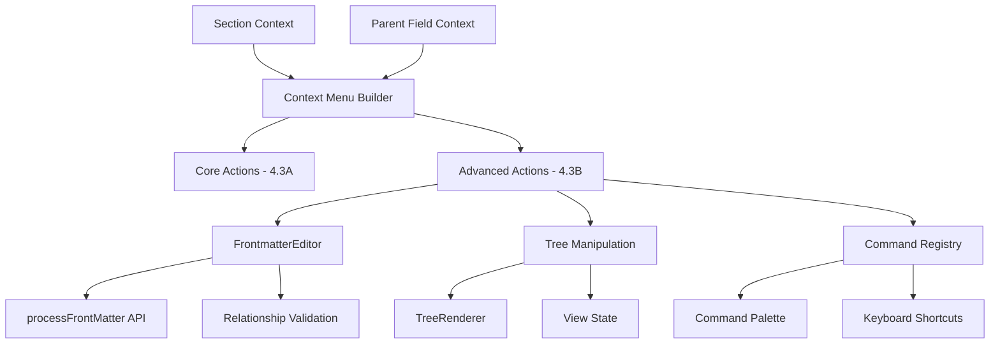

# Milestone 4.3B: Advanced Context Menu - Implementation Plan

**Status:** Ready for Implementation
**Priority:** High
**Estimated Time:** 2-3 days

---

## Overview

This document provides a comprehensive implementation plan for Milestone 4.3B: Advanced Context Menu, the second part of the context menu enhancement system for the Relations Obsidian plugin.

### Decision Summary

- **Approach:** Extend Milestone 4.3A with relationship modification and tree manipulation
- **Frontmatter Editing:** Use Obsidian's built-in `processFrontMatter` API for safe modifications
- **Confirmation Strategy:** Require confirmation for destructive actions (remove relationships)
- **Command Integration:** Expose key actions via Obsidian's command palette
- **Section-Specific Menus:** Different actions based on section context

---

## Goals

Implement advanced context menu functionality that allows users to:
- Modify parent-child relationships directly from context menus
- Set/remove parent relationships via context menu
- Remove child relationships from descendant nodes
- Expand/collapse entire subtrees
- Access key actions via command palette with keyboard shortcuts
- Experience intelligent section-specific menu options

---

## Current State Analysis

### Existing Architecture (from Milestone 4.3A)

Currently in [`src/context-menu-builder.ts`](../src/context-menu-builder.ts):
- **Core Actions Implemented:** Pin, navigation, and copy actions (Milestone 4.3A)
- **Section Detection:** Context menu knows which section a node is in
- **Field Awareness:** Context menu has access to current parent field
- **Multi-Sidebar Support:** Independent context menus per sidebar instance

### Features Needed

1. **Frontmatter Modification:** Safe editing of parent field arrays
2. **Relationship Actions:** Add/remove parent-child links
3. **Tree Manipulation:** Expand/collapse operations
4. **Section Logic:** Different actions for ancestors vs descendants vs siblings
5. **Command Integration:** Commands for keyboard shortcuts
6. **Confirmation Dialogs:** Prevent accidental relationship changes

---

## Architecture Overview

### Component Interaction



### Key Architectural Decisions

1. **Frontmatter Safety:** Use Obsidian's `processFrontMatter` API
   - Atomic file writes
   - Automatic undo/redo support
   - Conflict handling built-in
   - Format preservation

2. **Two-Way Relationships:** Modify both sides of relationships
   - Set parent: Add to current file's frontmatter
   - Remove parent: Remove from current file's frontmatter
   - Remove child: Remove from other file's frontmatter

3. **Section-Specific Actions:** Menu adapts to context
   - Ancestors: Show "Set as parent", "Remove as parent"
   - Descendants: Show "Remove as child"
   - Siblings: Show "Set as parent"

4. **Command Architecture:** Register globally accessible commands
   - Allow keyboard shortcut assignment
   - Work without context menu
   - Respect command availability conditions

---

## Data Structures

### New TypeScript Interfaces

**File:** `src/frontmatter-editor.ts` (new file)

```typescript
/**
 * Result of a frontmatter modification operation
 */
export interface FrontmatterEditResult {
  /** Whether the operation succeeded */
  success: boolean;

  /** Error message if operation failed */
  error?: string;

  /** The modified file */
  file: TFile;

  /** The field that was modified */
  field: string;

  /** The value that was added/removed */
  value: string;

  /** Type of operation performed */
  operation: 'add' | 'remove';
}

/**
 * Options for frontmatter modification
 */
export interface FrontmatterEditOptions {
  /** Whether to create field if it doesn't exist */
  createIfMissing?: boolean;

  /** Whether to remove field if it becomes empty */
  removeIfEmpty?: boolean;

  /** Whether to validate the value before adding */
  validate?: boolean;

  /** Custom validator function */
  validator?: (value: string) => boolean;
}
```

### Extended Menu Context

**File:** `src/context-menu-builder.ts` (additions)

```typescript
/**
 * Extended context for advanced menu actions
 */
export interface AdvancedMenuContext extends NodeMenuContext {
  /** The frontmatter editor instance */
  frontmatterEditor: FrontmatterEditor;

  /** Whether the node is currently a parent of active file */
  isCurrentParent: boolean;

  /** Whether the active file is currently a parent of this node */
  isCurrentChild: boolean;

  /** Whether the node has children that can be expanded */
  hasExpandableChildren: boolean;
}
```

---

## Detailed Design

### 1. FrontmatterEditor Class

**File:** `src/frontmatter-editor.ts` (new file)

```typescript
import { App, TFile, Notice } from 'obsidian';

/**
 * Safely modifies note frontmatter for relationship management.
 *
 * Uses Obsidian's processFrontMatter API to ensure safe, atomic updates
 * with automatic undo/redo support.
 */
export class FrontmatterEditor {
  private app: App;

  constructor(app: App) {
    this.app = app;
  }

  /**
   * Adds a value to a frontmatter field array.
   *
   * @param file - The file to modify
   * @param fieldName - The frontmatter field name
   * @param value - The value to add (wiki-link format)
   * @param options - Modification options
   * @returns Result of the operation
   *
   * @example
   * await editor.addToField(currentFile, 'parent', '[[Project A]]');
   */
  async addToField(
    file: TFile,
    fieldName: string,
    value: string,
    options: FrontmatterEditOptions = {}
  ): Promise<FrontmatterEditResult> {
    try {
      await this.app.fileManager.processFrontMatter(file, (frontmatter) => {
        // Get current field value
        let fieldValue = frontmatter[fieldName];

        // Initialize as array if missing
        if (fieldValue === undefined || fieldValue === null) {
          if (!options.createIfMissing) {
            throw new Error(`Field "${fieldName}" does not exist`);
          }
          fieldValue = [];
        }

        // Ensure array format
        const fieldArray = Array.isArray(fieldValue)
          ? fieldValue
          : [fieldValue];

        // Validate value if validator provided
        if (options.validator && !options.validator(value)) {
          throw new Error(`Invalid value: ${value}`);
        }

        // Check for duplicates
        if (fieldArray.includes(value)) {
          throw new Error(`Value already exists: ${value}`);
        }

        // Add value
        fieldArray.push(value);

        // Update frontmatter
        frontmatter[fieldName] = fieldArray;
      });

      return {
        success: true,
        file,
        field: fieldName,
        value,
        operation: 'add'
      };

    } catch (error) {
      return {
        success: false,
        error: error.message,
        file,
        field: fieldName,
        value,
        operation: 'add'
      };
    }
  }

  /**
   * Removes a value from a frontmatter field array.
   *
   * @param file - The file to modify
   * @param fieldName - The frontmatter field name
   * @param value - The value to remove
   * @param options - Modification options
   * @returns Result of the operation
   *
   * @example
   * await editor.removeFromField(currentFile, 'parent', '[[Old Parent]]');
   */
  async removeFromField(
    file: TFile,
    fieldName: string,
    value: string,
    options: FrontmatterEditOptions = {}
  ): Promise<FrontmatterEditResult> {
    try {
      await this.app.fileManager.processFrontMatter(file, (frontmatter) => {
        const fieldValue = frontmatter[fieldName];

        // Field doesn't exist - nothing to remove
        if (fieldValue === undefined || fieldValue === null) {
          throw new Error(`Field "${fieldName}" does not exist`);
        }

        // Ensure array format
        const fieldArray = Array.isArray(fieldValue)
          ? fieldValue
          : [fieldValue];

        // Check if value exists
        if (!fieldArray.includes(value)) {
          throw new Error(`Value not found: ${value}`);
        }

        // Remove value
        const filtered = fieldArray.filter(v => v !== value);

        // Update frontmatter
        if (filtered.length === 0 && options.removeIfEmpty) {
          // Remove field entirely if empty
          delete frontmatter[fieldName];
        } else if (filtered.length === 1) {
          // Convert to single value if only one remains
          frontmatter[fieldName] = filtered[0];
        } else {
          // Keep as array
          frontmatter[fieldName] = filtered;
        }
      });

      return {
        success: true,
        file,
        field: fieldName,
        value,
        operation: 'remove'
      };

    } catch (error) {
      return {
        success: false,
        error: error.message,
        file,
        field: fieldName,
        value,
        operation: 'remove'
      };
    }
  }

  /**
   * Checks if a file has a specific value in a frontmatter field.
   *
   * @param file - The file to check
   * @param fieldName - The frontmatter field name
   * @param value - The value to look for
   * @returns Whether the value exists in the field
   */
  hasFieldValue(file: TFile, fieldName: string, value: string): boolean {
    const cache = this.app.metadataCache.getFileCache(file);
    if (!cache?.frontmatter) return false;

    const fieldValue = cache.frontmatter[fieldName];
    if (!fieldValue) return false;

    const fieldArray = Array.isArray(fieldValue) ? fieldValue : [fieldValue];
    return fieldArray.includes(value);
  }

  /**
   * Gets all values from a frontmatter field.
   *
   * @param file - The file to check
   * @param fieldName - The frontmatter field name
   * @returns Array of values (empty if field doesn't exist)
   */
  getFieldValues(file: TFile, fieldName: string): string[] {
    const cache = this.app.metadataCache.getFileCache(file);
    if (!cache?.frontmatter) return [];

    const fieldValue = cache.frontmatter[fieldName];
    if (!fieldValue) return [];

    return Array.isArray(fieldValue) ? fieldValue : [fieldValue];
  }
}
```

**Design Rationale:**
- **processFrontMatter API:** Built-in Obsidian API ensures safe atomic writes
- **Array Normalization:** Handles both single values and arrays transparently
- **Error Handling:** Returns result objects instead of throwing errors
- **Undo Support:** processFrontMatter automatically supports undo/redo
- **Format Preservation:** Maintains frontmatter formatting and order

---

### 2. Advanced Context Menu Actions

**File:** `src/context-menu-builder.ts` (modifications)

#### Add Advanced Actions Group:

```typescript
/**
 * Adds advanced actions (4.3B) to the context menu.
 *
 * @param menu - The Obsidian menu instance
 * @param context - Extended menu context with frontmatter editor
 */
private addAdvancedActions(menu: Menu, context: AdvancedMenuContext): void {
  // Relationship modification (section-specific)
  if (this.shouldShowRelationshipActions(context)) {
    menu.addSeparator();
    this.addRelationshipActions(menu, context);
  }

  // Tree manipulation
  if (this.shouldShowTreeActions(context)) {
    menu.addSeparator();
    this.addTreeActions(menu, context);
  }
}

/**
 * Adds relationship modification actions.
 */
private addRelationshipActions(menu: Menu, context: AdvancedMenuContext): void {
  const { section, parentFieldDisplayName, isCurrentParent } = context;

  // "Set as [Field] parent" - Available in Ancestors and Siblings sections
  if (section === 'ancestors' || section === 'siblings') {
    menu.addItem((item) => {
      item
        .setTitle(`Set as ${parentFieldDisplayName} parent`)
        .setIcon('arrow-up')
        .onClick(async () => {
          await this.handleSetAsParent(context);
        });
    });
  }

  // "Remove as [Field] parent" - Only in Ancestors if currently a parent
  if (section === 'ancestors' && isCurrentParent) {
    menu.addItem((item) => {
      item
        .setTitle(`Remove as ${parentFieldDisplayName} parent`)
        .setIcon('x')
        .onClick(async () => {
          await this.handleRemoveAsParent(context);
        });
    });
  }

  // "Remove as [Field] child" - Only in Descendants
  if (section === 'descendants') {
    menu.addItem((item) => {
      item
        .setTitle(`Remove as ${parentFieldDisplayName} child`)
        .setIcon('x')
        .onClick(async () => {
          await this.handleRemoveAsChild(context);
        });
    });
  }
}

/**
 * Adds tree manipulation actions.
 */
private addTreeActions(menu: Menu, context: AdvancedMenuContext): void {
  const { node, hasExpandableChildren } = context;

  // Only show if node has children
  if (!hasExpandableChildren) return;

  menu.addItem((item) => {
    item
      .setTitle('Expand all children')
      .setIcon('chevrons-down')
      .onClick(() => {
        this.handleExpandAllChildren(context);
      });
  });

  menu.addItem((item) => {
    item
      .setTitle('Collapse all children')
      .setIcon('chevrons-up')
      .onClick(() => {
        this.handleCollapseAllChildren(context);
      });
  });

  // "Expand to this node" - Only if not at root level
  if (node.depth > 0) {
    menu.addItem((item) => {
      item
        .setTitle('Expand to this node')
        .setIcon('arrow-down-to-line')
        .onClick(() => {
          this.handleExpandToNode(context);
        });
    });
  }
}

/**
 * Determines if relationship actions should be shown.
 */
private shouldShowRelationshipActions(context: AdvancedMenuContext): boolean {
  const { section, isCurrentParent } = context;

  // Show in ancestors/siblings for "Set as parent"
  if (section === 'ancestors' || section === 'siblings') return true;

  // Show in ancestors if currently a parent (for remove)
  if (section === 'ancestors' && isCurrentParent) return true;

  // Show in descendants for "Remove as child"
  if (section === 'descendants') return true;

  return false;
}

/**
 * Determines if tree actions should be shown.
 */
private shouldShowTreeActions(context: AdvancedMenuContext): boolean {
  return context.hasExpandableChildren || context.node.depth > 0;
}
```

#### Action Handlers:

```typescript
/**
 * Handles "Set as [Field] parent" action.
 */
private async handleSetAsParent(context: AdvancedMenuContext): Promise<void> {
  const { file, frontmatterEditor, parentField, parentFieldDisplayName } = context;
  const currentFile = this.app.workspace.getActiveFile();

  if (!currentFile) {
    new Notice('No active file');
    return;
  }

  // Create wiki-link format
  const wikiLink = `[[${file.basename}]]`;

  // Add to current file's parent field
  const result = await frontmatterEditor.addToField(
    currentFile,
    parentField,
    wikiLink,
    { createIfMissing: true }
  );

  if (result.success) {
    new Notice(`Added as ${parentFieldDisplayName} parent`);
    // Trigger sidebar refresh
    context.sidebarView.updateView();
  } else {
    new Notice(`Failed to add parent: ${result.error}`);
  }
}

/**
 * Handles "Remove as [Field] parent" action.
 */
private async handleRemoveAsParent(context: AdvancedMenuContext): Promise<void> {
  const { file, frontmatterEditor, parentField, parentFieldDisplayName } = context;
  const currentFile = this.app.workspace.getActiveFile();

  if (!currentFile) {
    new Notice('No active file');
    return;
  }

  // Confirm destructive action
  const confirmed = await this.confirmAction(
    'Remove Parent Relationship',
    `Remove "${file.basename}" as a ${parentFieldDisplayName} parent?`
  );

  if (!confirmed) return;

  // Create wiki-link format
  const wikiLink = `[[${file.basename}]]`;

  // Remove from current file's parent field
  const result = await frontmatterEditor.removeFromField(
    currentFile,
    parentField,
    wikiLink,
    { removeIfEmpty: true }
  );

  if (result.success) {
    new Notice(`Removed as ${parentFieldDisplayName} parent`);
    // Trigger sidebar refresh
    context.sidebarView.updateView();
  } else {
    new Notice(`Failed to remove parent: ${result.error}`);
  }
}

/**
 * Handles "Remove as [Field] child" action.
 */
private async handleRemoveAsChild(context: AdvancedMenuContext): Promise<void> {
  const { file, frontmatterEditor, parentField, parentFieldDisplayName } = context;
  const currentFile = this.app.workspace.getActiveFile();

  if (!currentFile) {
    new Notice('No active file');
    return;
  }

  // Confirm destructive action
  const confirmed = await this.confirmAction(
    'Remove Child Relationship',
    `Remove current note as a ${parentFieldDisplayName} child of "${file.basename}"?`
  );

  if (!confirmed) return;

  // Create wiki-link format for current file
  const wikiLink = `[[${currentFile.basename}]]`;

  // Remove from other file's parent field
  const result = await frontmatterEditor.removeFromField(
    file,
    parentField,
    wikiLink,
    { removeIfEmpty: true }
  );

  if (result.success) {
    new Notice(`Removed as ${parentFieldDisplayName} child`);
    // Trigger sidebar refresh
    context.sidebarView.updateView();
  } else {
    new Notice(`Failed to remove child: ${result.error}`);
  }
}

/**
 * Shows confirmation dialog for destructive actions.
 */
private async confirmAction(title: string, message: string): Promise<boolean> {
  return new Promise((resolve) => {
    const modal = new ConfirmationModal(this.app, title, message, (confirmed) => {
      resolve(confirmed);
    });
    modal.open();
  });
}

/**
 * Handles "Expand all children" action.
 */
private handleExpandAllChildren(context: AdvancedMenuContext): void {
  const { node, sidebarView } = context;

  // Delegate to TreeRenderer
  const renderer = sidebarView.getRenderer();
  renderer.expandAllChildren(node);
}

/**
 * Handles "Collapse all children" action.
 */
private handleCollapseAllChildren(context: AdvancedMenuContext): void {
  const { node, sidebarView } = context;

  // Delegate to TreeRenderer
  const renderer = sidebarView.getRenderer();
  renderer.collapseAllChildren(node);
}

/**
 * Handles "Expand to this node" action.
 */
private handleExpandToNode(context: AdvancedMenuContext): void {
  const { node, sidebarView } = context;

  // Delegate to TreeRenderer
  const renderer = sidebarView.getRenderer();
  renderer.expandToNode(node);
}
```

---

### 3. Confirmation Modal

**File:** `src/components/confirmation-modal.ts` (new file)

```typescript
import { App, Modal } from 'obsidian';

/**
 * Simple confirmation modal for destructive actions.
 */
export class ConfirmationModal extends Modal {
  private title: string;
  private message: string;
  private onConfirm: (confirmed: boolean) => void;

  constructor(
    app: App,
    title: string,
    message: string,
    onConfirm: (confirmed: boolean) => void
  ) {
    super(app);
    this.title = title;
    this.message = message;
    this.onConfirm = onConfirm;
  }

  onOpen() {
    const { contentEl } = this;
    contentEl.empty();

    contentEl.addClass('relation-confirmation-modal');

    // Title
    contentEl.createEl('h2', { text: this.title });

    // Message
    contentEl.createEl('p', { text: this.message });

    // Buttons
    const buttonContainer = contentEl.createDiv('modal-button-container');

    // Cancel button
    const cancelButton = buttonContainer.createEl('button', {
      text: 'Cancel',
      cls: 'mod-secondary'
    });
    cancelButton.addEventListener('click', () => {
      this.onConfirm(false);
      this.close();
    });

    // Confirm button
    const confirmButton = buttonContainer.createEl('button', {
      text: 'Confirm',
      cls: 'mod-warning'
    });
    confirmButton.addEventListener('click', () => {
      this.onConfirm(true);
      this.close();
    });

    // Focus confirm button
    confirmButton.focus();
  }

  onClose() {
    const { contentEl } = this;
    contentEl.empty();
  }
}
```

---

### 4. TreeRenderer Extensions

**File:** `src/tree-renderer.ts` (additions)

```typescript
/**
 * Expands all children of a node recursively.
 *
 * @param node - The root node to expand from
 */
expandAllChildren(node: TreeNode): void {
  const domNode = this.findDomNode(node);
  if (!domNode) return;

  // Expand this node if it has children
  if (node.children.length > 0) {
    this.expandNode(domNode);

    // Recursively expand all children
    node.children.forEach(child => {
      this.expandAllChildren(child);
    });
  }
}

/**
 * Collapses all children of a node recursively.
 *
 * @param node - The root node to collapse from
 */
collapseAllChildren(node: TreeNode): void {
  const domNode = this.findDomNode(node);
  if (!domNode) return;

  // First collapse all descendants
  node.children.forEach(child => {
    this.collapseAllChildren(child);
  });

  // Then collapse this node
  if (node.children.length > 0) {
    this.collapseNode(domNode);
  }
}

/**
 * Expands all ancestors to make a node visible.
 *
 * @param node - The target node to reveal
 */
expandToNode(node: TreeNode): void {
  // Build path from root to node
  const path = this.buildPathToNode(node);

  // Expand each node in the path
  path.forEach(pathNode => {
    const domNode = this.findDomNode(pathNode);
    if (domNode && pathNode.children.length > 0) {
      this.expandNode(domNode);
    }
  });

  // Scroll target into view
  const targetDomNode = this.findDomNode(node);
  if (targetDomNode) {
    targetDomNode.scrollIntoView({ behavior: 'smooth', block: 'center' });
  }
}

/**
 * Builds path from root to a specific node.
 *
 * @param targetNode - The target node
 * @returns Array of nodes from root to target
 */
private buildPathToNode(targetNode: TreeNode): TreeNode[] {
  const path: TreeNode[] = [];

  // Walk up the tree using parent references
  // (This requires tracking parent in TreeNode or in renderer state)
  // For now, use a simplified approach with BFS to find path

  // Implementation details...
  return path;
}

/**
 * Finds the DOM element for a tree node.
 *
 * @param node - The tree node
 * @returns The DOM element, or null if not found
 */
private findDomNode(node: TreeNode): HTMLElement | null {
  // Look up node in renderer's DOM cache
  // (Requires maintaining a map of TreeNode -> HTMLElement)

  // Implementation details...
  return null;
}

/**
 * Expands a single node.
 */
private expandNode(domNode: HTMLElement): void {
  domNode.removeClass('is-collapsed');
  const toggle = domNode.querySelector('.tree-item-toggle');
  if (toggle) {
    setIcon(toggle as HTMLElement, 'chevron-down');
  }
}

/**
 * Collapses a single node.
 */
private collapseNode(domNode: HTMLElement): void {
  domNode.addClass('is-collapsed');
  const toggle = domNode.querySelector('.tree-item-toggle');
  if (toggle) {
    setIcon(toggle as HTMLElement, 'chevron-right');
  }
}
```

---

### 5. Command Palette Integration

**File:** `src/main.ts` (additions)

```typescript
/**
 * Registers commands for context menu actions.
 */
private registerCommands(): void {
  // Pin clicked note
  this.addCommand({
    id: 'pin-clicked-note',
    name: 'Pin clicked note to sidebar',
    callback: () => {
      // Get the last clicked node from context
      // This requires tracking click state
      const lastClickedFile = this.getLastClickedFile();
      if (lastClickedFile) {
        this.pinToSidebar(lastClickedFile);
      } else {
        new Notice('No note selected');
      }
    }
  });

  // Set as parent of current note
  this.addCommand({
    id: 'set-as-parent',
    name: 'Set as parent of current note',
    callback: async () => {
      const lastClickedFile = this.getLastClickedFile();
      const currentFile = this.app.workspace.getActiveFile();

      if (!lastClickedFile || !currentFile) {
        new Notice('No note selected');
        return;
      }

      const field = this.getCurrentParentField();
      const wikiLink = `[[${lastClickedFile.basename}]]`;

      const result = await this.frontmatterEditor.addToField(
        currentFile,
        field,
        wikiLink,
        { createIfMissing: true }
      );

      if (result.success) {
        new Notice('Added as parent');
        this.refreshSidebarViews();
      } else {
        new Notice(`Failed: ${result.error}`);
      }
    }
  });

  // Copy link to note
  this.addCommand({
    id: 'copy-link-to-note',
    name: 'Copy link to clicked note',
    callback: async () => {
      const lastClickedFile = this.getLastClickedFile();

      if (!lastClickedFile) {
        new Notice('No note selected');
        return;
      }

      const wikiLink = `[[${lastClickedFile.basename}]]`;
      await navigator.clipboard.writeText(wikiLink);
      new Notice('Link copied to clipboard');
    }
  });

  // Expand all in current view
  this.addCommand({
    id: 'expand-all',
    name: 'Expand all in relation view',
    callback: () => {
      const activeView = this.getActiveSidebarView();
      if (activeView) {
        activeView.expandAll();
      }
    }
  });

  // Collapse all in current view
  this.addCommand({
    id: 'collapse-all',
    name: 'Collapse all in relation view',
    callback: () => {
      const activeView = this.getActiveSidebarView();
      if (activeView) {
        activeView.collapseAll();
      }
    }
  });
}

/**
 * Gets the last clicked file (for commands).
 */
private getLastClickedFile(): TFile | null {
  // Implementation requires tracking clicks
  // For now, return null
  return null;
}

/**
 * Gets the currently selected parent field.
 */
private getCurrentParentField(): string {
  const activeView = this.getActiveSidebarView();
  return activeView?.getCurrentParentField() ?? this.settings.defaultParentField;
}

/**
 * Gets the active sidebar view.
 */
private getActiveSidebarView(): RelationSidebarView | null {
  const leaves = this.app.workspace.getLeavesOfType(VIEW_TYPE_RELATION_SIDEBAR);
  if (leaves.length > 0) {
    return leaves[0].view as RelationSidebarView;
  }
  return null;
}
```

---

## Test Specification

**File:** `tests/milestone-4.3B.test.ts` (new file)

### Test Cases

```typescript
import { describe, it, expect, beforeEach, vi } from 'vitest';
import { FrontmatterEditor } from '@/frontmatter-editor';
import { ConfirmationModal } from '@/components/confirmation-modal';

describe('Milestone 4.3B: Advanced Context Menu', () => {
  describe('FrontmatterEditor', () => {
    it('should add value to frontmatter field', async () => {
      // Test adding parent link
      // Verify field is created if missing
      // Verify value is appended to array
    });

    it('should remove value from frontmatter field', async () => {
      // Test removing parent link
      // Verify value is removed from array
      // Verify field is removed if empty (with option)
    });

    it('should handle duplicate values', async () => {
      // Test adding duplicate value
      // Verify error is returned
    });

    it('should handle missing fields gracefully', async () => {
      // Test removing from non-existent field
      // Verify appropriate error
    });

    it('should preserve frontmatter format', async () => {
      // Test that other fields are not affected
      // Verify formatting is maintained
    });

    it('should support undo/redo', async () => {
      // Test that changes can be undone
      // Verify redo works
    });
  });

  describe('Relationship Modification', () => {
    it('should add parent relationship via context menu', async () => {
      // Simulate "Set as parent" action
      // Verify frontmatter is updated
      // Verify graph is updated
    });

    it('should remove parent relationship via context menu', async () => {
      // Simulate "Remove as parent" action
      // Verify confirmation dialog appears
      // Verify frontmatter is updated after confirmation
    });

    it('should remove child relationship via context menu', async () => {
      // Simulate "Remove as child" action
      // Verify confirmation dialog appears
      // Verify other file's frontmatter is updated
    });

    it('should show correct actions based on section', async () => {
      // Test ancestors section shows "Set/Remove as parent"
      // Test descendants section shows "Remove as child"
      // Test siblings section shows "Set as parent"
    });
  });

  describe('Tree Manipulation', () => {
    it('should expand all children recursively', () => {
      // Test expand all action
      // Verify all descendants are expanded
    });

    it('should collapse all children recursively', () => {
      // Test collapse all action
      // Verify all descendants are collapsed
    });

    it('should expand to specific node', () => {
      // Test expand to node action
      // Verify path from root is expanded
      // Verify node is scrolled into view
    });

    it('should preserve manual expand/collapse state', () => {
      // Manually expand some nodes
      // Perform tree operation
      // Verify state is preserved where appropriate
    });
  });

  describe('Confirmation Dialogs', () => {
    it('should show confirmation for remove parent', async () => {
      // Test confirmation modal appears
      // Verify cancel prevents action
      // Verify confirm executes action
    });

    it('should show confirmation for remove child', async () => {
      // Test confirmation modal
      // Verify destructive actions require confirmation
    });

    it('should not show confirmation for non-destructive actions', async () => {
      // Test "Set as parent" doesn't require confirmation
      // Verify copy actions don't require confirmation
    });
  });

  describe('Command Palette Integration', () => {
    it('should register commands', () => {
      // Verify commands are registered
      // Verify command IDs are correct
    });

    it('should execute pin command', () => {
      // Test pin command via palette
      // Verify file is pinned
    });

    it('should execute set parent command', async () => {
      // Test set parent command
      // Verify relationship is created
    });

    it('should execute expand/collapse commands', () => {
      // Test tree manipulation commands
      // Verify actions are performed
    });

    it('should handle commands when no file selected', () => {
      // Test command gracefully handles no selection
      // Verify appropriate message shown
    });
  });

  describe('Section-Specific Logic', () => {
    it('should show different actions in ancestors section', () => {
      // Verify "Set as parent" available
      // Verify "Remove as parent" available if applicable
    });

    it('should show different actions in descendants section', () => {
      // Verify "Remove as child" available
      // Verify "Set as parent" not available
    });

    it('should show different actions in siblings section', () => {
      // Verify "Set as parent" available
      // Verify "Remove as child" not available
    });

    it('should hide tree actions when no children', () => {
      // Test leaf nodes don't show expand/collapse
    });
  });

  describe('Error Handling', () => {
    it('should handle file lock errors', async () => {
      // Test concurrent edits
      // Verify appropriate error message
    });

    it('should handle invalid field values', async () => {
      // Test adding invalid wiki-link
      // Verify validation works
    });

    it('should handle missing files', async () => {
      // Test operations on deleted files
      // Verify graceful failure
    });
  });

  describe('Integration', () => {
    it('should refresh sidebar after relationship change', async () => {
      // Modify relationship
      // Verify sidebar updates automatically
    });

    it('should update all graphs after frontmatter change', async () => {
      // Modify parent field
      // Verify all graphs for all fields are updated
    });

    it('should work with multiple parent fields', async () => {
      // Test with different parent fields
      // Verify field-specific modifications
    });
  });
});
```

---

## Implementation Checklist

### Phase 1: Frontmatter System (Day 1)

- [ ] **Create FrontmatterEditor**
  - [ ] Create `src/frontmatter-editor.ts`
  - [ ] Implement `addToField()` method
  - [ ] Implement `removeFromField()` method
  - [ ] Implement `hasFieldValue()` helper
  - [ ] Implement `getFieldValues()` helper
  - [ ] Add error handling and validation
  - [ ] Add JSDoc documentation
  - [ ] Write unit tests

- [ ] **Create Confirmation Modal**
  - [ ] Create `src/components/confirmation-modal.ts`
  - [ ] Implement modal UI
  - [ ] Add callback handling
  - [ ] Add styling
  - [ ] Test user interaction

### Phase 2: Relationship Actions (Day 1-2)

- [ ] **Extend Context Menu Builder**
  - [ ] Modify `src/context-menu-builder.ts`
  - [ ] Add `addAdvancedActions()` method
  - [ ] Add `addRelationshipActions()` method
  - [ ] Implement `handleSetAsParent()` handler
  - [ ] Implement `handleRemoveAsParent()` handler
  - [ ] Implement `handleRemoveAsChild()` handler
  - [ ] Add `shouldShowRelationshipActions()` logic
  - [ ] Add dynamic field name display

- [ ] **Add Context Detection**
  - [ ] Detect if node is current parent
  - [ ] Detect if active file is current child
  - [ ] Pass detection results to menu context

### Phase 3: Tree Manipulation (Day 2)

- [ ] **Extend TreeRenderer**
  - [ ] Modify `src/tree-renderer.ts`
  - [ ] Implement `expandAllChildren()` method
  - [ ] Implement `collapseAllChildren()` method
  - [ ] Implement `expandToNode()` method
  - [ ] Add DOM node lookup functionality
  - [ ] Add path building logic
  - [ ] Add smooth scrolling

- [ ] **Add Tree Actions to Menu**
  - [ ] Add `addTreeActions()` method
  - [ ] Implement `handleExpandAllChildren()` handler
  - [ ] Implement `handleCollapseAllChildren()` handler
  - [ ] Implement `handleExpandToNode()` handler
  - [ ] Add `shouldShowTreeActions()` logic

### Phase 4: Command Integration (Day 2-3)

- [ ] **Register Commands**
  - [ ] Modify `src/main.ts`
  - [ ] Add `registerCommands()` method
  - [ ] Register "Pin clicked note" command
  - [ ] Register "Set as parent" command
  - [ ] Register "Copy link" command
  - [ ] Register "Expand all" command
  - [ ] Register "Collapse all" command

- [ ] **Add Command Support Infrastructure**
  - [ ] Implement click tracking for "last clicked file"
  - [ ] Add `getLastClickedFile()` method
  - [ ] Add `getCurrentParentField()` method
  - [ ] Add `getActiveSidebarView()` method

### Phase 5: Testing & Polish (Day 3)

- [ ] **Create Tests**
  - [ ] Create `tests/milestone-4.3B.test.ts`
  - [ ] Write FrontmatterEditor tests
  - [ ] Write relationship modification tests
  - [ ] Write tree manipulation tests
  - [ ] Write confirmation dialog tests
  - [ ] Write command integration tests
  - [ ] Write section-specific logic tests
  - [ ] Write error handling tests
  - [ ] Write integration tests
  - [ ] Ensure all tests pass

- [ ] **Manual Testing**
  - [ ] Test "Set as parent" in ancestors section
  - [ ] Test "Set as parent" in siblings section
  - [ ] Test "Remove as parent" in ancestors section
  - [ ] Test "Remove as child" in descendants section
  - [ ] Test confirmation dialogs
  - [ ] Test expand/collapse all children
  - [ ] Test expand to node
  - [ ] Test all commands from palette
  - [ ] Test keyboard shortcuts
  - [ ] Test with multiple parent fields
  - [ ] Test error cases
  - [ ] Test undo/redo

- [ ] **Documentation**
  - [ ] Add JSDoc comments to all new code
  - [ ] Update README with advanced features
  - [ ] Add user guide for relationship modification
  - [ ] Document available commands
  - [ ] Add keyboard shortcut examples

---

## Acceptance Criteria

From specification:

- [ ] Relationship modification works correctly
- [ ] Frontmatter is updated safely with undo support
- [ ] Dynamic field names shown in menu
- [ ] Section-specific actions shown appropriately
- [ ] Tree manipulation actions work smoothly
- [ ] Commands available in command palette
- [ ] Users can assign keyboard shortcuts
- [ ] Confirmation dialogs prevent accidental changes
- [ ] Error handling is robust
- [ ] Sidebar refreshes after modifications
- [ ] Multi-field support works correctly

---

## Performance Considerations

### Frontmatter Modification Performance

**Target:**
- Frontmatter update completes in <200ms
- Multiple file updates batch efficiently
- No UI blocking during edits

**Strategy:**
- Use Obsidian's optimized `processFrontMatter` API
- Minimal validation to avoid delays
- Asynchronous operations with proper loading states

### Tree Manipulation Performance

**Target:**
- Expand/collapse operations complete in <50ms
- Smooth animations
- No jank with large trees (500+ nodes)

**Strategy:**
- Use CSS transitions for smooth animations
- Batch DOM updates
- Virtual scrolling for large trees (if needed)

### Command Execution

**Target:**
- Command execution latency <100ms
- Commands work reliably
- Proper feedback for long operations

**Strategy:**
- Cache last clicked file for quick access
- Show loading indicators for async operations
- Debounce rapid command executions

---

## Edge Cases & Considerations

### 1. Concurrent Frontmatter Edits

**Scenario:** User edits frontmatter while plugin tries to modify it
**Handling:** processFrontMatter API handles conflicts automatically
**Action:** Show appropriate error message if edit fails

### 2. Circular Relationship Creation

**Scenario:** User tries to set child as parent (creates cycle)
**Handling:** Allow it (cycles are supported in the graph)
**Note:** Cycle detector already handles this

### 3. Self-Reference

**Scenario:** User tries to set note as its own parent
**Handling:** Validate and prevent this in FrontmatterEditor
**Error:** Show "Cannot set note as its own parent"

### 4. Missing Frontmatter

**Scenario:** File has no frontmatter section
**Handling:** processFrontMatter creates it automatically
**Result:** Frontmatter added with parent field

### 5. Field Name Conflicts

**Scenario:** Parent field name conflicts with other metadata
**Handling:** No special handling - user's responsibility
**Note:** Document best practices for field naming

### 6. Large Relationship Arrays

**Scenario:** Note has 100+ parents
**Handling:** Performance may degrade
**Mitigation:** Consider warning user about excessive relationships

### 7. Deleted Files in Relationships

**Scenario:** Parent file is deleted but still referenced
**Handling:** Graph update removes reference automatically
**UI:** May show briefly until next update

### 8. Undo Relationship Changes

**Scenario:** User wants to undo relationship modification
**Handling:** Standard Obsidian undo (Cmd/Ctrl+Z) works
**Benefit:** processFrontMatter provides this automatically

---

## Success Metrics

- [ ] All acceptance criteria met
- [ ] All tests passing (new + existing)
- [ ] Performance benchmarks met
- [ ] No regressions in Milestone 4.3A functionality
- [ ] User can modify relationships via context menu
- [ ] Tree manipulation is smooth and intuitive
- [ ] Commands work via palette with keyboard shortcuts
- [ ] Error handling is comprehensive
- [ ] Documentation is complete

---

## Dependencies

### External Dependencies
- `obsidian` - API for plugin development (already installed)
- `vitest` - Testing framework (already installed ✅)

### Internal Dependencies
- **Milestone 4.3A (Core Context Menu)** - ✅ REQUIRED (Completed)
- **Milestone 4.2A (Basic Multi-Field)** - ✅ REQUIRED (Completed)
- **Milestone 3.2 (DOM Tree Renderer)** - ✅ REQUIRED (Completed)
- `RelationGraph` - For graph updates
- `RelationshipEngine` - For relationship queries
- `TreeRenderer` - For tree manipulation

---

## Risk Assessment

### Potential Issues

1. **Risk:** Frontmatter corruption from bugs
   - **Mitigation:** Use proven processFrontMatter API
   - **Testing:** Comprehensive frontmatter modification tests
   - **Fallback:** Undo support built-in

2. **Risk:** Confirmation dialogs become annoying
   - **Mitigation:** Only show for truly destructive actions
   - **User Control:** Consider "Don't ask again" option in future
   - **Testing:** User feedback during manual testing

3. **Risk:** Tree manipulation performance issues
   - **Mitigation:** Benchmark with large trees
   - **Optimization:** Batch DOM updates
   - **Fallback:** Limit recursion depth if needed

4. **Risk:** Command conflicts with other plugins
   - **Mitigation:** Use descriptive command IDs
   - **Documentation:** Document command IDs
   - **Flexibility:** Allow users to reassign shortcuts

5. **Risk:** Section-specific logic becomes complex
   - **Mitigation:** Clear separation of concerns
   - **Testing:** Comprehensive section-specific tests
   - **Refactoring:** Extract section logic to separate module if needed

---

## Future Enhancements (Out of Scope for 4.3B)

These features are **not** part of Milestone 4.3B but may be added later:

- [ ] Batch operations (multi-select support)
- [ ] Drag-and-drop to modify relationships
- [ ] Relationship history/audit log
- [ ] Validation rules for relationships
- [ ] Custom relationship types
- [ ] Relationship templates
- [ ] Advanced tree operations (merge, split, reorder)
- [ ] Relationship suggestions based on content
- [ ] Conflict resolution for complex edits
- [ ] Parent field selector in "Set as parent" dialog
- [ ] Preview of relationship impact before applying
- [ ] Relationship statistics and analytics

---

## Next Steps After Completion

1. Complete Milestone 4.3B implementation
2. Verify all acceptance criteria met
3. Run comprehensive testing (unit + manual)
4. Update documentation
5. Create user tutorial/demo
6. Gather user feedback on context menu UX
7. Consider Milestone 4.4 (if needed) or other enhancements
8. Plan for public release

---

## Appendix A: Menu Structure Reference

### Ancestors Section Menu (Full)

```
📄 Note Name
├─ Pin this note                       [4.3A]
├─ Pin in new sidebar                  [4.3A]
├─ ────────────────────────────────
├─ Open in new pane                    [4.3A]
├─ Open to the right                   [4.3A]
├─ Reveal in file explorer             [4.3A]
├─ ────────────────────────────────
├─ Set as [Project] parent             [4.3B] ← Dynamic field name
├─ Remove as [Project] parent          [4.3B] ← Only if currently a parent
├─ ────────────────────────────────
├─ Copy link                           [4.3A]
├─ Copy path to node                   [4.3A]
├─ ────────────────────────────────
├─ Expand all children                 [4.3B]
├─ Collapse all children               [4.3B]
└─ Expand to this node                 [4.3B] ← If depth > 0
```

### Descendants Section Menu (Full)

```
📄 Note Name
├─ Pin this note                       [4.3A]
├─ Pin in new sidebar                  [4.3A]
├─ ────────────────────────────────
├─ Open in new pane                    [4.3A]
├─ Open to the right                   [4.3A]
├─ Reveal in file explorer             [4.3A]
├─ ────────────────────────────────
├─ Remove as [Project] child           [4.3B] ← Only in Descendants
├─ ────────────────────────────────
├─ Copy link                           [4.3A]
├─ Copy path to node                   [4.3A]
├─ ────────────────────────────────
├─ Expand all children                 [4.3B]
└─ Collapse all children               [4.3B]
```

### Siblings Section Menu (Full)

```
📄 Note Name
├─ Pin this note                       [4.3A]
├─ Pin in new sidebar                  [4.3A]
├─ ────────────────────────────────
├─ Open in new pane                    [4.3A]
├─ Open to the right                   [4.3A]
├─ Reveal in file explorer             [4.3A]
├─ ────────────────────────────────
├─ Set as [Project] parent             [4.3B] ← Dynamic field name
├─ ────────────────────────────────
├─ Copy link                           [4.3A]
└─ Copy path to node                   [4.3A]
```

---

## Appendix B: Command Reference

### Registered Commands

| Command ID | Name | Description | Default Shortcut |
|-----------|------|-------------|------------------|
| `relations:pin-clicked-note` | Pin clicked note to sidebar | Pins the last clicked note to the active sidebar | None (assignable) |
| `relations:set-as-parent` | Set as parent of current note | Sets the last clicked note as a parent of the active note | None (assignable) |
| `relations:copy-link-to-note` | Copy link to clicked note | Copies wiki-link of last clicked note to clipboard | None (assignable) |
| `relations:expand-all` | Expand all in relation view | Expands all nodes in the active relation sidebar | None (assignable) |
| `relations:collapse-all` | Collapse all in relation view | Collapses all nodes in the active relation sidebar | None (assignable) |

**Note:** Users can assign keyboard shortcuts to these commands via Obsidian's Hotkeys settings.

---

## Appendix C: Frontmatter Modification Examples

### Before: Current Note

```yaml
---
title: My Task
tags: [task, urgent]
---

Content here...
```

### Action: "Set as [Project] parent" (on note "Project Alpha")

### After: Current Note

```yaml
---
title: My Task
tags: [task, urgent]
project: "[[Project Alpha]]"
---

Content here...
```

### Action: "Set as [Project] parent" (on note "Project Beta", second parent)

### After: Current Note

```yaml
---
title: My Task
tags: [task, urgent]
project:
  - "[[Project Alpha]]"
  - "[[Project Beta]]"
---

Content here...
```

### Action: "Remove as [Project] parent" (on "Project Alpha")

### After: Current Note

```yaml
---
title: My Task
tags: [task, urgent]
project: "[[Project Beta]]"
---

Content here...
```

### Action: "Remove as [Project] parent" (on "Project Beta", last parent)

### After: Current Note

```yaml
---
title: My Task
tags: [task, urgent]
---

Content here...
```

**Note:** Field is removed entirely when last value is removed (with `removeIfEmpty: true` option).

---

## Appendix D: Error Messages

### User-Facing Error Messages

| Error Condition | Message |
|----------------|---------|
| No active file | "No active file" |
| No note selected | "No note selected" |
| Add duplicate parent | "Failed to add parent: Value already exists: [[Note]]" |
| Remove non-existent parent | "Failed to remove parent: Value not found: [[Note]]" |
| Self-reference attempt | "Cannot set note as its own parent" |
| File lock conflict | "Failed to modify frontmatter: File is currently being edited" |
| Invalid wiki-link | "Failed to add parent: Invalid value: [[]]" |
| Missing parent field | "Field \"project\" does not exist" (only if createIfMissing=false) |
| Generic frontmatter error | "Failed to modify frontmatter: {error details}" |

---

**Document Version:** 1.0
**Last Updated:** 2025-11-16
**Status:** Ready for Review & Implementation
