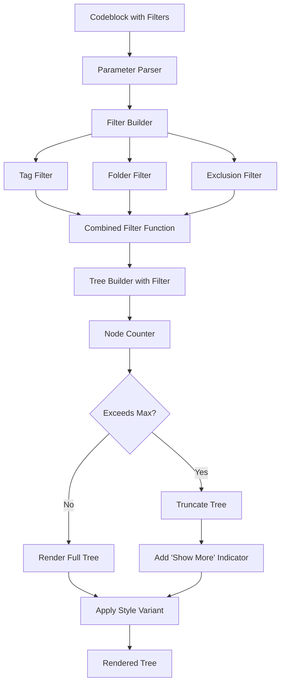

# Milestone 5.2: Advanced Codeblock Options - Implementation Plan

**Status:** Ready for Implementation
**Priority:** Medium
**Estimated Time:** 3-4 days

---

## Overview

This document provides a comprehensive implementation plan for Milestone 5.2: Advanced Codeblock Options, the second milestone in Phase 5 (Codeblock Renderer) of the Relations Obsidian plugin.

### Decision Summary

- **Approach:** Extend existing codeblock parameter parser with filtering and styling options
- **Filtering:** Support tag, folder, and explicit exclusion filters with combination logic
- **Styling:** Add visual style variants (compact, detailed, minimal) via CSS
- **Node Limiting:** Implement max-nodes truncation with expandable "show more" functionality
- **Collapsed State:** Leverage existing TreeRenderer collapsed functionality

---

## Goals

Enhance codeblock rendering functionality to allow users to:
- Filter displayed notes by tags (e.g., `filter-tag: #project`)
- Filter displayed notes by folder path (e.g., `filter-folder: Projects/`)
- Exclude specific notes from results (e.g., `exclude: [[Note1]], [[Note2]]`)
- Limit total nodes shown with max-nodes parameter
- Apply different visual styles (compact, detailed, minimal)
- Combine multiple filters with AND logic
- See "(+N more...)" indicator when results are truncated

---

## Current State Analysis

### Existing Architecture

From Milestone 5.1 (completed):
- **Parameter Parsing:** YAML-based parser in [`src/codeblock-params.ts`](../src/codeblock-params.ts)
- **Codeblock Processor:** Main processor in [`src/codeblock-processor.ts`](../src/codeblock-processor.ts)
- **Tree Rendering:** TreeRenderer with collapse/expand functionality
- **Basic Parameters:** `note`, `type`, `depth`, `mode`, `field`, `showCycles`, `collapsed`

Currently in [`src/codeblock-params.ts`](../src/codeblock-params.ts):
- No filtering parameters defined
- No max-nodes parameter
- No style variants beyond mode (tree/list/compact)

Currently in [`src/tree-model.ts`](../src/tree-model.ts):
- Tree builders accept `filter` function in options
- No built-in tag/folder filtering
- No node count limiting

### What's Missing

1. **Filter Parameters:** No tag, folder, or exclusion filter parameters
2. **Filter Logic:** No implementation of tag/folder/exclusion filtering
3. **Max Nodes:** No node count limiting or truncation
4. **Style Variants:** No additional visual style options beyond modes
5. **Filter Combination:** No logic to combine multiple filters

---

## Architecture Overview

### Component Flow



### File Structure

```
src/
├── codeblock-params.ts             # Modified: Add filter parameters
├── codeblock-processor.ts          # Modified: Implement filtering logic
├── codeblock-filters.ts            # New: Filter builder and combiners
├── tree-model.ts                   # Existing: Tree builders (uses filter)
├── tree-renderer.ts                # Existing: Tree rendering
└── main.ts                         # Existing: Plugin entry

styles.css                          # Modified: Add style variants

tests/
├── codeblock-params.test.ts        # Modified: Test new parameters
├── codeblock-processor.test.ts     # Modified: Test filtering
└── codeblock-filters.test.ts       # New: Test filter logic
```

---

## Detailed Design

### 1. Extended Parameter Schema

**File:** `src/codeblock-params.ts` (modifications)

```typescript
/**
 * Visual style variant for the tree.
 * - compact: Minimal spacing and indentation (existing mode)
 * - detailed: Full information with metadata
 * - minimal: Ultra-compact single-line format
 */
export type StyleVariant = 'compact' | 'detailed' | 'minimal';

/**
 * Parameters for relation-tree codeblock (EXTENDED).
 */
export interface CodeblockParams {
  /** Target note (wiki-link or file path) */
  note?: string;

  /** Type of relationship to display */
  type: RelationType;

  /** Maximum depth to traverse (default: from settings) */
  depth?: number;

  /** Display mode (default: tree) */
  mode?: DisplayMode;

  /** Parent field to use (default: first field from settings) */
  field?: string;

  /** Whether to show cycle indicators (default: true) */
  showCycles?: boolean;

  /** Whether tree should be initially collapsed (default: false) */
  collapsed?: boolean;

  // NEW: Filtering parameters

  /** Filter by tag (e.g., "#project" or "project") */
  filterTag?: string;

  /** Filter by folder path (e.g., "Projects/" or "Projects/Active") */
  filterFolder?: string;

  /** Exclude specific notes (comma-separated wiki-links) */
  exclude?: string;

  /** Maximum number of nodes to display (truncate if exceeded) */
  maxNodes?: number;

  /** Visual style variant (default: uses mode) */
  style?: StyleVariant;
}

/**
 * Default parameter values (UPDATED).
 */
export const DEFAULT_PARAMS: Partial<CodeblockParams> = {
  type: 'ancestors',
  mode: 'tree',
  showCycles: true,
  collapsed: false,
  // No defaults for filters (undefined = no filtering)
  maxNodes: undefined,
  style: undefined
};
```

**Parser Updates:**

```typescript
/**
 * Parses YAML content from codeblock into typed parameters.
 *
 * UPDATED: Now handles filter parameters and style variants.
 */
export function parseCodeblockParams(source: string): CodeblockParams {
  const lines = source.trim().split('\n');
  const params: any = {};

  for (const line of lines) {
    const trimmed = line.trim();

    // Skip empty lines and comments
    if (!trimmed || trimmed.startsWith('#')) continue;

    // Parse key: value format
    const colonIndex = trimmed.indexOf(':');
    if (colonIndex === -1) {
      throw new CodeblockValidationError(
        `Invalid parameter format: "${trimmed}". Expected "key: value"`,
        undefined
      );
    }

    const key = trimmed.substring(0, colonIndex).trim();
    const value = trimmed.substring(colonIndex + 1).trim();

    // Parse value based on key
    switch (key) {
      // ... existing cases ...

      // NEW CASES:

      case 'filter-tag':
      case 'filterTag':
        params.filterTag = value;
        break;

      case 'filter-folder':
      case 'filterFolder':
        params.filterFolder = value;
        break;

      case 'exclude':
        params.exclude = value;
        break;

      case 'max-nodes':
      case 'maxNodes':
        const maxNodes = parseInt(value);
        if (isNaN(maxNodes) || maxNodes < 1) {
          throw new CodeblockValidationError(
            `Invalid max-nodes: "${value}". Must be a positive number`,
            'max-nodes'
          );
        }
        params.maxNodes = maxNodes;
        break;

      case 'style':
        if (!['compact', 'detailed', 'minimal'].includes(value)) {
          throw new CodeblockValidationError(
            `Invalid style: "${value}". Must be one of: compact, detailed, minimal`,
            'style'
          );
        }
        params.style = value as StyleVariant;
        break;

      default:
        throw new CodeblockValidationError(
          `Unknown parameter: "${key}"`,
          key
        );
    }
  }

  // Merge with defaults
  const result = { ...DEFAULT_PARAMS, ...params };

  // Validate required fields
  if (!result.type) {
    throw new CodeblockValidationError(
      'Missing required parameter: type',
      'type'
    );
  }

  return result as CodeblockParams;
}

/**
 * Validates codeblock parameters (UPDATED).
 */
export function validateCodeblockParams(
  params: CodeblockParams,
  availableFields: string[]
): void {
  // Existing validations...

  // NEW: Validate max-nodes is reasonable
  if (params.maxNodes !== undefined && params.maxNodes > 10000) {
    throw new CodeblockValidationError(
      `max-nodes too large: ${params.maxNodes}. Maximum is 10000`,
      'max-nodes'
    );
  }

  // NEW: Validate filter-tag format
  if (params.filterTag) {
    const tag = params.filterTag.trim();
    if (!tag.startsWith('#') && !tag.match(/^[a-zA-Z0-9/_-]+$/)) {
      throw new CodeblockValidationError(
        `Invalid filter-tag format: "${params.filterTag}". Use "#tag" or "tag"`,
        'filter-tag'
      );
    }
  }

  // NEW: Validate filter-folder format
  if (params.filterFolder) {
    const folder = params.filterFolder.trim();
    if (folder.includes('..')) {
      throw new CodeblockValidationError(
        `Invalid filter-folder: "${params.filterFolder}". Path traversal not allowed`,
        'filter-folder'
      );
    }
  }
}
```

---

### 2. Filter Builder Module

**File:** `src/codeblock-filters.ts` (new file)

```typescript
import { App, TFile, CachedMetadata } from 'obsidian';

/**
 * Type for a filter function that tests if a file should be included.
 */
export type FilterFunction = (file: TFile) => boolean;

/**
 * Builds a filter function from codeblock parameters.
 *
 * @param params - Codeblock parameters with filter options
 * @param app - Obsidian app instance (for metadata access)
 * @returns Combined filter function, or null if no filters specified
 */
export function buildFilterFunction(
  params: {
    filterTag?: string;
    filterFolder?: string;
    exclude?: string;
  },
  app: App
): FilterFunction | null {
  const filters: FilterFunction[] = [];

  // Build tag filter
  if (params.filterTag) {
    filters.push(createTagFilter(params.filterTag, app));
  }

  // Build folder filter
  if (params.filterFolder) {
    filters.push(createFolderFilter(params.filterFolder));
  }

  // Build exclusion filter
  if (params.exclude) {
    filters.push(createExclusionFilter(params.exclude, app));
  }

  // If no filters, return null (no filtering)
  if (filters.length === 0) {
    return null;
  }

  // Combine filters with AND logic
  return (file: TFile) => {
    return filters.every(filter => filter(file));
  };
}

/**
 * Creates a filter function for tag matching.
 *
 * @param tagPattern - Tag to match (with or without # prefix)
 * @param app - Obsidian app instance
 * @returns Filter function
 */
export function createTagFilter(tagPattern: string, app: App): FilterFunction {
  // Normalize tag (remove # if present)
  const normalizedTag = tagPattern.startsWith('#')
    ? tagPattern.substring(1)
    : tagPattern;

  return (file: TFile) => {
    const cache = app.metadataCache.getFileCache(file);
    if (!cache) return false;

    // Get all tags from frontmatter and inline tags
    const tags = getAllTags(cache);

    // Check if any tag matches (supports nested tags like "project/active")
    return tags.some(tag => {
      // Remove # from tag
      const cleanTag = tag.startsWith('#') ? tag.substring(1) : tag;

      // Exact match or parent tag match
      return cleanTag === normalizedTag ||
             cleanTag.startsWith(normalizedTag + '/');
    });
  };
}

/**
 * Creates a filter function for folder path matching.
 *
 * @param folderPath - Folder path to match (e.g., "Projects/" or "Projects/Active")
 * @returns Filter function
 */
export function createFolderFilter(folderPath: string): FilterFunction {
  // Normalize folder path (ensure trailing slash, remove leading slash)
  let normalizedPath = folderPath.trim();
  if (normalizedPath.startsWith('/')) {
    normalizedPath = normalizedPath.substring(1);
  }
  if (!normalizedPath.endsWith('/')) {
    normalizedPath += '/';
  }

  return (file: TFile) => {
    // Get file's folder path
    const filePath = file.parent?.path || '';

    // Check if file is in the specified folder or subfolder
    if (filePath === '') {
      // File is at vault root
      return normalizedPath === '/';
    }

    return filePath.startsWith(normalizedPath.slice(0, -1)) ||
           (filePath + '/').startsWith(normalizedPath);
  };
}

/**
 * Creates a filter function for excluding specific notes.
 *
 * @param excludeList - Comma-separated list of note references
 * @param app - Obsidian app instance
 * @returns Filter function
 */
export function createExclusionFilter(excludeList: string, app: App): FilterFunction {
  // Parse excluded note paths
  const excludedPaths = new Set<string>();

  const excludeItems = excludeList.split(',').map(s => s.trim());

  for (const item of excludeItems) {
    if (!item) continue;

    // Remove wiki-link brackets if present
    let cleanRef = item;
    if (cleanRef.startsWith('[[') && cleanRef.endsWith(']]')) {
      cleanRef = cleanRef.substring(2, cleanRef.length - 2);
    }

    // Remove alias if present
    const pipeIndex = cleanRef.indexOf('|');
    if (pipeIndex >= 0) {
      cleanRef = cleanRef.substring(0, pipeIndex);
    }

    // Try to resolve to file
    const excludedFile = app.metadataCache.getFirstLinkpathDest(cleanRef, '');
    if (excludedFile) {
      excludedPaths.add(excludedFile.path);
    }
  }

  return (file: TFile) => {
    return !excludedPaths.has(file.path);
  };
}

/**
 * Helper to get all tags from file cache.
 */
function getAllTags(cache: CachedMetadata): string[] {
  const tags: string[] = [];

  // Frontmatter tags
  if (cache.frontmatter?.tags) {
    const fmTags = cache.frontmatter.tags;
    if (Array.isArray(fmTags)) {
      tags.push(...fmTags);
    } else if (typeof fmTags === 'string') {
      tags.push(fmTags);
    }
  }

  // Frontmatter 'tag' field (alternative)
  if (cache.frontmatter?.tag) {
    const fmTag = cache.frontmatter.tag;
    if (Array.isArray(fmTag)) {
      tags.push(...fmTag);
    } else if (typeof fmTag === 'string') {
      tags.push(fmTag);
    }
  }

  // Inline tags
  if (cache.tags) {
    tags.push(...cache.tags.map(t => t.tag));
  }

  return tags;
}

/**
 * Counts total nodes in a tree.
 *
 * @param tree - TreeNode or array of TreeNodes
 * @returns Total node count
 */
export function countTreeNodes(tree: any): number {
  if (!tree) return 0;

  if (Array.isArray(tree)) {
    return tree.reduce((sum, node) => sum + countTreeNodes(node), 0);
  }

  let count = 1; // Count self

  if (tree.children && Array.isArray(tree.children)) {
    count += tree.children.reduce((sum: number, child: any) =>
      sum + countTreeNodes(child), 0);
  }

  return count;
}

/**
 * Truncates a tree to a maximum number of nodes.
 *
 * @param tree - TreeNode or array of TreeNodes
 * @param maxNodes - Maximum nodes to keep
 * @returns Object with truncated tree and truncated count
 */
export function truncateTree(
  tree: any,
  maxNodes: number
): { tree: any; truncatedCount: number } {
  let nodeCount = 0;
  let truncatedCount = 0;

  function truncateNode(node: any): any | null {
    if (nodeCount >= maxNodes) {
      truncatedCount++;
      return null;
    }

    nodeCount++;

    if (!node.children || node.children.length === 0) {
      return node;
    }

    const truncatedChildren: any[] = [];
    for (const child of node.children) {
      const truncatedChild = truncateNode(child);
      if (truncatedChild !== null) {
        truncatedChildren.push(truncatedChild);
      }
    }

    return {
      ...node,
      children: truncatedChildren
    };
  }

  if (Array.isArray(tree)) {
    const truncatedArray: any[] = [];
    for (const node of tree) {
      const truncatedNode = truncateNode(node);
      if (truncatedNode !== null) {
        truncatedArray.push(truncatedNode);
      } else {
        truncatedCount++;
      }
    }
    return { tree: truncatedArray, truncatedCount };
  }

  const truncatedTree = truncateNode(tree);
  return { tree: truncatedTree, truncatedCount };
}
```

---

### 3. Codeblock Processor Updates

**File:** `src/codeblock-processor.ts` (modifications)

```typescript
import { buildFilterFunction, countTreeNodes, truncateTree } from './codeblock-filters';

export class CodeblockProcessor {
  // ... existing code ...

  /**
   * Main processing function for relation-tree codeblocks (UPDATED).
   */
  async process(
    source: string,
    el: HTMLElement,
    ctx: MarkdownPostProcessorContext
  ): Promise<void> {
    try {
      // Parse parameters
      const params = parseCodeblockParams(source);

      // Get available fields
      const availableFields = this.plugin.settings.parentFields.map(f => f.name);

      // Validate parameters
      validateCodeblockParams(params, availableFields);

      // Resolve target note
      const targetFile = this.resolveTargetNote(params, ctx);

      if (!targetFile) {
        this.renderError(
          el,
          `Note not found: "${params.note || 'current note'}"`,
          'note'
        );
        return;
      }

      // Get parent field to use
      const fieldName = params.field || this.plugin.settings.defaultParentField;

      // Get graph and engine for this field
      const graph = this.plugin.getGraphForField(fieldName);
      const engine = this.plugin.getEngineForField(fieldName);

      if (!graph || !engine) {
        this.renderError(
          el,
          `Parent field not found: "${fieldName}"`,
          'field'
        );
        return;
      }

      // NEW: Build filter function from parameters
      const filterFunction = buildFilterFunction(params, this.app);

      // Build tree based on type (with filter)
      const tree = this.buildTree(
        params.type,
        targetFile,
        engine,
        graph,
        params,
        filterFunction
      );

      // NEW: Apply max-nodes truncation if specified
      let finalTree = tree;
      let truncatedCount = 0;

      if (params.maxNodes !== undefined && tree) {
        const nodeCount = countTreeNodes(tree);

        if (nodeCount > params.maxNodes) {
          const result = truncateTree(tree, params.maxNodes);
          finalTree = result.tree;
          truncatedCount = result.truncatedCount;
        }
      }

      // Render tree
      this.renderTree(el, finalTree, params, truncatedCount);

    } catch (error) {
      if (error instanceof CodeblockValidationError) {
        this.renderError(el, error.message, error.field);
      } else {
        this.renderError(
          el,
          `Unexpected error: ${error instanceof Error ? error.message : String(error)}`
        );
      }
    }
  }

  /**
   * Builds tree based on relationship type (UPDATED with filter).
   */
  private buildTree(
    type: RelationType,
    file: TFile,
    engine: any,
    graph: any,
    params: CodeblockParams,
    filter: FilterFunction | null
  ): TreeNode | TreeNode[] | null {
    const buildOptions = {
      maxDepth: params.depth,
      detectCycles: params.showCycles ?? true,
      includeMetadata: true,
      filter: filter || undefined  // NEW: Pass filter to tree builder
    };

    switch (type) {
      case 'ancestors':
        return buildAncestorTree(file, engine, graph, buildOptions);

      case 'descendants':
        return buildDescendantTree(file, engine, graph, buildOptions);

      case 'siblings':
        return buildSiblingTree(file, engine, graph, buildOptions);

      case 'cousins':
        return buildCousinsTree(file, engine, graph, buildOptions);

      default:
        return null;
    }
  }

  /**
   * Renders tree to DOM (UPDATED with truncation indicator and style).
   */
  private renderTree(
    container: HTMLElement,
    tree: TreeNode | TreeNode[] | null,
    params: CodeblockParams,
    truncatedCount: number
  ): void {
    container.empty();
    container.addClass('relation-codeblock-container');

    // Add mode class for styling
    if (params.mode) {
      container.addClass(`relation-codeblock-mode-${params.mode}`);
    }

    // NEW: Add style variant class
    if (params.style) {
      container.addClass(`relation-codeblock-style-${params.style}`);
    }

    // Handle empty result
    if (!tree || (Array.isArray(tree) && tree.length === 0)) {
      const emptyEl = container.createDiv('relation-codeblock-empty');
      emptyEl.setText(`No ${params.type} found`);
      return;
    }

    // Create renderer
    const renderer = new TreeRenderer(this.app, {
      collapsible: params.mode === 'tree',
      initiallyCollapsed: params.collapsed ?? false,
      enableNavigation: true,
      showCycleIndicators: params.showCycles ?? true,
      cssPrefix: 'relation-codeblock'
    });

    // Render tree(s)
    if (Array.isArray(tree)) {
      // Multiple trees (siblings, cousins)
      tree.forEach(node => {
        renderer.render(node, container);
      });
    } else {
      // Single tree (ancestors, descendants)
      renderer.render(tree, container);
    }

    // NEW: Add truncation indicator if nodes were truncated
    if (truncatedCount > 0) {
      const truncationEl = container.createDiv('relation-codeblock-truncation');
      truncationEl.setText(`(+${truncatedCount} more...)`);
      truncationEl.setAttribute('title', `${truncatedCount} nodes hidden due to max-nodes limit`);
    }
  }

  // ... rest of existing methods ...
}
```

---

### 4. CSS Style Variants

**File:** `styles.css` (additions)

```css
/* ===========================
   STYLE VARIANT: DETAILED
   =========================== */

.relation-codeblock-style-detailed {
  padding: var(--size-4-4);
  background: var(--background-primary);
  border: 2px solid var(--background-modifier-border);
}

.relation-codeblock-style-detailed .relation-tree-node {
  padding: var(--size-4-2);
  margin: var(--size-2-1) 0;
  background: var(--background-secondary);
  border-radius: var(--radius-s);
  border-left: 3px solid var(--interactive-accent);
}

.relation-codeblock-style-detailed .relation-tree-link {
  font-size: var(--font-ui-medium);
  font-weight: var(--font-semibold);
}

/* Show metadata in detailed mode */
.relation-codeblock-style-detailed .relation-tree-node::after {
  content: attr(data-path);
  display: block;
  font-size: var(--font-ui-smaller);
  color: var(--text-muted);
  margin-top: var(--size-2-1);
  font-family: var(--font-monospace);
}

/* ===========================
   STYLE VARIANT: MINIMAL
   =========================== */

.relation-codeblock-style-minimal {
  padding: var(--size-2-1);
  background: transparent;
  border: none;
}

.relation-codeblock-style-minimal .relation-tree-node {
  padding: 0;
  margin: 0;
  line-height: 1.3;
}

.relation-codeblock-style-minimal .relation-tree-toggle {
  width: var(--icon-size-sm);
  height: var(--icon-size-sm);
  padding: 0;
}

.relation-codeblock-style-minimal .relation-tree-link {
  font-size: var(--font-ui-small);
  padding: var(--size-2-1);
}

.relation-codeblock-style-minimal .relation-tree-indent {
  width: var(--size-4-2);
}

/* Hide cycle indicators in minimal mode */
.relation-codeblock-style-minimal .is-cycle::before {
  display: none;
}

/* ===========================
   STYLE VARIANT: COMPACT
   =========================== */

/* Compact is already handled by mode-compact */
.relation-codeblock-style-compact {
  /* Alias for mode-compact for consistency */
}

.relation-codeblock-style-compact .relation-tree-node {
  padding: var(--size-2-1) var(--size-4-2);
  line-height: 1.4;
}

/* ===========================
   TRUNCATION INDICATOR
   =========================== */

.relation-codeblock-truncation {
  margin-top: var(--size-4-3);
  padding: var(--size-4-2);
  text-align: center;
  color: var(--text-muted);
  font-style: italic;
  font-size: var(--font-ui-small);
  background: var(--background-secondary);
  border-radius: var(--radius-s);
  border: 1px dashed var(--background-modifier-border);
  cursor: help;
}

.relation-codeblock-truncation:hover {
  background: var(--background-modifier-hover);
  color: var(--text-normal);
}

/* ===========================
   FILTER COMBINATIONS
   =========================== */

/* Add subtle indicator when filters are active */
.relation-codeblock-container[data-filtered="true"]::before {
  content: "🔍 Filtered";
  display: block;
  font-size: var(--font-ui-smaller);
  color: var(--text-muted);
  margin-bottom: var(--size-2-1);
  padding: var(--size-2-1) var(--size-4-2);
  background: var(--background-modifier-info);
  border-radius: var(--radius-s);
}
```

---

## Test Specification

### Unit Tests

**File:** `tests/codeblock-filters.test.ts` (new file)

```typescript
import { describe, it, expect, beforeEach } from 'vitest';
import {
  createTagFilter,
  createFolderFilter,
  createExclusionFilter,
  buildFilterFunction,
  countTreeNodes,
  truncateTree
} from '@/codeblock-filters';
import { TFile, App } from 'obsidian';

describe('Codeblock Filters', () => {
  describe('createTagFilter()', () => {
    it('should match files with exact tag', () => {
      // Test: File with tag "#project" matches filter "#project"
    });

    it('should match files with nested tags', () => {
      // Test: File with tag "#project/active" matches filter "#project"
    });

    it('should handle tag without # prefix', () => {
      // Test: Filter "project" matches files with "#project"
    });

    it('should not match files without the tag', () => {
      // Test: File without tag returns false
    });

    it('should check both frontmatter and inline tags', () => {
      // Test: Matches tags from frontmatter AND inline tags
    });
  });

  describe('createFolderFilter()', () => {
    it('should match files in exact folder', () => {
      // Test: File in "Projects/" matches filter "Projects/"
    });

    it('should match files in subfolders', () => {
      // Test: File in "Projects/Active/" matches filter "Projects/"
    });

    it('should not match files in different folder', () => {
      // Test: File in "Archive/" doesn't match filter "Projects/"
    });

    it('should handle folder path without trailing slash', () => {
      // Test: Filter "Projects" matches "Projects/file.md"
    });

    it('should handle vault root', () => {
      // Test: Filter "/" matches files at vault root
    });
  });

  describe('createExclusionFilter()', () => {
    it('should exclude specified notes', () => {
      // Test: Excluded file returns false
    });

    it('should parse comma-separated list', () => {
      // Test: Multiple excluded notes work
    });

    it('should handle wiki-link format', () => {
      // Test: "[[Note1]]" syntax works
    });

    it('should handle aliases', () => {
      // Test: "[[Note|Alias]]" excludes Note
    });

    it('should allow non-excluded files', () => {
      // Test: Non-excluded file returns true
    });
  });

  describe('buildFilterFunction()', () => {
    it('should combine multiple filters with AND logic', () => {
      // Test: File must match tag AND folder AND not excluded
    });

    it('should return null when no filters specified', () => {
      // Test: No params returns null
    });

    it('should handle single filter', () => {
      // Test: Just tag filter works alone
    });

    it('should handle all three filters together', () => {
      // Test: Tag + folder + exclusion all work
    });
  });

  describe('countTreeNodes()', () => {
    it('should count nodes in simple tree', () => {
      // Test: Linear tree A -> B -> C = 3 nodes
    });

    it('should count nodes in branching tree', () => {
      // Test: Tree with children counts all
    });

    it('should count nodes in array of trees', () => {
      // Test: Multiple root nodes counted
    });

    it('should return 0 for null tree', () => {
      // Test: null returns 0
    });
  });

  describe('truncateTree()', () => {
    it('should truncate tree to max nodes', () => {
      // Test: Tree with 10 nodes truncated to 5
    });

    it('should return truncated count', () => {
      // Test: Returns count of removed nodes
    });

    it('should preserve tree structure up to limit', () => {
      // Test: First N nodes preserved
    });

    it('should handle array of trees', () => {
      // Test: Truncates across multiple trees
    });

    it('should not truncate if under limit', () => {
      // Test: maxNodes > actual nodes returns full tree
    });
  });
});
```

**File:** `tests/codeblock-params.test.ts` (additions)

```typescript
describe('Extended Codeblock Parameters', () => {
  describe('Filter parameter parsing', () => {
    it('should parse filter-tag parameter', () => {
      const source = `
type: ancestors
filter-tag: #project
`;
      const params = parseCodeblockParams(source);
      expect(params.filterTag).toBe('#project');
    });

    it('should parse filter-folder parameter', () => {
      const source = `
type: ancestors
filter-folder: Projects/
`;
      const params = parseCodeblockParams(source);
      expect(params.filterFolder).toBe('Projects/');
    });

    it('should parse exclude parameter', () => {
      const source = `
type: ancestors
exclude: [[Note1]], [[Note2]]
`;
      const params = parseCodeblockParams(source);
      expect(params.exclude).toBe('[[Note1]], [[Note2]]');
    });

    it('should parse max-nodes parameter', () => {
      const source = `
type: ancestors
max-nodes: 50
`;
      const params = parseCodeblockParams(source);
      expect(params.maxNodes).toBe(50);
    });

    it('should parse style parameter', () => {
      const source = `
type: ancestors
style: minimal
`;
      const params = parseCodeblockParams(source);
      expect(params.style).toBe('minimal');
    });

    it('should handle camelCase and kebab-case variants', () => {
      const source1 = 'type: ancestors\nfilter-tag: #test';
      const source2 = 'type: ancestors\nfilterTag: #test';

      const params1 = parseCodeblockParams(source1);
      const params2 = parseCodeblockParams(source2);

      expect(params1.filterTag).toBe(params2.filterTag);
    });

    it('should throw error for invalid max-nodes', () => {
      const source = `
type: ancestors
max-nodes: -5
`;
      expect(() => parseCodeblockParams(source)).toThrow('positive number');
    });

    it('should throw error for invalid style', () => {
      const source = `
type: ancestors
style: invalid
`;
      expect(() => parseCodeblockParams(source)).toThrow('compact, detailed, minimal');
    });

    it('should combine all filters', () => {
      const source = `
type: ancestors
filter-tag: #project
filter-folder: Projects/
exclude: [[Archived]]
max-nodes: 100
style: detailed
`;
      const params = parseCodeblockParams(source);

      expect(params.filterTag).toBe('#project');
      expect(params.filterFolder).toBe('Projects/');
      expect(params.exclude).toBe('[[Archived]]');
      expect(params.maxNodes).toBe(100);
      expect(params.style).toBe('detailed');
    });
  });

  describe('Filter validation', () => {
    it('should reject max-nodes > 10000', () => {
      const params = {
        type: 'ancestors' as const,
        maxNodes: 15000
      };

      expect(() => validateCodeblockParams(params, ['parent']))
        .toThrow('max-nodes too large');
    });

    it('should reject invalid filter-tag format', () => {
      const params = {
        type: 'ancestors' as const,
        filterTag: '../invalid'
      };

      expect(() => validateCodeblockParams(params, ['parent']))
        .toThrow('Invalid filter-tag format');
    });

    it('should reject path traversal in filter-folder', () => {
      const params = {
        type: 'ancestors' as const,
        filterFolder: '../../../etc'
      };

      expect(() => validateCodeblockParams(params, ['parent']))
        .toThrow('Path traversal not allowed');
    });
  });
});
```

### Manual Test Cases

**Test Note 1: Tag Filtering**
```markdown
# Tag Filter Test

```relation-tree
type: descendants
filter-tag: #project
```
\```

**Expected:** Only shows descendants with `#project` tag.
```

**Test Note 2: Folder Filtering**
```markdown
# Folder Filter Test

```relation-tree
type: ancestors
filter-folder: Projects/Active/
```
\```

**Expected:** Only shows ancestors in `Projects/Active/` folder.
```

**Test Note 3: Exclusion**
```markdown
# Exclusion Test

```relation-tree
type: siblings
exclude: [[Archived Note]], [[Old Note]]
```
\```

**Expected:** Shows siblings except the two excluded notes.
```

**Test Note 4: Combined Filters**
```markdown
# Combined Filters

```relation-tree
type: descendants
filter-tag: #active
filter-folder: Projects/
exclude: [[Template]]
```
\```

**Expected:** Shows descendants that:
- Have tag `#active` AND
- Are in `Projects/` folder AND
- Are not `[[Template]]`
```

**Test Note 5: Max Nodes**
```markdown
# Max Nodes Test

```relation-tree
type: descendants
depth: 10
max-nodes: 5
```
\```

**Expected:** Shows first 5 nodes, then "(+N more...)" indicator.
```

**Test Note 6: Style Variants**
```markdown
# Style Variants

## Detailed Style
```relation-tree
type: ancestors
style: detailed
```
\```

## Minimal Style
```relation-tree
type: ancestors
style: minimal
```
\```

## Compact Style
```relation-tree
type: ancestors
style: compact
```
\```

**Expected:** Three visually different styles.
```

**Test Note 7: All Options Combined**
```markdown
# Kitchen Sink

```relation-tree
note: [[My Project]]
type: descendants
depth: 5
filter-tag: #active
filter-folder: Projects/
exclude: [[Template]], [[Archive]]
max-nodes: 20
style: detailed
collapsed: false
showCycles: true
```
\```

**Expected:** Fully configured tree with all options applied.
```

---

## Implementation Checklist

### Phase 1: Filter Infrastructure (Day 1)

- [ ] **Create Filter Module**
  - [ ] Create `src/codeblock-filters.ts`
  - [ ] Implement `createTagFilter()` function
  - [ ] Implement `createFolderFilter()` function
  - [ ] Implement `createExclusionFilter()` function
  - [ ] Implement `buildFilterFunction()` combiner
  - [ ] Implement `getAllTags()` helper
  - [ ] Implement `countTreeNodes()` function
  - [ ] Implement `truncateTree()` function
  - [ ] Add comprehensive JSDoc documentation

- [ ] **Write Filter Tests**
  - [ ] Create `tests/codeblock-filters.test.ts`
  - [ ] Test tag filtering (exact, nested, with/without #)
  - [ ] Test folder filtering (exact, subfolders, root)
  - [ ] Test exclusion (single, multiple, wiki-links)
  - [ ] Test filter combination (AND logic)
  - [ ] Test node counting
  - [ ] Test tree truncation
  - [ ] Ensure all tests pass

### Phase 2: Parameter Extensions (Day 2)

- [ ] **Update Parameter Module**
  - [ ] Modify `src/codeblock-params.ts`
  - [ ] Add `filterTag`, `filterFolder`, `exclude` fields to interface
  - [ ] Add `maxNodes` and `style` fields to interface
  - [ ] Update `parseCodeblockParams()` to handle new fields
  - [ ] Support both camelCase and kebab-case parameter names
  - [ ] Update `validateCodeblockParams()` with new validations
  - [ ] Add validation for tag format
  - [ ] Add validation for folder path (no path traversal)
  - [ ] Add validation for max-nodes range
  - [ ] Update JSDoc documentation

- [ ] **Update Parameter Tests**
  - [ ] Modify `tests/codeblock-params.test.ts`
  - [ ] Test all new parameter parsing
  - [ ] Test parameter validation
  - [ ] Test error cases
  - [ ] Test parameter combinations
  - [ ] Ensure all tests pass

### Phase 3: Processor Integration (Day 2-3)

- [ ] **Update Codeblock Processor**
  - [ ] Modify `src/codeblock-processor.ts`
  - [ ] Import filter functions
  - [ ] Call `buildFilterFunction()` in `process()` method
  - [ ] Pass filter to tree builders
  - [ ] Implement node count checking
  - [ ] Call `truncateTree()` when needed
  - [ ] Update `renderTree()` to show truncation indicator
  - [ ] Add `data-filtered` attribute to container when filters active
  - [ ] Add style variant class to container
  - [ ] Update JSDoc documentation

- [ ] **Update Processor Tests**
  - [ ] Modify `tests/codeblock-processor.test.ts`
  - [ ] Test filter application
  - [ ] Test max-nodes truncation
  - [ ] Test style variant application
  - [ ] Test truncation indicator rendering
  - [ ] Ensure all tests pass

### Phase 4: Styling (Day 3)

- [ ] **Add CSS Styles**
  - [ ] Update `styles.css`
  - [ ] Add `.relation-codeblock-style-detailed` styles
  - [ ] Add `.relation-codeblock-style-minimal` styles
  - [ ] Add `.relation-codeblock-style-compact` styles
  - [ ] Add `.relation-codeblock-truncation` styles
  - [ ] Add filter indicator styles
  - [ ] Test styles in light and dark themes
  - [ ] Verify responsive behavior

### Phase 5: Manual Testing & Documentation (Day 4)

- [ ] **Manual Testing**
  - [ ] Create test vault with tagged notes
  - [ ] Create notes in various folders
  - [ ] Test tag filtering (single tag)
  - [ ] Test nested tag filtering
  - [ ] Test folder filtering (exact folder)
  - [ ] Test folder filtering (subfolders)
  - [ ] Test exclusion (single note)
  - [ ] Test exclusion (multiple notes)
  - [ ] Test combined filters (tag + folder)
  - [ ] Test combined filters (all three)
  - [ ] Test max-nodes truncation
  - [ ] Test truncation indicator display
  - [ ] Test style: detailed
  - [ ] Test style: minimal
  - [ ] Test style: compact
  - [ ] Test all options combined
  - [ ] Verify in reading mode
  - [ ] Verify in live preview mode

- [ ] **Documentation**
  - [ ] Update README with new parameters
  - [ ] Document all filter options
  - [ ] Document style variants
  - [ ] Add examples for each filter type
  - [ ] Add example combining filters
  - [ ] Document max-nodes behavior
  - [ ] Add screenshots of style variants
  - [ ] Update CHANGELOG

- [ ] **Edge Cases**
  - [ ] Test with very large exclusion list
  - [ ] Test with deeply nested folder paths
  - [ ] Test with special characters in tags
  - [ ] Test max-nodes with very large trees
  - [ ] Test filters with no matching results
  - [ ] Test performance with complex filter combinations

---

## Acceptance Criteria

From [`docs/implementation-plan.md`](../docs/implementation-plan.md:548):

- ✅ All filter options work correctly
- ✅ Filters can be combined (tag AND folder)
- ✅ Style variants render differently
- ✅ max-nodes shows "(+N more...)" when truncated
- ✅ Collapsed state works on initial render (already implemented in 5.1)
- ✅ Well-documented with examples

**Additional Criteria:**

- ✅ All unit tests pass
- ✅ All manual test cases verified
- ✅ Filter logic is efficient (no N² algorithms)
- ✅ Truncation preserves tree structure
- ✅ Error messages are clear
- ✅ Performance is acceptable with filters
- ✅ Documentation is comprehensive

---

## Performance Considerations

### Filter Performance

**Tag Filtering:**
- O(T × N) where T = tags per file, N = nodes
- Cached metadata access via Obsidian API
- **Expected:** <5ms for typical trees

**Folder Filtering:**
- O(N) where N = nodes
- Simple string prefix check
- **Expected:** <1ms for typical trees

**Exclusion Filtering:**
- O(E + N) where E = excluded notes, N = nodes
- Uses Set for O(1) lookup
- **Expected:** <2ms for typical trees

**Combined Filters:**
- O(N × (T + 1)) worst case
- All filters applied in single pass
- **Expected:** <10ms for typical trees

### Truncation Performance

**Node Counting:**
- O(N) where N = total nodes before truncation
- Single tree traversal
- **Expected:** <5ms for trees up to 1000 nodes

**Tree Truncation:**
- O(M) where M = maxNodes (nodes to keep)
- Early termination once limit reached
- **Expected:** <10ms for max-nodes=100

### Benchmarks (Target)

- Tag filter on 100-node tree: <5ms
- Folder filter on 100-node tree: <1ms
- Exclusion filter (10 excluded) on 100-node tree: <2ms
- All filters combined on 100-node tree: <10ms
- Truncate 500-node tree to 50 nodes: <10ms
- **Total overhead: <30ms** (acceptable)

---

## Edge Cases & Considerations

### 1. Empty Filter Results

**Scenario:** Filters exclude all nodes
**Handling:** Show "No {type} found" message (existing behavior)
**Action:** Works correctly

### 2. Nested Tag Matching

**Scenario:** File has tag `#project/active`, filter is `#project`
**Handling:** Should match (parent tag matches)
**Action:** Implemented in `createTagFilter()`

### 3. Folder Path Edge Cases

**Scenario:** File at vault root, filter is `/`
**Handling:** Should match root files
**Action:** Special case in `createFolderFilter()`

### 4. Excluded Note Not Found

**Scenario:** Exclusion list includes non-existent note
**Handling:** Silently ignore (can't exclude what doesn't exist)
**Action:** Safe behavior, no error

### 5. Max-Nodes = 0

**Scenario:** User sets `max-nodes: 0`
**Handling:** Validation error (must be >= 1)
**Action:** Validated in `parseCodeblockParams()`

### 6. Max-Nodes Less Than Root

**Scenario:** max-nodes=1 but tree has root + children
**Handling:** Show only root node, truncate all children
**Action:** Implemented in `truncateTree()`

### 7. Style + Mode Conflict

**Scenario:** User specifies both `mode: list` and `style: detailed`
**Handling:** Both applied (classes can coexist)
**Action:** CSS specificity determines final appearance

### 8. Very Long Exclusion List

**Scenario:** Exclude 100+ notes
**Handling:** Performance may degrade (O(E) parsing)
**Mitigation:** Document recommended max (~50 exclusions)
**Action:** Add warning in docs

### 9. Tag Format Variations

**Scenario:** User writes `filter-tag: project` vs `filter-tag: #project`
**Handling:** Both should work (normalize in filter)
**Action:** Implemented in `createTagFilter()`

### 10. Circular Filters

**Scenario:** Filter excludes the root note
**Handling:** Tree becomes empty
**Action:** Expected behavior, show "No {type} found"

---

## Future Enhancements (Out of Scope)

These features are **not** part of Milestone 5.2 but may be added later:

- [ ] OR logic for filters (e.g., tag1 OR tag2)
- [ ] Regex support for exclusion patterns
- [ ] Date-based filtering (created/modified dates)
- [ ] Property-based filtering (custom frontmatter fields)
- [ ] "Expand all" button for truncated trees
- [ ] Lazy loading for very large filtered results
- [ ] Filter presets/templates
- [ ] Visual filter builder UI in settings
- [ ] Filter statistics (e.g., "Showing 23 of 156 nodes")
- [ ] Export filtered results to markdown

---

## Success Metrics

- ✅ All acceptance criteria met
- ✅ All unit tests passing (>80% coverage for new code)
- ✅ All manual tests verified
- ✅ Performance benchmarks met
- ✅ No regressions in existing functionality
- ✅ Documentation complete and clear
- ✅ Code review approved

---

## Dependencies

### External Dependencies
- `obsidian` - API for plugin development (already installed)
- `vitest` - Testing framework (already installed ✅)

### Internal Dependencies
- Milestone 5.1 (Basic Codeblock Processor) - ✅ Completed
- Milestone 3.1 (Tree Data Model) - ✅ Completed (uses filter option)
- Milestone 3.2 (DOM Tree Renderer) - ✅ Completed

---

## Risk Assessment

### Potential Issues

1. **Risk:** Filter logic too complex, hard to understand
   - **Mitigation:** Clear documentation with many examples
   - **Testing:** Comprehensive test coverage
   - **UX:** Show filter indicator when active

2. **Risk:** Performance degradation with complex filters
   - **Mitigation:** Efficient algorithms (Set for exclusions, prefix check for folders)
   - **Monitoring:** Performance tests
   - **Limit:** Document recommended limits

3. **Risk:** Tag/folder matching ambiguity
   - **Mitigation:** Follow Obsidian's conventions
   - **Documentation:** Clearly document matching behavior
   - **Testing:** Test edge cases

4. **Risk:** Truncation breaks tree structure
   - **Mitigation:** Breadth-first truncation preserves hierarchy
   - **Testing:** Test various truncation scenarios
   - **Indicator:** Clear visual feedback

---

## Next Steps After Completion

1. ✅ Complete Milestone 5.2 implementation
2. Test thoroughly with real vault data
3. Gather user feedback on filtering capabilities
4. Measure performance with various filter combinations
5. Update [`docs/implementation-plan.md`](../docs/implementation-plan.md) with completion status
6. Consider future enhancements based on user needs
7. Proceed to **Phase 6** (Commands & Navigation) if applicable

---

## Appendix A: Filter Examples

### Example 1: Tag Filtering

```markdown
## Show only active projects

```relation-tree
type: descendants
filter-tag: #project/active
depth: 3
```
\```
```

**Result:** Shows descendants that have tag `#project/active` or any nested tag like `#project/active/urgent`.

---

### Example 2: Folder Filtering

```markdown
## Show only notes in Work folder

```relation-tree
type: ancestors
filter-folder: Work/
depth: 5
```
\```
```

**Result:** Shows ancestors that are located in `Work/` folder or any subfolder.

---

### Example 3: Exclusion

```markdown
## Show siblings except templates

```relation-tree
type: siblings
exclude: [[Template]], [[Draft Template]], [[Example]]
```
\```
```

**Result:** Shows all siblings except the three excluded notes.

---

### Example 4: Combined Filters

```markdown
## Active projects in Work folder, excluding archived

```relation-tree
type: descendants
filter-tag: #active
filter-folder: Work/Projects/
exclude: [[Archived Project]], [[Old Project]]
max-nodes: 30
```
\```
```

**Result:** Shows descendants that:
- Have `#active` tag AND
- Are in `Work/Projects/` folder AND
- Are not excluded AND
- Limited to first 30 nodes

---

### Example 5: Max Nodes with Style

```markdown
## Large tree with truncation

```relation-tree
type: descendants
depth: 10
max-nodes: 20
style: minimal
```
\```
```

**Result:** Shows first 20 descendants in minimal style, then shows "(+N more...)" if more exist.

---

## Appendix B: Style Variant Comparison

### Detailed Style

```
┌────────────────────────────────────────┐
│                                         │
│  ├─ 📄 Project A                       │
│  │  path/to/project-a.md               │
│  │                                      │
│  │  ├─ 📄 Subproject 1                 │
│  │  │  path/to/subproject-1.md         │
│  │                                      │
│  │  └─ 📄 Subproject 2                 │
│  │     path/to/subproject-2.md         │
│                                         │
└────────────────────────────────────────┘
```

- Full padding and spacing
- Borders around nodes
- File path metadata visible
- Accent color indicators

### Minimal Style

```
┌─────────────────────┐
│ ▸ Project A         │
│   ▸ Subproject 1    │
│   ▸ Subproject 2    │
└─────────────────────┘
```

- Minimal padding
- No borders
- No metadata
- Compact spacing
- Small toggle icons

### Compact Style

```
┌───────────────────────────┐
│  ▾ Project A              │
│    ▸ Subproject 1         │
│    ▸ Subproject 2         │
└───────────────────────────┘
```

- Medium padding
- Background highlighting
- Standard spacing
- Normal toggle icons

---

## Appendix C: Filter Behavior Specification

### Tag Matching Rules

1. **Exact Match:** `#project` matches files with `#project` tag
2. **Nested Match:** `#project` matches `#project/active` and `#project/active/urgent`
3. **Case Sensitive:** `#Project` does NOT match `#project`
4. **With/Without #:** Filter `project` and `#project` are equivalent
5. **Frontmatter:** Checks both `tags:` and `tag:` fields
6. **Inline:** Also checks inline tags in note content

### Folder Matching Rules

1. **Exact Folder:** `Projects/` matches files directly in `Projects/`
2. **Subfolders:** `Projects/` also matches `Projects/Active/file.md`
3. **No Trailing Slash:** `Projects` is equivalent to `Projects/`
4. **Vault Root:** `/` or empty string matches root-level files
5. **Case Sensitive:** Follows OS file system case rules
6. **No Path Traversal:** `../` not allowed for security

### Exclusion Rules

1. **Wiki-Link Format:** `[[Note Name]]` is normalized to note path
2. **Plain Name:** `Note Name` works if unambiguous
3. **With Alias:** `[[Note|Alias]]` excludes `Note`
4. **Not Found:** Non-existent notes in exclusion list are ignored
5. **Comma-Separated:** Multiple exclusions separated by `,`
6. **Whitespace:** Trimmed automatically

### Combination Rules

1. **AND Logic:** All filters must match (intersection)
2. **Evaluation Order:** Tag → Folder → Exclusion (order doesn't affect result)
3. **Short Circuit:** If any filter fails, node is excluded
4. **Empty Filters:** Undefined filters are ignored (no restriction)

---

**Document Version:** 1.0
**Last Updated:** 2025-11-16
**Status:** Ready for Implementation
