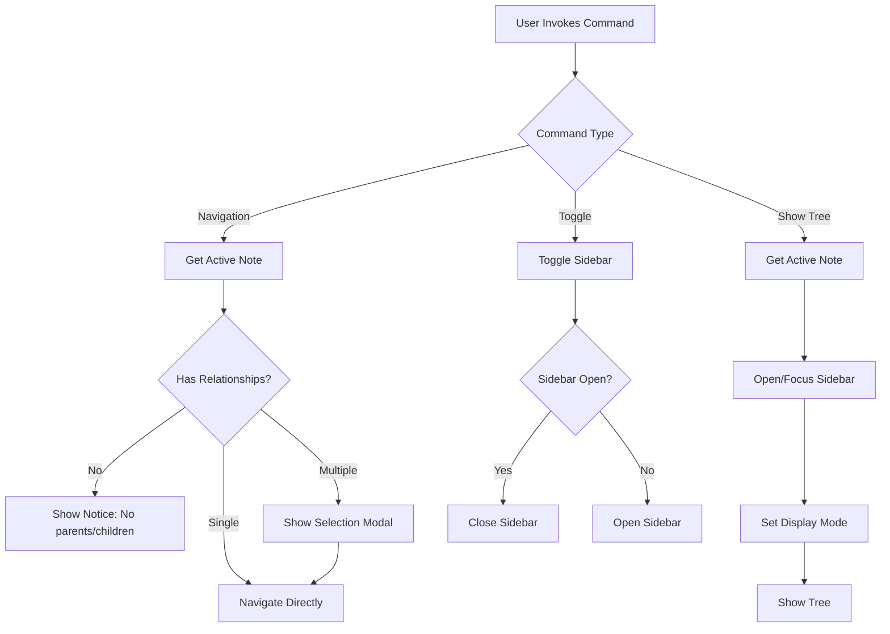

# Milestone 6.1: Basic Navigation Commands - Implementation Plan

**Status:** Ready for Implementation
**Priority:** Medium
**Estimated Time:** 2-3 days

---

## Overview

This document provides a comprehensive implementation plan for Milestone 6.1: Basic Navigation Commands, the first milestone in Phase 6 (Commands & Navigation) of the Relations Obsidian plugin.

### Decision Summary

- **Approach:** Register command palette commands using Obsidian's command API
- **Navigation:** Direct navigation for single parent/child, modal selection for multiple
- **Sidebar Integration:** Commands to show different tree views in sidebar
- **Context Awareness:** Commands enabled/disabled based on active note's relationships
- **Keyboard Shortcuts:** All commands assignable by user via Obsidian settings

---

## Goals

Implement essential navigation commands that allow users to:
- Quickly navigate between related notes (parents, children)
- Show relationship trees in the sidebar via commands
- Toggle the relation sidebar visibility
- Access all functionality via command palette and keyboard shortcuts
- Experience intuitive navigation with smart defaults

---

## Current State Analysis

### Existing Architecture

Currently in [`src/main.ts`](../src/main.ts):
- **Existing Commands:** Four context menu commands (lines 244-318)
  - Pin clicked note
  - Copy link to clicked note
  - Expand/collapse all children of clicked note
- **Sidebar View:** `RelationSidebarView` implemented (Milestone 4.1)
- **Relationship Engine:** All relationship methods available (Phase 2)
- **Multi-Field Support:** Multiple parent fields supported (Milestone 4.2)

Currently in [`src/sidebar-view.ts`](../src/sidebar-view.ts):
- **Sidebar Management:** View can be opened, closed, and pinned
- **Section Display:** Three sections (ancestors, descendants, siblings)
- **Field Switching:** Parent field selector UI
- **Pin Functionality:** Per-field pinning implemented

### What's Missing

1. **Navigation Commands:** No commands to navigate between related notes
2. **Show Tree Commands:** No commands to open sidebar showing specific relationships
3. **Toggle Command:** No command to show/hide the relation sidebar
4. **Modal Selection:** No UI for selecting from multiple parents/children
5. **Conditional Enabling:** Commands don't check if they're applicable to current note

---

## Architecture Overview

### Command Flow



### File Structure

```
src/
├── commands/
│   ├── navigation-commands.ts      # New: Navigation command implementations
│   └── modal-selector.ts           # New: Modal for selecting from multiple notes
├── sidebar-view.ts                 # Modified: Add methods for command integration
├── main.ts                         # Modified: Register new commands
└── types.ts                        # Modified: Add command-related types

tests/
├── commands/
│   ├── navigation-commands.test.ts # New: Command tests
│   └── modal-selector.test.ts      # New: Modal tests
```

---

## Detailed Design

### 1. Command Definitions

**File:** `src/commands/navigation-commands.ts` (new file)

```typescript
import { Notice, TFile } from 'obsidian';
import type ParentRelationPlugin from '../main';
import { NoteSelectorModal } from './modal-selector';
import { RelationSidebarView, VIEW_TYPE_RELATION_SIDEBAR } from '../sidebar-view';

/**
 * Command ID and name mappings.
 */
export const COMMANDS = {
  SHOW_PARENT_TREE: {
    id: 'show-parent-tree',
    name: 'Show parent tree in sidebar'
  },
  SHOW_CHILD_TREE: {
    id: 'show-child-tree',
    name: 'Show child tree in sidebar'
  },
  SHOW_FULL_LINEAGE: {
    id: 'show-full-lineage',
    name: 'Show full lineage in sidebar'
  },
  TOGGLE_SIDEBAR: {
    id: 'toggle-sidebar',
    name: 'Toggle relation sidebar'
  },
  GO_TO_PARENT: {
    id: 'go-to-parent',
    name: 'Go to parent note'
  },
  GO_TO_CHILD: {
    id: 'go-to-child',
    name: 'Go to child note'
  }
} as const;

/**
 * Registers all basic navigation commands.
 *
 * @param plugin - The plugin instance
 */
export function registerNavigationCommands(plugin: ParentRelationPlugin): void {
  registerShowParentTreeCommand(plugin);
  registerShowChildTreeCommand(plugin);
  registerShowFullLineageCommand(plugin);
  registerToggleSidebarCommand(plugin);
  registerGoToParentCommand(plugin);
  registerGoToChildCommand(plugin);
}

/**
 * Command: Show parent tree in sidebar.
 */
function registerShowParentTreeCommand(plugin: ParentRelationPlugin): void {
  plugin.addCommand({
    id: COMMANDS.SHOW_PARENT_TREE.id,
    name: COMMANDS.SHOW_PARENT_TREE.name,
    checkCallback: (checking: boolean) => {
      const file = plugin.app.workspace.getActiveFile();
      if (!file) return false;

      if (!checking) {
        showTreeInSidebar(plugin, file, 'ancestors');
      }
      return true;
    }
  });
}

/**
 * Command: Show child tree in sidebar.
 */
function registerShowChildTreeCommand(plugin: ParentRelationPlugin): void {
  plugin.addCommand({
    id: COMMANDS.SHOW_CHILD_TREE.id,
    name: COMMANDS.SHOW_CHILD_TREE.name,
    checkCallback: (checking: boolean) => {
      const file = plugin.app.workspace.getActiveFile();
      if (!file) return false;

      if (!checking) {
        showTreeInSidebar(plugin, file, 'descendants');
      }
      return true;
    }
  });
}

/**
 * Command: Show full lineage in sidebar.
 */
function registerShowFullLineageCommand(plugin: ParentRelationPlugin): void {
  plugin.addCommand({
    id: COMMANDS.SHOW_FULL_LINEAGE.id,
    name: COMMANDS.SHOW_FULL_LINEAGE.name,
    checkCallback: (checking: boolean) => {
      const file = plugin.app.workspace.getActiveFile();
      if (!file) return false;

      if (!checking) {
        showTreeInSidebar(plugin, file, 'all');
      }
      return true;
    }
  });
}

/**
 * Command: Toggle relation sidebar.
 */
function registerToggleSidebarCommand(plugin: ParentRelationPlugin): void {
  plugin.addCommand({
    id: COMMANDS.TOGGLE_SIDEBAR.id,
    name: COMMANDS.TOGGLE_SIDEBAR.name,
    callback: () => {
      toggleSidebar(plugin);
    }
  });
}

/**
 * Command: Go to parent note.
 */
function registerGoToParentCommand(plugin: ParentRelationPlugin): void {
  plugin.addCommand({
    id: COMMANDS.GO_TO_PARENT.id,
    name: COMMANDS.GO_TO_PARENT.name,
    checkCallback: (checking: boolean) => {
      const file = plugin.app.workspace.getActiveFile();
      if (!file) return false;

      // Get parents using default field
      const fieldName = plugin.settings.defaultParentField;
      const graph = plugin.getGraphForField(fieldName);
      if (!graph) return false;

      const parents = graph.getParents(file);
      if (parents.length === 0) return false;

      if (!checking) {
        if (parents.length === 1) {
          // Single parent - navigate directly
          plugin.app.workspace.getLeaf().openFile(parents[0]);
        } else {
          // Multiple parents - show modal
          new NoteSelectorModal(
            plugin.app,
            parents,
            'Select Parent Note',
            (selected) => {
              plugin.app.workspace.getLeaf().openFile(selected);
            }
          ).open();
        }
      }
      return true;
    }
  });
}

/**
 * Command: Go to child note.
 */
function registerGoToChildCommand(plugin: ParentRelationPlugin): void {
  plugin.addCommand({
    id: COMMANDS.GO_TO_CHILD.id,
    name: COMMANDS.GO_TO_CHILD.name,
    checkCallback: (checking: boolean) => {
      const file = plugin.app.workspace.getActiveFile();
      if (!file) return false;

      // Get children using default field
      const fieldName = plugin.settings.defaultParentField;
      const graph = plugin.getGraphForField(fieldName);
      if (!graph) return false;

      const children = graph.getChildren(file);
      if (children.length === 0) return false;

      if (!checking) {
        if (children.length === 1) {
          // Single child - navigate directly
          plugin.app.workspace.getLeaf().openFile(children[0]);
        } else {
          // Multiple children - show modal
          new NoteSelectorModal(
            plugin.app,
            children,
            'Select Child Note',
            (selected) => {
              plugin.app.workspace.getLeaf().openFile(selected);
            }
          ).open();
        }
      }
      return true;
    }
  });
}

/**
 * Helper: Shows a tree in the sidebar.
 *
 * @param plugin - Plugin instance
 * @param file - File to show tree for
 * @param treeType - Type of tree to show
 */
async function showTreeInSidebar(
  plugin: ParentRelationPlugin,
  file: TFile,
  treeType: 'ancestors' | 'descendants' | 'all'
): Promise<void> {
  // Ensure sidebar is open
  const leaf = await ensureSidebarOpen(plugin);
  if (!leaf) return;

  const view = leaf.view as RelationSidebarView;
  if (!(view instanceof RelationSidebarView)) return;

  // Pin to the specified file
  view.pinToFile(file);

  // Configure visible sections based on tree type
  switch (treeType) {
    case 'ancestors':
      view.setSectionsVisible({
        ancestors: true,
        descendants: false,
        siblings: false
      });
      break;
    case 'descendants':
      view.setSectionsVisible({
        ancestors: false,
        descendants: true,
        siblings: false
      });
      break;
    case 'all':
      view.setSectionsVisible({
        ancestors: true,
        descendants: true,
        siblings: true
      });
      break;
  }

  // Make sure the sidebar leaf is revealed
  plugin.app.workspace.revealLeaf(leaf);

  new Notice(`Showing ${treeType === 'all' ? 'full lineage' : treeType} for ${file.basename}`);
}

/**
 * Helper: Ensures sidebar is open and returns the leaf.
 */
async function ensureSidebarOpen(plugin: ParentRelationPlugin): Promise<any> {
  // Check if sidebar is already open
  const existingLeaves = plugin.app.workspace.getLeavesOfType(VIEW_TYPE_RELATION_SIDEBAR);

  if (existingLeaves.length > 0) {
    // Use existing sidebar
    return existingLeaves[0];
  }

  // Open new sidebar
  const leaf = plugin.app.workspace.getRightLeaf(false);
  if (!leaf) {
    new Notice('Could not open relation sidebar');
    return null;
  }

  await leaf.setViewState({
    type: VIEW_TYPE_RELATION_SIDEBAR,
    active: true
  });

  return leaf;
}

/**
 * Helper: Toggles sidebar visibility.
 */
function toggleSidebar(plugin: ParentRelationPlugin): void {
  const leaves = plugin.app.workspace.getLeavesOfType(VIEW_TYPE_RELATION_SIDEBAR);

  if (leaves.length > 0) {
    // Close all relation sidebar instances
    leaves.forEach(leaf => leaf.detach());
    new Notice('Relation sidebar closed');
  } else {
    // Open new sidebar
    const leaf = plugin.app.workspace.getRightLeaf(false);
    if (leaf) {
      leaf.setViewState({
        type: VIEW_TYPE_RELATION_SIDEBAR,
        active: true
      });
      new Notice('Relation sidebar opened');
    }
  }
}
```

---

### 2. Note Selector Modal

**File:** `src/commands/modal-selector.ts` (new file)

```typescript
import { App, Modal, TFile, Setting } from 'obsidian';

/**
 * Modal for selecting a note from a list.
 */
export class NoteSelectorModal extends Modal {
  private notes: TFile[];
  private title: string;
  private onSelect: (note: TFile) => void;

  constructor(
    app: App,
    notes: TFile[],
    title: string,
    onSelect: (note: TFile) => void
  ) {
    super(app);
    this.notes = notes;
    this.title = title;
    this.onSelect = onSelect;
  }

  onOpen(): void {
    const { contentEl } = this;
    contentEl.empty();

    contentEl.createEl('h2', { text: this.title });

    // Create list of notes
    const listEl = contentEl.createDiv('relation-note-selector-list');

    this.notes.forEach(note => {
      const itemEl = listEl.createDiv('relation-note-selector-item');

      // Note name
      const nameEl = itemEl.createDiv('relation-note-selector-name');
      nameEl.setText(note.basename);

      // Note path (if not in root)
      if (note.parent && note.parent.path !== '/') {
        const pathEl = itemEl.createDiv('relation-note-selector-path');
        pathEl.setText(note.parent.path);
      }

      // Click handler
      itemEl.addEventListener('click', () => {
        this.onSelect(note);
        this.close();
      });

      // Keyboard navigation
      itemEl.tabIndex = 0;
      itemEl.addEventListener('keydown', (e) => {
        if (e.key === 'Enter' || e.key === ' ') {
          e.preventDefault();
          this.onSelect(note);
          this.close();
        }
      });
    });

    // Focus first item
    const firstItem = listEl.querySelector('.relation-note-selector-item') as HTMLElement;
    if (firstItem) {
      firstItem.focus();
    }
  }

  onClose(): void {
    const { contentEl } = this;
    contentEl.empty();
  }
}
```

---

### 3. Sidebar View Extensions

**File:** `src/sidebar-view.ts` (additions)

```typescript
/**
 * Sets which sections are visible in the sidebar.
 *
 * @param visible - Object specifying visibility for each section
 */
setSectionsVisible(visible: {
  ancestors?: boolean;
  descendants?: boolean;
  siblings?: boolean;
}): void {
  const fieldName = this.viewState.selectedParentField;
  const fieldConfig = this.plugin.settings.parentFields.find(
    f => f.name === fieldName
  );

  if (!fieldConfig) return;

  // Update field config
  if (visible.ancestors !== undefined) {
    fieldConfig.ancestors.visible = visible.ancestors;
  }
  if (visible.descendants !== undefined) {
    fieldConfig.descendants.visible = visible.descendants;
  }
  if (visible.siblings !== undefined) {
    fieldConfig.siblings.visible = visible.siblings;
  }

  // Refresh view
  this.updateView();
}

/**
 * Pins the sidebar to a specific file.
 *
 * @param file - File to pin to
 */
pinToFile(file: TFile): void {
  const fieldName = this.viewState.selectedParentField;
  this.viewState.pinnedFiles[fieldName] = file.path;
  this.updateView();
}
```

---

### 4. Plugin Integration

**File:** `src/main.ts` (modifications)

```typescript
import { registerNavigationCommands } from './commands/navigation-commands';

export default class ParentRelationPlugin extends Plugin {
  // ... existing properties ...

  async onload() {
    await this.loadSettings();

    // ... existing initialization ...

    // Register navigation commands (NEW for Milestone 6.1)
    registerNavigationCommands(this);

    // Register existing context menu commands (Milestone 4.3B)
    this.registerCommands();

    // ... rest of onload ...
  }

  // ... existing methods ...
}
```

---

### 5. Styling

**File:** `styles.css` (additions)

```css
/* Note Selector Modal */
.relation-note-selector-list {
  margin-top: var(--size-4-4);
  max-height: 400px;
  overflow-y: auto;
}

.relation-note-selector-item {
  padding: var(--size-4-3);
  margin-bottom: var(--size-2-1);
  border: 1px solid var(--background-modifier-border);
  border-radius: var(--radius-s);
  cursor: pointer;
  transition: background-color 0.1s ease;
}

.relation-note-selector-item:hover,
.relation-note-selector-item:focus {
  background-color: var(--background-modifier-hover);
  outline: none;
}

.relation-note-selector-item:active {
  background-color: var(--background-modifier-active-hover);
}

.relation-note-selector-name {
  font-weight: var(--font-semibold);
  color: var(--text-normal);
  margin-bottom: var(--size-2-1);
}

.relation-note-selector-path {
  font-size: var(--font-ui-smaller);
  color: var(--text-muted);
  font-family: var(--font-monospace);
}

/* Keyboard focus indicator */
.relation-note-selector-item:focus {
  box-shadow: 0 0 0 2px var(--interactive-accent);
}
```

---

## Test Specification

### Manual Test Cases

**Test 1: Show Parent Tree Command**
1. Open a note with parents
2. Open command palette (Cmd/Ctrl + P)
3. Search for "Show parent tree"
4. Execute command
5. **Expected:** Sidebar opens showing only ancestors section

**Test 2: Show Child Tree Command**
1. Open a note with children
2. Execute "Show child tree" command
3. **Expected:** Sidebar opens showing only descendants section

**Test 3: Show Full Lineage Command**
1. Open a note with both parents and children
2. Execute "Show full lineage" command
3. **Expected:** Sidebar opens showing all sections

**Test 4: Toggle Sidebar Command**
1. Execute "Toggle relation sidebar" command (sidebar closed)
2. **Expected:** Sidebar opens
3. Execute command again
4. **Expected:** Sidebar closes

**Test 5: Go to Parent (Single)**
1. Open a note with exactly one parent
2. Execute "Go to parent note" command
3. **Expected:** Navigates directly to parent note

**Test 6: Go to Parent (Multiple)**
1. Open a note with multiple parents
2. Execute "Go to parent note" command
3. **Expected:** Modal appears with list of parents
4. Click on a parent
5. **Expected:** Navigates to selected parent

**Test 7: Go to Child (Single)**
1. Open a note with exactly one child
2. Execute "Go to child note" command
3. **Expected:** Navigates directly to child note

**Test 8: Go to Child (Multiple)**
1. Open a note with multiple children
2. Execute "Go to child note" command
3. **Expected:** Modal appears with list of children
4. Select a child using keyboard (arrow keys + Enter)
5. **Expected:** Navigates to selected child

**Test 9: Command Availability**
1. Open a note with no parents
2. Open command palette
3. **Expected:** "Go to parent note" command not visible
4. Open a note with parents
5. **Expected:** "Go to parent note" command now visible

**Test 10: Keyboard Shortcuts**
1. Assign keyboard shortcut to "Go to parent note"
2. Press shortcut
3. **Expected:** Command executes

**Test 11: Multiple Parent Fields**
1. Configure multiple parent fields (parent, project)
2. Set "project" as default field
3. Execute "Go to parent note" command
4. **Expected:** Navigates using "project" field relationships

**Test 12: Empty Vault**
1. Open a note with no relationships
2. Try to execute navigation commands
3. **Expected:** Commands are disabled/not shown

### Unit Tests

**File:** `tests/commands/navigation-commands.test.ts` (new file)

```typescript
import { describe, it, expect, beforeEach, vi } from 'vitest';
import { COMMANDS } from '@/commands/navigation-commands';

describe('Navigation Commands', () => {
  describe('Command Registration', () => {
    it('should register all six commands', () => {
      // Verify all commands are registered
    });

    it('should have unique command IDs', () => {
      const ids = Object.values(COMMANDS).map(cmd => cmd.id);
      const uniqueIds = new Set(ids);
      expect(uniqueIds.size).toBe(ids.length);
    });
  });

  describe('Show Parent Tree Command', () => {
    it('should be available when file is active', () => {
      // Test checkCallback returns true
    });

    it('should not be available when no file is active', () => {
      // Test checkCallback returns false
    });

    it('should open sidebar and show ancestors', () => {
      // Test sidebar opens with ancestors visible
    });
  });

  describe('Show Child Tree Command', () => {
    it('should open sidebar and show descendants', () => {
      // Test sidebar opens with descendants visible
    });
  });

  describe('Show Full Lineage Command', () => {
    it('should show all sections', () => {
      // Test all sections visible
    });
  });

  describe('Toggle Sidebar Command', () => {
    it('should open sidebar when closed', () => {
      // Test sidebar opens
    });

    it('should close sidebar when open', () => {
      // Test sidebar closes
    });
  });

  describe('Go to Parent Command', () => {
    it('should be disabled when note has no parents', () => {
      // Test command not available
    });

    it('should navigate directly when single parent', () => {
      // Test direct navigation
    });

    it('should show modal when multiple parents', () => {
      // Test modal appears
    });
  });

  describe('Go to Child Command', () => {
    it('should be disabled when note has no children', () => {
      // Test command not available
    });

    it('should navigate directly when single child', () => {
      // Test direct navigation
    });

    it('should show modal when multiple children', () => {
      // Test modal appears
    });
  });
});
```

**File:** `tests/commands/modal-selector.test.ts` (new file)

```typescript
import { describe, it, expect, beforeEach, vi } from 'vitest';
import { NoteSelectorModal } from '@/commands/modal-selector';

describe('Note Selector Modal', () => {
  describe('Rendering', () => {
    it('should display modal title', () => {
      // Test title appears
    });

    it('should list all provided notes', () => {
      // Test all notes rendered
    });

    it('should show note paths when not in root', () => {
      // Test path display
    });
  });

  describe('Selection', () => {
    it('should call onSelect when note clicked', () => {
      // Test click handler
    });

    it('should close modal after selection', () => {
      // Test modal closes
    });
  });

  describe('Keyboard Navigation', () => {
    it('should select note on Enter key', () => {
      // Test Enter key
    });

    it('should select note on Space key', () => {
      // Test Space key
    });

    it('should focus first item on open', () => {
      // Test initial focus
    });
  });
});
```

---

## Implementation Checklist

### Phase 1: Core Command Infrastructure (Day 1)

- [ ] **Create Command Module**
  - [ ] Create `src/commands/navigation-commands.ts`
  - [ ] Define `COMMANDS` constant with all command metadata
  - [ ] Implement `registerNavigationCommands()` function
  - [ ] Add JSDoc documentation for all functions

- [ ] **Implement Show Tree Commands**
  - [ ] Implement `registerShowParentTreeCommand()`
  - [ ] Implement `registerShowChildTreeCommand()`
  - [ ] Implement `registerShowFullLineageCommand()`
  - [ ] Implement `showTreeInSidebar()` helper
  - [ ] Implement `ensureSidebarOpen()` helper

- [ ] **Implement Toggle Command**
  - [ ] Implement `registerToggleSidebarCommand()`
  - [ ] Implement `toggleSidebar()` helper

### Phase 2: Navigation Commands (Day 1-2)

- [ ] **Implement Go To Commands**
  - [ ] Implement `registerGoToParentCommand()`
  - [ ] Implement `registerGoToChildCommand()`
  - [ ] Add conditional enabling (checkCallback)
  - [ ] Handle single vs multiple relationships

- [ ] **Create Modal Selector**
  - [ ] Create `src/commands/modal-selector.ts`
  - [ ] Implement `NoteSelectorModal` class
  - [ ] Implement `onOpen()` method
  - [ ] Implement `onClose()` method
  - [ ] Add keyboard navigation support
  - [ ] Add click handlers

### Phase 3: Sidebar Integration (Day 2)

- [ ] **Extend Sidebar View**
  - [ ] Add `setSectionsVisible()` method to `RelationSidebarView`
  - [ ] Ensure `pinToFile()` method exists and works
  - [ ] Test integration with commands

- [ ] **Plugin Integration**
  - [ ] Modify `src/main.ts`
  - [ ] Import `registerNavigationCommands`
  - [ ] Call registration in `onload()`
  - [ ] Test all commands registered

### Phase 4: Styling & Polish (Day 2-3)

- [ ] **Add Styles**
  - [ ] Add modal styles to `styles.css`
  - [ ] Style note selector list
  - [ ] Style note selector items
  - [ ] Add hover/focus states
  - [ ] Test in light and dark themes

- [ ] **Testing**
  - [ ] Create `tests/commands/navigation-commands.test.ts`
  - [ ] Create `tests/commands/modal-selector.test.ts`
  - [ ] Write unit tests for all commands
  - [ ] Write unit tests for modal
  - [ ] Ensure all tests pass

### Phase 5: Manual Testing & Documentation (Day 3)

- [ ] **Manual Testing**
  - [ ] Test all 12 manual test cases
  - [ ] Test with various vault configurations
  - [ ] Test keyboard shortcuts
  - [ ] Test command availability logic
  - [ ] Test with multiple parent fields

- [ ] **Documentation**
  - [ ] Add command descriptions to README
  - [ ] Document keyboard shortcut setup
  - [ ] Add usage examples
  - [ ] Update CHANGELOG
  - [ ] Add screenshots/GIFs of commands in action

---

## Acceptance Criteria

From [`docs/implementation-plan.md`](../docs/implementation-plan.md:586):

- ✅ All commands appear in command palette
- ✅ Commands work on currently active note
- ✅ "Go to" commands navigate correctly
- ✅ Modal selection works for multiple parents/children
- ✅ Commands disabled when not applicable (e.g., no parents)
- ✅ Keyboard shortcuts assignable by user

**Additional Criteria:**

- ✅ All unit tests pass
- ✅ All manual tests verified
- ✅ Modal is keyboard accessible
- ✅ Sidebar integration works correctly
- ✅ Commands work with multiple parent fields
- ✅ No regressions in existing functionality

---

## Performance Considerations

### Expected Performance

**Command Execution:**
- Check if command available: <1ms (graph lookup)
- Open sidebar: <50ms (DOM creation)
- Show modal: <10ms (list rendering for <100 items)
- Navigate to note: Native Obsidian performance

**Optimization Strategies:**
1. **Lazy Loading:** Don't compute relationships until command executed
2. **Caching:** Reuse sidebar instances when possible
3. **Debouncing:** Not needed for commands (user-triggered)

### Benchmarks (Target)

- Command availability check: <1ms
- Open sidebar with tree: <100ms
- Show modal with 10 notes: <20ms
- Navigate to note: <50ms

---

## Edge Cases & Considerations

### 1. No Active File

**Scenario:** User invokes command when no file is active
**Handling:** Commands that require active file return false in checkCallback
**Result:** Commands not shown in palette

### 2. File with No Relationships

**Scenario:** Active file has no parents/children
**Handling:** Navigation commands disabled
**Result:** Commands not shown in palette

### 3. Sidebar Already Open

**Scenario:** User invokes "show tree" command with sidebar already open
**Handling:** Reuse existing sidebar, update its configuration
**Result:** Sidebar updates to show requested tree

### 4. Multiple Sidebar Instances

**Scenario:** User has multiple relation sidebars open
**Handling:** Use first instance found
**Alternative:** Could show in all instances (future enhancement)

### 5. Modal with Many Notes

**Scenario:** Note has 100+ children
**Handling:** Scrollable list with focus management
**Enhancement:** Add search/filter in Milestone 6.2

### 6. Keyboard Navigation in Modal

**Scenario:** User wants to navigate modal with keyboard only
**Handling:**
- Tab to move between items
- Enter/Space to select
- Escape to cancel
**Action:** Fully implemented

### 7. Different Parent Fields

**Scenario:** User has multiple parent fields configured
**Handling:** Commands use `defaultParentField` setting
**Enhancement:** Could add field selector to modal (Milestone 6.2)

---

## Future Enhancements (Out of Scope)

These features are **not** part of Milestone 6.1 but planned for Milestone 6.2:

- [ ] "Find shortest path to note" command
- [ ] "Show all root notes" command
- [ ] "Show all leaf notes" command
- [ ] "Show siblings of current note" command
- [ ] "Show cousins of current note" command
- [ ] "Validate relationship graph" command
- [ ] "Export tree as markdown" command
- [ ] Search/filter in note selector modal
- [ ] Parent field selector in modal
- [ ] Command to set parent field
- [ ] Batch navigation (navigate through all parents/children)
- [ ] History tracking (navigate back through relationship path)

---

## Success Metrics

- ✅ All acceptance criteria met
- ✅ All unit tests passing (>80% coverage)
- ✅ All manual tests verified
- ✅ Performance benchmarks met
- ✅ No regressions in existing functionality
- ✅ Documentation complete
- ✅ Code review approved

---

## Dependencies

### External Dependencies
- `obsidian` - API for commands, modals (already installed)
- `vitest` - Testing framework (already installed ✅)

### Internal Dependencies
- Milestone 4.1 (Basic Sidebar View) - ✅ Completed
- Milestone 4.2 (Multi-Parent-Field Support) - ✅ Completed
- Milestone 2.1 (Ancestor Traversal) - ✅ Completed
- Milestone 2.2 (Descendant Traversal) - ✅ Completed
- Phase 2 (Relationship Engine) - ✅ Completed

---

## Risk Assessment

### Potential Issues

1. **Risk:** Command palette becomes cluttered with many commands
   - **Mitigation:** Use clear, descriptive names
   - **Enhancement:** Add command categories (future Obsidian feature)
   - **Workaround:** Users can hide unwanted commands in settings

2. **Risk:** Modal selection confusing for many notes
   - **Mitigation:** Show note paths to disambiguate
   - **Enhancement:** Add search filter in Milestone 6.2
   - **Documentation:** Provide usage examples

3. **Risk:** Commands conflict with other plugins
   - **Mitigation:** Use unique command IDs with plugin prefix
   - **Testing:** Test with popular plugins
   - **Documentation:** List potential conflicts

4. **Risk:** Sidebar state not preserved when using commands
   - **Mitigation:** Commands update existing sidebar when possible
   - **Testing:** Test sidebar state management
   - **Enhancement:** Add state preservation settings

---

## Next Steps After Completion

1. ✅ Complete Milestone 6.1 implementation
2. Test thoroughly with real vault data
3. Gather user feedback on command usage
4. Update [`docs/implementation-plan.md`](../docs/implementation-plan.md) with completion status
5. Proceed to **Milestone 6.2** (Advanced Navigation Commands)
   - Path finding
   - Root/leaf navigation
   - Enhanced modal with search
   - Relationship graph validation
   - Tree export

---

## Appendix A: Command Reference

### Show Tree Commands

| Command | Description | Behavior |
|---------|-------------|----------|
| Show parent tree in sidebar | Opens sidebar showing ancestors | Pins to current note, shows only ancestors section |
| Show child tree in sidebar | Opens sidebar showing descendants | Pins to current note, shows only descendants section |
| Show full lineage in sidebar | Opens sidebar showing all relationships | Pins to current note, shows all sections |

### Navigation Commands

| Command | Description | Behavior |
|---------|-------------|----------|
| Go to parent note | Navigate to parent | Direct if single parent, modal if multiple |
| Go to child note | Navigate to child | Direct if single child, modal if multiple |

### Utility Commands

| Command | Description | Behavior |
|---------|-------------|----------|
| Toggle relation sidebar | Show/hide sidebar | Opens if closed, closes if open |

---

## Appendix B: Keyboard Shortcuts Setup

Users can assign keyboard shortcuts via Obsidian settings:

1. Open Settings (Cmd/Ctrl + ,)
2. Navigate to "Hotkeys"
3. Search for "relation" to find plugin commands
4. Click the (+) icon to assign a shortcut
5. Press desired key combination

**Suggested Shortcuts:**
- Go to parent note: `Cmd/Ctrl + Shift + P`
- Go to child note: `Cmd/Ctrl + Shift + C`
- Toggle relation sidebar: `Cmd/Ctrl + Shift + R`
- Show full lineage: `Cmd/Ctrl + Shift + L`

---

## Appendix C: Modal UI Mockup

```
┌─────────────────────────────────────┐
│  Select Parent Note                 │
├─────────────────────────────────────┤
│                                      │
│  ┌─────────────────────────────┐   │
│  │ Project Alpha                │   │  ← Clickable item
│  │ projects/                    │   │     Shows path
│  └─────────────────────────────┘   │
│                                      │
│  ┌─────────────────────────────┐   │
│  │ Main Initiative              │   │
│  │ strategic/initiatives/       │   │
│  └─────────────────────────────┘   │
│                                      │
│  ┌─────────────────────────────┐   │
│  │ Team Objectives              │   │
│  │ teams/engineering/           │   │
│  └─────────────────────────────┘   │
│                                      │
└─────────────────────────────────────┘

Use: Click or press Enter to select
     Escape to cancel
```

---

## Appendix D: Implementation Example

### Before (No Navigation Commands)

```typescript
// src/main.ts
async onload() {
  // ... existing setup ...

  // Only context menu commands (Milestone 4.3B)
  this.registerCommands();
}
```

### After (With Navigation Commands)

```typescript
// src/main.ts
import { registerNavigationCommands } from './commands/navigation-commands';

async onload() {
  // ... existing setup ...

  // NEW: Register navigation commands (Milestone 6.1)
  registerNavigationCommands(this);

  // Existing context menu commands (Milestone 4.3B)
  this.registerCommands();
}
```

### Usage in Action

```typescript
// User workflow:
// 1. User presses Cmd+P (command palette)
// 2. Types "parent"
// 3. Sees "Show parent tree in sidebar" command
// 4. Presses Enter
// 5. Sidebar opens showing ancestor tree for current note

// Programmatic flow:
registerShowParentTreeCommand(plugin)
  → User executes command
  → checkCallback verifies file exists
  → showTreeInSidebar(plugin, file, 'ancestors')
  → ensureSidebarOpen(plugin)
  → view.setSectionsVisible({ ancestors: true, ... })
  → Sidebar updates to show ancestors
```

---

**Document Version:** 1.0
**Last Updated:** 2025-11-17
**Status:** Ready for Implementation
