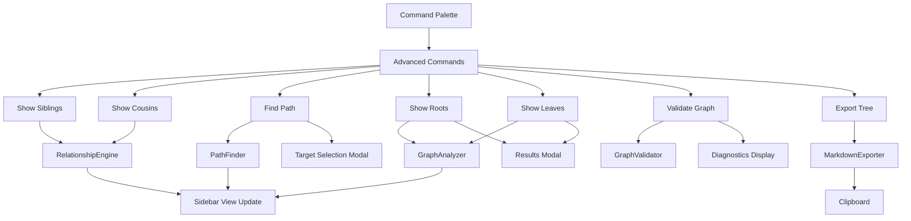

# Milestone 6.2: Advanced Navigation Commands - Implementation Plan

**Status:** Ready for Implementation
**Priority:** Medium
**Estimated Time:** 4-5 days

---

## Overview

This document provides a comprehensive implementation plan for Milestone 6.2: Advanced Navigation Commands, the second milestone in Phase 6 (Commands & Navigation) of the Relations Obsidian plugin.

### Decision Summary

- **Approach:** Extend existing command system with advanced navigation features
- **Modal UI:** Implement search/filter modals for multi-option selection
- **Path-Finding:** Breadth-First Search (BFS) algorithm for shortest path
- **Export:** Tree-to-markdown formatter with indentation preservation
- **Diagnostics:** Integration with existing graph validation utilities

---

## Goals

Implement advanced navigation and utility commands that allow users to:
- Navigate to siblings and cousins of the current note
- Find the shortest path between two notes in the relationship graph
- View all root notes (notes with no parents) in the vault
- View all leaf notes (notes with no children) in the vault
- Validate the relationship graph and view diagnostics
- Export relationship trees as formatted markdown to clipboard
- Search and filter through results using interactive modals

---

## Current State Analysis

### Existing Architecture

Currently in [`src/main.ts`](../src/main.ts):
- **Basic Commands:** Milestone 6.1 implemented basic navigation commands
  - "Show parent tree in sidebar"
  - "Show child tree in sidebar"
  - "Show full lineage in sidebar"
  - "Toggle relation sidebar"
  - "Go to parent note"
  - "Go to child note"
- **Command Registration:** Commands registered in `onload()` method
- **No Advanced Features:** No path-finding, root/leaf detection, or export functionality

Currently in [`src/relationship-engine.ts`](../src/relationship-engine.ts):
- **Basic Relationships:** `getAncestors()`, `getDescendants()`, `getSiblings()`, `getCousins()`
- **No Path-Finding:** No method to find paths between arbitrary notes
- **No Filtering:** No methods to find root or leaf notes

Currently in [`src/relation-graph.ts`](../src/relation-graph.ts):
- **Graph Validation:** `getDiagnostics()` method exists (from Milestone 1.3)
- **Cycle Detection:** `detectCycle()` and `getCycleInfo()` methods available

### What's Missing

1. **Advanced Navigation Commands:** Siblings, cousins, path-finding
2. **Graph Analysis Commands:** Root notes, leaf notes
3. **Utility Commands:** Validation, export
4. **Modal UI Components:** Search/filter modals for multi-option selection
5. **Path-Finding Algorithm:** Shortest path computation
6. **Markdown Export:** Tree-to-markdown formatter
7. **Command Helpers:** Reusable command utilities

---

## Architecture Overview

### Component Flow



### File Structure

```
src/
├── commands/
│   ├── advanced-navigation.ts      # New: Advanced navigation commands
│   ├── graph-analysis.ts            # New: Graph analysis commands
│   ├── utility-commands.ts          # New: Utility commands
│   └── command-helpers.ts           # New: Shared command utilities
├── modals/
│   ├── note-selection-modal.ts      # New: Note selection with search
│   └── results-modal.ts             # New: Display results with filtering
├── utils/
│   ├── path-finder.ts               # New: Path-finding algorithms
│   ├── graph-analyzer.ts            # New: Graph analysis utilities
│   └── markdown-exporter.ts         # New: Tree to markdown export
├── relationship-engine.ts           # Existing: Modified with new methods
├── relation-graph.ts                # Existing: Used for validation
└── main.ts                          # Modified: Register new commands

tests/
├── commands/
│   ├── advanced-navigation.test.ts  # New: Navigation command tests
│   ├── graph-analysis.test.ts       # New: Analysis command tests
│   └── utility-commands.test.ts     # New: Utility command tests
├── utils/
│   ├── path-finder.test.ts          # New: Path-finding tests
│   ├── graph-analyzer.test.ts       # New: Graph analysis tests
│   └── markdown-exporter.test.ts    # New: Export tests
└── modals/
    └── note-selection-modal.test.ts # New: Modal tests
```

---

## Detailed Design

### 1. Path-Finding Algorithm

**File:** `src/utils/path-finder.ts` (new file)

```typescript
import { TFile } from 'obsidian';
import { RelationGraph } from '../relation-graph';

/**
 * Represents a path between two notes in the relationship graph.
 */
export interface NotePath {
  /** Starting note */
  start: TFile;

  /** Ending note */
  end: TFile;

  /** Ordered array of notes from start to end (inclusive) */
  path: TFile[];

  /** Length of path (number of edges) */
  length: number;

  /** Direction of relationships in path */
  direction: 'up' | 'down' | 'mixed';
}

/**
 * Finds the shortest path between two notes using BFS.
 *
 * @param start - Starting note
 * @param end - Target note
 * @param graph - Relation graph to search
 * @returns Shortest path or null if no path exists
 *
 * @example
 * // Given: A → B → C → D
 * // findShortestPath(A, D) returns:
 * // {
 * //   start: A,
 * //   end: D,
 * //   path: [A, B, C, D],
 * //   length: 3,
 * //   direction: 'up'
 * // }
 */
export function findShortestPath(
  start: TFile,
  end: TFile,
  graph: RelationGraph
): NotePath | null {
  // Early exit if start equals end
  if (start.path === end.path) {
    return {
      start,
      end,
      path: [start],
      length: 0,
      direction: 'mixed'
    };
  }

  // BFS to find shortest path
  const queue: Array<{ node: TFile; path: TFile[] }> = [
    { node: start, path: [start] }
  ];
  const visited = new Set<string>([start.path]);

  while (queue.length > 0) {
    const { node, path } = queue.shift()!;

    // Check parents (upward direction)
    const parents = graph.getParents(node);
    for (const parent of parents) {
      if (parent.path === end.path) {
        const fullPath = [...path, parent];
        return {
          start,
          end,
          path: fullPath,
          length: fullPath.length - 1,
          direction: 'up'
        };
      }

      if (!visited.has(parent.path)) {
        visited.add(parent.path);
        queue.push({ node: parent, path: [...path, parent] });
      }
    }

    // Check children (downward direction)
    const children = graph.getChildren(node);
    for (const child of children) {
      if (child.path === end.path) {
        const fullPath = [...path, child];
        return {
          start,
          end,
          path: fullPath,
          length: fullPath.length - 1,
          direction: 'down'
        };
      }

      if (!visited.has(child.path)) {
        visited.add(child.path);
        queue.push({ node: child, path: [...path, child] });
      }
    }
  }

  // No path found
  return null;
}

/**
 * Finds all paths between two notes up to a maximum length.
 *
 * @param start - Starting note
 * @param end - Target note
 * @param graph - Relation graph to search
 * @param maxLength - Maximum path length to consider (default: 10)
 * @returns Array of all paths within max length, sorted by length
 */
export function findAllPaths(
  start: TFile,
  end: TFile,
  graph: RelationGraph,
  maxLength: number = 10
): NotePath[] {
  const paths: NotePath[] = [];

  function dfs(
    current: TFile,
    target: TFile,
    path: TFile[],
    visited: Set<string>
  ): void {
    // Stop if path is too long
    if (path.length > maxLength) return;

    // Found target
    if (current.path === target.path) {
      paths.push({
        start,
        end,
        path: [...path],
        length: path.length - 1,
        direction: determineDirec(path, graph)
      });
      return;
    }

    // Mark as visited
    visited.add(current.path);

    // Explore parents
    const parents = graph.getParents(current);
    for (const parent of parents) {
      if (!visited.has(parent.path)) {
        dfs(parent, target, [...path, parent], new Set(visited));
      }
    }

    // Explore children
    const children = graph.getChildren(current);
    for (const child of children) {
      if (!visited.has(child.path)) {
        dfs(child, target, [...path, child], new Set(visited));
      }
    }
  }

  dfs(start, end, [start], new Set());

  // Sort by path length (shortest first)
  return paths.sort((a, b) => a.length - b.length);
}

/**
 * Determines the direction of a path.
 */
function determineDirection(path: TFile[], graph: RelationGraph): 'up' | 'down' | 'mixed' {
  if (path.length < 2) return 'mixed';

  let hasUp = false;
  let hasDown = false;

  for (let i = 0; i < path.length - 1; i++) {
    const current = path[i];
    const next = path[i + 1];

    const parents = graph.getParents(current);
    const children = graph.getChildren(current);

    if (parents.some(p => p.path === next.path)) {
      hasUp = true;
    }
    if (children.some(c => c.path === next.path)) {
      hasDown = true;
    }
  }

  if (hasUp && !hasDown) return 'up';
  if (hasDown && !hasUp) return 'down';
  return 'mixed';
}
```

---

### 2. Graph Analyzer

**File:** `src/utils/graph-analyzer.ts` (new file)

```typescript
import { TFile } from 'obsidian';
import { RelationGraph } from '../relation-graph';

/**
 * Finds all root notes (notes with no parents) in the graph.
 *
 * @param graph - Relation graph to analyze
 * @returns Array of root notes, sorted alphabetically
 */
export function findRootNotes(graph: RelationGraph): TFile[] {
  const allFiles = graph.getAllFiles();
  const roots: TFile[] = [];

  for (const file of allFiles) {
    const parents = graph.getParents(file);
    if (parents.length === 0) {
      roots.push(file);
    }
  }

  // Sort alphabetically by basename
  return roots.sort((a, b) =>
    a.basename.localeCompare(b.basename)
  );
}

/**
 * Finds all leaf notes (notes with no children) in the graph.
 *
 * @param graph - Relation graph to analyze
 * @returns Array of leaf notes, sorted alphabetically
 */
export function findLeafNotes(graph: RelationGraph): TFile[] {
  const allFiles = graph.getAllFiles();
  const leaves: TFile[] = [];

  for (const file of allFiles) {
    const children = graph.getChildren(file);
    if (children.length === 0) {
      leaves.push(file);
    }
  }

  // Sort alphabetically by basename
  return leaves.sort((a, b) =>
    a.basename.localeCompare(b.basename)
  );
}

/**
 * Computes graph statistics.
 *
 * @param graph - Relation graph to analyze
 * @returns Object with various graph metrics
 */
export function computeGraphStatistics(graph: RelationGraph): GraphStatistics {
  const allFiles = graph.getAllFiles();
  const totalNodes = allFiles.length;

  let totalEdges = 0;
  let maxDepth = 0;
  let maxBreadth = 0;
  const roots = findRootNotes(graph);
  const leaves = findLeafNotes(graph);

  // Count edges
  for (const file of allFiles) {
    const children = graph.getChildren(file);
    totalEdges += children.length;
    maxBreadth = Math.max(maxBreadth, children.length);
  }

  // Compute max depth (from roots)
  for (const root of roots) {
    const depth = computeMaxDepthFrom(root, graph);
    maxDepth = Math.max(maxDepth, depth);
  }

  // Detect cycles
  const cycles = graph.getAllCycles();

  return {
    totalNodes,
    totalEdges,
    rootCount: roots.length,
    leafCount: leaves.length,
    maxDepth,
    maxBreadth,
    cycleCount: cycles.length,
    averageChildren: totalNodes > 0 ? totalEdges / totalNodes : 0
  };
}

/**
 * Statistics about the relationship graph.
 */
export interface GraphStatistics {
  /** Total number of notes in graph */
  totalNodes: number;

  /** Total number of parent-child relationships */
  totalEdges: number;

  /** Number of root notes (no parents) */
  rootCount: number;

  /** Number of leaf notes (no children) */
  leafCount: number;

  /** Maximum depth from any root */
  maxDepth: number;

  /** Maximum number of children any note has */
  maxBreadth: number;

  /** Number of cycles detected */
  cycleCount: number;

  /** Average number of children per note */
  averageChildren: number;
}

/**
 * Computes maximum depth from a given starting node.
 */
function computeMaxDepthFrom(
  start: TFile,
  graph: RelationGraph,
  visited: Set<string> = new Set()
): number {
  // Prevent infinite loops in cyclic graphs
  if (visited.has(start.path)) return 0;

  visited.add(start.path);

  const children = graph.getChildren(start);
  if (children.length === 0) return 0;

  let maxChildDepth = 0;
  for (const child of children) {
    const depth = computeMaxDepthFrom(child, graph, new Set(visited));
    maxChildDepth = Math.max(maxChildDepth, depth);
  }

  return maxChildDepth + 1;
}
```

---

### 3. Markdown Exporter

**File:** `src/utils/markdown-exporter.ts` (new file)

```typescript
import { TFile } from 'obsidian';
import { TreeNode } from '../tree-model';

/**
 * Options for markdown export.
 */
export interface MarkdownExportOptions {
  /** Use wiki-links [[Note]] or plain text */
  useWikiLinks?: boolean;

  /** Include cycle indicators */
  showCycles?: boolean;

  /** Indentation string (default: "  ") */
  indent?: string;

  /** Maximum depth to export (default: unlimited) */
  maxDepth?: number;

  /** Include header with export info */
  includeHeader?: boolean;
}

/**
 * Default export options.
 */
const DEFAULT_EXPORT_OPTIONS: MarkdownExportOptions = {
  useWikiLinks: true,
  showCycles: true,
  indent: '  ',
  includeHeader: true
};

/**
 * Exports a tree to markdown format.
 *
 * @param tree - Tree node to export (or array of trees)
 * @param title - Optional title for the export
 * @param options - Export options
 * @returns Markdown string
 *
 * @example
 * // Given tree: A → [B → D, C → E]
 * // exportTreeToMarkdown(tree, "My Ancestors") returns:
 * // # My Ancestors
 * // - [[A]]
 * //   - [[B]]
 * //     - [[D]]
 * //   - [[C]]
 * //     - [[E]]
 */
export function exportTreeToMarkdown(
  tree: TreeNode | TreeNode[],
  title?: string,
  options: MarkdownExportOptions = {}
): string {
  const opts = { ...DEFAULT_EXPORT_OPTIONS, ...options };
  const lines: string[] = [];

  // Add header if requested
  if (opts.includeHeader && title) {
    lines.push(`# ${title}`);
    lines.push('');
  }

  // Export tree(s)
  if (Array.isArray(tree)) {
    tree.forEach(node => {
      exportNode(node, 0, lines, opts);
    });
  } else {
    exportNode(tree, 0, lines, opts);
  }

  return lines.join('\n');
}

/**
 * Recursively exports a tree node to markdown lines.
 */
function exportNode(
  node: TreeNode,
  depth: number,
  lines: string[],
  options: MarkdownExportOptions
): void {
  // Check max depth
  if (options.maxDepth !== undefined && depth > options.maxDepth) {
    return;
  }

  // Create indentation
  const indent = options.indent!.repeat(depth);

  // Format note name
  let noteName: string;
  if (options.useWikiLinks) {
    noteName = `[[${node.file.basename}]]`;
  } else {
    noteName = node.file.basename;
  }

  // Add cycle indicator if needed
  if (options.showCycles && node.isCycle) {
    noteName += ' 🔄';
  }

  // Add list item
  lines.push(`${indent}- ${noteName}`);

  // Recursively export children
  for (const child of node.children) {
    exportNode(child, depth + 1, lines, options);
  }
}

/**
 * Exports a flat list of notes to markdown.
 *
 * @param notes - Array of notes to export
 * @param title - Optional title
 * @param options - Export options
 * @returns Markdown string
 */
export function exportNotesToMarkdown(
  notes: TFile[],
  title?: string,
  options: MarkdownExportOptions = {}
): string {
  const opts = { ...DEFAULT_EXPORT_OPTIONS, ...options };
  const lines: string[] = [];

  // Add header if requested
  if (opts.includeHeader && title) {
    lines.push(`# ${title}`);
    lines.push('');
  }

  // Export each note as list item
  for (const note of notes) {
    const noteName = opts.useWikiLinks
      ? `[[${note.basename}]]`
      : note.basename;
    lines.push(`- ${noteName}`);
  }

  return lines.join('\n');
}

/**
 * Exports a path to markdown.
 *
 * @param path - Array of files representing a path
 * @param options - Export options
 * @returns Markdown string (path with arrows)
 */
export function exportPathToMarkdown(
  path: TFile[],
  options: MarkdownExportOptions = {}
): string {
  const opts = { ...DEFAULT_EXPORT_OPTIONS, ...options };

  const noteNames = path.map(file =>
    opts.useWikiLinks ? `[[${file.basename}]]` : file.basename
  );

  return noteNames.join(' → ');
}
```

---

### 4. Note Selection Modal

**File:** `src/modals/note-selection-modal.ts` (new file)

```typescript
import { App, FuzzySuggestModal, TFile } from 'obsidian';

/**
 * Modal for selecting a note with fuzzy search.
 */
export class NoteSelectionModal extends FuzzySuggestModal<TFile> {
  private notes: TFile[];
  private onSelect: (note: TFile) => void;

  constructor(
    app: App,
    notes: TFile[],
    placeholder: string,
    onSelect: (note: TFile) => void
  ) {
    super(app);
    this.notes = notes;
    this.onSelect = onSelect;

    this.setPlaceholder(placeholder);
  }

  getItems(): TFile[] {
    return this.notes;
  }

  getItemText(note: TFile): string {
    return note.basename;
  }

  onChooseItem(note: TFile, evt: MouseEvent | KeyboardEvent): void {
    this.onSelect(note);
  }
}

/**
 * Opens a note selection modal.
 *
 * @param app - Obsidian app instance
 * @param notes - Notes to choose from
 * @param placeholder - Placeholder text
 * @returns Promise that resolves with selected note or null if cancelled
 */
export function selectNote(
  app: App,
  notes: TFile[],
  placeholder: string = 'Select a note...'
): Promise<TFile | null> {
  return new Promise((resolve) => {
    const modal = new NoteSelectionModal(
      app,
      notes,
      placeholder,
      (note) => resolve(note)
    );

    // Handle modal close without selection
    const originalOnClose = modal.onClose.bind(modal);
    modal.onClose = () => {
      originalOnClose();
      resolve(null);
    };

    modal.open();
  });
}
```

---

### 5. Results Modal

**File:** `src/modals/results-modal.ts` (new file)

```typescript
import { App, Modal, TFile, setIcon } from 'obsidian';

/**
 * Modal for displaying a list of results with filtering.
 */
export class ResultsModal extends Modal {
  private results: TFile[];
  private title: string;
  private onSelect: (note: TFile) => void;
  private filterInput!: HTMLInputElement;
  private resultsContainer!: HTMLElement;

  constructor(
    app: App,
    results: TFile[],
    title: string,
    onSelect: (note: TFile) => void
  ) {
    super(app);
    this.results = results;
    this.title = title;
    this.onSelect = onSelect;
  }

  onOpen(): void {
    const { contentEl } = this;
    contentEl.empty();
    contentEl.addClass('relation-results-modal');

    // Title
    const titleEl = contentEl.createEl('h2', { text: this.title });
    titleEl.addClass('relation-results-title');

    // Count
    const countEl = contentEl.createDiv('relation-results-count');
    countEl.setText(`${this.results.length} result${this.results.length !== 1 ? 's' : ''}`);

    // Filter input
    const filterContainer = contentEl.createDiv('relation-results-filter');
    const filterIcon = filterContainer.createSpan('relation-results-filter-icon');
    setIcon(filterIcon, 'search');

    this.filterInput = filterContainer.createEl('input', {
      type: 'text',
      placeholder: 'Filter results...'
    });
    this.filterInput.addClass('relation-results-filter-input');

    this.filterInput.addEventListener('input', () => {
      this.renderResults();
    });

    // Results container
    this.resultsContainer = contentEl.createDiv('relation-results-container');

    // Initial render
    this.renderResults();

    // Focus filter input
    this.filterInput.focus();
  }

  private renderResults(): void {
    this.resultsContainer.empty();

    const filterText = this.filterInput.value.toLowerCase();
    const filteredResults = this.results.filter(file =>
      file.basename.toLowerCase().includes(filterText)
    );

    if (filteredResults.length === 0) {
      const emptyEl = this.resultsContainer.createDiv('relation-results-empty');
      emptyEl.setText('No results found');
      return;
    }

    const listEl = this.resultsContainer.createEl('ul', {
      cls: 'relation-results-list'
    });

    for (const file of filteredResults) {
      const itemEl = listEl.createEl('li', {
        cls: 'relation-results-item'
      });

      const linkEl = itemEl.createDiv('relation-results-link');
      linkEl.setText(file.basename);

      linkEl.addEventListener('click', () => {
        this.onSelect(file);
        this.close();
      });

      // Add path hint
      const pathEl = itemEl.createDiv('relation-results-path');
      pathEl.setText(file.path);
    }
  }

  onClose(): void {
    const { contentEl } = this;
    contentEl.empty();
  }
}

/**
 * Shows a results modal.
 *
 * @param app - Obsidian app instance
 * @param results - Results to display
 * @param title - Modal title
 * @param onSelect - Callback when a result is selected
 */
export function showResults(
  app: App,
  results: TFile[],
  title: string,
  onSelect: (note: TFile) => void
): void {
  const modal = new ResultsModal(app, results, title, onSelect);
  modal.open();
}
```

---

### 6. Advanced Navigation Commands

**File:** `src/commands/advanced-navigation.ts` (new file)

```typescript
import { App, Notice, TFile } from 'obsidian';
import type ParentRelationPlugin from '../main';
import { selectNote } from '../modals/note-selection-modal';
import { findShortestPath, NotePath } from '../utils/path-finder';
import { exportPathToMarkdown } from '../utils/markdown-exporter';

/**
 * Registers advanced navigation commands.
 */
export function registerAdvancedNavigationCommands(
  plugin: ParentRelationPlugin
): void {
  const { app } = plugin;

  // Command: Show siblings of current note
  plugin.addCommand({
    id: 'show-siblings',
    name: 'Show siblings of current note',
    checkCallback: (checking: boolean) => {
      const activeFile = app.workspace.getActiveFile();
      if (!activeFile) return false;

      if (!checking) {
        showSiblings(plugin, activeFile);
      }
      return true;
    }
  });

  // Command: Show cousins of current note
  plugin.addCommand({
    id: 'show-cousins',
    name: 'Show cousins of current note',
    checkCallback: (checking: boolean) => {
      const activeFile = app.workspace.getActiveFile();
      if (!activeFile) return false;

      if (!checking) {
        showCousins(plugin, activeFile);
      }
      return true;
    }
  });

  // Command: Find shortest path to note
  plugin.addCommand({
    id: 'find-path-to-note',
    name: 'Find shortest path to note',
    checkCallback: (checking: boolean) => {
      const activeFile = app.workspace.getActiveFile();
      if (!activeFile) return false;

      if (!checking) {
        findPathToNote(plugin, activeFile);
      }
      return true;
    }
  });
}

/**
 * Shows siblings in sidebar.
 */
async function showSiblings(
  plugin: ParentRelationPlugin,
  file: TFile
): Promise<void> {
  const fieldName = plugin.settings.defaultParentField;
  const engine = plugin.getEngineForField(fieldName);

  if (!engine) {
    new Notice(`Parent field "${fieldName}" not found`);
    return;
  }

  const siblings = engine.getSiblings(file, false); // Exclude self

  if (siblings.length === 0) {
    new Notice(`${file.basename} has no siblings`);
    return;
  }

  new Notice(`Found ${siblings.length} sibling${siblings.length !== 1 ? 's' : ''}`);

  // Update sidebar to show siblings
  // (Implementation depends on sidebar view structure)
  plugin.updateSidebarWithSiblings(file, siblings);
}

/**
 * Shows cousins in sidebar.
 */
async function showCousins(
  plugin: ParentRelationPlugin,
  file: TFile
): Promise<void> {
  const fieldName = plugin.settings.defaultParentField;
  const engine = plugin.getEngineForField(fieldName);

  if (!engine) {
    new Notice(`Parent field "${fieldName}" not found`);
    return;
  }

  const cousins = engine.getCousins(file, 1); // First cousins

  if (cousins.length === 0) {
    new Notice(`${file.basename} has no cousins`);
    return;
  }

  new Notice(`Found ${cousins.length} cousin${cousins.length !== 1 ? 's' : ''}`);

  // Update sidebar to show cousins
  plugin.updateSidebarWithCousins(file, cousins);
}

/**
 * Finds and displays shortest path to selected note.
 */
async function findPathToNote(
  plugin: ParentRelationPlugin,
  startFile: TFile
): Promise<void> {
  const fieldName = plugin.settings.defaultParentField;
  const graph = plugin.getGraphForField(fieldName);

  if (!graph) {
    new Notice(`Parent field "${fieldName}" not found`);
    return;
  }

  // Get all files for selection
  const allFiles = graph.getAllFiles();
  const otherFiles = allFiles.filter(f => f.path !== startFile.path);

  if (otherFiles.length === 0) {
    new Notice('No other notes in vault');
    return;
  }

  // Prompt user to select target note
  const targetFile = await selectNote(
    plugin.app,
    otherFiles,
    'Select target note...'
  );

  if (!targetFile) {
    return; // User cancelled
  }

  // Find shortest path
  const path = findShortestPath(startFile, targetFile, graph);

  if (!path) {
    new Notice(`No path found from ${startFile.basename} to ${targetFile.basename}`);
    return;
  }

  // Display path
  displayPath(plugin, path);
}

/**
 * Displays a path in a notice and sidebar.
 */
function displayPath(plugin: ParentRelationPlugin, path: NotePath): void {
  const pathMarkdown = exportPathToMarkdown(path.path, { useWikiLinks: false });

  new Notice(
    `Path (length ${path.length}, ${path.direction}):\n${pathMarkdown}`,
    10000
  );

  // Update sidebar to show path as tree
  plugin.updateSidebarWithPath(path);
}
```

---

### 7. Graph Analysis Commands

**File:** `src/commands/graph-analysis.ts` (new file)

```typescript
import { App, Notice, TFile } from 'obsidian';
import type ParentRelationPlugin from '../main';
import { findRootNotes, findLeafNotes } from '../utils/graph-analyzer';
import { showResults } from '../modals/results-modal';

/**
 * Registers graph analysis commands.
 */
export function registerGraphAnalysisCommands(
  plugin: ParentRelationPlugin
): void {
  const { app } = plugin;

  // Command: Show all root notes
  plugin.addCommand({
    id: 'show-root-notes',
    name: 'Show all root notes',
    callback: () => {
      showRootNotes(plugin);
    }
  });

  // Command: Show all leaf notes
  plugin.addCommand({
    id: 'show-leaf-notes',
    name: 'Show all leaf notes',
    callback: () => {
      showLeafNotes(plugin);
    }
  });
}

/**
 * Shows all root notes in a modal.
 */
function showRootNotes(plugin: ParentRelationPlugin): void {
  const fieldName = plugin.settings.defaultParentField;
  const graph = plugin.getGraphForField(fieldName);

  if (!graph) {
    new Notice(`Parent field "${fieldName}" not found`);
    return;
  }

  const roots = findRootNotes(graph);

  if (roots.length === 0) {
    new Notice('No root notes found (all notes have parents)');
    return;
  }

  showResults(
    plugin.app,
    roots,
    `Root Notes (${roots.length})`,
    (note) => {
      // Open note when selected
      plugin.app.workspace.getLeaf().openFile(note);
    }
  );
}

/**
 * Shows all leaf notes in a modal.
 */
function showLeafNotes(plugin: ParentRelationPlugin): void {
  const fieldName = plugin.settings.defaultParentField;
  const graph = plugin.getGraphForField(fieldName);

  if (!graph) {
    new Notice(`Parent field "${fieldName}" not found`);
    return;
  }

  const leaves = findLeafNotes(graph);

  if (leaves.length === 0) {
    new Notice('No leaf notes found (all notes have children)');
    return;
  }

  showResults(
    plugin.app,
    leaves,
    `Leaf Notes (${leaves.length})`,
    (note) => {
      // Open note when selected
      plugin.app.workspace.getLeaf().openFile(note);
    }
  );
}
```

---

### 8. Utility Commands

**File:** `src/commands/utility-commands.ts` (new file)

```typescript
import { App, Notice } from 'obsidian';
import type ParentRelationPlugin from '../main';
import { exportTreeToMarkdown } from '../utils/markdown-exporter';
import { buildAncestorTree } from '../tree-model';

/**
 * Registers utility commands.
 */
export function registerUtilityCommands(
  plugin: ParentRelationPlugin
): void {
  const { app } = plugin;

  // Command: Validate relationship graph
  plugin.addCommand({
    id: 'validate-graph',
    name: 'Validate relationship graph',
    callback: () => {
      validateGraph(plugin);
    }
  });

  // Command: Export tree as markdown
  plugin.addCommand({
    id: 'export-tree-markdown',
    name: 'Export tree as markdown',
    checkCallback: (checking: boolean) => {
      const activeFile = app.workspace.getActiveFile();
      if (!activeFile) return false;

      if (!checking) {
        exportTreeAsMarkdown(plugin, activeFile);
      }
      return true;
    }
  });
}

/**
 * Validates the relationship graph and shows diagnostics.
 */
function validateGraph(plugin: ParentRelationPlugin): void {
  const fieldName = plugin.settings.defaultParentField;
  const graph = plugin.getGraphForField(fieldName);

  if (!graph) {
    new Notice(`Parent field "${fieldName}" not found`);
    return;
  }

  const diagnostics = graph.getDiagnostics();

  // Display diagnostics in console
  console.log('=== Relationship Graph Validation ===');
  console.log(`Field: ${fieldName}`);
  console.log('');
  plugin.logDiagnostics(diagnostics);

  // Show summary notice
  const hasErrors = diagnostics.errors && diagnostics.errors.length > 0;
  const hasWarnings = diagnostics.warnings && diagnostics.warnings.length > 0;

  if (hasErrors || hasWarnings) {
    new Notice(
      `Graph validation: ${diagnostics.errors?.length || 0} errors, ${diagnostics.warnings?.length || 0} warnings. Check console for details.`
    );
  } else {
    new Notice('Graph validation passed! No errors or warnings found.');
  }
}

/**
 * Exports current note's tree as markdown to clipboard.
 */
async function exportTreeAsMarkdown(
  plugin: ParentRelationPlugin,
  file: TFile
): Promise<void> {
  const fieldName = plugin.settings.defaultParentField;
  const graph = plugin.getGraphForField(fieldName);
  const engine = plugin.getEngineForField(fieldName);

  if (!graph || !engine) {
    new Notice(`Parent field "${fieldName}" not found`);
    return;
  }

  // Build ancestor tree for current file
  const tree = buildAncestorTree(file, engine, graph, {
    maxDepth: 10,
    detectCycles: true,
    includeMetadata: false
  });

  // Export to markdown
  const markdown = exportTreeToMarkdown(
    tree,
    `Ancestors of ${file.basename}`,
    {
      useWikiLinks: true,
      showCycles: true,
      includeHeader: true
    }
  );

  // Copy to clipboard
  await navigator.clipboard.writeText(markdown);

  new Notice('Tree exported to clipboard!');
}
```

---

### 9. Plugin Integration

**File:** `src/main.ts` (modifications)

```typescript
import { registerAdvancedNavigationCommands } from './commands/advanced-navigation';
import { registerGraphAnalysisCommands } from './commands/graph-analysis';
import { registerUtilityCommands } from './commands/utility-commands';

export default class ParentRelationPlugin extends Plugin {
  // ... existing properties ...

  async onload() {
    // ... existing initialization ...

    // Register basic commands (from Milestone 6.1)
    this.registerBasicCommands();

    // NEW: Register advanced commands (Milestone 6.2)
    registerAdvancedNavigationCommands(this);
    registerGraphAnalysisCommands(this);
    registerUtilityCommands(this);

    // ... rest of onload ...
  }

  /**
   * NEW: Updates sidebar to show siblings.
   */
  updateSidebarWithSiblings(file: TFile, siblings: TFile[]): void {
    // Implementation depends on sidebar structure
    // Show siblings in a special view mode
  }

  /**
   * NEW: Updates sidebar to show cousins.
   */
  updateSidebarWithCousins(file: TFile, cousins: TFile[]): void {
    // Implementation depends on sidebar structure
    // Show cousins in a special view mode
  }

  /**
   * NEW: Updates sidebar to show path.
   */
  updateSidebarWithPath(path: NotePath): void {
    // Implementation depends on sidebar structure
    // Visualize path as a linear tree
  }
}
```

---

### 10. Styling

**File:** `styles.css` (additions)

```css
/* Results Modal */
.relation-results-modal {
  padding: 0;
}

.relation-results-title {
  margin: 0;
  padding: var(--size-4-4);
  border-bottom: 1px solid var(--background-modifier-border);
}

.relation-results-count {
  padding: var(--size-4-2) var(--size-4-4);
  color: var(--text-muted);
  font-size: var(--font-ui-smaller);
}

.relation-results-filter {
  display: flex;
  align-items: center;
  gap: var(--size-2-2);
  padding: var(--size-4-2) var(--size-4-4);
  border-bottom: 1px solid var(--background-modifier-border);
}

.relation-results-filter-icon {
  color: var(--text-muted);
}

.relation-results-filter-input {
  flex: 1;
  border: none;
  background: transparent;
  outline: none;
  font-size: var(--font-ui-medium);
}

.relation-results-container {
  max-height: 400px;
  overflow-y: auto;
}

.relation-results-list {
  list-style: none;
  margin: 0;
  padding: 0;
}

.relation-results-item {
  padding: var(--size-4-2) var(--size-4-4);
  border-bottom: 1px solid var(--background-modifier-border);
  cursor: pointer;
}

.relation-results-item:hover {
  background: var(--background-modifier-hover);
}

.relation-results-link {
  font-weight: var(--font-semibold);
  margin-bottom: var(--size-2-1);
}

.relation-results-path {
  font-size: var(--font-ui-smaller);
  color: var(--text-muted);
  font-family: var(--font-monospace);
}

.relation-results-empty {
  padding: var(--size-4-6);
  text-align: center;
  color: var(--text-muted);
  font-style: italic;
}
```

---

## Test Specification

**File:** `tests/utils/path-finder.test.ts` (new file)

### Test Cases

```typescript
import { describe, it, expect, beforeEach } from 'vitest';
import { findShortestPath, findAllPaths } from '@/utils/path-finder';

describe('Path Finding', () => {
  describe('findShortestPath()', () => {
    it('should find shortest path in linear chain: A → B → C → D', () => {
      // Setup: A → B → C → D
      // Test: findShortestPath(A, D)
      // Expect: [A, B, C, D], length 3, direction 'up'
    });

    it('should find shortest path in diamond: A → B, A → C; B → D, C → D', () => {
      // Setup: Diamond structure
      // Test: findShortestPath(A, D)
      // Expect: One of [A, B, D] or [A, C, D], length 2
    });

    it('should return null when no path exists', () => {
      // Setup: Disconnected graphs
      // Test: findShortestPath(A, Z)
      // Expect: null
    });

    it('should return zero-length path when start equals end', () => {
      // Test: findShortestPath(A, A)
      // Expect: [A], length 0
    });

    it('should handle bidirectional paths correctly', () => {
      // Setup: A → B → C, C → A (cycle)
      // Test: findShortestPath(A, C)
      // Expect: [A, B, C], length 2
    });
  });

  describe('findAllPaths()', () => {
    it('should find all paths within max length', () => {
      // Setup: Multiple paths between nodes
      // Test: findAllPaths(A, D, maxLength 5)
      // Expect: All valid paths sorted by length
    });

    it('should limit paths to max length', () => {
      // Test: findAllPaths(A, Z, maxLength 3)
      // Expect: Only paths <= 3 edges
    });
  });
});
```

---

**File:** `tests/utils/graph-analyzer.test.ts` (new file)

```typescript
import { describe, it, expect } from 'vitest';
import { findRootNotes, findLeafNotes, computeGraphStatistics } from '@/utils/graph-analyzer';

describe('Graph Analysis', () => {
  describe('findRootNotes()', () => {
    it('should find all root notes', () => {
      // Setup: Graph with multiple roots
      // Test: findRootNotes(graph)
      // Expect: All notes with no parents
    });

    it('should return sorted results', () => {
      // Verify alphabetical sorting
    });
  });

  describe('findLeafNotes()', () => {
    it('should find all leaf notes', () => {
      // Setup: Graph with multiple leaves
      // Test: findLeafNotes(graph)
      // Expect: All notes with no children
    });
  });

  describe('computeGraphStatistics()', () => {
    it('should compute correct statistics', () => {
      // Test all stat fields
    });
  });
});
```

---

**File:** `tests/utils/markdown-exporter.test.ts` (new file)

```typescript
import { describe, it, expect } from 'vitest';
import { exportTreeToMarkdown, exportPathToMarkdown } from '@/utils/markdown-exporter';

describe('Markdown Export', () => {
  describe('exportTreeToMarkdown()', () => {
    it('should export tree with wiki-links', () => {
      // Test export with wiki-link format
    });

    it('should export tree with plain text', () => {
      // Test export with plain text
    });

    it('should respect max depth', () => {
      // Test depth limiting
    });

    it('should include cycle indicators', () => {
      // Test cycle marking
    });
  });

  describe('exportPathToMarkdown()', () => {
    it('should format path with arrows', () => {
      // Test: [A, B, C] → "[[A]] → [[B]] → [[C]]"
    });
  });
});
```

---

## Implementation Checklist

### Phase 1: Utility Modules (Day 1-2)

- [ ] **Create Path Finder**
  - [ ] Create `src/utils/path-finder.ts`
  - [ ] Implement `findShortestPath()` with BFS
  - [ ] Implement `findAllPaths()` with DFS
  - [ ] Implement `determineDirection()` helper
  - [ ] Add comprehensive JSDoc documentation
  - [ ] Write unit tests

- [ ] **Create Graph Analyzer**
  - [ ] Create `src/utils/graph-analyzer.ts`
  - [ ] Implement `findRootNotes()`
  - [ ] Implement `findLeafNotes()`
  - [ ] Implement `computeGraphStatistics()`
  - [ ] Implement `computeMaxDepthFrom()` helper
  - [ ] Add JSDoc documentation
  - [ ] Write unit tests

- [ ] **Create Markdown Exporter**
  - [ ] Create `src/utils/markdown-exporter.ts`
  - [ ] Implement `exportTreeToMarkdown()`
  - [ ] Implement `exportNotesToMarkdown()`
  - [ ] Implement `exportPathToMarkdown()`
  - [ ] Implement `exportNode()` helper
  - [ ] Add JSDoc documentation
  - [ ] Write unit tests

### Phase 2: Modal Components (Day 2-3)

- [ ] **Create Note Selection Modal**
  - [ ] Create `src/modals/note-selection-modal.ts`
  - [ ] Implement `NoteSelectionModal` class
  - [ ] Implement fuzzy search functionality
  - [ ] Implement `selectNote()` helper function
  - [ ] Add keyboard navigation support
  - [ ] Add JSDoc documentation

- [ ] **Create Results Modal**
  - [ ] Create `src/modals/results-modal.ts`
  - [ ] Implement `ResultsModal` class
  - [ ] Implement filter input functionality
  - [ ] Implement `renderResults()` method
  - [ ] Implement `showResults()` helper function
  - [ ] Add click handlers for selection
  - [ ] Add JSDoc documentation

### Phase 3: Commands (Day 3-4)

- [ ] **Create Advanced Navigation Commands**
  - [ ] Create `src/commands/advanced-navigation.ts`
  - [ ] Implement "Show siblings" command
  - [ ] Implement "Show cousins" command
  - [ ] Implement "Find shortest path" command
  - [ ] Implement `showSiblings()` helper
  - [ ] Implement `showCousins()` helper
  - [ ] Implement `findPathToNote()` helper
  - [ ] Implement `displayPath()` helper
  - [ ] Add JSDoc documentation

- [ ] **Create Graph Analysis Commands**
  - [ ] Create `src/commands/graph-analysis.ts`
  - [ ] Implement "Show all root notes" command
  - [ ] Implement "Show all leaf notes" command
  - [ ] Implement `showRootNotes()` helper
  - [ ] Implement `showLeafNotes()` helper
  - [ ] Add JSDoc documentation

- [ ] **Create Utility Commands**
  - [ ] Create `src/commands/utility-commands.ts`
  - [ ] Implement "Validate relationship graph" command
  - [ ] Implement "Export tree as markdown" command
  - [ ] Implement `validateGraph()` helper
  - [ ] Implement `exportTreeAsMarkdown()` helper
  - [ ] Add JSDoc documentation

### Phase 4: Integration & Styling (Day 4-5)

- [ ] **Plugin Integration**
  - [ ] Modify `src/main.ts`
  - [ ] Add command registration in `onload()`
  - [ ] Implement `updateSidebarWithSiblings()` method
  - [ ] Implement `updateSidebarWithCousins()` method
  - [ ] Implement `updateSidebarWithPath()` method
  - [ ] Test all commands work

- [ ] **Add Styling**
  - [ ] Update `styles.css`
  - [ ] Add results modal styles
  - [ ] Add filter input styles
  - [ ] Test in light and dark themes

- [ ] **Update RelationGraph**
  - [ ] Add `getAllFiles()` method if not exists
  - [ ] Add `getAllCycles()` method if not exists
  - [ ] Ensure existing methods work with new features

### Phase 5: Testing & Documentation (Day 5)

- [ ] **Write Tests**
  - [ ] Write path-finder tests
  - [ ] Write graph-analyzer tests
  - [ ] Write markdown-exporter tests
  - [ ] Write integration tests for commands
  - [ ] Ensure all tests pass
  - [ ] Verify test coverage >80%

- [ ] **Manual Testing**
  - [ ] Test "Show siblings" command
  - [ ] Test "Show cousins" command
  - [ ] Test "Find shortest path" command
  - [ ] Test "Show all root notes" command
  - [ ] Test "Show all leaf notes" command
  - [ ] Test "Validate relationship graph" command
  - [ ] Test "Export tree as markdown" command
  - [ ] Test modals with keyboard navigation
  - [ ] Test with various vault structures

- [ ] **Documentation**
  - [ ] Update README with new commands
  - [ ] Add usage examples
  - [ ] Document modal interactions
  - [ ] Add screenshots if needed
  - [ ] Update CHANGELOG

---

## Acceptance Criteria

From [`docs/implementation-plan.md`](../docs/implementation-plan.md:618):

- ✅ Each command produces expected output
- ✅ Modals have search/filter functionality
- ✅ Path-finding works correctly
- ✅ Diagnostics command shows helpful output
- ✅ Export preserves tree structure in markdown format

**Additional Criteria:**

- ✅ All unit tests pass
- ✅ All commands appear in command palette
- ✅ Keyboard shortcuts work in modals
- ✅ Error handling for edge cases
- ✅ Performance acceptable for large vaults
- ✅ Documentation complete

---

## Performance Considerations

### Expected Performance

**Path-Finding:**
- Small graphs (< 100 nodes): <10ms
- Medium graphs (100-1000 nodes): <50ms
- Large graphs (1000+ nodes): <200ms
- Uses BFS for efficiency

**Graph Analysis:**
- Find roots/leaves: O(N) where N = total nodes
- Target: <100ms for 10,000 nodes

**Markdown Export:**
- Small trees (< 50 nodes): <5ms
- Large trees (500+ nodes): <50ms
- Linear time complexity

### Optimization Strategies

1. **Caching:** Cache root/leaf detection results
2. **Lazy Loading:** Only compute when command invoked
3. **Debouncing:** Debounce filter input in modals
4. **Virtual Scrolling:** For very large result lists (future)

---

## Edge Cases & Considerations

### 1. No Path Exists

**Scenario:** User tries to find path in disconnected graph
**Handling:** Show message "No path found"
**Action:** Implemented in path-finder

### 2. Multiple Equal-Length Paths

**Scenario:** BFS finds multiple shortest paths
**Handling:** Return first path found (arbitrary but deterministic)
**Note:** `findAllPaths()` available for showing all paths

### 3. Empty Results

**Scenario:** Command finds no results (e.g., no root notes)
**Handling:** Show appropriate message
**Action:** Implemented in each command

### 4. Very Large Result Sets

**Scenario:** 1000+ root notes or leaf notes
**Handling:** Modal with filter helps narrow down
**Enhancement:** Add pagination if needed (future)

### 5. Cycles in Path-Finding

**Scenario:** Graph contains cycles
**Handling:** BFS with visited set prevents infinite loops
**Action:** Cycle-safe implementation

### 6. Export Very Large Trees

**Scenario:** Exporting tree with 1000+ nodes
**Handling:** Works but may take time
**Enhancement:** Add progress indicator (future)

---

## Success Metrics

- ✅ All acceptance criteria met
- ✅ All unit tests passing (>80% coverage)
- ✅ All commands functional and tested
- ✅ Modals are user-friendly and responsive
- ✅ Performance benchmarks met
- ✅ No regressions in existing functionality
- ✅ Documentation complete

---

## Dependencies

### External Dependencies
- `obsidian` - API for plugin development (already installed)
- `vitest` - Testing framework (already installed ✅)

### Internal Dependencies
- Milestone 2.1 (Ancestor Traversal) - ✅ Completed
- Milestone 2.2 (Descendant Traversal) - ✅ Completed
- Milestone 2.3 (Sibling Resolution) - ✅ Completed
- Milestone 2.4 (Cousin Resolution) - ✅ Completed
- Milestone 3.1 (Tree Data Model) - ✅ Completed
- Milestone 6.1 (Basic Navigation Commands) - ✅ Completed

---

## Risk Assessment

### Potential Issues

1. **Risk:** Path-finding too slow for very large graphs
   - **Mitigation:** BFS is efficient, add timeout if needed
   - **Monitoring:** Test with 10,000+ node graphs
   - **Fallback:** Show warning for very large graphs

2. **Risk:** Too many root/leaf notes to display
   - **Mitigation:** Filter functionality in modal
   - **Enhancement:** Add pagination (future)
   - **Limit:** Consider max results warning

3. **Risk:** Markdown export fails for very large trees
   - **Mitigation:** Implement max-depth limiting
   - **Testing:** Test with 1000+ node trees
   - **Fallback:** Show error if too large

4. **Risk:** Modal UI performance with many results
   - **Mitigation:** Filter reduces visible results
   - **Optimization:** Virtual scrolling (future)
   - **Limit:** Test with 1000+ results

---

## Future Enhancements (Out of Scope)

These features are **not** part of Milestone 6.2 but may be added in future:

- [ ] Show all paths (not just shortest)
- [ ] Visualize path in graph view
- [ ] Export with custom templates
- [ ] Batch operations on results
- [ ] Save favorite paths
- [ ] Path history
- [ ] Graph visualization modal
- [ ] Custom sort orders in results
- [ ] Export to different formats (JSON, CSV)
- [ ] Import/export graph structure

---

## Next Steps After Completion

1. ✅ Complete Milestone 6.2 implementation
2. Test thoroughly with various vault structures
3. Gather user feedback on commands
4. Update [`docs/implementation-plan.md`](../docs/implementation-plan.md) with completion status
5. Proceed to **Phase 7** (Performance Optimization)
   - Graph indexing optimization
   - Tree rendering optimization
   - Performance tuning settings

---

## Appendix A: Command Reference

### Advanced Navigation Commands

| Command | Description | Shortcut |
|---------|-------------|----------|
| Show siblings of current note | Opens sidebar showing all siblings | - |
| Show cousins of current note | Opens sidebar showing all cousins | - |
| Find shortest path to note | Prompts for target, shows shortest path | - |

### Graph Analysis Commands

| Command | Description | Shortcut |
|---------|-------------|----------|
| Show all root notes | Lists all notes with no parents | - |
| Show all leaf notes | Lists all notes with no children | - |

### Utility Commands

| Command | Description | Shortcut |
|---------|-------------|----------|
| Validate relationship graph | Runs diagnostics, shows in console | - |
| Export tree as markdown | Copies current tree to clipboard | - |

---

## Appendix B: Example Outputs

### Shortest Path Display

```
Path (length 3, up):
Project X → Main Program → Department → Organization
```

### Root Notes Modal

```
┌────────────────────────────────────┐
│ Root Notes (42)                    │
├────────────────────────────────────┤
│ 🔍 [Filter results...]             │
├────────────────────────────────────┤
│ Company Overview                   │
│ path/to/company-overview.md        │
├────────────────────────────────────┤
│ Master Index                       │
│ index.md                           │
├────────────────────────────────────┤
│ ...                                │
└────────────────────────────────────┘
```

### Exported Markdown

```markdown
# Ancestors of Project X

- [[Project X]]
  - [[Main Program]]
    - [[Department]]
      - [[Organization]]
  - [[Related Initiative]]
    - [[Department]]
      - [[Organization]]
```

### Graph Validation Output

```
=== Relationship Graph Validation ===
Field: parent

✅ No cycles detected
✅ No orphaned references
⚠️  Warning: 15 notes have no parents (roots)
ℹ️  Info: 23 notes have no children (leaves)

Statistics:
- Total nodes: 542
- Total edges: 527
- Max depth: 7
- Max breadth: 12
- Average children per node: 0.97
```

---

## Appendix C: Algorithm Details

### BFS Path-Finding Pseudocode

```
function findShortestPath(start, end):
  if start == end:
    return [start]

  queue = [(start, [start])]
  visited = {start}

  while queue is not empty:
    current, path = queue.pop_front()

    for neighbor in (parents + children of current):
      if neighbor == end:
        return path + [neighbor]

      if neighbor not in visited:
        visited.add(neighbor)
        queue.push_back((neighbor, path + [neighbor]))

  return null  // No path found
```

### Root/Leaf Detection Pseudocode

```
function findRoots(graph):
  roots = []

  for file in graph.all_files():
    if graph.get_parents(file).length == 0:
      roots.add(file)

  return roots.sort_by_name()

function findLeaves(graph):
  leaves = []

  for file in graph.all_files():
    if graph.get_children(file).length == 0:
      leaves.add(file)

  return leaves.sort_by_name()
```

---

**Document Version:** 1.0
**Last Updated:** 2025-01-17
**Status:** Ready for Implementation
