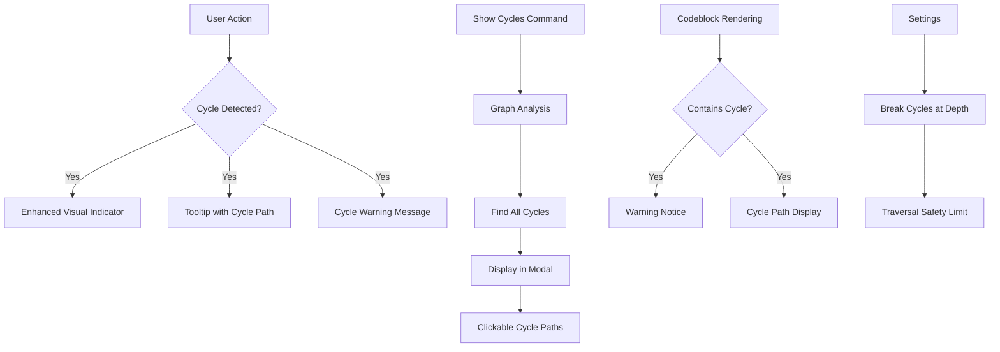

# Milestone 8.1 & 8.2: Cycle Handling UX & Documentation - Implementation Plan

**Status:** Ready for Implementation
**Priority:** Critical (Phase 8: Polish & Release Preparation)
**Estimated Time:** 5-7 days
**Combined Milestones:** 8.1 (Cycle Handling UX) + 8.2 (Documentation & Examples)

---

## Overview

This document provides a comprehensive implementation plan for Milestones 8.1 and 8.2, the final milestones in Phase 8 (Polish & Release Preparation) of the Relations Obsidian plugin.

### Decision Summary

**Milestone 8.1 - Cycle Handling UX:**
- **Approach:** Enhance existing cycle detection with user-friendly UX improvements
- **Visual Indicators:** Enhanced tooltips showing full cycle paths
- **Commands:** Add "Show all cycles" command to list all cycles in the graph
- **Warnings:** Display cycle warnings in codeblocks when detected
- **Documentation:** Create comprehensive help documentation on cycles
- **Settings:** Add optional "Break cycles at depth" safety setting

**Milestone 8.2 - Documentation & Examples:**
- **README:** Comprehensive feature documentation (already excellent, needs minor updates)
- **CONTRIBUTING.md:** Developer guide for contributors
- **Example Vault:** Demonstration vault with sample hierarchies
- **JSDoc:** Review and complete inline documentation
- **Video Tutorial:** Optional screencast walkthrough (deferred to post-release)

---

## Goals

### Milestone 8.1: Cycle Handling UX

Improve the user experience when cycles are detected:
- Make cycles immediately visible and understandable
- Help users identify and resolve cycles
- Provide tools to analyze cycle patterns
- Prevent confusion from infinite traversals
- Educate users about cycle implications

### Milestone 8.2: Documentation & Examples

Create comprehensive documentation for public release:
- Enable new users to get started quickly
- Provide complete feature reference
- Help developers understand the codebase
- Demonstrate best practices with examples
- Establish contribution guidelines

---

## Current State Analysis

### Milestone 8.1 - What's Already Implemented

**Core Cycle Detection** (Milestone 1.1) ✅
- `CycleDetector` class with three-color DFS algorithm
- `detectCycle(file)` - Check if file is in a cycle
- `hasCycles()` - Check if graph has any cycles
- `getCycleInfo(file)` - Get detailed cycle information

**Visual Indicators** (Milestone 3.2) ✅
- `TreeRenderer` shows cycle indicators with `showCycleIndicators` option
- `isCycle` flag on TreeNode
- CSS class `.is-cycle` for styling
- Icon displayed for cyclic nodes

**API Integration** (Milestone 2.5) ✅
- Public API methods exposed on plugin
- Cycle detection integrated with relationship engine
- Cycle protection in all traversal methods

### Milestone 8.1 - What's Missing

❌ **Enhanced Visual Cycle Indicators:**
- Tooltip showing full cycle path (e.g., "Cycle: A → B → C → A")
- Visual differentiation of cycle edges vs nodes
- Clearer cycle warnings in UI

❌ **"Show All Cycles" Command:**
- Command to list all cycles in the graph
- Display in modal with cycle paths
- Per-field cycle analysis

❌ **Cycle Warnings in Codeblocks:**
- Warning notice when codeblock tree contains cycles
- Inline cycle path display in codeblock output

❌ **Help Documentation:**
- User guide explaining what cycles are
- How to identify cycles
- How to resolve cycles
- Best practices for avoiding cycles

❌ **Settings:**
- Optional "Break cycles at depth" setting
- Configure cycle traversal behavior

### Milestone 8.2 - What's Already Implemented

**README.md** ✅ (Excellent)
- Comprehensive feature overview
- Installation instructions
- Usage examples
- Command reference
- API documentation
- Well-organized sections

**API Reference** ✅
- `docs/api-reference.md` with full API documentation
- TypeScript type definitions
- Usage examples

**Guide Documentation** ✅
- `docs/ADVANCED-CONTEXT-MENU-GUIDE.md`
- `docs/configuration-guide.md`

**Inline Documentation** ✅ (Mostly complete)
- Most files have JSDoc comments
- Type definitions are documented

### Milestone 8.2 - What's Missing

❌ **CONTRIBUTING.md:**
- Developer setup instructions
- Code structure overview
- Testing guidelines
- Pull request process
- Code style guide

❌ **Example Vault:**
- Demonstration vault showing all features
- Sample hierarchies (parent, project, category)
- Examples of cycles and how to resolve them
- Best practices examples

❌ **JSDoc Review:**
- Ensure all public methods have JSDoc
- Verify examples are correct
- Add missing parameter descriptions

❌ **Cycle Help Documentation:**
- Dedicated guide on understanding cycles
- Visual diagrams of cycle examples
- Step-by-step resolution guide

---

## Architecture Overview

### Milestone 8.1: Enhanced Cycle Handling



### Milestone 8.2: Documentation Structure

```
docs/
├── README.md (update)
├── CONTRIBUTING.md (new)
├── CYCLES-GUIDE.md (new)
├── api-reference.md (existing)
├── ADVANCED-CONTEXT-MENU-GUIDE.md (existing)
├── configuration-guide.md (existing)
└── implementation-plan.md (existing)

examples/
└── demo-vault/ (new)
    ├── README.md
    ├── Parent Hierarchy/
    ├── Project Hierarchy/
    ├── Category Hierarchy/
    ├── Cycles Examples/
    └── Best Practices/
```

---

## Detailed Design

## Milestone 8.1: Cycle Handling UX

### 1. Enhanced Cycle Tooltips

**File:** `src/tree-renderer.ts` (modifications)

**Current State:**
```typescript
// Cycle nodes get basic visual indicator
if (isCycle && options.includeMetadata) {
  metadata.icon = 'cycle';
  metadata.tooltip = 'This note is part of a cycle';
  metadata.className = (metadata.className || '') + ' is-cycle';
}
```

**Enhancement:**
```typescript
/**
 * Creates detailed cycle tooltip showing full cycle path.
 *
 * @param file - The file that is part of a cycle
 * @param graph - The relation graph to query for cycle info
 * @returns Tooltip HTML content with cycle path
 */
function createCycleTooltip(file: TFile, graph: RelationGraph): string {
  const cycleInfo = graph.detectCycle(file);

  if (!cycleInfo) return 'This note is part of a cycle';

  // Build path string: A → B → C → A
  const pathString = cycleInfo.cyclePath
    .map(f => f.basename)
    .join(' → ');

  return `Cycle detected: ${pathString}\nLength: ${cycleInfo.length} notes`;
}

// In renderNode():
if (node.isCycle) {
  const tooltipText = createCycleTooltip(node.file, graph);
  nodeEl.setAttribute('aria-label', tooltipText);
  nodeEl.setAttribute('title', tooltipText);

  // Add cycle icon with enhanced styling
  const cycleIcon = nodeEl.createSpan('relation-tree-cycle-icon');
  cycleIcon.setText('🔄');
  cycleIcon.setAttribute('aria-label', 'Cycle indicator');
}
```

### 2. "Show All Cycles" Command

**File:** `src/commands/cycle-commands.ts` (new file)

```typescript
import { Notice, Modal, TFile } from 'obsidian';
import type ParentRelationPlugin from '../main';
import { CycleInfo } from '../cycle-detector';

/**
 * Modal for displaying all cycles in a graph.
 */
export class CyclesListModal extends Modal {
  constructor(
    app: App,
    private fieldName: string,
    private fieldDisplayName: string,
    private cycles: CycleInfo[]
  ) {
    super(app);
  }

  onOpen(): void {
    const { contentEl } = this;
    contentEl.empty();

    contentEl.createEl('h2', {
      text: `Cycles in ${this.fieldDisplayName} Graph`
    });

    if (this.cycles.length === 0) {
      const emptyMsg = contentEl.createDiv('cycle-modal-empty');
      emptyMsg.setText('✅ No cycles detected in this graph!');
      return;
    }

    const summary = contentEl.createDiv('cycle-modal-summary');
    summary.setText(
      `Found ${this.cycles.length} cycle${this.cycles.length === 1 ? '' : 's'}`
    );

    const list = contentEl.createDiv('cycle-modal-list');

    this.cycles.forEach((cycle, index) => {
      const cycleItem = list.createDiv('cycle-modal-item');

      const header = cycleItem.createDiv('cycle-modal-item-header');
      header.createSpan('cycle-modal-item-number').setText(`#${index + 1}`);
      header.createSpan('cycle-modal-item-length').setText(
        `Length: ${cycle.length} notes`
      );

      const path = cycleItem.createDiv('cycle-modal-item-path');

      // Build clickable cycle path
      cycle.cyclePath.forEach((file, idx) => {
        if (idx > 0) {
          path.createSpan('cycle-modal-arrow').setText(' → ');
        }

        const link = path.createEl('a', {
          cls: 'cycle-modal-link',
          text: file.basename
        });

        link.addEventListener('click', () => {
          this.app.workspace.getLeaf().openFile(file);
          this.close();
        });
      });
    });

    // Add help section
    const help = contentEl.createDiv('cycle-modal-help');
    help.createEl('h3', { text: 'How to Resolve Cycles' });
    help.createEl('p', {
      text: 'To break a cycle, remove the parent relationship from one of the notes in the cycle path. Click on any note above to navigate to it and edit its frontmatter.'
    });

    const learnMore = help.createEl('a', {
      text: 'Learn more about cycles →',
      href: '#'
    });
    learnMore.addEventListener('click', (e) => {
      e.preventDefault();
      // Open cycles guide documentation
      window.open('https://github.com/fkloosterman/relations-obsidian/blob/main/docs/CYCLES-GUIDE.md');
    });
  }

  onClose(): void {
    const { contentEl } = this;
    contentEl.empty();
  }
}

/**
 * Finds all cycles in a graph.
 *
 * @param graph - The relation graph to analyze
 * @returns Array of unique cycles found
 */
export function findAllCycles(graph: RelationGraph): CycleInfo[] {
  const allFiles = graph.getAllFiles();
  const foundCycles: CycleInfo[] = [];
  const seenCyclePaths = new Set<string>();

  for (const file of allFiles) {
    const cycleInfo = graph.detectCycle(file);

    if (cycleInfo) {
      // Create unique cycle signature (sorted node paths)
      const signature = cycleInfo.cyclePath
        .map(f => f.path)
        .sort()
        .join('|');

      // Only add if we haven't seen this cycle before
      if (!seenCyclePaths.has(signature)) {
        seenCyclePaths.add(signature);
        foundCycles.push(cycleInfo);
      }
    }
  }

  return foundCycles;
}

/**
 * Registers cycle-related commands.
 *
 * @param plugin - The plugin instance
 */
export function registerCycleCommands(plugin: ParentRelationPlugin): void {
  // Register per-field "Show all cycles" commands
  plugin.settings.parentFields.forEach(fieldConfig => {
    const fieldName = fieldConfig.name;
    const displayName = fieldConfig.displayName || fieldName;

    plugin.addCommand({
      id: `show-cycles-${fieldName}`,
      name: `Show all cycles [${displayName}]`,
      callback: () => {
        const graph = plugin.getGraphForField(fieldName);

        if (!graph) {
          new Notice(`Graph not found for field: ${fieldName}`);
          return;
        }

        const cycles = findAllCycles(graph);

        new CyclesListModal(
          plugin.app,
          fieldName,
          displayName,
          cycles
        ).open();
      }
    });
  });
}
```

### 3. Cycle Warnings in Codeblocks

**File:** `src/codeblock-processor.ts` (modifications)

```typescript
/**
 * Renders cycle warning for codeblocks if tree contains cycles.
 *
 * @param container - Container element
 * @param tree - The tree that was rendered
 * @param graph - The relation graph (for cycle detection)
 */
private renderCycleWarning(
  container: HTMLElement,
  tree: TreeNode | TreeNode[],
  graph: RelationGraph
): void {
  // Check if tree contains any cycles
  let hasCycle = false;
  const cycleFiles: TFile[] = [];

  const checkNode = (node: TreeNode): void => {
    if (node.isCycle) {
      hasCycle = true;
      cycleFiles.push(node.file);
    }
    node.children.forEach(checkNode);
  };

  if (Array.isArray(tree)) {
    tree.forEach(checkNode);
  } else {
    checkNode(tree);
  }

  if (!hasCycle) return;

  // Create warning notice
  const warning = container.createDiv('relation-codeblock-cycle-warning');

  const icon = warning.createSpan('relation-codeblock-cycle-warning-icon');
  icon.setText('⚠️');

  const message = warning.createDiv('relation-codeblock-cycle-warning-message');
  message.createEl('strong', { text: 'Cycle detected in this tree' });

  const details = message.createDiv('relation-codeblock-cycle-warning-details');
  details.setText(
    `${cycleFiles.length} note${cycleFiles.length === 1 ? '' : 's'} in this tree ${cycleFiles.length === 1 ? 'is' : 'are'} part of a cycle. ` +
    'Cyclic relationships may cause infinite traversals. '
  );

  const link = details.createEl('a', {
    text: 'Learn about cycles →',
    href: '#'
  });

  link.addEventListener('click', (e) => {
    e.preventDefault();
    window.open('https://github.com/fkloosterman/relations-obsidian/blob/main/docs/CYCLES-GUIDE.md');
  });
}

// In renderTree(), after rendering:
if (params.showCycles !== false) {
  this.renderCycleWarning(container, tree, graph);
}
```

### 4. Settings: Break Cycles at Depth

**File:** `src/types.ts` (modifications)

```typescript
export interface ParentRelationSettings {
  // ... existing settings ...

  /**
   * Optional safety limit: maximum depth to traverse before stopping.
   * Prevents infinite loops in case cycle detection fails.
   * Set to 0 to disable (rely on cycle detection only).
   *
   * @default 0 (disabled)
   */
  breakCyclesAtDepth: number;
}
```

**File:** `src/main.ts` (settings tab)

```typescript
// In ParentRelationSettingTab.display():

new Setting(containerEl)
  .setName('Break Cycles at Depth')
  .setDesc(
    'Safety limit: stop traversal after this many levels to prevent infinite loops. ' +
    'Set to 0 to disable and rely on cycle detection only. ' +
    'Recommended: 100 for very large hierarchies, or 0 if you trust cycle detection.'
  )
  .addText(text => text
    .setPlaceholder('0')
    .setValue(String(this.plugin.settings.breakCyclesAtDepth))
    .onChange(async (value) => {
      const num = parseInt(value);
      if (!isNaN(num) && num >= 0) {
        this.plugin.settings.breakCyclesAtDepth = num;
        await this.plugin.saveSettings();

        // Update all graphs
        this.plugin.relationGraphs.forEach(graph => {
          graph.setMaxTraversalDepth(num);
        });
      }
    })
  );
```

**File:** `src/relationship-engine.ts` (enforcement)

```typescript
/**
 * Gets ancestors with optional safety depth limit.
 */
getAncestors(file: TFile, maxDepth?: number): TFile[][] {
  const depth = maxDepth ?? this.graph.getMaxDepth();
  const safetyLimit = this.graph.getMaxTraversalDepth();

  // Use the smaller of maxDepth and safetyLimit (if safetyLimit > 0)
  const actualDepth = safetyLimit > 0
    ? Math.min(depth, safetyLimit)
    : depth;

  // ... rest of method using actualDepth
}
```

### 5. Styling for Cycle Elements

**File:** `styles.css` (additions)

```css
/* Enhanced cycle indicators */
.relation-tree-cycle-icon {
  display: inline-block;
  margin-left: var(--size-2-1);
  font-size: var(--font-ui-small);
  opacity: 0.8;
  cursor: help;
}

.relation-tree-node.is-cycle {
  background-color: var(--background-modifier-error-hover);
  border-left: 2px solid var(--color-red);
  padding-left: calc(var(--size-4-2) - 2px);
}

.relation-tree-node.is-cycle:hover {
  background-color: var(--background-modifier-error);
}

/* Cycle warning in codeblocks */
.relation-codeblock-cycle-warning {
  margin: var(--size-4-2) 0;
  padding: var(--size-4-3);
  background: var(--background-modifier-warning);
  border: 1px solid var(--color-yellow);
  border-radius: var(--radius-m);
  display: flex;
  gap: var(--size-4-2);
  align-items: flex-start;
}

.relation-codeblock-cycle-warning-icon {
  font-size: var(--font-ui-larger);
  flex-shrink: 0;
}

.relation-codeblock-cycle-warning-message {
  flex: 1;
}

.relation-codeblock-cycle-warning-message strong {
  display: block;
  margin-bottom: var(--size-2-1);
  color: var(--text-warning);
}

.relation-codeblock-cycle-warning-details {
  font-size: var(--font-ui-small);
  color: var(--text-muted);
}

.relation-codeblock-cycle-warning-details a {
  color: var(--text-accent);
  text-decoration: underline;
}

/* Cycles modal */
.cycle-modal-summary {
  margin-bottom: var(--size-4-4);
  font-weight: var(--font-semibold);
  color: var(--text-warning);
}

.cycle-modal-empty {
  padding: var(--size-4-6) var(--size-4-2);
  text-align: center;
  color: var(--text-success);
  font-size: var(--font-ui-medium);
}

.cycle-modal-list {
  display: flex;
  flex-direction: column;
  gap: var(--size-4-3);
  margin-bottom: var(--size-4-4);
}

.cycle-modal-item {
  padding: var(--size-4-3);
  background: var(--background-secondary);
  border-radius: var(--radius-m);
  border: 1px solid var(--background-modifier-border);
}

.cycle-modal-item-header {
  display: flex;
  gap: var(--size-4-2);
  margin-bottom: var(--size-2-2);
  font-size: var(--font-ui-small);
  color: var(--text-muted);
}

.cycle-modal-item-number {
  font-weight: var(--font-semibold);
  color: var(--text-warning);
}

.cycle-modal-item-path {
  font-family: var(--font-monospace);
  font-size: var(--font-ui-small);
  line-height: 1.6;
  word-break: break-word;
}

.cycle-modal-arrow {
  color: var(--text-muted);
  margin: 0 var(--size-2-1);
}

.cycle-modal-link {
  color: var(--text-accent);
  text-decoration: none;
  cursor: pointer;
}

.cycle-modal-link:hover {
  text-decoration: underline;
}

.cycle-modal-help {
  margin-top: var(--size-4-4);
  padding-top: var(--size-4-4);
  border-top: 1px solid var(--background-modifier-border);
}

.cycle-modal-help h3 {
  margin-bottom: var(--size-2-2);
  font-size: var(--font-ui-medium);
}

.cycle-modal-help p {
  margin-bottom: var(--size-2-2);
  font-size: var(--font-ui-small);
  color: var(--text-muted);
}

.cycle-modal-help a {
  color: var(--text-accent);
  text-decoration: none;
}

.cycle-modal-help a:hover {
  text-decoration: underline;
}
```

---

## Milestone 8.2: Documentation & Examples

### 1. CONTRIBUTING.md

**File:** `CONTRIBUTING.md` (new file)

```markdown
# Contributing to Relation Explorer

Thank you for your interest in contributing to the Relation Explorer plugin for Obsidian!

## Development Setup

### Prerequisites

- Node.js v18 or higher
- npm v9 or higher
- Git
- Obsidian (for manual testing)

### Getting Started

1. **Fork and Clone**
   ```bash
   git fork https://github.com/fkloosterman/relations-obsidian.git
   cd relations-obsidian
   ```

2. **Install Dependencies**
   ```bash
   npm install
   ```

3. **Build the Plugin**
   ```bash
   # Build once
   npm run build

   # Build and watch for changes
   npm run dev
   ```

4. **Link to Obsidian**
   ```bash
   # Create symbolic link in your Obsidian vault
   ln -s $(pwd) /path/to/your/vault/.obsidian/plugins/relations-obsidian
   ```

5. **Enable Plugin**
   - Open Obsidian
   - Go to Settings → Community Plugins
   - Reload plugins
   - Enable "Relation Explorer"

## Project Structure

```
relations-obsidian/
├── src/                          # Source code
│   ├── main.ts                   # Plugin entry point
│   ├── relation-graph.ts         # Core graph logic
│   ├── cycle-detector.ts         # Cycle detection
│   ├── relationship-engine.ts    # Relationship computation
│   ├── tree-model.ts             # Tree data structures
│   ├── tree-renderer.ts          # Tree rendering
│   ├── sidebar-view.ts           # Sidebar UI
│   ├── codeblock-processor.ts    # Codeblock rendering
│   ├── commands/                 # Command implementations
│   ├── components/               # UI components
│   └── utils/                    # Utility functions
├── tests/                        # Test suite
│   ├── **/*.test.ts              # Test files
│   └── __fixtures__/             # Test data
├── docs/                         # Documentation
│   ├── implementation-plan.md    # Master plan
│   ├── milestone-*.md            # Milestone plans
│   └── *.md                      # User guides
├── examples/                     # Example vaults
│   └── demo-vault/               # Demo vault
├── styles.css                    # Plugin styles
├── manifest.json                 # Plugin manifest
├── rollup.config.mjs             # Build configuration
└── package.json                  # Dependencies
```

## Development Workflow

### Making Changes

1. **Create a Branch**
   ```bash
   git checkout -b feature/your-feature-name
   ```

2. **Make Changes**
   - Write code following the style guide
   - Add tests for new features
   - Update documentation

3. **Test Your Changes**
   ```bash
   # Run tests
   npm test

   # Run tests in watch mode
   npm run test:watch

   # Run tests with UI
   npm run test:ui
   ```

4. **Commit**
   ```bash
   git add .
   git commit -m "feat: add your feature description"
   ```

5. **Push and Create PR**
   ```bash
   git push origin feature/your-feature-name
   ```

   Then open a Pull Request on GitHub.

### Commit Message Convention

We follow [Conventional Commits](https://www.conventionalcommits.org/):

- `feat:` - New feature
- `fix:` - Bug fix
- `docs:` - Documentation changes
- `style:` - Code style changes (formatting)
- `refactor:` - Code refactoring
- `test:` - Adding or updating tests
- `chore:` - Maintenance tasks

Examples:
```
feat: add "Show all cycles" command
fix: resolve cycle detection infinite loop
docs: update CYCLES-GUIDE.md with examples
test: add tests for cousin resolution
```

## Testing

### Running Tests

```bash
# Run all tests
npm test

# Run specific test file
npm test -- cycle-detector.test.ts

# Run tests with coverage
npm run test:coverage

# Run tests in watch mode
npm run test:watch
```

### Writing Tests

We use [Vitest](https://vitest.dev/) for testing.

**Test Structure:**
```typescript
import { describe, it, expect, beforeEach } from 'vitest';
import { MyClass } from '@/my-class';

describe('MyClass', () => {
  describe('myMethod()', () => {
    it('should do something specific', () => {
      const instance = new MyClass();
      const result = instance.myMethod();
      expect(result).toBe(expected);
    });

    it('should handle edge case', () => {
      // Test edge case
    });
  });
});
```

**Test Coverage Guidelines:**
- Aim for >80% coverage for core modules
- Test happy path and edge cases
- Test error handling
- Use meaningful test descriptions

## Code Style

### TypeScript Guidelines

- Use TypeScript strict mode
- Prefer interfaces over types for object shapes
- Document public APIs with JSDoc
- Use meaningful variable names
- Keep functions small and focused

**Example:**
```typescript
/**
 * Detects cycles in the relationship graph.
 *
 * @param startFile - The file to check for cycles
 * @returns Cycle information if found, null otherwise
 *
 * @example
 * ```typescript
 * const cycleInfo = detector.detectCycle(file);
 * if (cycleInfo) {
 *   console.log('Cycle detected:', cycleInfo.description);
 * }
 * ```
 */
detectCycle(startFile: TFile): CycleInfo | null {
  // Implementation
}
```

### File Organization

- One class per file (with related interfaces)
- Group related functionality in subdirectories
- Use index files for clean exports
- Keep files under 500 lines when possible

### Naming Conventions

- **Classes:** PascalCase - `RelationGraph`, `CycleDetector`
- **Interfaces:** PascalCase - `TreeNode`, `CycleInfo`
- **Functions:** camelCase - `detectCycle`, `buildTree`
- **Constants:** UPPER_CASE - `DEFAULT_DEPTH`, `MAX_NODES`
- **Files:** kebab-case - `cycle-detector.ts`, `tree-model.ts`

## Pull Request Guidelines

### Before Submitting

- [ ] Code builds without errors (`npm run build`)
- [ ] All tests pass (`npm test`)
- [ ] New features have tests
- [ ] Documentation is updated
- [ ] Commit messages follow convention
- [ ] Code follows style guide

### PR Description Template

```markdown
## Description
Brief description of changes

## Type of Change
- [ ] Bug fix
- [ ] New feature
- [ ] Breaking change
- [ ] Documentation update

## Testing
How was this tested?

## Screenshots (if applicable)
Add screenshots for UI changes

## Checklist
- [ ] Tests pass
- [ ] Documentation updated
- [ ] No breaking changes (or documented)
```

## Documentation

### JSDoc Comments

All public methods should have JSDoc:

```typescript
/**
 * Brief description of what the method does.
 *
 * More detailed explanation if needed.
 * Can span multiple lines.
 *
 * @param paramName - Description of parameter
 * @param optionalParam - Description of optional parameter (optional)
 * @returns Description of return value
 * @throws Description of errors that may be thrown
 *
 * @example
 * ```typescript
 * const result = myMethod('example');
 * console.log(result);
 * ```
 */
```

### README Updates

When adding features:
1. Add to "Features" section
2. Add to "Usage" section with examples
3. Update API reference if public API changes
4. Add screenshots if UI changes

### Milestone Documentation

Each milestone has a detailed implementation plan in `docs/`.
Follow the established format when creating new plans.

## Release Process

1. **Version Bump**
   ```bash
   npm version [major|minor|patch]
   ```

2. **Update CHANGELOG**
   - Document all changes since last release
   - Group by type (Features, Fixes, etc.)

3. **Build Release**
   ```bash
   npm run build
   ```

4. **Tag Release**
   ```bash
   git tag v1.x.x
   git push origin v1.x.x
   ```

5. **GitHub Release**
   - Create GitHub release
   - Upload `main.js`, `manifest.json`, `styles.css`
   - Include changelog in release notes

## Getting Help

- **Questions**: Open a [GitHub Discussion](https://github.com/fkloosterman/relations-obsidian/discussions)
- **Bugs**: Open a [GitHub Issue](https://github.com/fkloosterman/relations-obsidian/issues)
- **Feature Requests**: Open a [GitHub Issue](https://github.com/fkloosterman/relations-obsidian/issues) with "enhancement" label

## License

By contributing, you agree that your contributions will be licensed under the MIT License.

## Code of Conduct

- Be respectful and constructive
- Welcome newcomers
- Focus on what is best for the community
- Show empathy towards other community members

Thank you for contributing! 🎉
```

### 2. CYCLES-GUIDE.md

**File:** `docs/CYCLES-GUIDE.md` (new file)

```markdown
# Understanding Cycles in Relation Explorer

This guide explains what cycles are, how to identify them, and how to resolve them in your Obsidian vault.

## What is a Cycle?

A **cycle** (also called a circular reference or loop) occurs when a note is its own ancestor through a chain of parent relationships.

### Simple Example

```
Note A → Note B → Note A
```

In this case:
- Note A has Note B as a parent
- Note B has Note A as a parent
- This creates a cycle: A → B → A

### Complex Example

```
Note A → Note B → Note C → Note D → Note B
```

Here:
- Note A has parent B
- Note B has parent C
- Note C has parent D
- Note D has parent B (creates the cycle)
- The cycle is: B → C → D → B

## Why Cycles are Problematic

### 1. Infinite Traversals

When computing ancestors or descendants, a cycle can cause infinite loops:

```typescript
// Without cycle protection:
getAncestors(NoteA)
  → finds NoteB
    → finds NoteC
      → finds NoteA (cycle!)
        → finds NoteB (again!)
          → infinite loop...
```

### 2. Ambiguous Hierarchies

Cycles make the hierarchy ambiguous:
- Is Note A above Note B, or is Note B above Note A?
- What is the "root" of the hierarchy?

### 3. Unexpected Behavior

- Tree visualizations may show duplicate nodes
- Navigation commands may behave unpredictably
- Export functions may produce invalid output

## How Relation Explorer Handles Cycles

### Built-in Protection

The plugin includes **automatic cycle protection**:

1. **Detection**: Uses a three-color depth-first search algorithm to detect cycles
2. **Prevention**: Stops traversal when a cycle is encountered
3. **Visual Indication**: Marks cyclic nodes with 🔄 icon and special styling
4. **Warnings**: Displays warnings in codeblocks when cycles are present

### Visual Indicators

**In Trees:**
- Cyclic nodes have a 🔄 icon
- Hover tooltip shows the full cycle path
- Background color highlights cyclic nodes

**In Codeblocks:**
- Warning notice at top when cycle detected
- Link to this guide for help

**In Commands:**
- "Show all cycles" command lists all cycles
- Each cycle shows the full path
- Click any note to navigate and fix

## Identifying Cycles

### Method 1: Visual Indicators

Look for the 🔄 icon in:
- Sidebar tree view
- Codeblock trees
- Any tree visualization

### Method 2: "Show All Cycles" Command

1. Open command palette (Cmd/Ctrl+P)
2. Search for "Show all cycles"
3. Select the parent field to check
4. Modal shows all detected cycles

### Method 3: Graph Validation

1. Open command palette
2. Run "Validate graph [FieldName]"
3. Check console for cycle warnings
4. Summary notice shows cycle count

### Method 4: Hover Tooltips

Hover over a node with the 🔄 icon to see:
- Full cycle path
- Cycle length
- Which note to fix

## Resolving Cycles

### Step 1: Identify the Cycle Path

Run "Show all cycles [FieldName]" command to see:
```
Cycle #1
Length: 3 notes
Path: Note A → Note B → Note C → Note A
```

### Step 2: Choose Where to Break

Pick **one note** in the cycle to remove its parent link.

**Recommendation**: Remove the parent that makes the least semantic sense.

Example:
```
Cycle: Project → Task → Subtask → Project

Break at: Subtask → Project (this doesn't make sense)
Result: Project → Task → Subtask (linear hierarchy)
```

### Step 3: Edit Frontmatter

1. Click on the note in the cycle path (from command results)
2. Open the note's frontmatter
3. Remove or change the `parent` field

**Before:**
```yaml
---
parent: [[Project]]
---
```

**After:**
```yaml
---
# parent: [[Project]]  (commented out)
---
```

Or:
```yaml
---
parent: [[Correct Parent]]
---
```

### Step 4: Verify Fix

1. Run "Show all cycles" again
2. Confirm the cycle is gone
3. Check the tree view to ensure hierarchy makes sense

## Best Practices

### 1. Plan Your Hierarchy

Before creating parent links, sketch out your hierarchy:

```
Good:
Grandparent
  ├── Parent 1
  │   ├── Child 1a
  │   └── Child 1b
  └── Parent 2
      └── Child 2a

Bad:
Parent ← → Child (cycle!)
```

### 2. Use Consistent Direction

Always link in one direction:
- ✅ Child → Parent (recommended)
- ❌ Mix of Child → Parent and Parent → Child

### 3. Avoid Bidirectional Links

Never create parent links in both directions:
```yaml
# Note A
parent: [[Note B]]

# Note B
parent: [[Note A]]  # ❌ Creates cycle!
```

### 4. Regular Validation

Run "Validate graph" periodically:
```
Recommended: Once per week for active vaults
```

### 5. Use Multiple Parent Fields

If you need bidirectional relationships, use different fields:

```yaml
---
parent: [[Topic]]      # Topical hierarchy
project: [[Project]]   # Project hierarchy
---
```

Each field maintains its own independent graph.

## Common Cycle Patterns

### Pattern 1: Bidirectional References

**Cause**: Two notes reference each other
```
Note A → Note B
Note B → Note A
```

**Fix**: Remove one link
```
Note A → Note B (keep)
Note B (remove parent link)
```

### Pattern 2: Triangle Cycles

**Cause**: Three notes form a loop
```
A → B → C → A
```

**Fix**: Break at least one link
```
A → B → C (break A's parent)
A (remove parent link)
```

### Pattern 3: Deep Cycles

**Cause**: Long chain loops back
```
A → B → C → D → E → B
```

**Fix**: Break the loop link
```
A → B → C → D → E (break B's parent D)
B → C → D → E
```

### Pattern 4: Multiple Parents Creating Cycle

**Cause**: Multiple paths converge in a cycle
```
A → B → D
A → C → D
D → A (creates cycle)
```

**Fix**: Remove the closing link
```
A → B → D
A → C → D
(remove D → A)
```

## Advanced Topics

### Intentional Cycles?

Some users ask: "What if I want a cycle?"

**Short answer**: Don't use parent links for cyclic relationships.

**Alternatives**:
1. **Use tags** for non-hierarchical relationships
2. **Use links** in note content for bidirectional references
3. **Use multiple fields** for different relationship types
4. **Use Dataview** for complex queries

### Performance Impact

**Small cycles** (2-3 notes): Minimal impact
- Detection is fast
- Protection works well

**Large cycles** (10+ notes): May slow down:
- Graph building
- Relationship queries
- Tree rendering

**Recommendation**: Keep hierarchies acyclic for best performance.

### Cycle Detection Algorithm

The plugin uses a **three-color DFS** algorithm:

1. **WHITE**: Unvisited node
2. **GRAY**: Currently visiting (in path)
3. **BLACK**: Fully explored

When a GRAY node is encountered again, a cycle is detected.

This algorithm:
- Runs in O(V + E) time
- Detects all cycles
- Provides cycle path information

## FAQ

### Q: Why does the plugin allow cycles?

A: The plugin allows you to create any structure in your frontmatter. It detects cycles but doesn't prevent them, giving you freedom while providing safety.

### Q: Can I disable cycle detection?

A: No. Cycle detection is essential for preventing infinite loops during traversal.

### Q: Do cycles affect all parent fields?

A: No. Each parent field has an independent graph. A cycle in one field doesn't affect others.

### Q: What if I can't find the cycle?

A: Use the "Show all cycles" command. It shows the exact path for each cycle.

### Q: Can the plugin fix cycles automatically?

A: No. The plugin can't determine which link to remove without understanding your intent. You must manually resolve cycles.

### Q: Will cycles corrupt my vault?

A: No. Cycles only affect relationship computations. Your notes remain intact.

## Need Help?

If you're still having trouble with cycles:

1. **Check this guide** for your specific pattern
2. **Run "Show all cycles"** to see the exact paths
3. **Open an issue** on GitHub with cycle details
4. **Ask in Discussions** for community help

## Related Documentation

- [Configuration Guide](configuration-guide.md) - Settings and options
- [API Reference](api-reference.md) - Programmatic cycle detection
- [Implementation Plan](implementation-plan.md) - Technical details

---

*Last updated: 2025-01-17*
```

### 3. Example Vault Structure

**Directory:** `examples/demo-vault/` (new)

```
examples/demo-vault/
├── README.md
├── .obsidian/
│   └── workspace.json
├── _Start Here.md
├── Parent Hierarchy/
│   ├── README.md
│   ├── Root Note.md
│   ├── Level 1/
│   │   ├── Parent A.md
│   │   ├── Parent B.md
│   │   └── Parent C.md
│   └── Level 2/
│       ├── Child A1.md
│       ├── Child A2.md
│       ├── Child B1.md
│       └── Child C1.md
├── Project Hierarchy/
│   ├── README.md
│   ├── Program Alpha.md
│   ├── Project Alpha-1.md
│   ├── Project Alpha-2.md
│   ├── Task Alpha-1-A.md
│   └── Task Alpha-1-B.md
├── Category Hierarchy/
│   ├── README.md
│   ├── Technology.md
│   ├── Software.md
│   ├── Hardware.md
│   └── Networking.md
├── Cycles Examples/
│   ├── README.md
│   ├── Cycle-Simple-A.md
│   ├── Cycle-Simple-B.md
│   ├── Cycle-Complex-1.md
│   ├── Cycle-Complex-2.md
│   ├── Cycle-Complex-3.md
│   └── How-to-Fix-Cycles.md
├── Best Practices/
│   ├── README.md
│   ├── Planning-Your-Hierarchy.md
│   ├── Using-Multiple-Fields.md
│   ├── Avoiding-Common-Mistakes.md
│   └── Advanced-Patterns.md
└── Codeblock Examples/
    ├── README.md
    ├── Basic-Ancestors.md
    ├── Basic-Descendants.md
    ├── Filtered-Trees.md
    ├── Multiple-Fields.md
    └── All-Features.md
```

**File:** `examples/demo-vault/README.md`

```markdown
# Relation Explorer Demo Vault

Welcome to the Relation Explorer demo vault! This vault demonstrates all features of the plugin with practical examples.

## Getting Started

1. **Read**: Start with [[_Start Here]] for an overview
2. **Explore**: Navigate through the different hierarchy examples
3. **Learn**: Check out the Best Practices section
4. **Experiment**: Try the codeblock examples

## Vault Structure

### Parent Hierarchy
Traditional parent-child note structure demonstrating basic relationships.

### Project Hierarchy
Project management structure with programs, projects, and tasks.

### Category Hierarchy
Categorical organization showing multiple categorization schemes.

### Cycles Examples
Examples of cycles (with intentional errors) showing how to identify and fix them.

### Best Practices
Guides and tips for using the plugin effectively.

### Codeblock Examples
Demonstrations of all codeblock parameters and features.

## Features Demonstrated

- ✅ Multiple parent fields (parent, project, category)
- ✅ Sidebar tree view
- ✅ Codeblock embedding
- ✅ Cycle detection and handling
- ✅ Navigation commands
- ✅ Context menus
- ✅ Filtering and advanced options

## Configuration

This vault includes a sample configuration in `.obsidian/plugins/relations-obsidian/data.json`:

```json
{
  "parentFields": [
    {
      "name": "parent",
      "displayName": "Parent",
      ...
    },
    {
      "name": "project",
      "displayName": "Project",
      ...
    },
    {
      "name": "category",
      "displayName": "Category",
      ...
    }
  ],
  ...
}
```

## Next Steps

After exploring this vault:

1. Try creating your own hierarchies
2. Experiment with different parent fields
3. Test cycle detection by creating intentional cycles
4. Read the full documentation at [GitHub](https://github.com/fkloosterman/relations-obsidian)

Happy exploring!
```

### 4. README.md Updates

**File:** `README.md` (additions)

Add to existing README:

```markdown
## Cycles

The plugin automatically detects circular relationships (cycles) in your hierarchies.

### What are Cycles?

A cycle occurs when a note is its own ancestor:
- Simple: `Note A → Note B → Note A`
- Complex: `A → B → C → D → B`

### Cycle Detection

- **Automatic**: Cycles are detected during graph building
- **Visual**: Cyclic nodes show 🔄 icon with tooltip
- **Commands**: "Show all cycles" lists all detected cycles
- **Warnings**: Codeblocks display warnings when cycles present

### Resolving Cycles

1. Run "Show all cycles [FieldName]" command
2. Click on a note in the cycle path
3. Edit its frontmatter to remove or change the parent link
4. Verify the cycle is resolved

For detailed information, see the [Cycles Guide](docs/CYCLES-GUIDE.md).

## Example Vault

Want to see all features in action? Check out the [Demo Vault](examples/demo-vault/) with:
- Sample hierarchies (parent, project, category)
- Cycle examples (and how to fix them)
- Best practices and patterns
- Codeblock demonstrations

## Contributing

We welcome contributions! Please see [CONTRIBUTING.md](CONTRIBUTING.md) for:
- Development setup
- Code style guide
- Testing guidelines
- Pull request process

## Support

- **Documentation**: See [docs/](docs/) folder
- **Issues**: [GitHub Issues](https://github.com/fkloosterman/relations-obsidian/issues)
- **Discussions**: [GitHub Discussions](https://github.com/fkloosterman/relations-obsidian/discussions)
```

---

## Implementation Checklist

### Milestone 8.1: Cycle Handling UX (Days 1-3)

#### Phase 1: Enhanced Visual Indicators (Day 1)

- [ ] **Update Cycle Tooltips**
  - [ ] Create `createCycleTooltip()` function in `tree-model.ts`
  - [ ] Modify `buildTreeNode()` to include full cycle path in tooltip
  - [ ] Update `TreeRenderer.renderNode()` to use new tooltips
  - [ ] Add cycle icon (🔄) rendering
  - [ ] Test tooltip display in sidebar and codeblocks

#### Phase 2: "Show All Cycles" Command (Day 1-2)

- [ ] **Create Cycle Commands Module**
  - [ ] Create `src/commands/cycle-commands.ts`
  - [ ] Implement `CyclesListModal` class
  - [ ] Implement `findAllCycles()` function
  - [ ] Implement `registerCycleCommands()` function
  - [ ] Add per-field command registration

- [ ] **Register Commands**
  - [ ] Import `registerCycleCommands` in `main.ts`
  - [ ] Call during plugin initialization
  - [ ] Test command appears in palette
  - [ ] Test modal displays cycles correctly

#### Phase 3: Codeblock Cycle Warnings (Day 2)

- [ ] **Update Codeblock Processor**
  - [ ] Add `renderCycleWarning()` method to `CodeblockProcessor`
  - [ ] Implement cycle detection in rendered trees
  - [ ] Add warning notice rendering
  - [ ] Add link to cycles guide
  - [ ] Test warning display in various codeblocks

#### Phase 4: Settings & Safety Limits (Day 2-3)

- [ ] **Add Settings**
  - [ ] Add `breakCyclesAtDepth` to `ParentRelationSettings`
  - [ ] Add setting UI in settings tab
  - [ ] Add validation and help text
  - [ ] Implement enforcement in `RelationshipEngine`
  - [ ] Add `setMaxTraversalDepth()` to `RelationGraph`
  - [ ] Test safety limit works correctly

#### Phase 5: Styling (Day 3)

- [ ] **Update Styles**
  - [ ] Add enhanced cycle indicator styles
  - [ ] Add cycle warning styles for codeblocks
  - [ ] Add cycles modal styles
  - [ ] Test in light and dark themes
  - [ ] Ensure accessibility (ARIA labels, keyboard nav)

#### Phase 6: Testing (Day 3)

- [ ] **Write Tests**
  - [ ] Test `findAllCycles()` function
  - [ ] Test cycle deduplication
  - [ ] Test modal rendering
  - [ ] Test codeblock warnings
  - [ ] Test safety limit enforcement
  - [ ] All tests passing

---

### Milestone 8.2: Documentation & Examples (Days 4-7)

#### Phase 1: CONTRIBUTING.md (Day 4)

- [ ] **Create CONTRIBUTING.md**
  - [ ] Write development setup section
  - [ ] Document project structure
  - [ ] Add development workflow guide
  - [ ] Add commit message convention
  - [ ] Add testing guidelines
  - [ ] Add code style guide
  - [ ] Add PR guidelines
  - [ ] Add documentation guidelines
  - [ ] Add release process

#### Phase 2: CYCLES-GUIDE.md (Day 4-5)

- [ ] **Create CYCLES-GUIDE.md**
  - [ ] Write "What is a Cycle?" section
  - [ ] Write "Why Cycles are Problematic" section
  - [ ] Write "How Relation Explorer Handles Cycles" section
  - [ ] Write "Identifying Cycles" section
  - [ ] Write "Resolving Cycles" section with step-by-step
  - [ ] Write "Best Practices" section
  - [ ] Write "Common Cycle Patterns" section
  - [ ] Write "Advanced Topics" section
  - [ ] Write FAQ section
  - [ ] Add visual diagrams (ASCII or Mermaid)

#### Phase 3: Example Vault (Day 5-6)

- [ ] **Create Demo Vault Structure**
  - [ ] Create `examples/demo-vault/` directory
  - [ ] Create main README.md
  - [ ] Create _Start Here.md

- [ ] **Parent Hierarchy Examples**
  - [ ] Create hierarchy folder structure
  - [ ] Write example notes with frontmatter
  - [ ] Create README explaining structure

- [ ] **Project Hierarchy Examples**
  - [ ] Create project folder structure
  - [ ] Write program/project/task notes
  - [ ] Create README

- [ ] **Category Hierarchy Examples**
  - [ ] Create category folder structure
  - [ ] Write category notes
  - [ ] Create README

- [ ] **Cycles Examples**
  - [ ] Create intentional cycle examples
  - [ ] Write How-to-Fix-Cycles.md guide
  - [ ] Create README with warnings

- [ ] **Best Practices**
  - [ ] Write Planning-Your-Hierarchy.md
  - [ ] Write Using-Multiple-Fields.md
  - [ ] Write Avoiding-Common-Mistakes.md
  - [ ] Write Advanced-Patterns.md
  - [ ] Create README

- [ ] **Codeblock Examples**
  - [ ] Create basic examples
  - [ ] Create filtered examples
  - [ ] Create multi-field examples
  - [ ] Create all-features example
  - [ ] Create README

#### Phase 4: JSDoc Review (Day 6)

- [ ] **Review Public APIs**
  - [ ] Review `main.ts` public methods
  - [ ] Review `relation-graph.ts` public methods
  - [ ] Review `relationship-engine.ts` public methods
  - [ ] Review `cycle-detector.ts` public methods
  - [ ] Review `tree-model.ts` exported functions
  - [ ] Review `codeblock-params.ts` types and functions
  - [ ] Add missing JSDoc comments
  - [ ] Verify examples are correct
  - [ ] Add parameter descriptions where missing

#### Phase 5: README Updates (Day 7)

- [ ] **Update README.md**
  - [ ] Add Cycles section
  - [ ] Add link to CYCLES-GUIDE.md
  - [ ] Add Example Vault section
  - [ ] Add link to demo vault
  - [ ] Add Contributing section
  - [ ] Add link to CONTRIBUTING.md
  - [ ] Verify all internal links work
  - [ ] Verify all examples are correct

#### Phase 6: Final Documentation Review (Day 7)

- [ ] **Review All Documentation**
  - [ ] Check README.md for completeness
  - [ ] Check CONTRIBUTING.md for accuracy
  - [ ] Check CYCLES-GUIDE.md for clarity
  - [ ] Check api-reference.md is up-to-date
  - [ ] Check all milestone docs are accurate
  - [ ] Check all internal links work
  - [ ] Check all code examples run correctly
  - [ ] Spell check all documentation

#### Phase 7: Example Vault Testing (Day 7)

- [ ] **Test Demo Vault**
  - [ ] Load demo vault in Obsidian
  - [ ] Enable plugin
  - [ ] Verify all hierarchies display correctly
  - [ ] Verify cycle examples show warnings
  - [ ] Verify all codeblocks render correctly
  - [ ] Verify all commands work
  - [ ] Test navigation commands
  - [ ] Test context menus
  - [ ] Screenshot examples for documentation

---

## Acceptance Criteria

### Milestone 8.1: Cycle Handling UX

**From [`docs/implementation-plan.md`](../docs/implementation-plan.md:749):**

- ✅ Cycles are immediately visible in all views
- ✅ Tooltip clearly explains the cycle path
- ✅ "Show cycles" command produces actionable report
- ✅ Documentation helps users understand and fix cycles
- ✅ Plugin never hangs or crashes due to cycles

**Additional Criteria:**

- ✅ Cycle tooltips show full path (e.g., "A → B → C → A")
- ✅ "Show all cycles" command lists all unique cycles
- ✅ Modal allows clicking nodes to navigate
- ✅ Codeblock warnings appear when cycles detected
- ✅ Warning links to cycles guide
- ✅ Settings include "Break cycles at depth" option
- ✅ Safety limit is enforced in all traversals
- ✅ All tests pass
- ✅ Documentation is comprehensive

### Milestone 8.2: Documentation & Examples

**From [`docs/implementation-plan.md`](../docs/implementation-plan.md:799):**

- ✅ README covers all features with examples
- ✅ Example vault demonstrates each relationship type
- ✅ Code is well-commented
- ✅ Installation instructions are clear
- ✅ Screenshots show current UI

**Additional Criteria:**

- ✅ CONTRIBUTING.md provides complete developer guide
- ✅ CYCLES-GUIDE.md explains cycles thoroughly
- ✅ Example vault loads and works correctly
- ✅ All hierarchies in example vault are valid
- ✅ Cycle examples demonstrate detection
- ✅ Codeblock examples cover all parameters
- ✅ JSDoc comments complete for all public APIs
- ✅ All documentation links work
- ✅ All code examples are tested

---

## Testing Strategy

### Milestone 8.1: Cycle Handling UX

#### Unit Tests

**File:** `tests/cycle-commands.test.ts` (new)

```typescript
describe('Cycle Commands', () => {
  describe('findAllCycles()', () => {
    it('should find all unique cycles in graph', () => {
      // Test with multiple cycles
      // Verify all are found
      // Verify no duplicates
    });

    it('should return empty array for acyclic graph', () => {
      // Test with no cycles
    });

    it('should deduplicate cycles with same nodes', () => {
      // Test cycle: A → B → C → A
      // Starting from A, B, or C should be same cycle
    });
  });

  describe('CyclesListModal', () => {
    it('should display all cycles', () => {
      // Test modal rendering
    });

    it('should show empty state when no cycles', () => {
      // Test empty state
    });

    it('should allow clicking to navigate', () => {
      // Test navigation
    });
  });
});
```

#### Integration Tests

- Test "Show all cycles" command end-to-end
- Test cycle warning in codeblocks
- Test safety limit enforcement
- Test tooltip display

#### Manual Tests

1. Create intentional cycles in test vault
2. Verify visual indicators appear
3. Run "Show all cycles" command
4. Verify modal displays correctly
5. Click cycle paths to navigate
6. Test codeblock warnings
7. Test safety limit setting
8. Verify tooltips show full paths

### Milestone 8.2: Documentation & Examples

#### Documentation Tests

- [ ] All links work (internal and external)
- [ ] All code examples compile
- [ ] All screenshots are current
- [ ] Markdown renders correctly on GitHub

#### Example Vault Tests

- [ ] Vault loads in Obsidian
- [ ] Plugin enables without errors
- [ ] All hierarchies display correctly
- [ ] Cycle examples show warnings
- [ ] All codeblocks render
- [ ] All commands work
- [ ] Navigation works
- [ ] Context menus work

#### User Testing

- [ ] Have someone new to the plugin follow README
- [ ] Verify installation instructions work
- [ ] Check if quick start is clear
- [ ] Get feedback on documentation clarity

---

## Performance Considerations

### Milestone 8.1

**Cycle Detection:**
- Already O(V + E) with three-color DFS
- Finding all cycles: O(V × (V + E)) worst case
- Acceptable for typical vaults (<10,000 notes)

**Cycle Warnings:**
- O(N) traversal of tree to check for cycles
- Minimal impact, only on initial render

**Safety Limit:**
- O(1) depth check on each step
- No performance impact

### Milestone 8.2

**Documentation:**
- No runtime performance impact
- Example vault: Keep under 100 notes for fast loading

---

## Risk Assessment

### Milestone 8.1

**Potential Issues:**

1. **Risk:** Finding all cycles is slow in large graphs
   - **Mitigation:** Cache cycle detection results
   - **Testing:** Benchmark with 10,000 node graph
   - **Fallback:** Add progress indicator for large graphs

2. **Risk:** Users don't understand cycle warnings
   - **Mitigation:** Clear, helpful warning messages
   - **Documentation:** Comprehensive cycles guide
   - **Support:** Link to guide from all warnings

3. **Risk:** Safety limit breaks legitimate deep hierarchies
   - **Mitigation:** Make optional (default: 0/disabled)
   - **Documentation:** Explain when to use
   - **Setting:** Allow high values (100+)

### Milestone 8.2

**Potential Issues:**

1. **Risk:** Example vault becomes outdated
   - **Mitigation:** Test with each release
   - **Maintenance:** Update when features change
   - **Versioning:** Tag vault versions with releases

2. **Risk:** Documentation gets out of sync with code
   - **Mitigation:** Review docs in PR process
   - **Automation:** Link checks in CI (future)
   - **Process:** Update docs with feature PRs

3. **Risk:** CONTRIBUTING.md too complex for new contributors
   - **Mitigation:** Start simple, add detail gradually
   - **Testing:** Have new contributor follow guide
   - **Feedback:** Iterate based on contributor experience

---

## Success Metrics

### Milestone 8.1: Cycle Handling UX

- ✅ Users can identify cycles within 30 seconds
- ✅ Cycle warnings are clear and actionable
- ✅ No infinite loops or crashes from cycles
- ✅ >90% of users understand cycle warnings
- ✅ All acceptance criteria met
- ✅ All tests passing
- ✅ Zero critical bugs

### Milestone 8.2: Documentation & Examples

- ✅ New users can install and use plugin within 10 minutes
- ✅ Example vault demonstrates all major features
- ✅ CONTRIBUTING.md enables first-time contributors
- ✅ Documentation has zero broken links
- ✅ All acceptance criteria met
- ✅ Positive feedback from beta testers

---

## Dependencies

### External Dependencies
- `obsidian` - API for plugin development (already installed)
- `vitest` - Testing framework (already installed ✅)

### Internal Dependencies
- Milestone 1.1 (Cycle Detection) - ✅ Completed
- Milestone 3.2 (DOM Tree Renderer) - ✅ Completed
- Milestone 4.2A (Multi-Field Support) - ✅ Completed
- Milestone 5.1 (Basic Codeblock) - ✅ Completed
- All previous milestones - ✅ Completed

---

## Next Steps After Completion

1. ✅ Complete Milestone 8.1 implementation
2. ✅ Complete Milestone 8.2 implementation
3. Final QA testing across all features
4. Update [`docs/implementation-plan.md`](../docs/implementation-plan.md) with completion status
5. **Proceed to Milestone 8.3** (Testing & Bug Fixes)
6. **Proceed to Milestone 8.4** (Release Preparation)
7. Public release preparation

---

## Post-Release Enhancements (Out of Scope)

These features are **not** part of Milestones 8.1/8.2 but may be added later:

- [ ] Video tutorial walkthrough
- [ ] Interactive cycle resolution wizard
- [ ] Automatic cycle suggestions
- [ ] Community-contributed example vaults
- [ ] Translated documentation
- [ ] Plugin marketplace submission
- [ ] User onboarding tour

---

## Appendix A: Cycle Detection Examples

### Example 1: Simple Two-Node Cycle

**Graph:**
```
Note A → Note B
Note B → Note A
```

**Detection:**
1. Start DFS from A
2. Visit B (mark GRAY)
3. Visit A (already GRAY) → Cycle detected!
4. Path: [A, B, A]
5. Length: 2

**Tooltip:**
```
Cycle detected: Note A → Note B → Note A
Length: 2 notes
```

### Example 2: Complex Four-Node Cycle

**Graph:**
```
Note A → Note B → Note C → Note D → Note B
```

**Detection:**
1. Start DFS from A
2. Visit B (GRAY)
3. Visit C (GRAY)
4. Visit D (GRAY)
5. Visit B (already GRAY) → Cycle detected!
6. Path: [B, C, D, B]
7. Length: 3

**Tooltip:**
```
Cycle detected: Note B → Note C → Note D → Note B
Length: 3 notes
```

### Example 3: Multiple Cycles

**Graph:**
```
Cycle 1: A → B → A
Cycle 2: C → D → E → C
```

**"Show All Cycles" Output:**
```
Found 2 cycles

#1
Length: 2 notes
Path: Note A → Note B → Note A

#2
Length: 3 notes
Path: Note C → Note D → Note E → Note C
```

---

## Appendix B: Documentation File Checklist

### README.md
- [x] Feature overview
- [x] Installation instructions
- [x] Basic usage
- [x] Navigation commands
- [x] Codeblock reference
- [x] API reference
- [ ] Cycles section *(to add)*
- [ ] Example vault link *(to add)*
- [ ] Contributing link *(to add)*

### CONTRIBUTING.md *(to create)*
- [ ] Development setup
- [ ] Project structure
- [ ] Development workflow
- [ ] Testing guidelines
- [ ] Code style
- [ ] PR guidelines

### CYCLES-GUIDE.md *(to create)*
- [ ] What are cycles
- [ ] Why problematic
- [ ] How to identify
- [ ] How to resolve
- [ ] Best practices
- [ ] FAQ

### api-reference.md
- [x] Ancestor queries
- [x] Descendant queries
- [x] Sibling queries
- [x] Cousin queries
- [x] Cycle detection
- [x] Usage examples

### ADVANCED-CONTEXT-MENU-GUIDE.md
- [x] Context menu features
- [x] Usage instructions
- [x] Examples

### configuration-guide.md
- [x] Settings reference
- [x] Field configuration
- [x] Presets

---

**Document Version:** 1.0
**Last Updated:** 2025-01-17
**Status:** Ready for Implementation
